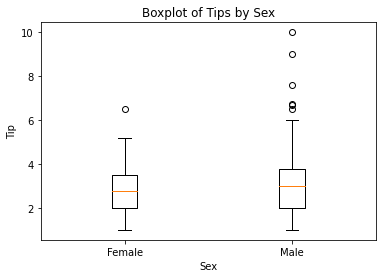

```python
import pandas as pd
import numpy as np
```


```python
names1880 = pd.read_csv('babynames/yob1880.txt', names=['name', 'sex', 'births'])
names1880
```


<div>
<style scoped>
    .dataframe tbody tr th:only-of-type {
        vertical-align: middle;
    }

    .dataframe tbody tr th {
        vertical-align: top;
    }

    .dataframe thead th {
        text-align: right;
    }
</style>
<table border="1" class="dataframe">
  <thead>
    <tr style="text-align: right;">
      <th></th>
      <th>name</th>
      <th>sex</th>
      <th>births</th>
    </tr>
  </thead>
  <tbody>
    <tr>
      <th>0</th>
      <td>Mary</td>
      <td>F</td>
      <td>7065</td>
    </tr>
    <tr>
      <th>1</th>
      <td>Anna</td>
      <td>F</td>
      <td>2604</td>
    </tr>
    <tr>
      <th>2</th>
      <td>Emma</td>
      <td>F</td>
      <td>2003</td>
    </tr>
    <tr>
      <th>3</th>
      <td>Elizabeth</td>
      <td>F</td>
      <td>1939</td>
    </tr>
    <tr>
      <th>4</th>
      <td>Minnie</td>
      <td>F</td>
      <td>1746</td>
    </tr>
    <tr>
      <th>...</th>
      <td>...</td>
      <td>...</td>
      <td>...</td>
    </tr>
    <tr>
      <th>1995</th>
      <td>Woodie</td>
      <td>M</td>
      <td>5</td>
    </tr>
    <tr>
      <th>1996</th>
      <td>Worthy</td>
      <td>M</td>
      <td>5</td>
    </tr>
    <tr>
      <th>1997</th>
      <td>Wright</td>
      <td>M</td>
      <td>5</td>
    </tr>
    <tr>
      <th>1998</th>
      <td>York</td>
      <td>M</td>
      <td>5</td>
    </tr>
    <tr>
      <th>1999</th>
      <td>Zachariah</td>
      <td>M</td>
      <td>5</td>
    </tr>
  </tbody>
</table>
<p>2000 rows × 3 columns</p>
</div>


```python
# 남자아이와 여자아이의 태어난 수
names1880.groupby('sex')['births'].sum()
```


    sex
    F     90993
    M    110493
    Name: births, dtype: int64


```python
# 성별에 따른 이름 종류의 개수
names1880.sex.value_counts()
```


    M    1058
    F     942
    Name: sex, dtype: int64


```python
pieces=[]
for y in range(1880, 2011):
    frame=pd.read_csv(f"babynames/yob{y}.txt", names=['name', 'sex', 'births'])
    frame['year']=y
    pieces.append(frame)
#     print(frame)
#     print(str(y)+"="*50)
```


```python
# pieces
names = pd.concat(pieces, ignore_index=True)
```


```python
names
```


<div>
<style scoped>
    .dataframe tbody tr th:only-of-type {
        vertical-align: middle;
    }

    .dataframe tbody tr th {
        vertical-align: top;
    }

    .dataframe thead th {
        text-align: right;
    }
</style>
<table border="1" class="dataframe">
  <thead>
    <tr style="text-align: right;">
      <th></th>
      <th>name</th>
      <th>sex</th>
      <th>births</th>
      <th>year</th>
    </tr>
  </thead>
  <tbody>
    <tr>
      <th>0</th>
      <td>Mary</td>
      <td>F</td>
      <td>7065</td>
      <td>1880</td>
    </tr>
    <tr>
      <th>1</th>
      <td>Anna</td>
      <td>F</td>
      <td>2604</td>
      <td>1880</td>
    </tr>
    <tr>
      <th>2</th>
      <td>Emma</td>
      <td>F</td>
      <td>2003</td>
      <td>1880</td>
    </tr>
    <tr>
      <th>3</th>
      <td>Elizabeth</td>
      <td>F</td>
      <td>1939</td>
      <td>1880</td>
    </tr>
    <tr>
      <th>4</th>
      <td>Minnie</td>
      <td>F</td>
      <td>1746</td>
      <td>1880</td>
    </tr>
    <tr>
      <th>...</th>
      <td>...</td>
      <td>...</td>
      <td>...</td>
      <td>...</td>
    </tr>
    <tr>
      <th>1690779</th>
      <td>Zymaire</td>
      <td>M</td>
      <td>5</td>
      <td>2010</td>
    </tr>
    <tr>
      <th>1690780</th>
      <td>Zyonne</td>
      <td>M</td>
      <td>5</td>
      <td>2010</td>
    </tr>
    <tr>
      <th>1690781</th>
      <td>Zyquarius</td>
      <td>M</td>
      <td>5</td>
      <td>2010</td>
    </tr>
    <tr>
      <th>1690782</th>
      <td>Zyran</td>
      <td>M</td>
      <td>5</td>
      <td>2010</td>
    </tr>
    <tr>
      <th>1690783</th>
      <td>Zzyzx</td>
      <td>M</td>
      <td>5</td>
      <td>2010</td>
    </tr>
  </tbody>
</table>
<p>1690784 rows × 4 columns</p>
</div>


```python
names.births.sum()
# Mary 이름을 가지고 태어난 아이는 총 몇 명?
names[names.name=='Mary'].births.sum()
```


    4119074


```python
total_births=names.pivot_table('births', 'year', 'sex', aggfunc='sum')
total_births
```


<div>
<style scoped>
    .dataframe tbody tr th:only-of-type {
        vertical-align: middle;
    }

    .dataframe tbody tr th {
        vertical-align: top;
    }

    .dataframe thead th {
        text-align: right;
    }
</style>
<table border="1" class="dataframe">
  <thead>
    <tr style="text-align: right;">
      <th>sex</th>
      <th>F</th>
      <th>M</th>
    </tr>
    <tr>
      <th>year</th>
      <th></th>
      <th></th>
    </tr>
  </thead>
  <tbody>
    <tr>
      <th>1880</th>
      <td>90993</td>
      <td>110493</td>
    </tr>
    <tr>
      <th>1881</th>
      <td>91955</td>
      <td>100748</td>
    </tr>
    <tr>
      <th>1882</th>
      <td>107851</td>
      <td>113687</td>
    </tr>
    <tr>
      <th>1883</th>
      <td>112322</td>
      <td>104632</td>
    </tr>
    <tr>
      <th>1884</th>
      <td>129021</td>
      <td>114445</td>
    </tr>
    <tr>
      <th>...</th>
      <td>...</td>
      <td>...</td>
    </tr>
    <tr>
      <th>2006</th>
      <td>1896468</td>
      <td>2050234</td>
    </tr>
    <tr>
      <th>2007</th>
      <td>1916888</td>
      <td>2069242</td>
    </tr>
    <tr>
      <th>2008</th>
      <td>1883645</td>
      <td>2032310</td>
    </tr>
    <tr>
      <th>2009</th>
      <td>1827643</td>
      <td>1973359</td>
    </tr>
    <tr>
      <th>2010</th>
      <td>1759010</td>
      <td>1898382</td>
    </tr>
  </tbody>
</table>
<p>131 rows × 2 columns</p>
</div>


```python
total_births.plot() # pandas에 시각화 기능 있음
```


    <AxesSubplot:xlabel='year'>


    

    


```python
names
```


<div>
<style scoped>
    .dataframe tbody tr th:only-of-type {
        vertical-align: middle;
    }

    .dataframe tbody tr th {
        vertical-align: top;
    }

    .dataframe thead th {
        text-align: right;
    }
</style>
<table border="1" class="dataframe">
  <thead>
    <tr style="text-align: right;">
      <th></th>
      <th>name</th>
      <th>sex</th>
      <th>births</th>
      <th>year</th>
    </tr>
  </thead>
  <tbody>
    <tr>
      <th>0</th>
      <td>Mary</td>
      <td>F</td>
      <td>7065</td>
      <td>1880</td>
    </tr>
    <tr>
      <th>1</th>
      <td>Anna</td>
      <td>F</td>
      <td>2604</td>
      <td>1880</td>
    </tr>
    <tr>
      <th>2</th>
      <td>Emma</td>
      <td>F</td>
      <td>2003</td>
      <td>1880</td>
    </tr>
    <tr>
      <th>3</th>
      <td>Elizabeth</td>
      <td>F</td>
      <td>1939</td>
      <td>1880</td>
    </tr>
    <tr>
      <th>4</th>
      <td>Minnie</td>
      <td>F</td>
      <td>1746</td>
      <td>1880</td>
    </tr>
    <tr>
      <th>...</th>
      <td>...</td>
      <td>...</td>
      <td>...</td>
      <td>...</td>
    </tr>
    <tr>
      <th>1690779</th>
      <td>Zymaire</td>
      <td>M</td>
      <td>5</td>
      <td>2010</td>
    </tr>
    <tr>
      <th>1690780</th>
      <td>Zyonne</td>
      <td>M</td>
      <td>5</td>
      <td>2010</td>
    </tr>
    <tr>
      <th>1690781</th>
      <td>Zyquarius</td>
      <td>M</td>
      <td>5</td>
      <td>2010</td>
    </tr>
    <tr>
      <th>1690782</th>
      <td>Zyran</td>
      <td>M</td>
      <td>5</td>
      <td>2010</td>
    </tr>
    <tr>
      <th>1690783</th>
      <td>Zzyzx</td>
      <td>M</td>
      <td>5</td>
      <td>2010</td>
    </tr>
  </tbody>
</table>
<p>1690784 rows × 4 columns</p>
</div>


```python
names.groupby(['year', 'sex']).groups
```


    {(1880, 'F'): [0, 1, 2, 3, 4, 5, 6, 7, 8, 9, 10, 11, 12, 13, 14, 15, 16, 17, 18, 19, 20, 21, 22, 23, 24, 25, 26, 27, 28, 29, 30, 31, 32, 33, 34, 35, 36, 37, 38, 39, 40, 41, 42, 43, 44, 45, 46, 47, 48, 49, 50, 51, 52, 53, 54, 55, 56, 57, 58, 59, 60, 61, 62, 63, 64, 65, 66, 67, 68, 69, 70, 71, 72, 73, 74, 75, 76, 77, 78, 79, 80, 81, 82, 83, 84, 85, 86, 87, 88, 89, 90, 91, 92, 93, 94, 95, 96, 97, 98, 99, ...], (1880, 'M'): [942, 943, 944, 945, 946, 947, 948, 949, 950, 951, 952, 953, 954, 955, 956, 957, 958, 959, 960, 961, 962, 963, 964, 965, 966, 967, 968, 969, 970, 971, 972, 973, 974, 975, 976, 977, 978, 979, 980, 981, 982, 983, 984, 985, 986, 987, 988, 989, 990, 991, 992, 993, 994, 995, 996, 997, 998, 999, 1000, 1001, 1002, 1003, 1004, 1005, 1006, 1007, 1008, 1009, 1010, 1011, 1012, 1013, 1014, 1015, 1016, 1017, 1018, 1019, 1020, 1021, 1022, 1023, 1024, 1025, 1026, 1027, 1028, 1029, 1030, 1031, 1032, 1033, 1034, 1035, 1036, 1037, 1038, 1039, 1040, 1041, ...], (1881, 'F'): [2000, 2001, 2002, 2003, 2004, 2005, 2006, 2007, 2008, 2009, 2010, 2011, 2012, 2013, 2014, 2015, 2016, 2017, 2018, 2019, 2020, 2021, 2022, 2023, 2024, 2025, 2026, 2027, 2028, 2029, 2030, 2031, 2032, 2033, 2034, 2035, 2036, 2037, 2038, 2039, 2040, 2041, 2042, 2043, 2044, 2045, 2046, 2047, 2048, 2049, 2050, 2051, 2052, 2053, 2054, 2055, 2056, 2057, 2058, 2059, 2060, 2061, 2062, 2063, 2064, 2065, 2066, 2067, 2068, 2069, 2070, 2071, 2072, 2073, 2074, 2075, 2076, 2077, 2078, 2079, 2080, 2081, 2082, 2083, 2084, 2085, 2086, 2087, 2088, 2089, 2090, 2091, 2092, 2093, 2094, 2095, 2096, 2097, 2098, 2099, ...], (1881, 'M'): [2938, 2939, 2940, 2941, 2942, 2943, 2944, 2945, 2946, 2947, 2948, 2949, 2950, 2951, 2952, 2953, 2954, 2955, 2956, 2957, 2958, 2959, 2960, 2961, 2962, 2963, 2964, 2965, 2966, 2967, 2968, 2969, 2970, 2971, 2972, 2973, 2974, 2975, 2976, 2977, 2978, 2979, 2980, 2981, 2982, 2983, 2984, 2985, 2986, 2987, 2988, 2989, 2990, 2991, 2992, 2993, 2994, 2995, 2996, 2997, 2998, 2999, 3000, 3001, 3002, 3003, 3004, 3005, 3006, 3007, 3008, 3009, 3010, 3011, 3012, 3013, 3014, 3015, 3016, 3017, 3018, 3019, 3020, 3021, 3022, 3023, 3024, 3025, 3026, 3027, 3028, 3029, 3030, 3031, 3032, 3033, 3034, 3035, 3036, 3037, ...], (1882, 'F'): [3935, 3936, 3937, 3938, 3939, 3940, 3941, 3942, 3943, 3944, 3945, 3946, 3947, 3948, 3949, 3950, 3951, 3952, 3953, 3954, 3955, 3956, 3957, 3958, 3959, 3960, 3961, 3962, 3963, 3964, 3965, 3966, 3967, 3968, 3969, 3970, 3971, 3972, 3973, 3974, 3975, 3976, 3977, 3978, 3979, 3980, 3981, 3982, 3983, 3984, 3985, 3986, 3987, 3988, 3989, 3990, 3991, 3992, 3993, 3994, 3995, 3996, 3997, 3998, 3999, 4000, 4001, 4002, 4003, 4004, 4005, 4006, 4007, 4008, 4009, 4010, 4011, 4012, 4013, 4014, 4015, 4016, 4017, 4018, 4019, 4020, 4021, 4022, 4023, 4024, 4025, 4026, 4027, 4028, 4029, 4030, 4031, 4032, 4033, 4034, ...], (1882, 'M'): [4963, 4964, 4965, 4966, 4967, 4968, 4969, 4970, 4971, 4972, 4973, 4974, 4975, 4976, 4977, 4978, 4979, 4980, 4981, 4982, 4983, 4984, 4985, 4986, 4987, 4988, 4989, 4990, 4991, 4992, 4993, 4994, 4995, 4996, 4997, 4998, 4999, 5000, 5001, 5002, 5003, 5004, 5005, 5006, 5007, 5008, 5009, 5010, 5011, 5012, 5013, 5014, 5015, 5016, 5017, 5018, 5019, 5020, 5021, 5022, 5023, 5024, 5025, 5026, 5027, 5028, 5029, 5030, 5031, 5032, 5033, 5034, 5035, 5036, 5037, 5038, 5039, 5040, 5041, 5042, 5043, 5044, 5045, 5046, 5047, 5048, 5049, 5050, 5051, 5052, 5053, 5054, 5055, 5056, 5057, 5058, 5059, 5060, 5061, 5062, ...], (1883, 'F'): [6062, 6063, 6064, 6065, 6066, 6067, 6068, 6069, 6070, 6071, 6072, 6073, 6074, 6075, 6076, 6077, 6078, 6079, 6080, 6081, 6082, 6083, 6084, 6085, 6086, 6087, 6088, 6089, 6090, 6091, 6092, 6093, 6094, 6095, 6096, 6097, 6098, 6099, 6100, 6101, 6102, 6103, 6104, 6105, 6106, 6107, 6108, 6109, 6110, 6111, 6112, 6113, 6114, 6115, 6116, 6117, 6118, 6119, 6120, 6121, 6122, 6123, 6124, 6125, 6126, 6127, 6128, 6129, 6130, 6131, 6132, 6133, 6134, 6135, 6136, 6137, 6138, 6139, 6140, 6141, 6142, 6143, 6144, 6145, 6146, 6147, 6148, 6149, 6150, 6151, 6152, 6153, 6154, 6155, 6156, 6157, 6158, 6159, 6160, 6161, ...], (1883, 'M'): [7116, 7117, 7118, 7119, 7120, 7121, 7122, 7123, 7124, 7125, 7126, 7127, 7128, 7129, 7130, 7131, 7132, 7133, 7134, 7135, 7136, 7137, 7138, 7139, 7140, 7141, 7142, 7143, 7144, 7145, 7146, 7147, 7148, 7149, 7150, 7151, 7152, 7153, 7154, 7155, 7156, 7157, 7158, 7159, 7160, 7161, 7162, 7163, 7164, 7165, 7166, 7167, 7168, 7169, 7170, 7171, 7172, 7173, 7174, 7175, 7176, 7177, 7178, 7179, 7180, 7181, 7182, 7183, 7184, 7185, 7186, 7187, 7188, 7189, 7190, 7191, 7192, 7193, 7194, 7195, 7196, 7197, 7198, 7199, 7200, 7201, 7202, 7203, 7204, 7205, 7206, 7207, 7208, 7209, 7210, 7211, 7212, 7213, 7214, 7215, ...], (1884, 'F'): [8146, 8147, 8148, 8149, 8150, 8151, 8152, 8153, 8154, 8155, 8156, 8157, 8158, 8159, 8160, 8161, 8162, 8163, 8164, 8165, 8166, 8167, 8168, 8169, 8170, 8171, 8172, 8173, 8174, 8175, 8176, 8177, 8178, 8179, 8180, 8181, 8182, 8183, 8184, 8185, 8186, 8187, 8188, 8189, 8190, 8191, 8192, 8193, 8194, 8195, 8196, 8197, 8198, 8199, 8200, 8201, 8202, 8203, 8204, 8205, 8206, 8207, 8208, 8209, 8210, 8211, 8212, 8213, 8214, 8215, 8216, 8217, 8218, 8219, 8220, 8221, 8222, 8223, 8224, 8225, 8226, 8227, 8228, 8229, 8230, 8231, 8232, 8233, 8234, 8235, 8236, 8237, 8238, 8239, 8240, 8241, 8242, 8243, 8244, 8245, ...], (1884, 'M'): [9318, 9319, 9320, 9321, 9322, 9323, 9324, 9325, 9326, 9327, 9328, 9329, 9330, 9331, 9332, 9333, 9334, 9335, 9336, 9337, 9338, 9339, 9340, 9341, 9342, 9343, 9344, 9345, 9346, 9347, 9348, 9349, 9350, 9351, 9352, 9353, 9354, 9355, 9356, 9357, 9358, 9359, 9360, 9361, 9362, 9363, 9364, 9365, 9366, 9367, 9368, 9369, 9370, 9371, 9372, 9373, 9374, 9375, 9376, 9377, 9378, 9379, 9380, 9381, 9382, 9383, 9384, 9385, 9386, 9387, 9388, 9389, 9390, 9391, 9392, 9393, 9394, 9395, 9396, 9397, 9398, 9399, 9400, 9401, 9402, 9403, 9404, 9405, 9406, 9407, 9408, 9409, 9410, 9411, 9412, 9413, 9414, 9415, 9416, 9417, ...], (1885, 'F'): [10443, 10444, 10445, 10446, 10447, 10448, 10449, 10450, 10451, 10452, 10453, 10454, 10455, 10456, 10457, 10458, 10459, 10460, 10461, 10462, 10463, 10464, 10465, 10466, 10467, 10468, 10469, 10470, 10471, 10472, 10473, 10474, 10475, 10476, 10477, 10478, 10479, 10480, 10481, 10482, 10483, 10484, 10485, 10486, 10487, 10488, 10489, 10490, 10491, 10492, 10493, 10494, 10495, 10496, 10497, 10498, 10499, 10500, 10501, 10502, 10503, 10504, 10505, 10506, 10507, 10508, 10509, 10510, 10511, 10512, 10513, 10514, 10515, 10516, 10517, 10518, 10519, 10520, 10521, 10522, 10523, 10524, 10525, 10526, 10527, 10528, 10529, 10530, 10531, 10532, 10533, 10534, 10535, 10536, 10537, 10538, 10539, 10540, 10541, 10542, ...], (1885, 'M'): [11640, 11641, 11642, 11643, 11644, 11645, 11646, 11647, 11648, 11649, 11650, 11651, 11652, 11653, 11654, 11655, 11656, 11657, 11658, 11659, 11660, 11661, 11662, 11663, 11664, 11665, 11666, 11667, 11668, 11669, 11670, 11671, 11672, 11673, 11674, 11675, 11676, 11677, 11678, 11679, 11680, 11681, 11682, 11683, 11684, 11685, 11686, 11687, 11688, 11689, 11690, 11691, 11692, 11693, 11694, 11695, 11696, 11697, 11698, 11699, 11700, 11701, 11702, 11703, 11704, 11705, 11706, 11707, 11708, 11709, 11710, 11711, 11712, 11713, 11714, 11715, 11716, 11717, 11718, 11719, 11720, 11721, 11722, 11723, 11724, 11725, 11726, 11727, 11728, 11729, 11730, 11731, 11732, 11733, 11734, 11735, 11736, 11737, 11738, 11739, ...], (1886, 'F'): [12737, 12738, 12739, 12740, 12741, 12742, 12743, 12744, 12745, 12746, 12747, 12748, 12749, 12750, 12751, 12752, 12753, 12754, 12755, 12756, 12757, 12758, 12759, 12760, 12761, 12762, 12763, 12764, 12765, 12766, 12767, 12768, 12769, 12770, 12771, 12772, 12773, 12774, 12775, 12776, 12777, 12778, 12779, 12780, 12781, 12782, 12783, 12784, 12785, 12786, 12787, 12788, 12789, 12790, 12791, 12792, 12793, 12794, 12795, 12796, 12797, 12798, 12799, 12800, 12801, 12802, 12803, 12804, 12805, 12806, 12807, 12808, 12809, 12810, 12811, 12812, 12813, 12814, 12815, 12816, 12817, 12818, 12819, 12820, 12821, 12822, 12823, 12824, 12825, 12826, 12827, 12828, 12829, 12830, 12831, 12832, 12833, 12834, 12835, 12836, ...], (1886, 'M'): [14019, 14020, 14021, 14022, 14023, 14024, 14025, 14026, 14027, 14028, 14029, 14030, 14031, 14032, 14033, 14034, 14035, 14036, 14037, 14038, 14039, 14040, 14041, 14042, 14043, 14044, 14045, 14046, 14047, 14048, 14049, 14050, 14051, 14052, 14053, 14054, 14055, 14056, 14057, 14058, 14059, 14060, 14061, 14062, 14063, 14064, 14065, 14066, 14067, 14068, 14069, 14070, 14071, 14072, 14073, 14074, 14075, 14076, 14077, 14078, 14079, 14080, 14081, 14082, 14083, 14084, 14085, 14086, 14087, 14088, 14089, 14090, 14091, 14092, 14093, 14094, 14095, 14096, 14097, 14098, 14099, 14100, 14101, 14102, 14103, 14104, 14105, 14106, 14107, 14108, 14109, 14110, 14111, 14112, 14113, 14114, 14115, 14116, 14117, 14118, ...], (1887, 'F'): [15129, 15130, 15131, 15132, 15133, 15134, 15135, 15136, 15137, 15138, 15139, 15140, 15141, 15142, 15143, 15144, 15145, 15146, 15147, 15148, 15149, 15150, 15151, 15152, 15153, 15154, 15155, 15156, 15157, 15158, 15159, 15160, 15161, 15162, 15163, 15164, 15165, 15166, 15167, 15168, 15169, 15170, 15171, 15172, 15173, 15174, 15175, 15176, 15177, 15178, 15179, 15180, 15181, 15182, 15183, 15184, 15185, 15186, 15187, 15188, 15189, 15190, 15191, 15192, 15193, 15194, 15195, 15196, 15197, 15198, 15199, 15200, 15201, 15202, 15203, 15204, 15205, 15206, 15207, 15208, 15209, 15210, 15211, 15212, 15213, 15214, 15215, 15216, 15217, 15218, 15219, 15220, 15221, 15222, 15223, 15224, 15225, 15226, 15227, 15228, ...], (1887, 'M'): [16435, 16436, 16437, 16438, 16439, 16440, 16441, 16442, 16443, 16444, 16445, 16446, 16447, 16448, 16449, 16450, 16451, 16452, 16453, 16454, 16455, 16456, 16457, 16458, 16459, 16460, 16461, 16462, 16463, 16464, 16465, 16466, 16467, 16468, 16469, 16470, 16471, 16472, 16473, 16474, 16475, 16476, 16477, 16478, 16479, 16480, 16481, 16482, 16483, 16484, 16485, 16486, 16487, 16488, 16489, 16490, 16491, 16492, 16493, 16494, 16495, 16496, 16497, 16498, 16499, 16500, 16501, 16502, 16503, 16504, 16505, 16506, 16507, 16508, 16509, 16510, 16511, 16512, 16513, 16514, 16515, 16516, 16517, 16518, 16519, 16520, 16521, 16522, 16523, 16524, 16525, 16526, 16527, 16528, 16529, 16530, 16531, 16532, 16533, 16534, ...], (1888, 'F'): [17502, 17503, 17504, 17505, 17506, 17507, 17508, 17509, 17510, 17511, 17512, 17513, 17514, 17515, 17516, 17517, 17518, 17519, 17520, 17521, 17522, 17523, 17524, 17525, 17526, 17527, 17528, 17529, 17530, 17531, 17532, 17533, 17534, 17535, 17536, 17537, 17538, 17539, 17540, 17541, 17542, 17543, 17544, 17545, 17546, 17547, 17548, 17549, 17550, 17551, 17552, 17553, 17554, 17555, 17556, 17557, 17558, 17559, 17560, 17561, 17562, 17563, 17564, 17565, 17566, 17567, 17568, 17569, 17570, 17571, 17572, 17573, 17574, 17575, 17576, 17577, 17578, 17579, 17580, 17581, 17582, 17583, 17584, 17585, 17586, 17587, 17588, 17589, 17590, 17591, 17592, 17593, 17594, 17595, 17596, 17597, 17598, 17599, 17600, 17601, ...], (1888, 'M'): [18976, 18977, 18978, 18979, 18980, 18981, 18982, 18983, 18984, 18985, 18986, 18987, 18988, 18989, 18990, 18991, 18992, 18993, 18994, 18995, 18996, 18997, 18998, 18999, 19000, 19001, 19002, 19003, 19004, 19005, 19006, 19007, 19008, 19009, 19010, 19011, 19012, 19013, 19014, 19015, 19016, 19017, 19018, 19019, 19020, 19021, 19022, 19023, 19024, 19025, 19026, 19027, 19028, 19029, 19030, 19031, 19032, 19033, 19034, 19035, 19036, 19037, 19038, 19039, 19040, 19041, 19042, 19043, 19044, 19045, 19046, 19047, 19048, 19049, 19050, 19051, 19052, 19053, 19054, 19055, 19056, 19057, 19058, 19059, 19060, 19061, 19062, 19063, 19064, 19065, 19066, 19067, 19068, 19069, 19070, 19071, 19072, 19073, 19074, 19075, ...], (1889, 'F'): [20153, 20154, 20155, 20156, 20157, 20158, 20159, 20160, 20161, 20162, 20163, 20164, 20165, 20166, 20167, 20168, 20169, 20170, 20171, 20172, 20173, 20174, 20175, 20176, 20177, 20178, 20179, 20180, 20181, 20182, 20183, 20184, 20185, 20186, 20187, 20188, 20189, 20190, 20191, 20192, 20193, 20194, 20195, 20196, 20197, 20198, 20199, 20200, 20201, 20202, 20203, 20204, 20205, 20206, 20207, 20208, 20209, 20210, 20211, 20212, 20213, 20214, 20215, 20216, 20217, 20218, 20219, 20220, 20221, 20222, 20223, 20224, 20225, 20226, 20227, 20228, 20229, 20230, 20231, 20232, 20233, 20234, 20235, 20236, 20237, 20238, 20239, 20240, 20241, 20242, 20243, 20244, 20245, 20246, 20247, 20248, 20249, 20250, 20251, 20252, ...], (1889, 'M'): [21632, 21633, 21634, 21635, 21636, 21637, 21638, 21639, 21640, 21641, 21642, 21643, 21644, 21645, 21646, 21647, 21648, 21649, 21650, 21651, 21652, 21653, 21654, 21655, 21656, 21657, 21658, 21659, 21660, 21661, 21662, 21663, 21664, 21665, 21666, 21667, 21668, 21669, 21670, 21671, 21672, 21673, 21674, 21675, 21676, 21677, 21678, 21679, 21680, 21681, 21682, 21683, 21684, 21685, 21686, 21687, 21688, 21689, 21690, 21691, 21692, 21693, 21694, 21695, 21696, 21697, 21698, 21699, 21700, 21701, 21702, 21703, 21704, 21705, 21706, 21707, 21708, 21709, 21710, 21711, 21712, 21713, 21714, 21715, 21716, 21717, 21718, 21719, 21720, 21721, 21722, 21723, 21724, 21725, 21726, 21727, 21728, 21729, 21730, 21731, ...], (1890, 'F'): [22743, 22744, 22745, 22746, 22747, 22748, 22749, 22750, 22751, 22752, 22753, 22754, 22755, 22756, 22757, 22758, 22759, 22760, 22761, 22762, 22763, 22764, 22765, 22766, 22767, 22768, 22769, 22770, 22771, 22772, 22773, 22774, 22775, 22776, 22777, 22778, 22779, 22780, 22781, 22782, 22783, 22784, 22785, 22786, 22787, 22788, 22789, 22790, 22791, 22792, 22793, 22794, 22795, 22796, 22797, 22798, 22799, 22800, 22801, 22802, 22803, 22804, 22805, 22806, 22807, 22808, 22809, 22810, 22811, 22812, 22813, 22814, 22815, 22816, 22817, 22818, 22819, 22820, 22821, 22822, 22823, 22824, 22825, 22826, 22827, 22828, 22829, 22830, 22831, 22832, 22833, 22834, 22835, 22836, 22837, 22838, 22839, 22840, 22841, 22842, ...], (1890, 'M'): [24277, 24278, 24279, 24280, 24281, 24282, 24283, 24284, 24285, 24286, 24287, 24288, 24289, 24290, 24291, 24292, 24293, 24294, 24295, 24296, 24297, 24298, 24299, 24300, 24301, 24302, 24303, 24304, 24305, 24306, 24307, 24308, 24309, 24310, 24311, 24312, 24313, 24314, 24315, 24316, 24317, 24318, 24319, 24320, 24321, 24322, 24323, 24324, 24325, 24326, 24327, 24328, 24329, 24330, 24331, 24332, 24333, 24334, 24335, 24336, 24337, 24338, 24339, 24340, 24341, 24342, 24343, 24344, 24345, 24346, 24347, 24348, 24349, 24350, 24351, 24352, 24353, 24354, 24355, 24356, 24357, 24358, 24359, 24360, 24361, 24362, 24363, 24364, 24365, 24366, 24367, 24368, 24369, 24370, 24371, 24372, 24373, 24374, 24375, 24376, ...], (1891, 'F'): [25438, 25439, 25440, 25441, 25442, 25443, 25444, 25445, 25446, 25447, 25448, 25449, 25450, 25451, 25452, 25453, 25454, 25455, 25456, 25457, 25458, 25459, 25460, 25461, 25462, 25463, 25464, 25465, 25466, 25467, 25468, 25469, 25470, 25471, 25472, 25473, 25474, 25475, 25476, 25477, 25478, 25479, 25480, 25481, 25482, 25483, 25484, 25485, 25486, 25487, 25488, 25489, 25490, 25491, 25492, 25493, 25494, 25495, 25496, 25497, 25498, 25499, 25500, 25501, 25502, 25503, 25504, 25505, 25506, 25507, 25508, 25509, 25510, 25511, 25512, 25513, 25514, 25515, 25516, 25517, 25518, 25519, 25520, 25521, 25522, 25523, 25524, 25525, 25526, 25527, 25528, 25529, 25530, 25531, 25532, 25533, 25534, 25535, 25536, 25537, ...], (1891, 'M'): [26971, 26972, 26973, 26974, 26975, 26976, 26977, 26978, 26979, 26980, 26981, 26982, 26983, 26984, 26985, 26986, 26987, 26988, 26989, 26990, 26991, 26992, 26993, 26994, 26995, 26996, 26997, 26998, 26999, 27000, 27001, 27002, 27003, 27004, 27005, 27006, 27007, 27008, 27009, 27010, 27011, 27012, 27013, 27014, 27015, 27016, 27017, 27018, 27019, 27020, 27021, 27022, 27023, 27024, 27025, 27026, 27027, 27028, 27029, 27030, 27031, 27032, 27033, 27034, 27035, 27036, 27037, 27038, 27039, 27040, 27041, 27042, 27043, 27044, 27045, 27046, 27047, 27048, 27049, 27050, 27051, 27052, 27053, 27054, 27055, 27056, 27057, 27058, 27059, 27060, 27061, 27062, 27063, 27064, 27065, 27066, 27067, 27068, 27069, 27070, ...], (1892, 'F'): [28098, 28099, 28100, 28101, 28102, 28103, 28104, 28105, 28106, 28107, 28108, 28109, 28110, 28111, 28112, 28113, 28114, 28115, 28116, 28117, 28118, 28119, 28120, 28121, 28122, 28123, 28124, 28125, 28126, 28127, 28128, 28129, 28130, 28131, 28132, 28133, 28134, 28135, 28136, 28137, 28138, 28139, 28140, 28141, 28142, 28143, 28144, 28145, 28146, 28147, 28148, 28149, 28150, 28151, 28152, 28153, 28154, 28155, 28156, 28157, 28158, 28159, 28160, 28161, 28162, 28163, 28164, 28165, 28166, 28167, 28168, 28169, 28170, 28171, 28172, 28173, 28174, 28175, 28176, 28177, 28178, 28179, 28180, 28181, 28182, 28183, 28184, 28185, 28186, 28187, 28188, 28189, 28190, 28191, 28192, 28193, 28194, 28195, 28196, 28197, ...], (1892, 'M'): [29759, 29760, 29761, 29762, 29763, 29764, 29765, 29766, 29767, 29768, 29769, 29770, 29771, 29772, 29773, 29774, 29775, 29776, 29777, 29778, 29779, 29780, 29781, 29782, 29783, 29784, 29785, 29786, 29787, 29788, 29789, 29790, 29791, 29792, 29793, 29794, 29795, 29796, 29797, 29798, 29799, 29800, 29801, 29802, 29803, 29804, 29805, 29806, 29807, 29808, 29809, 29810, 29811, 29812, 29813, 29814, 29815, 29816, 29817, 29818, 29819, 29820, 29821, 29822, 29823, 29824, 29825, 29826, 29827, 29828, 29829, 29830, 29831, 29832, 29833, 29834, 29835, 29836, 29837, 29838, 29839, 29840, 29841, 29842, 29843, 29844, 29845, 29846, 29847, 29848, 29849, 29850, 29851, 29852, 29853, 29854, 29855, 29856, 29857, 29858, ...], (1893, 'F'): [31019, 31020, 31021, 31022, 31023, 31024, 31025, 31026, 31027, 31028, 31029, 31030, 31031, 31032, 31033, 31034, 31035, 31036, 31037, 31038, 31039, 31040, 31041, 31042, 31043, 31044, 31045, 31046, 31047, 31048, 31049, 31050, 31051, 31052, 31053, 31054, 31055, 31056, 31057, 31058, 31059, 31060, 31061, 31062, 31063, 31064, 31065, 31066, 31067, 31068, 31069, 31070, 31071, 31072, 31073, 31074, 31075, 31076, 31077, 31078, 31079, 31080, 31081, 31082, 31083, 31084, 31085, 31086, 31087, 31088, 31089, 31090, 31091, 31092, 31093, 31094, 31095, 31096, 31097, 31098, 31099, 31100, 31101, 31102, 31103, 31104, 31105, 31106, 31107, 31108, 31109, 31110, 31111, 31112, 31113, 31114, 31115, 31116, 31117, 31118, ...], (1893, 'M'): [32671, 32672, 32673, 32674, 32675, 32676, 32677, 32678, 32679, 32680, 32681, 32682, 32683, 32684, 32685, 32686, 32687, 32688, 32689, 32690, 32691, 32692, 32693, 32694, 32695, 32696, 32697, 32698, 32699, 32700, 32701, 32702, 32703, 32704, 32705, 32706, 32707, 32708, 32709, 32710, 32711, 32712, 32713, 32714, 32715, 32716, 32717, 32718, 32719, 32720, 32721, 32722, 32723, 32724, 32725, 32726, 32727, 32728, 32729, 32730, 32731, 32732, 32733, 32734, 32735, 32736, 32737, 32738, 32739, 32740, 32741, 32742, 32743, 32744, 32745, 32746, 32747, 32748, 32749, 32750, 32751, 32752, 32753, 32754, 32755, 32756, 32757, 32758, 32759, 32760, 32761, 32762, 32763, 32764, 32765, 32766, 32767, 32768, 32769, 32770, ...], (1894, 'F'): [33850, 33851, 33852, 33853, 33854, 33855, 33856, 33857, 33858, 33859, 33860, 33861, 33862, 33863, 33864, 33865, 33866, 33867, 33868, 33869, 33870, 33871, 33872, 33873, 33874, 33875, 33876, 33877, 33878, 33879, 33880, 33881, 33882, 33883, 33884, 33885, 33886, 33887, 33888, 33889, 33890, 33891, 33892, 33893, 33894, 33895, 33896, 33897, 33898, 33899, 33900, 33901, 33902, 33903, 33904, 33905, 33906, 33907, 33908, 33909, 33910, 33911, 33912, 33913, 33914, 33915, 33916, 33917, 33918, 33919, 33920, 33921, 33922, 33923, 33924, 33925, 33926, 33927, 33928, 33929, 33930, 33931, 33932, 33933, 33934, 33935, 33936, 33937, 33938, 33939, 33940, 33941, 33942, 33943, 33944, 33945, 33946, 33947, 33948, 33949, ...], (1894, 'M'): [35552, 35553, 35554, 35555, 35556, 35557, 35558, 35559, 35560, 35561, 35562, 35563, 35564, 35565, 35566, 35567, 35568, 35569, 35570, 35571, 35572, 35573, 35574, 35575, 35576, 35577, 35578, 35579, 35580, 35581, 35582, 35583, 35584, 35585, 35586, 35587, 35588, 35589, 35590, 35591, 35592, 35593, 35594, 35595, 35596, 35597, 35598, 35599, 35600, 35601, 35602, 35603, 35604, 35605, 35606, 35607, 35608, 35609, 35610, 35611, 35612, 35613, 35614, 35615, 35616, 35617, 35618, 35619, 35620, 35621, 35622, 35623, 35624, 35625, 35626, 35627, 35628, 35629, 35630, 35631, 35632, 35633, 35634, 35635, 35636, 35637, 35638, 35639, 35640, 35641, 35642, 35643, 35644, 35645, 35646, 35647, 35648, 35649, 35650, 35651, ...], (1895, 'F'): [36791, 36792, 36793, 36794, 36795, 36796, 36797, 36798, 36799, 36800, 36801, 36802, 36803, 36804, 36805, 36806, 36807, 36808, 36809, 36810, 36811, 36812, 36813, 36814, 36815, 36816, 36817, 36818, 36819, 36820, 36821, 36822, 36823, 36824, 36825, 36826, 36827, 36828, 36829, 36830, 36831, 36832, 36833, 36834, 36835, 36836, 36837, 36838, 36839, 36840, 36841, 36842, 36843, 36844, 36845, 36846, 36847, 36848, 36849, 36850, 36851, 36852, 36853, 36854, 36855, 36856, 36857, 36858, 36859, 36860, 36861, 36862, 36863, 36864, 36865, 36866, 36867, 36868, 36869, 36870, 36871, 36872, 36873, 36874, 36875, 36876, 36877, 36878, 36879, 36880, 36881, 36882, 36883, 36884, 36885, 36886, 36887, 36888, 36889, 36890, ...], (1895, 'M'): [38599, 38600, 38601, 38602, 38603, 38604, 38605, 38606, 38607, 38608, 38609, 38610, 38611, 38612, 38613, 38614, 38615, 38616, 38617, 38618, 38619, 38620, 38621, 38622, 38623, 38624, 38625, 38626, 38627, 38628, 38629, 38630, 38631, 38632, 38633, 38634, 38635, 38636, 38637, 38638, 38639, 38640, 38641, 38642, 38643, 38644, 38645, 38646, 38647, 38648, 38649, 38650, 38651, 38652, 38653, 38654, 38655, 38656, 38657, 38658, 38659, 38660, 38661, 38662, 38663, 38664, 38665, 38666, 38667, 38668, 38669, 38670, 38671, 38672, 38673, 38674, 38675, 38676, 38677, 38678, 38679, 38680, 38681, 38682, 38683, 38684, 38685, 38686, 38687, 38688, 38689, 38690, 38691, 38692, 38693, 38694, 38695, 38696, 38697, 38698, ...], (1896, 'F'): [39840, 39841, 39842, 39843, 39844, 39845, 39846, 39847, 39848, 39849, 39850, 39851, 39852, 39853, 39854, 39855, 39856, 39857, 39858, 39859, 39860, 39861, 39862, 39863, 39864, 39865, 39866, 39867, 39868, 39869, 39870, 39871, 39872, 39873, 39874, 39875, 39876, 39877, 39878, 39879, 39880, 39881, 39882, 39883, 39884, 39885, 39886, 39887, 39888, 39889, 39890, 39891, 39892, 39893, 39894, 39895, 39896, 39897, 39898, 39899, 39900, 39901, 39902, 39903, 39904, 39905, 39906, 39907, 39908, 39909, 39910, 39911, 39912, 39913, 39914, 39915, 39916, 39917, 39918, 39919, 39920, 39921, 39922, 39923, 39924, 39925, 39926, 39927, 39928, 39929, 39930, 39931, 39932, 39933, 39934, 39935, 39936, 39937, 39938, 39939, ...], (1896, 'M'): [41665, 41666, 41667, 41668, 41669, 41670, 41671, 41672, 41673, 41674, 41675, 41676, 41677, 41678, 41679, 41680, 41681, 41682, 41683, 41684, 41685, 41686, 41687, 41688, 41689, 41690, 41691, 41692, 41693, 41694, 41695, 41696, 41697, 41698, 41699, 41700, 41701, 41702, 41703, 41704, 41705, 41706, 41707, 41708, 41709, 41710, 41711, 41712, 41713, 41714, 41715, 41716, 41717, 41718, 41719, 41720, 41721, 41722, 41723, 41724, 41725, 41726, 41727, 41728, 41729, 41730, 41731, 41732, 41733, 41734, 41735, 41736, 41737, 41738, 41739, 41740, 41741, 41742, 41743, 41744, 41745, 41746, 41747, 41748, 41749, 41750, 41751, 41752, 41753, 41754, 41755, 41756, 41757, 41758, 41759, 41760, 41761, 41762, 41763, 41764, ...], (1897, 'F'): [42931, 42932, 42933, 42934, 42935, 42936, 42937, 42938, 42939, 42940, 42941, 42942, 42943, 42944, 42945, 42946, 42947, 42948, 42949, 42950, 42951, 42952, 42953, 42954, 42955, 42956, 42957, 42958, 42959, 42960, 42961, 42962, 42963, 42964, 42965, 42966, 42967, 42968, 42969, 42970, 42971, 42972, 42973, 42974, 42975, 42976, 42977, 42978, 42979, 42980, 42981, 42982, 42983, 42984, 42985, 42986, 42987, 42988, 42989, 42990, 42991, 42992, 42993, 42994, 42995, 42996, 42997, 42998, 42999, 43000, 43001, 43002, 43003, 43004, 43005, 43006, 43007, 43008, 43009, 43010, 43011, 43012, 43013, 43014, 43015, 43016, 43017, 43018, 43019, 43020, 43021, 43022, 43023, 43024, 43025, 43026, 43027, 43028, 43029, 43030, ...], (1897, 'M'): [44730, 44731, 44732, 44733, 44734, 44735, 44736, 44737, 44738, 44739, 44740, 44741, 44742, 44743, 44744, 44745, 44746, 44747, 44748, 44749, 44750, 44751, 44752, 44753, 44754, 44755, 44756, 44757, 44758, 44759, 44760, 44761, 44762, 44763, 44764, 44765, 44766, 44767, 44768, 44769, 44770, 44771, 44772, 44773, 44774, 44775, 44776, 44777, 44778, 44779, 44780, 44781, 44782, 44783, 44784, 44785, 44786, 44787, 44788, 44789, 44790, 44791, 44792, 44793, 44794, 44795, 44796, 44797, 44798, 44799, 44800, 44801, 44802, 44803, 44804, 44805, 44806, 44807, 44808, 44809, 44810, 44811, 44812, 44813, 44814, 44815, 44816, 44817, 44818, 44819, 44820, 44821, 44822, 44823, 44824, 44825, 44826, 44827, 44828, 44829, ...], (1898, 'F'): [45959, 45960, 45961, 45962, 45963, 45964, 45965, 45966, 45967, 45968, 45969, 45970, 45971, 45972, 45973, 45974, 45975, 45976, 45977, 45978, 45979, 45980, 45981, 45982, 45983, 45984, 45985, 45986, 45987, 45988, 45989, 45990, 45991, 45992, 45993, 45994, 45995, 45996, 45997, 45998, 45999, 46000, 46001, 46002, 46003, 46004, 46005, 46006, 46007, 46008, 46009, 46010, 46011, 46012, 46013, 46014, 46015, 46016, 46017, 46018, 46019, 46020, 46021, 46022, 46023, 46024, 46025, 46026, 46027, 46028, 46029, 46030, 46031, 46032, 46033, 46034, 46035, 46036, 46037, 46038, 46039, 46040, 46041, 46042, 46043, 46044, 46045, 46046, 46047, 46048, 46049, 46050, 46051, 46052, 46053, 46054, 46055, 46056, 46057, 46058, ...], (1898, 'M'): [47934, 47935, 47936, 47937, 47938, 47939, 47940, 47941, 47942, 47943, 47944, 47945, 47946, 47947, 47948, 47949, 47950, 47951, 47952, 47953, 47954, 47955, 47956, 47957, 47958, 47959, 47960, 47961, 47962, 47963, 47964, 47965, 47966, 47967, 47968, 47969, 47970, 47971, 47972, 47973, 47974, 47975, 47976, 47977, 47978, 47979, 47980, 47981, 47982, 47983, 47984, 47985, 47986, 47987, 47988, 47989, 47990, 47991, 47992, 47993, 47994, 47995, 47996, 47997, 47998, 47999, 48000, 48001, 48002, 48003, 48004, 48005, 48006, 48007, 48008, 48009, 48010, 48011, 48012, 48013, 48014, 48015, 48016, 48017, 48018, 48019, 48020, 48021, 48022, 48023, 48024, 48025, 48026, 48027, 48028, 48029, 48030, 48031, 48032, 48033, ...], (1899, 'F'): [49224, 49225, 49226, 49227, 49228, 49229, 49230, 49231, 49232, 49233, 49234, 49235, 49236, 49237, 49238, 49239, 49240, 49241, 49242, 49243, 49244, 49245, 49246, 49247, 49248, 49249, 49250, 49251, 49252, 49253, 49254, 49255, 49256, 49257, 49258, 49259, 49260, 49261, 49262, 49263, 49264, 49265, 49266, 49267, 49268, 49269, 49270, 49271, 49272, 49273, 49274, 49275, 49276, 49277, 49278, 49279, 49280, 49281, 49282, 49283, 49284, 49285, 49286, 49287, 49288, 49289, 49290, 49291, 49292, 49293, 49294, 49295, 49296, 49297, 49298, 49299, 49300, 49301, 49302, 49303, 49304, 49305, 49306, 49307, 49308, 49309, 49310, 49311, 49312, 49313, 49314, 49315, 49316, 49317, 49318, 49319, 49320, 49321, 49322, 49323, ...], (1899, 'M'): [51066, 51067, 51068, 51069, 51070, 51071, 51072, 51073, 51074, 51075, 51076, 51077, 51078, 51079, 51080, 51081, 51082, 51083, 51084, 51085, 51086, 51087, 51088, 51089, 51090, 51091, 51092, 51093, 51094, 51095, 51096, 51097, 51098, 51099, 51100, 51101, 51102, 51103, 51104, 51105, 51106, 51107, 51108, 51109, 51110, 51111, 51112, 51113, 51114, 51115, 51116, 51117, 51118, 51119, 51120, 51121, 51122, 51123, 51124, 51125, 51126, 51127, 51128, 51129, 51130, 51131, 51132, 51133, 51134, 51135, 51136, 51137, 51138, 51139, 51140, 51141, 51142, 51143, 51144, 51145, 51146, 51147, 51148, 51149, 51150, 51151, 51152, 51153, 51154, 51155, 51156, 51157, 51158, 51159, 51160, 51161, 51162, 51163, 51164, 51165, ...], (1900, 'F'): [52266, 52267, 52268, 52269, 52270, 52271, 52272, 52273, 52274, 52275, 52276, 52277, 52278, 52279, 52280, 52281, 52282, 52283, 52284, 52285, 52286, 52287, 52288, 52289, 52290, 52291, 52292, 52293, 52294, 52295, 52296, 52297, 52298, 52299, 52300, 52301, 52302, 52303, 52304, 52305, 52306, 52307, 52308, 52309, 52310, 52311, 52312, 52313, 52314, 52315, 52316, 52317, 52318, 52319, 52320, 52321, 52322, 52323, 52324, 52325, 52326, 52327, 52328, 52329, 52330, 52331, 52332, 52333, 52334, 52335, 52336, 52337, 52338, 52339, 52340, 52341, 52342, 52343, 52344, 52345, 52346, 52347, 52348, 52349, 52350, 52351, 52352, 52353, 52354, 52355, 52356, 52357, 52358, 52359, 52360, 52361, 52362, 52363, 52364, 52365, ...], (1900, 'M'): [54492, 54493, 54494, 54495, 54496, 54497, 54498, 54499, 54500, 54501, 54502, 54503, 54504, 54505, 54506, 54507, 54508, 54509, 54510, 54511, 54512, 54513, 54514, 54515, 54516, 54517, 54518, 54519, 54520, 54521, 54522, 54523, 54524, 54525, 54526, 54527, 54528, 54529, 54530, 54531, 54532, 54533, 54534, 54535, 54536, 54537, 54538, 54539, 54540, 54541, 54542, 54543, 54544, 54545, 54546, 54547, 54548, 54549, 54550, 54551, 54552, 54553, 54554, 54555, 54556, 54557, 54558, 54559, 54560, 54561, 54562, 54563, 54564, 54565, 54566, 54567, 54568, 54569, 54570, 54571, 54572, 54573, 54574, 54575, 54576, 54577, 54578, 54579, 54580, 54581, 54582, 54583, 54584, 54585, 54586, 54587, 54588, 54589, 54590, 54591, ...], (1901, 'F'): [55999, 56000, 56001, 56002, 56003, 56004, 56005, 56006, 56007, 56008, 56009, 56010, 56011, 56012, 56013, 56014, 56015, 56016, 56017, 56018, 56019, 56020, 56021, 56022, 56023, 56024, 56025, 56026, 56027, 56028, 56029, 56030, 56031, 56032, 56033, 56034, 56035, 56036, 56037, 56038, 56039, 56040, 56041, 56042, 56043, 56044, 56045, 56046, 56047, 56048, 56049, 56050, 56051, 56052, 56053, 56054, 56055, 56056, 56057, 56058, 56059, 56060, 56061, 56062, 56063, 56064, 56065, 56066, 56067, 56068, 56069, 56070, 56071, 56072, 56073, 56074, 56075, 56076, 56077, 56078, 56079, 56080, 56081, 56082, 56083, 56084, 56085, 56086, 56087, 56088, 56089, 56090, 56091, 56092, 56093, 56094, 56095, 56096, 56097, 56098, ...], (1901, 'M'): [57942, 57943, 57944, 57945, 57946, 57947, 57948, 57949, 57950, 57951, 57952, 57953, 57954, 57955, 57956, 57957, 57958, 57959, 57960, 57961, 57962, 57963, 57964, 57965, 57966, 57967, 57968, 57969, 57970, 57971, 57972, 57973, 57974, 57975, 57976, 57977, 57978, 57979, 57980, 57981, 57982, 57983, 57984, 57985, 57986, 57987, 57988, 57989, 57990, 57991, 57992, 57993, 57994, 57995, 57996, 57997, 57998, 57999, 58000, 58001, 58002, 58003, 58004, 58005, 58006, 58007, 58008, 58009, 58010, 58011, 58012, 58013, 58014, 58015, 58016, 58017, 58018, 58019, 58020, 58021, 58022, 58023, 58024, 58025, 58026, 58027, 58028, 58029, 58030, 58031, 58032, 58033, 58034, 58035, 58036, 58037, 58038, 58039, 58040, 58041, ...], (1902, 'F'): [59152, 59153, 59154, 59155, 59156, 59157, 59158, 59159, 59160, 59161, 59162, 59163, 59164, 59165, 59166, 59167, 59168, 59169, 59170, 59171, 59172, 59173, 59174, 59175, 59176, 59177, 59178, 59179, 59180, 59181, 59182, 59183, 59184, 59185, 59186, 59187, 59188, 59189, 59190, 59191, 59192, 59193, 59194, 59195, 59196, 59197, 59198, 59199, 59200, 59201, 59202, 59203, 59204, 59205, 59206, 59207, 59208, 59209, 59210, 59211, 59212, 59213, 59214, 59215, 59216, 59217, 59218, 59219, 59220, 59221, 59222, 59223, 59224, 59225, 59226, 59227, 59228, 59229, 59230, 59231, 59232, 59233, 59234, 59235, 59236, 59237, 59238, 59239, 59240, 59241, 59242, 59243, 59244, 59245, 59246, 59247, 59248, 59249, 59250, 59251, ...], (1902, 'M'): [61194, 61195, 61196, 61197, 61198, 61199, 61200, 61201, 61202, 61203, 61204, 61205, 61206, 61207, 61208, 61209, 61210, 61211, 61212, 61213, 61214, 61215, 61216, 61217, 61218, 61219, 61220, 61221, 61222, 61223, 61224, 61225, 61226, 61227, 61228, 61229, 61230, 61231, 61232, 61233, 61234, 61235, 61236, 61237, 61238, 61239, 61240, 61241, 61242, 61243, 61244, 61245, 61246, 61247, 61248, 61249, 61250, 61251, 61252, 61253, 61254, 61255, 61256, 61257, 61258, 61259, 61260, 61261, 61262, 61263, 61264, 61265, 61266, 61267, 61268, 61269, 61270, 61271, 61272, 61273, 61274, 61275, 61276, 61277, 61278, 61279, 61280, 61281, 61282, 61283, 61284, 61285, 61286, 61287, 61288, 61289, 61290, 61291, 61292, 61293, ...], (1903, 'F'): [62514, 62515, 62516, 62517, 62518, 62519, 62520, 62521, 62522, 62523, 62524, 62525, 62526, 62527, 62528, 62529, 62530, 62531, 62532, 62533, 62534, 62535, 62536, 62537, 62538, 62539, 62540, 62541, 62542, 62543, 62544, 62545, 62546, 62547, 62548, 62549, 62550, 62551, 62552, 62553, 62554, 62555, 62556, 62557, 62558, 62559, 62560, 62561, 62562, 62563, 62564, 62565, 62566, 62567, 62568, 62569, 62570, 62571, 62572, 62573, 62574, 62575, 62576, 62577, 62578, 62579, 62580, 62581, 62582, 62583, 62584, 62585, 62586, 62587, 62588, 62589, 62590, 62591, 62592, 62593, 62594, 62595, 62596, 62597, 62598, 62599, 62600, 62601, 62602, 62603, 62604, 62605, 62606, 62607, 62608, 62609, 62610, 62611, 62612, 62613, ...], (1903, 'M'): [64597, 64598, 64599, 64600, 64601, 64602, 64603, 64604, 64605, 64606, 64607, 64608, 64609, 64610, 64611, 64612, 64613, 64614, 64615, 64616, 64617, 64618, 64619, 64620, 64621, 64622, 64623, 64624, 64625, 64626, 64627, 64628, 64629, 64630, 64631, 64632, 64633, 64634, 64635, 64636, 64637, 64638, 64639, 64640, 64641, 64642, 64643, 64644, 64645, 64646, 64647, 64648, 64649, 64650, 64651, 64652, 64653, 64654, 64655, 64656, 64657, 64658, 64659, 64660, 64661, 64662, 64663, 64664, 64665, 64666, 64667, 64668, 64669, 64670, 64671, 64672, 64673, 64674, 64675, 64676, 64677, 64678, 64679, 64680, 64681, 64682, 64683, 64684, 64685, 64686, 64687, 64688, 64689, 64690, 64691, 64692, 64693, 64694, 64695, 64696, ...], (1904, 'F'): [65903, 65904, 65905, 65906, 65907, 65908, 65909, 65910, 65911, 65912, 65913, 65914, 65915, 65916, 65917, 65918, 65919, 65920, 65921, 65922, 65923, 65924, 65925, 65926, 65927, 65928, 65929, 65930, 65931, 65932, 65933, 65934, 65935, 65936, 65937, 65938, 65939, 65940, 65941, 65942, 65943, 65944, 65945, 65946, 65947, 65948, 65949, 65950, 65951, 65952, 65953, 65954, 65955, 65956, 65957, 65958, 65959, 65960, 65961, 65962, 65963, 65964, 65965, 65966, 65967, 65968, 65969, 65970, 65971, 65972, 65973, 65974, 65975, 65976, 65977, 65978, 65979, 65980, 65981, 65982, 65983, 65984, 65985, 65986, 65987, 65988, 65989, 65990, 65991, 65992, 65993, 65994, 65995, 65996, 65997, 65998, 65999, 66000, 66001, 66002, ...], (1904, 'M'): [68069, 68070, 68071, 68072, 68073, 68074, 68075, 68076, 68077, 68078, 68079, 68080, 68081, 68082, 68083, 68084, 68085, 68086, 68087, 68088, 68089, 68090, 68091, 68092, 68093, 68094, 68095, 68096, 68097, 68098, 68099, 68100, 68101, 68102, 68103, 68104, 68105, 68106, 68107, 68108, 68109, 68110, 68111, 68112, 68113, 68114, 68115, 68116, 68117, 68118, 68119, 68120, 68121, 68122, 68123, 68124, 68125, 68126, 68127, 68128, 68129, 68130, 68131, 68132, 68133, 68134, 68135, 68136, 68137, 68138, 68139, 68140, 68141, 68142, 68143, 68144, 68145, 68146, 68147, 68148, 68149, 68150, 68151, 68152, 68153, 68154, 68155, 68156, 68157, 68158, 68159, 68160, 68161, 68162, 68163, 68164, 68165, 68166, 68167, 68168, ...], (1905, 'F'): [69464, 69465, 69466, 69467, 69468, 69469, 69470, 69471, 69472, 69473, 69474, 69475, 69476, 69477, 69478, 69479, 69480, 69481, 69482, 69483, 69484, 69485, 69486, 69487, 69488, 69489, 69490, 69491, 69492, 69493, 69494, 69495, 69496, 69497, 69498, 69499, 69500, 69501, 69502, 69503, 69504, 69505, 69506, 69507, 69508, 69509, 69510, 69511, 69512, 69513, 69514, 69515, 69516, 69517, 69518, 69519, 69520, 69521, 69522, 69523, 69524, 69525, 69526, 69527, 69528, 69529, 69530, 69531, 69532, 69533, 69534, 69535, 69536, 69537, 69538, 69539, 69540, 69541, 69542, 69543, 69544, 69545, 69546, 69547, 69548, 69549, 69550, 69551, 69552, 69553, 69554, 69555, 69556, 69557, 69558, 69559, 69560, 69561, 69562, 69563, ...], (1905, 'M'): [71699, 71700, 71701, 71702, 71703, 71704, 71705, 71706, 71707, 71708, 71709, 71710, 71711, 71712, 71713, 71714, 71715, 71716, 71717, 71718, 71719, 71720, 71721, 71722, 71723, 71724, 71725, 71726, 71727, 71728, 71729, 71730, 71731, 71732, 71733, 71734, 71735, 71736, 71737, 71738, 71739, 71740, 71741, 71742, 71743, 71744, 71745, 71746, 71747, 71748, 71749, 71750, 71751, 71752, 71753, 71754, 71755, 71756, 71757, 71758, 71759, 71760, 71761, 71762, 71763, 71764, 71765, 71766, 71767, 71768, 71769, 71770, 71771, 71772, 71773, 71774, 71775, 71776, 71777, 71778, 71779, 71780, 71781, 71782, 71783, 71784, 71785, 71786, 71787, 71788, 71789, 71790, 71791, 71792, 71793, 71794, 71795, 71796, 71797, 71798, ...], (1906, 'F'): [73120, 73121, 73122, 73123, 73124, 73125, 73126, 73127, 73128, 73129, 73130, 73131, 73132, 73133, 73134, 73135, 73136, 73137, 73138, 73139, 73140, 73141, 73142, 73143, 73144, 73145, 73146, 73147, 73148, 73149, 73150, 73151, 73152, 73153, 73154, 73155, 73156, 73157, 73158, 73159, 73160, 73161, 73162, 73163, 73164, 73165, 73166, 73167, 73168, 73169, 73170, 73171, 73172, 73173, 73174, 73175, 73176, 73177, 73178, 73179, 73180, 73181, 73182, 73183, 73184, 73185, 73186, 73187, 73188, 73189, 73190, 73191, 73192, 73193, 73194, 73195, 73196, 73197, 73198, 73199, 73200, 73201, 73202, 73203, 73204, 73205, 73206, 73207, 73208, 73209, 73210, 73211, 73212, 73213, 73214, 73215, 73216, 73217, 73218, 73219, ...], (1906, 'M'): [75340, 75341, 75342, 75343, 75344, 75345, 75346, 75347, 75348, 75349, 75350, 75351, 75352, 75353, 75354, 75355, 75356, 75357, 75358, 75359, 75360, 75361, 75362, 75363, 75364, 75365, 75366, 75367, 75368, 75369, 75370, 75371, 75372, 75373, 75374, 75375, 75376, 75377, 75378, 75379, 75380, 75381, 75382, 75383, 75384, 75385, 75386, 75387, 75388, 75389, 75390, 75391, 75392, 75393, 75394, 75395, 75396, 75397, 75398, 75399, 75400, 75401, 75402, 75403, 75404, 75405, 75406, 75407, 75408, 75409, 75410, 75411, 75412, 75413, 75414, 75415, 75416, 75417, 75418, 75419, 75420, 75421, 75422, 75423, 75424, 75425, 75426, 75427, 75428, 75429, 75430, 75431, 75432, 75433, 75434, 75435, 75436, 75437, 75438, 75439, ...], (1907, 'F'): [76753, 76754, 76755, 76756, 76757, 76758, 76759, 76760, 76761, 76762, 76763, 76764, 76765, 76766, 76767, 76768, 76769, 76770, 76771, 76772, 76773, 76774, 76775, 76776, 76777, 76778, 76779, 76780, 76781, 76782, 76783, 76784, 76785, 76786, 76787, 76788, 76789, 76790, 76791, 76792, 76793, 76794, 76795, 76796, 76797, 76798, 76799, 76800, 76801, 76802, 76803, 76804, 76805, 76806, 76807, 76808, 76809, 76810, 76811, 76812, 76813, 76814, 76815, 76816, 76817, 76818, 76819, 76820, 76821, 76822, 76823, 76824, 76825, 76826, 76827, 76828, 76829, 76830, 76831, 76832, 76833, 76834, 76835, 76836, 76837, 76838, 76839, 76840, 76841, 76842, 76843, 76844, 76845, 76846, 76847, 76848, 76849, 76850, 76851, 76852, ...], (1907, 'M'): [79152, 79153, 79154, 79155, 79156, 79157, 79158, 79159, 79160, 79161, 79162, 79163, 79164, 79165, 79166, 79167, 79168, 79169, 79170, 79171, 79172, 79173, 79174, 79175, 79176, 79177, 79178, 79179, 79180, 79181, 79182, 79183, 79184, 79185, 79186, 79187, 79188, 79189, 79190, 79191, 79192, 79193, 79194, 79195, 79196, 79197, 79198, 79199, 79200, 79201, 79202, 79203, 79204, 79205, 79206, 79207, 79208, 79209, 79210, 79211, 79212, 79213, 79214, 79215, 79216, 79217, 79218, 79219, 79220, 79221, 79222, 79223, 79224, 79225, 79226, 79227, 79228, 79229, 79230, 79231, 79232, 79233, 79234, 79235, 79236, 79237, 79238, 79239, 79240, 79241, 79242, 79243, 79244, 79245, 79246, 79247, 79248, 79249, 79250, 79251, ...], (1908, 'F'): [80701, 80702, 80703, 80704, 80705, 80706, 80707, 80708, 80709, 80710, 80711, 80712, 80713, 80714, 80715, 80716, 80717, 80718, 80719, 80720, 80721, 80722, 80723, 80724, 80725, 80726, 80727, 80728, 80729, 80730, 80731, 80732, 80733, 80734, 80735, 80736, 80737, 80738, 80739, 80740, 80741, 80742, 80743, 80744, 80745, 80746, 80747, 80748, 80749, 80750, 80751, 80752, 80753, 80754, 80755, 80756, 80757, 80758, 80759, 80760, 80761, 80762, 80763, 80764, 80765, 80766, 80767, 80768, 80769, 80770, 80771, 80772, 80773, 80774, 80775, 80776, 80777, 80778, 80779, 80780, 80781, 80782, 80783, 80784, 80785, 80786, 80787, 80788, 80789, 80790, 80791, 80792, 80793, 80794, 80795, 80796, 80797, 80798, 80799, 80800, ...], (1908, 'M'): [83135, 83136, 83137, 83138, 83139, 83140, 83141, 83142, 83143, 83144, 83145, 83146, 83147, 83148, 83149, 83150, 83151, 83152, 83153, 83154, 83155, 83156, 83157, 83158, 83159, 83160, 83161, 83162, 83163, 83164, 83165, 83166, 83167, 83168, 83169, 83170, 83171, 83172, 83173, 83174, 83175, 83176, 83177, 83178, 83179, 83180, 83181, 83182, 83183, 83184, 83185, 83186, 83187, 83188, 83189, 83190, 83191, 83192, 83193, 83194, 83195, 83196, 83197, 83198, 83199, 83200, 83201, 83202, 83203, 83204, 83205, 83206, 83207, 83208, 83209, 83210, 83211, 83212, 83213, 83214, 83215, 83216, 83217, 83218, 83219, 83220, 83221, 83222, 83223, 83224, 83225, 83226, 83227, 83228, 83229, 83230, 83231, 83232, 83233, 83234, ...], (1909, 'F'): [84719, 84720, 84721, 84722, 84723, 84724, 84725, 84726, 84727, 84728, 84729, 84730, 84731, 84732, 84733, 84734, 84735, 84736, 84737, 84738, 84739, 84740, 84741, 84742, 84743, 84744, 84745, 84746, 84747, 84748, 84749, 84750, 84751, 84752, 84753, 84754, 84755, 84756, 84757, 84758, 84759, 84760, 84761, 84762, 84763, 84764, 84765, 84766, 84767, 84768, 84769, 84770, 84771, 84772, 84773, 84774, 84775, 84776, 84777, 84778, 84779, 84780, 84781, 84782, 84783, 84784, 84785, 84786, 84787, 84788, 84789, 84790, 84791, 84792, 84793, 84794, 84795, 84796, 84797, 84798, 84799, 84800, 84801, 84802, 84803, 84804, 84805, 84806, 84807, 84808, 84809, 84810, 84811, 84812, 84813, 84814, 84815, 84816, 84817, 84818, ...], (1909, 'M'): [87267, 87268, 87269, 87270, 87271, 87272, 87273, 87274, 87275, 87276, 87277, 87278, 87279, 87280, 87281, 87282, 87283, 87284, 87285, 87286, 87287, 87288, 87289, 87290, 87291, 87292, 87293, 87294, 87295, 87296, 87297, 87298, 87299, 87300, 87301, 87302, 87303, 87304, 87305, 87306, 87307, 87308, 87309, 87310, 87311, 87312, 87313, 87314, 87315, 87316, 87317, 87318, 87319, 87320, 87321, 87322, 87323, 87324, 87325, 87326, 87327, 87328, 87329, 87330, 87331, 87332, 87333, 87334, 87335, 87336, 87337, 87338, 87339, 87340, 87341, 87342, 87343, 87344, 87345, 87346, 87347, 87348, 87349, 87350, 87351, 87352, 87353, 87354, 87355, 87356, 87357, 87358, 87359, 87360, 87361, 87362, 87363, 87364, 87365, 87366, ...], (1910, 'F'): [88945, 88946, 88947, 88948, 88949, 88950, 88951, 88952, 88953, 88954, 88955, 88956, 88957, 88958, 88959, 88960, 88961, 88962, 88963, 88964, 88965, 88966, 88967, 88968, 88969, 88970, 88971, 88972, 88973, 88974, 88975, 88976, 88977, 88978, 88979, 88980, 88981, 88982, 88983, 88984, 88985, 88986, 88987, 88988, 88989, 88990, 88991, 88992, 88993, 88994, 88995, 88996, 88997, 88998, 88999, 89000, 89001, 89002, 89003, 89004, 89005, 89006, 89007, 89008, 89009, 89010, 89011, 89012, 89013, 89014, 89015, 89016, 89017, 89018, 89019, 89020, 89021, 89022, 89023, 89024, 89025, 89026, 89027, 89028, 89029, 89030, 89031, 89032, 89033, 89034, 89035, 89036, 89037, 89038, 89039, 89040, 89041, 89042, 89043, 89044, ...], (1910, 'M'): [91734, 91735, 91736, 91737, 91738, 91739, 91740, 91741, 91742, 91743, 91744, 91745, 91746, 91747, 91748, 91749, 91750, 91751, 91752, 91753, 91754, 91755, 91756, 91757, 91758, 91759, 91760, 91761, 91762, 91763, 91764, 91765, 91766, 91767, 91768, 91769, 91770, 91771, 91772, 91773, 91774, 91775, 91776, 91777, 91778, 91779, 91780, 91781, 91782, 91783, 91784, 91785, 91786, 91787, 91788, 91789, 91790, 91791, 91792, 91793, 91794, 91795, 91796, 91797, 91798, 91799, 91800, 91801, 91802, 91803, 91804, 91805, 91806, 91807, 91808, 91809, 91810, 91811, 91812, 91813, 91814, 91815, 91816, 91817, 91818, 91819, 91820, 91821, 91822, 91823, 91824, 91825, 91826, 91827, 91828, 91829, 91830, 91831, 91832, 91833, ...], (1911, 'F'): [93573, 93574, 93575, 93576, 93577, 93578, 93579, 93580, 93581, 93582, 93583, 93584, 93585, 93586, 93587, 93588, 93589, 93590, 93591, 93592, 93593, 93594, 93595, 93596, 93597, 93598, 93599, 93600, 93601, 93602, 93603, 93604, 93605, 93606, 93607, 93608, 93609, 93610, 93611, 93612, 93613, 93614, 93615, 93616, 93617, 93618, 93619, 93620, 93621, 93622, 93623, 93624, 93625, 93626, 93627, 93628, 93629, 93630, 93631, 93632, 93633, 93634, 93635, 93636, 93637, 93638, 93639, 93640, 93641, 93642, 93643, 93644, 93645, 93646, 93647, 93648, 93649, 93650, 93651, 93652, 93653, 93654, 93655, 93656, 93657, 93658, 93659, 93660, 93661, 93662, 93663, 93664, 93665, 93666, 93667, 93668, 93669, 93670, 93671, 93672, ...], (1911, 'M'): [96441, 96442, 96443, 96444, 96445, 96446, 96447, 96448, 96449, 96450, 96451, 96452, 96453, 96454, 96455, 96456, 96457, 96458, 96459, 96460, 96461, 96462, 96463, 96464, 96465, 96466, 96467, 96468, 96469, 96470, 96471, 96472, 96473, 96474, 96475, 96476, 96477, 96478, 96479, 96480, 96481, 96482, 96483, 96484, 96485, 96486, 96487, 96488, 96489, 96490, 96491, 96492, 96493, 96494, 96495, 96496, 96497, 96498, 96499, 96500, 96501, 96502, 96503, 96504, 96505, 96506, 96507, 96508, 96509, 96510, 96511, 96512, 96513, 96514, 96515, 96516, 96517, 96518, 96519, 96520, 96521, 96522, 96523, 96524, 96525, 96526, 96527, 96528, 96529, 96530, 96531, 96532, 96533, 96534, 96535, 96536, 96537, 96538, 96539, 96540, ...], (1912, 'F'): [98441, 98442, 98443, 98444, 98445, 98446, 98447, 98448, 98449, 98450, 98451, 98452, 98453, 98454, 98455, 98456, 98457, 98458, 98459, 98460, 98461, 98462, 98463, 98464, 98465, 98466, 98467, 98468, 98469, 98470, 98471, 98472, 98473, 98474, 98475, 98476, 98477, 98478, 98479, 98480, 98481, 98482, 98483, 98484, 98485, 98486, 98487, 98488, 98489, 98490, 98491, 98492, 98493, 98494, 98495, 98496, 98497, 98498, 98499, 98500, 98501, 98502, 98503, 98504, 98505, 98506, 98507, 98508, 98509, 98510, 98511, 98512, 98513, 98514, 98515, 98516, 98517, 98518, 98519, 98520, 98521, 98522, 98523, 98524, 98525, 98526, 98527, 98528, 98529, 98530, 98531, 98532, 98533, 98534, 98535, 98536, 98537, 98538, 98539, 98540, ...], (1912, 'M'): [101884, 101885, 101886, 101887, 101888, 101889, 101890, 101891, 101892, 101893, 101894, 101895, 101896, 101897, 101898, 101899, 101900, 101901, 101902, 101903, 101904, 101905, 101906, 101907, 101908, 101909, 101910, 101911, 101912, 101913, 101914, 101915, 101916, 101917, 101918, 101919, 101920, 101921, 101922, 101923, 101924, 101925, 101926, 101927, 101928, 101929, 101930, 101931, 101932, 101933, 101934, 101935, 101936, 101937, 101938, 101939, 101940, 101941, 101942, 101943, 101944, 101945, 101946, 101947, 101948, 101949, 101950, 101951, 101952, 101953, 101954, 101955, 101956, 101957, 101958, 101959, 101960, 101961, 101962, 101963, 101964, 101965, 101966, 101967, 101968, 101969, 101970, 101971, 101972, 101973, 101974, 101975, 101976, 101977, 101978, 101979, 101980, 101981, 101982, 101983, ...], (1913, 'F'): [104790, 104791, 104792, 104793, 104794, 104795, 104796, 104797, 104798, 104799, 104800, 104801, 104802, 104803, 104804, 104805, 104806, 104807, 104808, 104809, 104810, 104811, 104812, 104813, 104814, 104815, 104816, 104817, 104818, 104819, 104820, 104821, 104822, 104823, 104824, 104825, 104826, 104827, 104828, 104829, 104830, 104831, 104832, 104833, 104834, 104835, 104836, 104837, 104838, 104839, 104840, 104841, 104842, 104843, 104844, 104845, 104846, 104847, 104848, 104849, 104850, 104851, 104852, 104853, 104854, 104855, 104856, 104857, 104858, 104859, 104860, 104861, 104862, 104863, 104864, 104865, 104866, 104867, 104868, 104869, 104870, 104871, 104872, 104873, 104874, 104875, 104876, 104877, 104878, 104879, 104880, 104881, 104882, 104883, 104884, 104885, 104886, 104887, 104888, 104889, ...], (1913, 'M'): [108495, 108496, 108497, 108498, 108499, 108500, 108501, 108502, 108503, 108504, 108505, 108506, 108507, 108508, 108509, 108510, 108511, 108512, 108513, 108514, 108515, 108516, 108517, 108518, 108519, 108520, 108521, 108522, 108523, 108524, 108525, 108526, 108527, 108528, 108529, 108530, 108531, 108532, 108533, 108534, 108535, 108536, 108537, 108538, 108539, 108540, 108541, 108542, 108543, 108544, 108545, 108546, 108547, 108548, 108549, 108550, 108551, 108552, 108553, 108554, 108555, 108556, 108557, 108558, 108559, 108560, 108561, 108562, 108563, 108564, 108565, 108566, 108567, 108568, 108569, 108570, 108571, 108572, 108573, 108574, 108575, 108576, 108577, 108578, 108579, 108580, 108581, 108582, 108583, 108584, 108585, 108586, 108587, 108588, 108589, 108590, 108591, 108592, 108593, 108594, ...], (1914, 'F'): [111755, 111756, 111757, 111758, 111759, 111760, 111761, 111762, 111763, 111764, 111765, 111766, 111767, 111768, 111769, 111770, 111771, 111772, 111773, 111774, 111775, 111776, 111777, 111778, 111779, 111780, 111781, 111782, 111783, 111784, 111785, 111786, 111787, 111788, 111789, 111790, 111791, 111792, 111793, 111794, 111795, 111796, 111797, 111798, 111799, 111800, 111801, 111802, 111803, 111804, 111805, 111806, 111807, 111808, 111809, 111810, 111811, 111812, 111813, 111814, 111815, 111816, 111817, 111818, 111819, 111820, 111821, 111822, 111823, 111824, 111825, 111826, 111827, 111828, 111829, 111830, 111831, 111832, 111833, 111834, 111835, 111836, 111837, 111838, 111839, 111840, 111841, 111842, 111843, 111844, 111845, 111846, 111847, 111848, 111849, 111850, 111851, 111852, 111853, 111854, ...], (1914, 'M'): [115959, 115960, 115961, 115962, 115963, 115964, 115965, 115966, 115967, 115968, 115969, 115970, 115971, 115972, 115973, 115974, 115975, 115976, 115977, 115978, 115979, 115980, 115981, 115982, 115983, 115984, 115985, 115986, 115987, 115988, 115989, 115990, 115991, 115992, 115993, 115994, 115995, 115996, 115997, 115998, 115999, 116000, 116001, 116002, 116003, 116004, 116005, 116006, 116007, 116008, 116009, 116010, 116011, 116012, 116013, 116014, 116015, 116016, 116017, 116018, 116019, 116020, 116021, 116022, 116023, 116024, 116025, 116026, 116027, 116028, 116029, 116030, 116031, 116032, 116033, 116034, 116035, 116036, 116037, 116038, 116039, 116040, 116041, 116042, 116043, 116044, 116045, 116046, 116047, 116048, 116049, 116050, 116051, 116052, 116053, 116054, 116055, 116056, 116057, 116058, ...], (1915, 'F'): [119719, 119720, 119721, 119722, 119723, 119724, 119725, 119726, 119727, 119728, 119729, 119730, 119731, 119732, 119733, 119734, 119735, 119736, 119737, 119738, 119739, 119740, 119741, 119742, 119743, 119744, 119745, 119746, 119747, 119748, 119749, 119750, 119751, 119752, 119753, 119754, 119755, 119756, 119757, 119758, 119759, 119760, 119761, 119762, 119763, 119764, 119765, 119766, 119767, 119768, 119769, 119770, 119771, 119772, 119773, 119774, 119775, 119776, 119777, 119778, 119779, 119780, 119781, 119782, 119783, 119784, 119785, 119786, 119787, 119788, 119789, 119790, 119791, 119792, 119793, 119794, 119795, 119796, 119797, 119798, 119799, 119800, 119801, 119802, 119803, 119804, 119805, 119806, 119807, 119808, 119809, 119810, 119811, 119812, 119813, 119814, 119815, 119816, 119817, 119818, ...], (1915, 'M'): [124688, 124689, 124690, 124691, 124692, 124693, 124694, 124695, 124696, 124697, 124698, 124699, 124700, 124701, 124702, 124703, 124704, 124705, 124706, 124707, 124708, 124709, 124710, 124711, 124712, 124713, 124714, 124715, 124716, 124717, 124718, 124719, 124720, 124721, 124722, 124723, 124724, 124725, 124726, 124727, 124728, 124729, 124730, 124731, 124732, 124733, 124734, 124735, 124736, 124737, 124738, 124739, 124740, 124741, 124742, 124743, 124744, 124745, 124746, 124747, 124748, 124749, 124750, 124751, 124752, 124753, 124754, 124755, 124756, 124757, 124758, 124759, 124760, 124761, 124762, 124763, 124764, 124765, 124766, 124767, 124768, 124769, 124770, 124771, 124772, 124773, 124774, 124775, 124776, 124777, 124778, 124779, 124780, 124781, 124782, 124783, 124784, 124785, 124786, 124787, ...], (1916, 'F'): [129080, 129081, 129082, 129083, 129084, 129085, 129086, 129087, 129088, 129089, 129090, 129091, 129092, 129093, 129094, 129095, 129096, 129097, 129098, 129099, 129100, 129101, 129102, 129103, 129104, 129105, 129106, 129107, 129108, 129109, 129110, 129111, 129112, 129113, 129114, 129115, 129116, 129117, 129118, 129119, 129120, 129121, 129122, 129123, 129124, 129125, 129126, 129127, 129128, 129129, 129130, 129131, 129132, 129133, 129134, 129135, 129136, 129137, 129138, 129139, 129140, 129141, 129142, 129143, 129144, 129145, 129146, 129147, 129148, 129149, 129150, 129151, 129152, 129153, 129154, 129155, 129156, 129157, 129158, 129159, 129160, 129161, 129162, 129163, 129164, 129165, 129166, 129167, 129168, 129169, 129170, 129171, 129172, 129173, 129174, 129175, 129176, 129177, 129178, 129179, ...], (1916, 'M'): [134243, 134244, 134245, 134246, 134247, 134248, 134249, 134250, 134251, 134252, 134253, 134254, 134255, 134256, 134257, 134258, 134259, 134260, 134261, 134262, 134263, 134264, 134265, 134266, 134267, 134268, 134269, 134270, 134271, 134272, 134273, 134274, 134275, 134276, 134277, 134278, 134279, 134280, 134281, 134282, 134283, 134284, 134285, 134286, 134287, 134288, 134289, 134290, 134291, 134292, 134293, 134294, 134295, 134296, 134297, 134298, 134299, 134300, 134301, 134302, 134303, 134304, 134305, 134306, 134307, 134308, 134309, 134310, 134311, 134312, 134313, 134314, 134315, 134316, 134317, 134318, 134319, 134320, 134321, 134322, 134323, 134324, 134325, 134326, 134327, 134328, 134329, 134330, 134331, 134332, 134333, 134334, 134335, 134336, 134337, 134338, 134339, 134340, 134341, 134342, ...], (1917, 'F'): [138776, 138777, 138778, 138779, 138780, 138781, 138782, 138783, 138784, 138785, 138786, 138787, 138788, 138789, 138790, 138791, 138792, 138793, 138794, 138795, 138796, 138797, 138798, 138799, 138800, 138801, 138802, 138803, 138804, 138805, 138806, 138807, 138808, 138809, 138810, 138811, 138812, 138813, 138814, 138815, 138816, 138817, 138818, 138819, 138820, 138821, 138822, 138823, 138824, 138825, 138826, 138827, 138828, 138829, 138830, 138831, 138832, 138833, 138834, 138835, 138836, 138837, 138838, 138839, 138840, 138841, 138842, 138843, 138844, 138845, 138846, 138847, 138848, 138849, 138850, 138851, 138852, 138853, 138854, 138855, 138856, 138857, 138858, 138859, 138860, 138861, 138862, 138863, 138864, 138865, 138866, 138867, 138868, 138869, 138870, 138871, 138872, 138873, 138874, 138875, ...], (1917, 'M'): [144088, 144089, 144090, 144091, 144092, 144093, 144094, 144095, 144096, 144097, 144098, 144099, 144100, 144101, 144102, 144103, 144104, 144105, 144106, 144107, 144108, 144109, 144110, 144111, 144112, 144113, 144114, 144115, 144116, 144117, 144118, 144119, 144120, 144121, 144122, 144123, 144124, 144125, 144126, 144127, 144128, 144129, 144130, 144131, 144132, 144133, 144134, 144135, 144136, 144137, 144138, 144139, 144140, 144141, 144142, 144143, 144144, 144145, 144146, 144147, 144148, 144149, 144150, 144151, 144152, 144153, 144154, 144155, 144156, 144157, 144158, 144159, 144160, 144161, 144162, 144163, 144164, 144165, 144166, 144167, 144168, 144169, 144170, 144171, 144172, 144173, 144174, 144175, 144176, 144177, 144178, 144179, 144180, 144181, 144182, 144183, 144184, 144185, 144186, 144187, ...], (1918, 'F'): [148690, 148691, 148692, 148693, 148694, 148695, 148696, 148697, 148698, 148699, 148700, 148701, 148702, 148703, 148704, 148705, 148706, 148707, 148708, 148709, 148710, 148711, 148712, 148713, 148714, 148715, 148716, 148717, 148718, 148719, 148720, 148721, 148722, 148723, 148724, 148725, 148726, 148727, 148728, 148729, 148730, 148731, 148732, 148733, 148734, 148735, 148736, 148737, 148738, 148739, 148740, 148741, 148742, 148743, 148744, 148745, 148746, 148747, 148748, 148749, 148750, 148751, 148752, 148753, 148754, 148755, 148756, 148757, 148758, 148759, 148760, 148761, 148762, 148763, 148764, 148765, 148766, 148767, 148768, 148769, 148770, 148771, 148772, 148773, 148774, 148775, 148776, 148777, 148778, 148779, 148780, 148781, 148782, 148783, 148784, 148785, 148786, 148787, 148788, 148789, ...], (1918, 'M'): [154276, 154277, 154278, 154279, 154280, 154281, 154282, 154283, 154284, 154285, 154286, 154287, 154288, 154289, 154290, 154291, 154292, 154293, 154294, 154295, 154296, 154297, 154298, 154299, 154300, 154301, 154302, 154303, 154304, 154305, 154306, 154307, 154308, 154309, 154310, 154311, 154312, 154313, 154314, 154315, 154316, 154317, 154318, 154319, 154320, 154321, 154322, 154323, 154324, 154325, 154326, 154327, 154328, 154329, 154330, 154331, 154332, 154333, 154334, 154335, 154336, 154337, 154338, 154339, 154340, 154341, 154342, 154343, 154344, 154345, 154346, 154347, 154348, 154349, 154350, 154351, 154352, 154353, 154354, 154355, 154356, 154357, 154358, 154359, 154360, 154361, 154362, 154363, 154364, 154365, 154366, 154367, 154368, 154369, 154370, 154371, 154372, 154373, 154374, 154375, ...], (1919, 'F'): [159092, 159093, 159094, 159095, 159096, 159097, 159098, 159099, 159100, 159101, 159102, 159103, 159104, 159105, 159106, 159107, 159108, 159109, 159110, 159111, 159112, 159113, 159114, 159115, 159116, 159117, 159118, 159119, 159120, 159121, 159122, 159123, 159124, 159125, 159126, 159127, 159128, 159129, 159130, 159131, 159132, 159133, 159134, 159135, 159136, 159137, 159138, 159139, 159140, 159141, 159142, 159143, 159144, 159145, 159146, 159147, 159148, 159149, 159150, 159151, 159152, 159153, 159154, 159155, 159156, 159157, 159158, 159159, 159160, 159161, 159162, 159163, 159164, 159165, 159166, 159167, 159168, 159169, 159170, 159171, 159172, 159173, 159174, 159175, 159176, 159177, 159178, 159179, 159180, 159181, 159182, 159183, 159184, 159185, 159186, 159187, 159188, 159189, 159190, 159191, ...], (1919, 'M'): [164653, 164654, 164655, 164656, 164657, 164658, 164659, 164660, 164661, 164662, 164663, 164664, 164665, 164666, 164667, 164668, 164669, 164670, 164671, 164672, 164673, 164674, 164675, 164676, 164677, 164678, 164679, 164680, 164681, 164682, 164683, 164684, 164685, 164686, 164687, 164688, 164689, 164690, 164691, 164692, 164693, 164694, 164695, 164696, 164697, 164698, 164699, 164700, 164701, 164702, 164703, 164704, 164705, 164706, 164707, 164708, 164709, 164710, 164711, 164712, 164713, 164714, 164715, 164716, 164717, 164718, 164719, 164720, 164721, 164722, 164723, 164724, 164725, 164726, 164727, 164728, 164729, 164730, 164731, 164732, 164733, 164734, 164735, 164736, 164737, 164738, 164739, 164740, 164741, 164742, 164743, 164744, 164745, 164746, 164747, 164748, 164749, 164750, 164751, 164752, ...], (1920, 'F'): [169461, 169462, 169463, 169464, 169465, 169466, 169467, 169468, 169469, 169470, 169471, 169472, 169473, 169474, 169475, 169476, 169477, 169478, 169479, 169480, 169481, 169482, 169483, 169484, 169485, 169486, 169487, 169488, 169489, 169490, 169491, 169492, 169493, 169494, 169495, 169496, 169497, 169498, 169499, 169500, 169501, 169502, 169503, 169504, 169505, 169506, 169507, 169508, 169509, 169510, 169511, 169512, 169513, 169514, 169515, 169516, 169517, 169518, 169519, 169520, 169521, 169522, 169523, 169524, 169525, 169526, 169527, 169528, 169529, 169530, 169531, 169532, 169533, 169534, 169535, 169536, 169537, 169538, 169539, 169540, 169541, 169542, 169543, 169544, 169545, 169546, 169547, 169548, 169549, 169550, 169551, 169552, 169553, 169554, 169555, 169556, 169557, 169558, 169559, 169560, ...], (1920, 'M'): [175225, 175226, 175227, 175228, 175229, 175230, 175231, 175232, 175233, 175234, 175235, 175236, 175237, 175238, 175239, 175240, 175241, 175242, 175243, 175244, 175245, 175246, 175247, 175248, 175249, 175250, 175251, 175252, 175253, 175254, 175255, 175256, 175257, 175258, 175259, 175260, 175261, 175262, 175263, 175264, 175265, 175266, 175267, 175268, 175269, 175270, 175271, 175272, 175273, 175274, 175275, 175276, 175277, 175278, 175279, 175280, 175281, 175282, 175283, 175284, 175285, 175286, 175287, 175288, 175289, 175290, 175291, 175292, 175293, 175294, 175295, 175296, 175297, 175298, 175299, 175300, 175301, 175302, 175303, 175304, 175305, 175306, 175307, 175308, 175309, 175310, 175311, 175312, 175313, 175314, 175315, 175316, 175317, 175318, 175319, 175320, 175321, 175322, 175323, 175324, ...], (1921, 'F'): [180217, 180218, 180219, 180220, 180221, 180222, 180223, 180224, 180225, 180226, 180227, 180228, 180229, 180230, 180231, 180232, 180233, 180234, 180235, 180236, 180237, 180238, 180239, 180240, 180241, 180242, 180243, 180244, 180245, 180246, 180247, 180248, 180249, 180250, 180251, 180252, 180253, 180254, 180255, 180256, 180257, 180258, 180259, 180260, 180261, 180262, 180263, 180264, 180265, 180266, 180267, 180268, 180269, 180270, 180271, 180272, 180273, 180274, 180275, 180276, 180277, 180278, 180279, 180280, 180281, 180282, 180283, 180284, 180285, 180286, 180287, 180288, 180289, 180290, 180291, 180292, 180293, 180294, 180295, 180296, 180297, 180298, 180299, 180300, 180301, 180302, 180303, 180304, 180305, 180306, 180307, 180308, 180309, 180310, 180311, 180312, 180313, 180314, 180315, 180316, ...], (1921, 'M'): [186087, 186088, 186089, 186090, 186091, 186092, 186093, 186094, 186095, 186096, 186097, 186098, 186099, 186100, 186101, 186102, 186103, 186104, 186105, 186106, 186107, 186108, 186109, 186110, 186111, 186112, 186113, 186114, 186115, 186116, 186117, 186118, 186119, 186120, 186121, 186122, 186123, 186124, 186125, 186126, 186127, 186128, 186129, 186130, 186131, 186132, 186133, 186134, 186135, 186136, 186137, 186138, 186139, 186140, 186141, 186142, 186143, 186144, 186145, 186146, 186147, 186148, 186149, 186150, 186151, 186152, 186153, 186154, 186155, 186156, 186157, 186158, 186159, 186160, 186161, 186162, 186163, 186164, 186165, 186166, 186167, 186168, 186169, 186170, 186171, 186172, 186173, 186174, 186175, 186176, 186177, 186178, 186179, 186180, 186181, 186182, 186183, 186184, 186185, 186186, ...], (1922, 'F'): [191073, 191074, 191075, 191076, 191077, 191078, 191079, 191080, 191081, 191082, 191083, 191084, 191085, 191086, 191087, 191088, 191089, 191090, 191091, 191092, 191093, 191094, 191095, 191096, 191097, 191098, 191099, 191100, 191101, 191102, 191103, 191104, 191105, 191106, 191107, 191108, 191109, 191110, 191111, 191112, 191113, 191114, 191115, 191116, 191117, 191118, 191119, 191120, 191121, 191122, 191123, 191124, 191125, 191126, 191127, 191128, 191129, 191130, 191131, 191132, 191133, 191134, 191135, 191136, 191137, 191138, 191139, 191140, 191141, 191142, 191143, 191144, 191145, 191146, 191147, 191148, 191149, 191150, 191151, 191152, 191153, 191154, 191155, 191156, 191157, 191158, 191159, 191160, 191161, 191162, 191163, 191164, 191165, 191166, 191167, 191168, 191169, 191170, 191171, 191172, ...], (1922, 'M'): [196860, 196861, 196862, 196863, 196864, 196865, 196866, 196867, 196868, 196869, 196870, 196871, 196872, 196873, 196874, 196875, 196876, 196877, 196878, 196879, 196880, 196881, 196882, 196883, 196884, 196885, 196886, 196887, 196888, 196889, 196890, 196891, 196892, 196893, 196894, 196895, 196896, 196897, 196898, 196899, 196900, 196901, 196902, 196903, 196904, 196905, 196906, 196907, 196908, 196909, 196910, 196911, 196912, 196913, 196914, 196915, 196916, 196917, 196918, 196919, 196920, 196921, 196922, 196923, 196924, 196925, 196926, 196927, 196928, 196929, 196930, 196931, 196932, 196933, 196934, 196935, 196936, 196937, 196938, 196939, 196940, 196941, 196942, 196943, 196944, 196945, 196946, 196947, 196948, 196949, 196950, 196951, 196952, 196953, 196954, 196955, 196956, 196957, 196958, 196959, ...], (1923, 'F'): [201832, 201833, 201834, 201835, 201836, 201837, 201838, 201839, 201840, 201841, 201842, 201843, 201844, 201845, 201846, 201847, 201848, 201849, 201850, 201851, 201852, 201853, 201854, 201855, 201856, 201857, 201858, 201859, 201860, 201861, 201862, 201863, 201864, 201865, 201866, 201867, 201868, 201869, 201870, 201871, 201872, 201873, 201874, 201875, 201876, 201877, 201878, 201879, 201880, 201881, 201882, 201883, 201884, 201885, 201886, 201887, 201888, 201889, 201890, 201891, 201892, 201893, 201894, 201895, 201896, 201897, 201898, 201899, 201900, 201901, 201902, 201903, 201904, 201905, 201906, 201907, 201908, 201909, 201910, 201911, 201912, 201913, 201914, 201915, 201916, 201917, 201918, 201919, 201920, 201921, 201922, 201923, 201924, 201925, 201926, 201927, 201928, 201929, 201930, 201931, ...], (1923, 'M'): [207572, 207573, 207574, 207575, 207576, 207577, 207578, 207579, 207580, 207581, 207582, 207583, 207584, 207585, 207586, 207587, 207588, 207589, 207590, 207591, 207592, 207593, 207594, 207595, 207596, 207597, 207598, 207599, 207600, 207601, 207602, 207603, 207604, 207605, 207606, 207607, 207608, 207609, 207610, 207611, 207612, 207613, 207614, 207615, 207616, 207617, 207618, 207619, 207620, 207621, 207622, 207623, 207624, 207625, 207626, 207627, 207628, 207629, 207630, 207631, 207632, 207633, 207634, 207635, 207636, 207637, 207638, 207639, 207640, 207641, 207642, 207643, 207644, 207645, 207646, 207647, 207648, 207649, 207650, 207651, 207652, 207653, 207654, 207655, 207656, 207657, 207658, 207659, 207660, 207661, 207662, 207663, 207664, 207665, 207666, 207667, 207668, 207669, 207670, 207671, ...], (1924, 'F'): [212483, 212484, 212485, 212486, 212487, 212488, 212489, 212490, 212491, 212492, 212493, 212494, 212495, 212496, 212497, 212498, 212499, 212500, 212501, 212502, 212503, 212504, 212505, 212506, 212507, 212508, 212509, 212510, 212511, 212512, 212513, 212514, 212515, 212516, 212517, 212518, 212519, 212520, 212521, 212522, 212523, 212524, 212525, 212526, 212527, 212528, 212529, 212530, 212531, 212532, 212533, 212534, 212535, 212536, 212537, 212538, 212539, 212540, 212541, 212542, 212543, 212544, 212545, 212546, 212547, 212548, 212549, 212550, 212551, 212552, 212553, 212554, 212555, 212556, 212557, 212558, 212559, 212560, 212561, 212562, 212563, 212564, 212565, 212566, 212567, 212568, 212569, 212570, 212571, 212572, 212573, 212574, 212575, 212576, 212577, 212578, 212579, 212580, 212581, 212582, ...], (1924, 'M'): [218380, 218381, 218382, 218383, 218384, 218385, 218386, 218387, 218388, 218389, 218390, 218391, 218392, 218393, 218394, 218395, 218396, 218397, 218398, 218399, 218400, 218401, 218402, 218403, 218404, 218405, 218406, 218407, 218408, 218409, 218410, 218411, 218412, 218413, 218414, 218415, 218416, 218417, 218418, 218419, 218420, 218421, 218422, 218423, 218424, 218425, 218426, 218427, 218428, 218429, 218430, 218431, 218432, 218433, 218434, 218435, 218436, 218437, 218438, 218439, 218440, 218441, 218442, 218443, 218444, 218445, 218446, 218447, 218448, 218449, 218450, 218451, 218452, 218453, 218454, 218455, 218456, 218457, 218458, 218459, 218460, 218461, 218462, 218463, 218464, 218465, 218466, 218467, 218468, 218469, 218470, 218471, 218472, 218473, 218474, 218475, 218476, 218477, 218478, 218479, ...], (1925, 'F'): [223345, 223346, 223347, 223348, 223349, 223350, 223351, 223352, 223353, 223354, 223355, 223356, 223357, 223358, 223359, 223360, 223361, 223362, 223363, 223364, 223365, 223366, 223367, 223368, 223369, 223370, 223371, 223372, 223373, 223374, 223375, 223376, 223377, 223378, 223379, 223380, 223381, 223382, 223383, 223384, 223385, 223386, 223387, 223388, 223389, 223390, 223391, 223392, 223393, 223394, 223395, 223396, 223397, 223398, 223399, 223400, 223401, 223402, 223403, 223404, 223405, 223406, 223407, 223408, 223409, 223410, 223411, 223412, 223413, 223414, 223415, 223416, 223417, 223418, 223419, 223420, 223421, 223422, 223423, 223424, 223425, 223426, 223427, 223428, 223429, 223430, 223431, 223432, 223433, 223434, 223435, 223436, 223437, 223438, 223439, 223440, 223441, 223442, 223443, 223444, ...], (1925, 'M'): [229119, 229120, 229121, 229122, 229123, 229124, 229125, 229126, 229127, 229128, 229129, 229130, 229131, 229132, 229133, 229134, 229135, 229136, 229137, 229138, 229139, 229140, 229141, 229142, 229143, 229144, 229145, 229146, 229147, 229148, 229149, 229150, 229151, 229152, 229153, 229154, 229155, 229156, 229157, 229158, 229159, 229160, 229161, 229162, 229163, 229164, 229165, 229166, 229167, 229168, 229169, 229170, 229171, 229172, 229173, 229174, 229175, 229176, 229177, 229178, 229179, 229180, 229181, 229182, 229183, 229184, 229185, 229186, 229187, 229188, 229189, 229190, 229191, 229192, 229193, 229194, 229195, 229196, 229197, 229198, 229199, 229200, 229201, 229202, 229203, 229204, 229205, 229206, 229207, 229208, 229209, 229210, 229211, 229212, 229213, 229214, 229215, 229216, 229217, 229218, ...], (1926, 'F'): [233988, 233989, 233990, 233991, 233992, 233993, 233994, 233995, 233996, 233997, 233998, 233999, 234000, 234001, 234002, 234003, 234004, 234005, 234006, 234007, 234008, 234009, 234010, 234011, 234012, 234013, 234014, 234015, 234016, 234017, 234018, 234019, 234020, 234021, 234022, 234023, 234024, 234025, 234026, 234027, 234028, 234029, 234030, 234031, 234032, 234033, 234034, 234035, 234036, 234037, 234038, 234039, 234040, 234041, 234042, 234043, 234044, 234045, 234046, 234047, 234048, 234049, 234050, 234051, 234052, 234053, 234054, 234055, 234056, 234057, 234058, 234059, 234060, 234061, 234062, 234063, 234064, 234065, 234066, 234067, 234068, 234069, 234070, 234071, 234072, 234073, 234074, 234075, 234076, 234077, 234078, 234079, 234080, 234081, 234082, 234083, 234084, 234085, 234086, 234087, ...], (1926, 'M'): [239607, 239608, 239609, 239610, 239611, 239612, 239613, 239614, 239615, 239616, 239617, 239618, 239619, 239620, 239621, 239622, 239623, 239624, 239625, 239626, 239627, 239628, 239629, 239630, 239631, 239632, 239633, 239634, 239635, 239636, 239637, 239638, 239639, 239640, 239641, 239642, 239643, 239644, 239645, 239646, 239647, 239648, 239649, 239650, 239651, 239652, 239653, 239654, 239655, 239656, 239657, 239658, 239659, 239660, 239661, 239662, 239663, 239664, 239665, 239666, 239667, 239668, 239669, 239670, 239671, 239672, 239673, 239674, 239675, 239676, 239677, 239678, 239679, 239680, 239681, 239682, 239683, 239684, 239685, 239686, 239687, 239688, 239689, 239690, 239691, 239692, 239693, 239694, 239695, 239696, 239697, 239698, 239699, 239700, 239701, 239702, 239703, 239704, 239705, 239706, ...], (1927, 'F'): [244448, 244449, 244450, 244451, 244452, 244453, 244454, 244455, 244456, 244457, 244458, 244459, 244460, 244461, 244462, 244463, 244464, 244465, 244466, 244467, 244468, 244469, 244470, 244471, 244472, 244473, 244474, 244475, 244476, 244477, 244478, 244479, 244480, 244481, 244482, 244483, 244484, 244485, 244486, 244487, 244488, 244489, 244490, 244491, 244492, 244493, 244494, 244495, 244496, 244497, 244498, 244499, 244500, 244501, 244502, 244503, 244504, 244505, 244506, 244507, 244508, 244509, 244510, 244511, 244512, 244513, 244514, 244515, 244516, 244517, 244518, 244519, 244520, 244521, 244522, 244523, 244524, 244525, 244526, 244527, 244528, 244529, 244530, 244531, 244532, 244533, 244534, 244535, 244536, 244537, 244538, 244539, 244540, 244541, 244542, 244543, 244544, 244545, 244546, 244547, ...], (1927, 'M'): [250054, 250055, 250056, 250057, 250058, 250059, 250060, 250061, 250062, 250063, 250064, 250065, 250066, 250067, 250068, 250069, 250070, 250071, 250072, 250073, 250074, 250075, 250076, 250077, 250078, 250079, 250080, 250081, 250082, 250083, 250084, 250085, 250086, 250087, 250088, 250089, 250090, 250091, 250092, 250093, 250094, 250095, 250096, 250097, 250098, 250099, 250100, 250101, 250102, 250103, 250104, 250105, 250106, 250107, 250108, 250109, 250110, 250111, 250112, 250113, 250114, 250115, 250116, 250117, 250118, 250119, 250120, 250121, 250122, 250123, 250124, 250125, 250126, 250127, 250128, 250129, 250130, 250131, 250132, 250133, 250134, 250135, 250136, 250137, 250138, 250139, 250140, 250141, 250142, 250143, 250144, 250145, 250146, 250147, 250148, 250149, 250150, 250151, 250152, 250153, ...], (1928, 'F'): [254855, 254856, 254857, 254858, 254859, 254860, 254861, 254862, 254863, 254864, 254865, 254866, 254867, 254868, 254869, 254870, 254871, 254872, 254873, 254874, 254875, 254876, 254877, 254878, 254879, 254880, 254881, 254882, 254883, 254884, 254885, 254886, 254887, 254888, 254889, 254890, 254891, 254892, 254893, 254894, 254895, 254896, 254897, 254898, 254899, 254900, 254901, 254902, 254903, 254904, 254905, 254906, 254907, 254908, 254909, 254910, 254911, 254912, 254913, 254914, 254915, 254916, 254917, 254918, 254919, 254920, 254921, 254922, 254923, 254924, 254925, 254926, 254927, 254928, 254929, 254930, 254931, 254932, 254933, 254934, 254935, 254936, 254937, 254938, 254939, 254940, 254941, 254942, 254943, 254944, 254945, 254946, 254947, 254948, 254949, 254950, 254951, 254952, 254953, 254954, ...], (1928, 'M'): [260290, 260291, 260292, 260293, 260294, 260295, 260296, 260297, 260298, 260299, 260300, 260301, 260302, 260303, 260304, 260305, 260306, 260307, 260308, 260309, 260310, 260311, 260312, 260313, 260314, 260315, 260316, 260317, 260318, 260319, 260320, 260321, 260322, 260323, 260324, 260325, 260326, 260327, 260328, 260329, 260330, 260331, 260332, 260333, 260334, 260335, 260336, 260337, 260338, 260339, 260340, 260341, 260342, 260343, 260344, 260345, 260346, 260347, 260348, 260349, 260350, 260351, 260352, 260353, 260354, 260355, 260356, 260357, 260358, 260359, 260360, 260361, 260362, 260363, 260364, 260365, 260366, 260367, 260368, 260369, 260370, 260371, 260372, 260373, 260374, 260375, 260376, 260377, 260378, 260379, 260380, 260381, 260382, 260383, 260384, 260385, 260386, 260387, 260388, 260389, ...], (1929, 'F'): [265015, 265016, 265017, 265018, 265019, 265020, 265021, 265022, 265023, 265024, 265025, 265026, 265027, 265028, 265029, 265030, 265031, 265032, 265033, 265034, 265035, 265036, 265037, 265038, 265039, 265040, 265041, 265042, 265043, 265044, 265045, 265046, 265047, 265048, 265049, 265050, 265051, 265052, 265053, 265054, 265055, 265056, 265057, 265058, 265059, 265060, 265061, 265062, 265063, 265064, 265065, 265066, 265067, 265068, 265069, 265070, 265071, 265072, 265073, 265074, 265075, 265076, 265077, 265078, 265079, 265080, 265081, 265082, 265083, 265084, 265085, 265086, 265087, 265088, 265089, 265090, 265091, 265092, 265093, 265094, 265095, 265096, 265097, 265098, 265099, 265100, 265101, 265102, 265103, 265104, 265105, 265106, 265107, 265108, 265109, 265110, 265111, 265112, 265113, 265114, ...], (1929, 'M'): [270290, 270291, 270292, 270293, 270294, 270295, 270296, 270297, 270298, 270299, 270300, 270301, 270302, 270303, 270304, 270305, 270306, 270307, 270308, 270309, 270310, 270311, 270312, 270313, 270314, 270315, 270316, 270317, 270318, 270319, 270320, 270321, 270322, 270323, 270324, 270325, 270326, 270327, 270328, 270329, 270330, 270331, 270332, 270333, 270334, 270335, 270336, 270337, 270338, 270339, 270340, 270341, 270342, 270343, 270344, 270345, 270346, 270347, 270348, 270349, 270350, 270351, 270352, 270353, 270354, 270355, 270356, 270357, 270358, 270359, 270360, 270361, 270362, 270363, 270364, 270365, 270366, 270367, 270368, 270369, 270370, 270371, 270372, 270373, 270374, 270375, 270376, 270377, 270378, 270379, 270380, 270381, 270382, 270383, 270384, 270385, 270386, 270387, 270388, 270389, ...], ...}


```python
names
```


<div>
<style scoped>
    .dataframe tbody tr th:only-of-type {
        vertical-align: middle;
    }

    .dataframe tbody tr th {
        vertical-align: top;
    }

    .dataframe thead th {
        text-align: right;
    }
</style>
<table border="1" class="dataframe">
  <thead>
    <tr style="text-align: right;">
      <th></th>
      <th>name</th>
      <th>sex</th>
      <th>births</th>
      <th>year</th>
    </tr>
  </thead>
  <tbody>
    <tr>
      <th>0</th>
      <td>Mary</td>
      <td>F</td>
      <td>7065</td>
      <td>1880</td>
    </tr>
    <tr>
      <th>1</th>
      <td>Anna</td>
      <td>F</td>
      <td>2604</td>
      <td>1880</td>
    </tr>
    <tr>
      <th>2</th>
      <td>Emma</td>
      <td>F</td>
      <td>2003</td>
      <td>1880</td>
    </tr>
    <tr>
      <th>3</th>
      <td>Elizabeth</td>
      <td>F</td>
      <td>1939</td>
      <td>1880</td>
    </tr>
    <tr>
      <th>4</th>
      <td>Minnie</td>
      <td>F</td>
      <td>1746</td>
      <td>1880</td>
    </tr>
    <tr>
      <th>...</th>
      <td>...</td>
      <td>...</td>
      <td>...</td>
      <td>...</td>
    </tr>
    <tr>
      <th>1690779</th>
      <td>Zymaire</td>
      <td>M</td>
      <td>5</td>
      <td>2010</td>
    </tr>
    <tr>
      <th>1690780</th>
      <td>Zyonne</td>
      <td>M</td>
      <td>5</td>
      <td>2010</td>
    </tr>
    <tr>
      <th>1690781</th>
      <td>Zyquarius</td>
      <td>M</td>
      <td>5</td>
      <td>2010</td>
    </tr>
    <tr>
      <th>1690782</th>
      <td>Zyran</td>
      <td>M</td>
      <td>5</td>
      <td>2010</td>
    </tr>
    <tr>
      <th>1690783</th>
      <td>Zzyzx</td>
      <td>M</td>
      <td>5</td>
      <td>2010</td>
    </tr>
  </tbody>
</table>
<p>1690784 rows × 4 columns</p>
</div>


```python
# 1880년 여아 비율
names[(names.year == 1880) & (names.sex == 'F')].births / names[(names.year == 1880) & (names.sex == 'F')].births.sum() # Series 형식
names[(names.year == 1880) & (names.sex == 'F')][['births']] / names[(names.year == 1880) & (names.sex == 'F')].births.sum() # DataFrame 형식
```


<div>
<style scoped>
    .dataframe tbody tr th:only-of-type {
        vertical-align: middle;
    }

    .dataframe tbody tr th {
        vertical-align: top;
    }

    .dataframe thead th {
        text-align: right;
    }
</style>
<table border="1" class="dataframe">
  <thead>
    <tr style="text-align: right;">
      <th></th>
      <th>births</th>
    </tr>
  </thead>
  <tbody>
    <tr>
      <th>0</th>
      <td>0.077643</td>
    </tr>
    <tr>
      <th>1</th>
      <td>0.028618</td>
    </tr>
    <tr>
      <th>2</th>
      <td>0.022013</td>
    </tr>
    <tr>
      <th>3</th>
      <td>0.021309</td>
    </tr>
    <tr>
      <th>4</th>
      <td>0.019188</td>
    </tr>
    <tr>
      <th>...</th>
      <td>...</td>
    </tr>
    <tr>
      <th>937</th>
      <td>0.000055</td>
    </tr>
    <tr>
      <th>938</th>
      <td>0.000055</td>
    </tr>
    <tr>
      <th>939</th>
      <td>0.000055</td>
    </tr>
    <tr>
      <th>940</th>
      <td>0.000055</td>
    </tr>
    <tr>
      <th>941</th>
      <td>0.000055</td>
    </tr>
  </tbody>
</table>
<p>942 rows × 1 columns</p>
</div>


```python
names['year'] == 1880
names['sex'] == 'F'
(names['year'] == 1880) & (names['sex'] == 'F')
names2 = names[(names['year'] == 1880) & (names['sex'] == 'F')]
names2
```


<div>
<style scoped>
    .dataframe tbody tr th:only-of-type {
        vertical-align: middle;
    }

    .dataframe tbody tr th {
        vertical-align: top;
    }

    .dataframe thead th {
        text-align: right;
    }
</style>
<table border="1" class="dataframe">
  <thead>
    <tr style="text-align: right;">
      <th></th>
      <th>name</th>
      <th>sex</th>
      <th>births</th>
      <th>year</th>
    </tr>
  </thead>
  <tbody>
    <tr>
      <th>0</th>
      <td>Mary</td>
      <td>F</td>
      <td>7065</td>
      <td>1880</td>
    </tr>
    <tr>
      <th>1</th>
      <td>Anna</td>
      <td>F</td>
      <td>2604</td>
      <td>1880</td>
    </tr>
    <tr>
      <th>2</th>
      <td>Emma</td>
      <td>F</td>
      <td>2003</td>
      <td>1880</td>
    </tr>
    <tr>
      <th>3</th>
      <td>Elizabeth</td>
      <td>F</td>
      <td>1939</td>
      <td>1880</td>
    </tr>
    <tr>
      <th>4</th>
      <td>Minnie</td>
      <td>F</td>
      <td>1746</td>
      <td>1880</td>
    </tr>
    <tr>
      <th>...</th>
      <td>...</td>
      <td>...</td>
      <td>...</td>
      <td>...</td>
    </tr>
    <tr>
      <th>937</th>
      <td>Ula</td>
      <td>F</td>
      <td>5</td>
      <td>1880</td>
    </tr>
    <tr>
      <th>938</th>
      <td>Vannie</td>
      <td>F</td>
      <td>5</td>
      <td>1880</td>
    </tr>
    <tr>
      <th>939</th>
      <td>Verona</td>
      <td>F</td>
      <td>5</td>
      <td>1880</td>
    </tr>
    <tr>
      <th>940</th>
      <td>Vertie</td>
      <td>F</td>
      <td>5</td>
      <td>1880</td>
    </tr>
    <tr>
      <th>941</th>
      <td>Wilma</td>
      <td>F</td>
      <td>5</td>
      <td>1880</td>
    </tr>
  </tbody>
</table>
<p>942 rows × 4 columns</p>
</div>


```python
names['year'] == 2010
names['sex'] == 'F'
(names['year'] == 2010) & (names['sex'] == 'F')
names2010 = names[(names['year'] == 2010) & (names['sex'] == 'F')]
names2010
```


<div>
<style scoped>
    .dataframe tbody tr th:only-of-type {
        vertical-align: middle;
    }

    .dataframe tbody tr th {
        vertical-align: top;
    }

    .dataframe thead th {
        text-align: right;
    }
</style>
<table border="1" class="dataframe">
  <thead>
    <tr style="text-align: right;">
      <th></th>
      <th>name</th>
      <th>sex</th>
      <th>births</th>
      <th>year</th>
    </tr>
  </thead>
  <tbody>
    <tr>
      <th>1656946</th>
      <td>Isabella</td>
      <td>F</td>
      <td>22731</td>
      <td>2010</td>
    </tr>
    <tr>
      <th>1656947</th>
      <td>Sophia</td>
      <td>F</td>
      <td>20477</td>
      <td>2010</td>
    </tr>
    <tr>
      <th>1656948</th>
      <td>Emma</td>
      <td>F</td>
      <td>17179</td>
      <td>2010</td>
    </tr>
    <tr>
      <th>1656949</th>
      <td>Olivia</td>
      <td>F</td>
      <td>16860</td>
      <td>2010</td>
    </tr>
    <tr>
      <th>1656950</th>
      <td>Ava</td>
      <td>F</td>
      <td>15300</td>
      <td>2010</td>
    </tr>
    <tr>
      <th>...</th>
      <td>...</td>
      <td>...</td>
      <td>...</td>
      <td>...</td>
    </tr>
    <tr>
      <th>1676639</th>
      <td>Zylynn</td>
      <td>F</td>
      <td>5</td>
      <td>2010</td>
    </tr>
    <tr>
      <th>1676640</th>
      <td>Zyniya</td>
      <td>F</td>
      <td>5</td>
      <td>2010</td>
    </tr>
    <tr>
      <th>1676641</th>
      <td>Zyonnah</td>
      <td>F</td>
      <td>5</td>
      <td>2010</td>
    </tr>
    <tr>
      <th>1676642</th>
      <td>Zyriana</td>
      <td>F</td>
      <td>5</td>
      <td>2010</td>
    </tr>
    <tr>
      <th>1676643</th>
      <td>Zyrihanna</td>
      <td>F</td>
      <td>5</td>
      <td>2010</td>
    </tr>
  </tbody>
</table>
<p>19698 rows × 4 columns</p>
</div>


```python
names2010.births / names2010.births.sum()
```


    1656946    0.012923
    1656947    0.011641
    1656948    0.009766
    1656949    0.009585
    1656950    0.008698
                 ...   
    1676639    0.000003
    1676640    0.000003
    1676641    0.000003
    1676642    0.000003
    1676643    0.000003
    Name: births, Length: 19698, dtype: float64


```python
names
```


<div>
<style scoped>
    .dataframe tbody tr th:only-of-type {
        vertical-align: middle;
    }

    .dataframe tbody tr th {
        vertical-align: top;
    }

    .dataframe thead th {
        text-align: right;
    }
</style>
<table border="1" class="dataframe">
  <thead>
    <tr style="text-align: right;">
      <th></th>
      <th>name</th>
      <th>sex</th>
      <th>births</th>
      <th>year</th>
    </tr>
  </thead>
  <tbody>
    <tr>
      <th>0</th>
      <td>Mary</td>
      <td>F</td>
      <td>7065</td>
      <td>1880</td>
    </tr>
    <tr>
      <th>1</th>
      <td>Anna</td>
      <td>F</td>
      <td>2604</td>
      <td>1880</td>
    </tr>
    <tr>
      <th>2</th>
      <td>Emma</td>
      <td>F</td>
      <td>2003</td>
      <td>1880</td>
    </tr>
    <tr>
      <th>3</th>
      <td>Elizabeth</td>
      <td>F</td>
      <td>1939</td>
      <td>1880</td>
    </tr>
    <tr>
      <th>4</th>
      <td>Minnie</td>
      <td>F</td>
      <td>1746</td>
      <td>1880</td>
    </tr>
    <tr>
      <th>...</th>
      <td>...</td>
      <td>...</td>
      <td>...</td>
      <td>...</td>
    </tr>
    <tr>
      <th>1690779</th>
      <td>Zymaire</td>
      <td>M</td>
      <td>5</td>
      <td>2010</td>
    </tr>
    <tr>
      <th>1690780</th>
      <td>Zyonne</td>
      <td>M</td>
      <td>5</td>
      <td>2010</td>
    </tr>
    <tr>
      <th>1690781</th>
      <td>Zyquarius</td>
      <td>M</td>
      <td>5</td>
      <td>2010</td>
    </tr>
    <tr>
      <th>1690782</th>
      <td>Zyran</td>
      <td>M</td>
      <td>5</td>
      <td>2010</td>
    </tr>
    <tr>
      <th>1690783</th>
      <td>Zzyzx</td>
      <td>M</td>
      <td>5</td>
      <td>2010</td>
    </tr>
  </tbody>
</table>
<p>1690784 rows × 4 columns</p>
</div>


```python
def add_prop(grp):
    grp['prop'] = grp['births']/grp['births'].sum()
    return grp

names.groupby(['year', 'sex']).apply(add_prop)
```


<div>
<style scoped>
    .dataframe tbody tr th:only-of-type {
        vertical-align: middle;
    }

    .dataframe tbody tr th {
        vertical-align: top;
    }

    .dataframe thead th {
        text-align: right;
    }
</style>
<table border="1" class="dataframe">
  <thead>
    <tr style="text-align: right;">
      <th></th>
      <th>name</th>
      <th>sex</th>
      <th>births</th>
      <th>year</th>
      <th>prop</th>
    </tr>
  </thead>
  <tbody>
    <tr>
      <th>0</th>
      <td>Mary</td>
      <td>F</td>
      <td>7065</td>
      <td>1880</td>
      <td>0.077643</td>
    </tr>
    <tr>
      <th>1</th>
      <td>Anna</td>
      <td>F</td>
      <td>2604</td>
      <td>1880</td>
      <td>0.028618</td>
    </tr>
    <tr>
      <th>2</th>
      <td>Emma</td>
      <td>F</td>
      <td>2003</td>
      <td>1880</td>
      <td>0.022013</td>
    </tr>
    <tr>
      <th>3</th>
      <td>Elizabeth</td>
      <td>F</td>
      <td>1939</td>
      <td>1880</td>
      <td>0.021309</td>
    </tr>
    <tr>
      <th>4</th>
      <td>Minnie</td>
      <td>F</td>
      <td>1746</td>
      <td>1880</td>
      <td>0.019188</td>
    </tr>
    <tr>
      <th>...</th>
      <td>...</td>
      <td>...</td>
      <td>...</td>
      <td>...</td>
      <td>...</td>
    </tr>
    <tr>
      <th>1690779</th>
      <td>Zymaire</td>
      <td>M</td>
      <td>5</td>
      <td>2010</td>
      <td>0.000003</td>
    </tr>
    <tr>
      <th>1690780</th>
      <td>Zyonne</td>
      <td>M</td>
      <td>5</td>
      <td>2010</td>
      <td>0.000003</td>
    </tr>
    <tr>
      <th>1690781</th>
      <td>Zyquarius</td>
      <td>M</td>
      <td>5</td>
      <td>2010</td>
      <td>0.000003</td>
    </tr>
    <tr>
      <th>1690782</th>
      <td>Zyran</td>
      <td>M</td>
      <td>5</td>
      <td>2010</td>
      <td>0.000003</td>
    </tr>
    <tr>
      <th>1690783</th>
      <td>Zzyzx</td>
      <td>M</td>
      <td>5</td>
      <td>2010</td>
      <td>0.000003</td>
    </tr>
  </tbody>
</table>
<p>1690784 rows × 5 columns</p>
</div>


```python
def add_prop(grp):
    grp['prop'] = grp['births']/grp['births'].sum()
    return grp

names = names.groupby(['year', 'sex'], group_keys=False).apply(add_prop) 
# 그룹화시 사용된 키들이 행 인덱스가 되지만, group_keys=False로 지정하여 행 인덱스가 되지 않게 설정
```


```python
names.groupby(['year', 'sex']).prop.sum()
```


    year  sex
    1880  F      1.0
          M      1.0
    1881  F      1.0
          M      1.0
    1882  F      1.0
                ... 
    2008  M      1.0
    2009  F      1.0
          M      1.0
    2010  F      1.0
          M      1.0
    Name: prop, Length: 262, dtype: float64


```python
names[(names.year==1880) & (names.sex=='M')]
```


<div>
<style scoped>
    .dataframe tbody tr th:only-of-type {
        vertical-align: middle;
    }

    .dataframe tbody tr th {
        vertical-align: top;
    }

    .dataframe thead th {
        text-align: right;
    }
</style>
<table border="1" class="dataframe">
  <thead>
    <tr style="text-align: right;">
      <th></th>
      <th>name</th>
      <th>sex</th>
      <th>births</th>
      <th>year</th>
      <th>prop</th>
    </tr>
  </thead>
  <tbody>
    <tr>
      <th>942</th>
      <td>John</td>
      <td>M</td>
      <td>9655</td>
      <td>1880</td>
      <td>0.087381</td>
    </tr>
    <tr>
      <th>943</th>
      <td>William</td>
      <td>M</td>
      <td>9533</td>
      <td>1880</td>
      <td>0.086277</td>
    </tr>
    <tr>
      <th>944</th>
      <td>James</td>
      <td>M</td>
      <td>5927</td>
      <td>1880</td>
      <td>0.053641</td>
    </tr>
    <tr>
      <th>945</th>
      <td>Charles</td>
      <td>M</td>
      <td>5348</td>
      <td>1880</td>
      <td>0.048401</td>
    </tr>
    <tr>
      <th>946</th>
      <td>George</td>
      <td>M</td>
      <td>5126</td>
      <td>1880</td>
      <td>0.046392</td>
    </tr>
    <tr>
      <th>...</th>
      <td>...</td>
      <td>...</td>
      <td>...</td>
      <td>...</td>
      <td>...</td>
    </tr>
    <tr>
      <th>1995</th>
      <td>Woodie</td>
      <td>M</td>
      <td>5</td>
      <td>1880</td>
      <td>0.000045</td>
    </tr>
    <tr>
      <th>1996</th>
      <td>Worthy</td>
      <td>M</td>
      <td>5</td>
      <td>1880</td>
      <td>0.000045</td>
    </tr>
    <tr>
      <th>1997</th>
      <td>Wright</td>
      <td>M</td>
      <td>5</td>
      <td>1880</td>
      <td>0.000045</td>
    </tr>
    <tr>
      <th>1998</th>
      <td>York</td>
      <td>M</td>
      <td>5</td>
      <td>1880</td>
      <td>0.000045</td>
    </tr>
    <tr>
      <th>1999</th>
      <td>Zachariah</td>
      <td>M</td>
      <td>5</td>
      <td>1880</td>
      <td>0.000045</td>
    </tr>
  </tbody>
</table>
<p>1058 rows × 5 columns</p>
</div>


```python
names[(names.year==2010) & (names.sex=='F')]
```


<div>
<style scoped>
    .dataframe tbody tr th:only-of-type {
        vertical-align: middle;
    }

    .dataframe tbody tr th {
        vertical-align: top;
    }

    .dataframe thead th {
        text-align: right;
    }
</style>
<table border="1" class="dataframe">
  <thead>
    <tr style="text-align: right;">
      <th></th>
      <th>name</th>
      <th>sex</th>
      <th>births</th>
      <th>year</th>
      <th>prop</th>
    </tr>
  </thead>
  <tbody>
    <tr>
      <th>1656946</th>
      <td>Isabella</td>
      <td>F</td>
      <td>22731</td>
      <td>2010</td>
      <td>0.012923</td>
    </tr>
    <tr>
      <th>1656947</th>
      <td>Sophia</td>
      <td>F</td>
      <td>20477</td>
      <td>2010</td>
      <td>0.011641</td>
    </tr>
    <tr>
      <th>1656948</th>
      <td>Emma</td>
      <td>F</td>
      <td>17179</td>
      <td>2010</td>
      <td>0.009766</td>
    </tr>
    <tr>
      <th>1656949</th>
      <td>Olivia</td>
      <td>F</td>
      <td>16860</td>
      <td>2010</td>
      <td>0.009585</td>
    </tr>
    <tr>
      <th>1656950</th>
      <td>Ava</td>
      <td>F</td>
      <td>15300</td>
      <td>2010</td>
      <td>0.008698</td>
    </tr>
    <tr>
      <th>...</th>
      <td>...</td>
      <td>...</td>
      <td>...</td>
      <td>...</td>
      <td>...</td>
    </tr>
    <tr>
      <th>1676639</th>
      <td>Zylynn</td>
      <td>F</td>
      <td>5</td>
      <td>2010</td>
      <td>0.000003</td>
    </tr>
    <tr>
      <th>1676640</th>
      <td>Zyniya</td>
      <td>F</td>
      <td>5</td>
      <td>2010</td>
      <td>0.000003</td>
    </tr>
    <tr>
      <th>1676641</th>
      <td>Zyonnah</td>
      <td>F</td>
      <td>5</td>
      <td>2010</td>
      <td>0.000003</td>
    </tr>
    <tr>
      <th>1676642</th>
      <td>Zyriana</td>
      <td>F</td>
      <td>5</td>
      <td>2010</td>
      <td>0.000003</td>
    </tr>
    <tr>
      <th>1676643</th>
      <td>Zyrihanna</td>
      <td>F</td>
      <td>5</td>
      <td>2010</td>
      <td>0.000003</td>
    </tr>
  </tbody>
</table>
<p>19698 rows × 5 columns</p>
</div>


```python
#상위 1000개 (1위~1000위) 이름에 대한 태어난 아이의 수

def getTop1000(grp):
#     print(grp.sort_values('births', ascending=False)[:1000])
#     print("="*50)
    return grp.sort_values('births', ascending=False)[:1000]

grouped=names.groupby(['year','sex'])
top1000=grouped.apply(getTop1000)
top1000
```


<div>
<style scoped>
    .dataframe tbody tr th:only-of-type {
        vertical-align: middle;
    }

    .dataframe tbody tr th {
        vertical-align: top;
    }

    .dataframe thead th {
        text-align: right;
    }
</style>
<table border="1" class="dataframe">
  <thead>
    <tr style="text-align: right;">
      <th></th>
      <th></th>
      <th></th>
      <th>name</th>
      <th>sex</th>
      <th>births</th>
      <th>year</th>
      <th>prop</th>
    </tr>
    <tr>
      <th>year</th>
      <th>sex</th>
      <th></th>
      <th></th>
      <th></th>
      <th></th>
      <th></th>
      <th></th>
    </tr>
  </thead>
  <tbody>
    <tr>
      <th rowspan="5" valign="top">1880</th>
      <th rowspan="5" valign="top">F</th>
      <th>0</th>
      <td>Mary</td>
      <td>F</td>
      <td>7065</td>
      <td>1880</td>
      <td>0.077643</td>
    </tr>
    <tr>
      <th>1</th>
      <td>Anna</td>
      <td>F</td>
      <td>2604</td>
      <td>1880</td>
      <td>0.028618</td>
    </tr>
    <tr>
      <th>2</th>
      <td>Emma</td>
      <td>F</td>
      <td>2003</td>
      <td>1880</td>
      <td>0.022013</td>
    </tr>
    <tr>
      <th>3</th>
      <td>Elizabeth</td>
      <td>F</td>
      <td>1939</td>
      <td>1880</td>
      <td>0.021309</td>
    </tr>
    <tr>
      <th>4</th>
      <td>Minnie</td>
      <td>F</td>
      <td>1746</td>
      <td>1880</td>
      <td>0.019188</td>
    </tr>
    <tr>
      <th>...</th>
      <th>...</th>
      <th>...</th>
      <td>...</td>
      <td>...</td>
      <td>...</td>
      <td>...</td>
      <td>...</td>
    </tr>
    <tr>
      <th rowspan="5" valign="top">2010</th>
      <th rowspan="5" valign="top">M</th>
      <th>1677639</th>
      <td>Camilo</td>
      <td>M</td>
      <td>194</td>
      <td>2010</td>
      <td>0.000102</td>
    </tr>
    <tr>
      <th>1677640</th>
      <td>Destin</td>
      <td>M</td>
      <td>194</td>
      <td>2010</td>
      <td>0.000102</td>
    </tr>
    <tr>
      <th>1677641</th>
      <td>Jaquan</td>
      <td>M</td>
      <td>194</td>
      <td>2010</td>
      <td>0.000102</td>
    </tr>
    <tr>
      <th>1677642</th>
      <td>Jaydan</td>
      <td>M</td>
      <td>194</td>
      <td>2010</td>
      <td>0.000102</td>
    </tr>
    <tr>
      <th>1677645</th>
      <td>Maxton</td>
      <td>M</td>
      <td>193</td>
      <td>2010</td>
      <td>0.000102</td>
    </tr>
  </tbody>
</table>
<p>261877 rows × 5 columns</p>
</div>


```python
top1000 = top1000.reset_index(drop=True)
top1000
```


<div>
<style scoped>
    .dataframe tbody tr th:only-of-type {
        vertical-align: middle;
    }

    .dataframe tbody tr th {
        vertical-align: top;
    }

    .dataframe thead th {
        text-align: right;
    }
</style>
<table border="1" class="dataframe">
  <thead>
    <tr style="text-align: right;">
      <th></th>
      <th>name</th>
      <th>sex</th>
      <th>births</th>
      <th>year</th>
      <th>prop</th>
    </tr>
  </thead>
  <tbody>
    <tr>
      <th>0</th>
      <td>Mary</td>
      <td>F</td>
      <td>7065</td>
      <td>1880</td>
      <td>0.077643</td>
    </tr>
    <tr>
      <th>1</th>
      <td>Anna</td>
      <td>F</td>
      <td>2604</td>
      <td>1880</td>
      <td>0.028618</td>
    </tr>
    <tr>
      <th>2</th>
      <td>Emma</td>
      <td>F</td>
      <td>2003</td>
      <td>1880</td>
      <td>0.022013</td>
    </tr>
    <tr>
      <th>3</th>
      <td>Elizabeth</td>
      <td>F</td>
      <td>1939</td>
      <td>1880</td>
      <td>0.021309</td>
    </tr>
    <tr>
      <th>4</th>
      <td>Minnie</td>
      <td>F</td>
      <td>1746</td>
      <td>1880</td>
      <td>0.019188</td>
    </tr>
    <tr>
      <th>...</th>
      <td>...</td>
      <td>...</td>
      <td>...</td>
      <td>...</td>
      <td>...</td>
    </tr>
    <tr>
      <th>261872</th>
      <td>Camilo</td>
      <td>M</td>
      <td>194</td>
      <td>2010</td>
      <td>0.000102</td>
    </tr>
    <tr>
      <th>261873</th>
      <td>Destin</td>
      <td>M</td>
      <td>194</td>
      <td>2010</td>
      <td>0.000102</td>
    </tr>
    <tr>
      <th>261874</th>
      <td>Jaquan</td>
      <td>M</td>
      <td>194</td>
      <td>2010</td>
      <td>0.000102</td>
    </tr>
    <tr>
      <th>261875</th>
      <td>Jaydan</td>
      <td>M</td>
      <td>194</td>
      <td>2010</td>
      <td>0.000102</td>
    </tr>
    <tr>
      <th>261876</th>
      <td>Maxton</td>
      <td>M</td>
      <td>193</td>
      <td>2010</td>
      <td>0.000102</td>
    </tr>
  </tbody>
</table>
<p>261877 rows × 5 columns</p>
</div>


```python
girls = top1000[top1000['sex']=='F']
boys = top1000[top1000['sex']=='M']
```


```python
girls
boys
```


<div>
<style scoped>
    .dataframe tbody tr th:only-of-type {
        vertical-align: middle;
    }

    .dataframe tbody tr th {
        vertical-align: top;
    }

    .dataframe thead th {
        text-align: right;
    }
</style>
<table border="1" class="dataframe">
  <thead>
    <tr style="text-align: right;">
      <th></th>
      <th>name</th>
      <th>sex</th>
      <th>births</th>
      <th>year</th>
      <th>prop</th>
    </tr>
  </thead>
  <tbody>
    <tr>
      <th>942</th>
      <td>John</td>
      <td>M</td>
      <td>9655</td>
      <td>1880</td>
      <td>0.087381</td>
    </tr>
    <tr>
      <th>943</th>
      <td>William</td>
      <td>M</td>
      <td>9533</td>
      <td>1880</td>
      <td>0.086277</td>
    </tr>
    <tr>
      <th>944</th>
      <td>James</td>
      <td>M</td>
      <td>5927</td>
      <td>1880</td>
      <td>0.053641</td>
    </tr>
    <tr>
      <th>945</th>
      <td>Charles</td>
      <td>M</td>
      <td>5348</td>
      <td>1880</td>
      <td>0.048401</td>
    </tr>
    <tr>
      <th>946</th>
      <td>George</td>
      <td>M</td>
      <td>5126</td>
      <td>1880</td>
      <td>0.046392</td>
    </tr>
    <tr>
      <th>...</th>
      <td>...</td>
      <td>...</td>
      <td>...</td>
      <td>...</td>
      <td>...</td>
    </tr>
    <tr>
      <th>261872</th>
      <td>Camilo</td>
      <td>M</td>
      <td>194</td>
      <td>2010</td>
      <td>0.000102</td>
    </tr>
    <tr>
      <th>261873</th>
      <td>Destin</td>
      <td>M</td>
      <td>194</td>
      <td>2010</td>
      <td>0.000102</td>
    </tr>
    <tr>
      <th>261874</th>
      <td>Jaquan</td>
      <td>M</td>
      <td>194</td>
      <td>2010</td>
      <td>0.000102</td>
    </tr>
    <tr>
      <th>261875</th>
      <td>Jaydan</td>
      <td>M</td>
      <td>194</td>
      <td>2010</td>
      <td>0.000102</td>
    </tr>
    <tr>
      <th>261876</th>
      <td>Maxton</td>
      <td>M</td>
      <td>193</td>
      <td>2010</td>
      <td>0.000102</td>
    </tr>
  </tbody>
</table>
<p>130997 rows × 5 columns</p>
</div>


```python
top1000
```


<div>
<style scoped>
    .dataframe tbody tr th:only-of-type {
        vertical-align: middle;
    }

    .dataframe tbody tr th {
        vertical-align: top;
    }

    .dataframe thead th {
        text-align: right;
    }
</style>
<table border="1" class="dataframe">
  <thead>
    <tr style="text-align: right;">
      <th></th>
      <th>name</th>
      <th>sex</th>
      <th>births</th>
      <th>year</th>
      <th>prop</th>
    </tr>
  </thead>
  <tbody>
    <tr>
      <th>0</th>
      <td>Mary</td>
      <td>F</td>
      <td>7065</td>
      <td>1880</td>
      <td>0.077643</td>
    </tr>
    <tr>
      <th>1</th>
      <td>Anna</td>
      <td>F</td>
      <td>2604</td>
      <td>1880</td>
      <td>0.028618</td>
    </tr>
    <tr>
      <th>2</th>
      <td>Emma</td>
      <td>F</td>
      <td>2003</td>
      <td>1880</td>
      <td>0.022013</td>
    </tr>
    <tr>
      <th>3</th>
      <td>Elizabeth</td>
      <td>F</td>
      <td>1939</td>
      <td>1880</td>
      <td>0.021309</td>
    </tr>
    <tr>
      <th>4</th>
      <td>Minnie</td>
      <td>F</td>
      <td>1746</td>
      <td>1880</td>
      <td>0.019188</td>
    </tr>
    <tr>
      <th>...</th>
      <td>...</td>
      <td>...</td>
      <td>...</td>
      <td>...</td>
      <td>...</td>
    </tr>
    <tr>
      <th>261872</th>
      <td>Camilo</td>
      <td>M</td>
      <td>194</td>
      <td>2010</td>
      <td>0.000102</td>
    </tr>
    <tr>
      <th>261873</th>
      <td>Destin</td>
      <td>M</td>
      <td>194</td>
      <td>2010</td>
      <td>0.000102</td>
    </tr>
    <tr>
      <th>261874</th>
      <td>Jaquan</td>
      <td>M</td>
      <td>194</td>
      <td>2010</td>
      <td>0.000102</td>
    </tr>
    <tr>
      <th>261875</th>
      <td>Jaydan</td>
      <td>M</td>
      <td>194</td>
      <td>2010</td>
      <td>0.000102</td>
    </tr>
    <tr>
      <th>261876</th>
      <td>Maxton</td>
      <td>M</td>
      <td>193</td>
      <td>2010</td>
      <td>0.000102</td>
    </tr>
  </tbody>
</table>
<p>261877 rows × 5 columns</p>
</div>


```python
total_births = top1000.pivot_table("births", index="year",
                            columns="name",
                            aggfunc=sum)
```


```python
total_births
```


<div>
<style scoped>
    .dataframe tbody tr th:only-of-type {
        vertical-align: middle;
    }

    .dataframe tbody tr th {
        vertical-align: top;
    }

    .dataframe thead th {
        text-align: right;
    }
</style>
<table border="1" class="dataframe">
  <thead>
    <tr style="text-align: right;">
      <th>name</th>
      <th>Aaden</th>
      <th>Aaliyah</th>
      <th>Aarav</th>
      <th>Aaron</th>
      <th>Aarush</th>
      <th>Ab</th>
      <th>Abagail</th>
      <th>Abb</th>
      <th>Abbey</th>
      <th>Abbie</th>
      <th>...</th>
      <th>Zoa</th>
      <th>Zoe</th>
      <th>Zoey</th>
      <th>Zoie</th>
      <th>Zola</th>
      <th>Zollie</th>
      <th>Zona</th>
      <th>Zora</th>
      <th>Zula</th>
      <th>Zuri</th>
    </tr>
    <tr>
      <th>year</th>
      <th></th>
      <th></th>
      <th></th>
      <th></th>
      <th></th>
      <th></th>
      <th></th>
      <th></th>
      <th></th>
      <th></th>
      <th></th>
      <th></th>
      <th></th>
      <th></th>
      <th></th>
      <th></th>
      <th></th>
      <th></th>
      <th></th>
      <th></th>
      <th></th>
    </tr>
  </thead>
  <tbody>
    <tr>
      <th>1880</th>
      <td>NaN</td>
      <td>NaN</td>
      <td>NaN</td>
      <td>102.0</td>
      <td>NaN</td>
      <td>NaN</td>
      <td>NaN</td>
      <td>NaN</td>
      <td>NaN</td>
      <td>71.0</td>
      <td>...</td>
      <td>8.0</td>
      <td>23.0</td>
      <td>NaN</td>
      <td>NaN</td>
      <td>7.0</td>
      <td>NaN</td>
      <td>8.0</td>
      <td>28.0</td>
      <td>27.0</td>
      <td>NaN</td>
    </tr>
    <tr>
      <th>1881</th>
      <td>NaN</td>
      <td>NaN</td>
      <td>NaN</td>
      <td>94.0</td>
      <td>NaN</td>
      <td>NaN</td>
      <td>NaN</td>
      <td>NaN</td>
      <td>NaN</td>
      <td>81.0</td>
      <td>...</td>
      <td>NaN</td>
      <td>22.0</td>
      <td>NaN</td>
      <td>NaN</td>
      <td>10.0</td>
      <td>NaN</td>
      <td>9.0</td>
      <td>21.0</td>
      <td>27.0</td>
      <td>NaN</td>
    </tr>
    <tr>
      <th>1882</th>
      <td>NaN</td>
      <td>NaN</td>
      <td>NaN</td>
      <td>85.0</td>
      <td>NaN</td>
      <td>NaN</td>
      <td>NaN</td>
      <td>NaN</td>
      <td>NaN</td>
      <td>80.0</td>
      <td>...</td>
      <td>8.0</td>
      <td>25.0</td>
      <td>NaN</td>
      <td>NaN</td>
      <td>9.0</td>
      <td>NaN</td>
      <td>17.0</td>
      <td>32.0</td>
      <td>21.0</td>
      <td>NaN</td>
    </tr>
    <tr>
      <th>1883</th>
      <td>NaN</td>
      <td>NaN</td>
      <td>NaN</td>
      <td>105.0</td>
      <td>NaN</td>
      <td>NaN</td>
      <td>NaN</td>
      <td>NaN</td>
      <td>NaN</td>
      <td>79.0</td>
      <td>...</td>
      <td>NaN</td>
      <td>23.0</td>
      <td>NaN</td>
      <td>NaN</td>
      <td>10.0</td>
      <td>NaN</td>
      <td>11.0</td>
      <td>35.0</td>
      <td>25.0</td>
      <td>NaN</td>
    </tr>
    <tr>
      <th>1884</th>
      <td>NaN</td>
      <td>NaN</td>
      <td>NaN</td>
      <td>97.0</td>
      <td>NaN</td>
      <td>NaN</td>
      <td>NaN</td>
      <td>NaN</td>
      <td>NaN</td>
      <td>98.0</td>
      <td>...</td>
      <td>13.0</td>
      <td>31.0</td>
      <td>NaN</td>
      <td>NaN</td>
      <td>14.0</td>
      <td>6.0</td>
      <td>8.0</td>
      <td>58.0</td>
      <td>27.0</td>
      <td>NaN</td>
    </tr>
    <tr>
      <th>...</th>
      <td>...</td>
      <td>...</td>
      <td>...</td>
      <td>...</td>
      <td>...</td>
      <td>...</td>
      <td>...</td>
      <td>...</td>
      <td>...</td>
      <td>...</td>
      <td>...</td>
      <td>...</td>
      <td>...</td>
      <td>...</td>
      <td>...</td>
      <td>...</td>
      <td>...</td>
      <td>...</td>
      <td>...</td>
      <td>...</td>
      <td>...</td>
    </tr>
    <tr>
      <th>2006</th>
      <td>NaN</td>
      <td>3737.0</td>
      <td>NaN</td>
      <td>8279.0</td>
      <td>NaN</td>
      <td>NaN</td>
      <td>297.0</td>
      <td>NaN</td>
      <td>404.0</td>
      <td>440.0</td>
      <td>...</td>
      <td>NaN</td>
      <td>5145.0</td>
      <td>2839.0</td>
      <td>530.0</td>
      <td>NaN</td>
      <td>NaN</td>
      <td>NaN</td>
      <td>NaN</td>
      <td>NaN</td>
      <td>NaN</td>
    </tr>
    <tr>
      <th>2007</th>
      <td>NaN</td>
      <td>3941.0</td>
      <td>NaN</td>
      <td>8914.0</td>
      <td>NaN</td>
      <td>NaN</td>
      <td>313.0</td>
      <td>NaN</td>
      <td>349.0</td>
      <td>468.0</td>
      <td>...</td>
      <td>NaN</td>
      <td>4925.0</td>
      <td>3028.0</td>
      <td>526.0</td>
      <td>NaN</td>
      <td>NaN</td>
      <td>NaN</td>
      <td>NaN</td>
      <td>NaN</td>
      <td>NaN</td>
    </tr>
    <tr>
      <th>2008</th>
      <td>955.0</td>
      <td>4028.0</td>
      <td>219.0</td>
      <td>8511.0</td>
      <td>NaN</td>
      <td>NaN</td>
      <td>317.0</td>
      <td>NaN</td>
      <td>344.0</td>
      <td>400.0</td>
      <td>...</td>
      <td>NaN</td>
      <td>4764.0</td>
      <td>3438.0</td>
      <td>492.0</td>
      <td>NaN</td>
      <td>NaN</td>
      <td>NaN</td>
      <td>NaN</td>
      <td>NaN</td>
      <td>NaN</td>
    </tr>
    <tr>
      <th>2009</th>
      <td>1265.0</td>
      <td>4352.0</td>
      <td>270.0</td>
      <td>7936.0</td>
      <td>NaN</td>
      <td>NaN</td>
      <td>296.0</td>
      <td>NaN</td>
      <td>307.0</td>
      <td>369.0</td>
      <td>...</td>
      <td>NaN</td>
      <td>5120.0</td>
      <td>3981.0</td>
      <td>496.0</td>
      <td>NaN</td>
      <td>NaN</td>
      <td>NaN</td>
      <td>NaN</td>
      <td>NaN</td>
      <td>NaN</td>
    </tr>
    <tr>
      <th>2010</th>
      <td>448.0</td>
      <td>4628.0</td>
      <td>438.0</td>
      <td>7374.0</td>
      <td>226.0</td>
      <td>NaN</td>
      <td>277.0</td>
      <td>NaN</td>
      <td>295.0</td>
      <td>324.0</td>
      <td>...</td>
      <td>NaN</td>
      <td>6200.0</td>
      <td>5164.0</td>
      <td>504.0</td>
      <td>NaN</td>
      <td>NaN</td>
      <td>NaN</td>
      <td>NaN</td>
      <td>NaN</td>
      <td>258.0</td>
    </tr>
  </tbody>
</table>
<p>131 rows × 6868 columns</p>
</div>


```python
total_births.info()
```

    <class 'pandas.core.frame.DataFrame'>
    Int64Index: 131 entries, 1880 to 2010
    Columns: 6868 entries, Aaden to Zuri
    dtypes: float64(6868)
    memory usage: 6.9 MB
    


```python
total_births[['Marilyn', 'Justin', 'Michael', 'Harry', 'John']]
```


<div>
<style scoped>
    .dataframe tbody tr th:only-of-type {
        vertical-align: middle;
    }

    .dataframe tbody tr th {
        vertical-align: top;
    }

    .dataframe thead th {
        text-align: right;
    }
</style>
<table border="1" class="dataframe">
  <thead>
    <tr style="text-align: right;">
      <th>name</th>
      <th>Marilyn</th>
      <th>Justin</th>
      <th>Michael</th>
      <th>Harry</th>
      <th>John</th>
    </tr>
    <tr>
      <th>year</th>
      <th></th>
      <th></th>
      <th></th>
      <th></th>
      <th></th>
    </tr>
  </thead>
  <tbody>
    <tr>
      <th>1880</th>
      <td>NaN</td>
      <td>8.0</td>
      <td>354.0</td>
      <td>2158.0</td>
      <td>9701.0</td>
    </tr>
    <tr>
      <th>1881</th>
      <td>NaN</td>
      <td>7.0</td>
      <td>298.0</td>
      <td>2002.0</td>
      <td>8795.0</td>
    </tr>
    <tr>
      <th>1882</th>
      <td>NaN</td>
      <td>NaN</td>
      <td>321.0</td>
      <td>2246.0</td>
      <td>9597.0</td>
    </tr>
    <tr>
      <th>1883</th>
      <td>NaN</td>
      <td>NaN</td>
      <td>307.0</td>
      <td>2116.0</td>
      <td>8934.0</td>
    </tr>
    <tr>
      <th>1884</th>
      <td>NaN</td>
      <td>6.0</td>
      <td>373.0</td>
      <td>2338.0</td>
      <td>9427.0</td>
    </tr>
    <tr>
      <th>...</th>
      <td>...</td>
      <td>...</td>
      <td>...</td>
      <td>...</td>
      <td>...</td>
    </tr>
    <tr>
      <th>2006</th>
      <td>596.0</td>
      <td>9956.0</td>
      <td>22592.0</td>
      <td>414.0</td>
      <td>15140.0</td>
    </tr>
    <tr>
      <th>2007</th>
      <td>597.0</td>
      <td>10019.0</td>
      <td>21915.0</td>
      <td>443.0</td>
      <td>14405.0</td>
    </tr>
    <tr>
      <th>2008</th>
      <td>543.0</td>
      <td>9330.0</td>
      <td>20524.0</td>
      <td>379.0</td>
      <td>13273.0</td>
    </tr>
    <tr>
      <th>2009</th>
      <td>519.0</td>
      <td>8585.0</td>
      <td>18822.0</td>
      <td>383.0</td>
      <td>12048.0</td>
    </tr>
    <tr>
      <th>2010</th>
      <td>531.0</td>
      <td>7792.0</td>
      <td>17133.0</td>
      <td>363.0</td>
      <td>11424.0</td>
    </tr>
  </tbody>
</table>
<p>131 rows × 5 columns</p>
</div>


```python
subset=total_births[['Marilyn', 'Justin', 'Michael', 'Harry', 'John']]
subset.plot()
```


    <AxesSubplot:xlabel='year'>


    

    


```python
subset.plot(subplots=True, figsize=(12,10))
```


    array([<AxesSubplot:xlabel='year'>, <AxesSubplot:xlabel='year'>,
           <AxesSubplot:xlabel='year'>, <AxesSubplot:xlabel='year'>,
           <AxesSubplot:xlabel='year'>], dtype=object)


    

    


```python
top1000.pivot_table('prop', index='year', columns='sex', aggfunc=sum)
```


<div>
<style scoped>
    .dataframe tbody tr th:only-of-type {
        vertical-align: middle;
    }

    .dataframe tbody tr th {
        vertical-align: top;
    }

    .dataframe thead th {
        text-align: right;
    }
</style>
<table border="1" class="dataframe">
  <thead>
    <tr style="text-align: right;">
      <th>sex</th>
      <th>F</th>
      <th>M</th>
    </tr>
    <tr>
      <th>year</th>
      <th></th>
      <th></th>
    </tr>
  </thead>
  <tbody>
    <tr>
      <th>1880</th>
      <td>1.000000</td>
      <td>0.997375</td>
    </tr>
    <tr>
      <th>1881</th>
      <td>1.000000</td>
      <td>1.000000</td>
    </tr>
    <tr>
      <th>1882</th>
      <td>0.998702</td>
      <td>0.995646</td>
    </tr>
    <tr>
      <th>1883</th>
      <td>0.997596</td>
      <td>0.998566</td>
    </tr>
    <tr>
      <th>1884</th>
      <td>0.993156</td>
      <td>0.994539</td>
    </tr>
    <tr>
      <th>...</th>
      <td>...</td>
      <td>...</td>
    </tr>
    <tr>
      <th>2006</th>
      <td>0.753153</td>
      <td>0.860368</td>
    </tr>
    <tr>
      <th>2007</th>
      <td>0.745959</td>
      <td>0.855159</td>
    </tr>
    <tr>
      <th>2008</th>
      <td>0.740933</td>
      <td>0.850003</td>
    </tr>
    <tr>
      <th>2009</th>
      <td>0.737290</td>
      <td>0.845256</td>
    </tr>
    <tr>
      <th>2010</th>
      <td>0.736780</td>
      <td>0.843156</td>
    </tr>
  </tbody>
</table>
<p>131 rows × 2 columns</p>
</div>


```python
table=top1000.pivot_table("prop", index="year", columns="sex", aggfunc=sum)
table
```


<div>
<style scoped>
    .dataframe tbody tr th:only-of-type {
        vertical-align: middle;
    }

    .dataframe tbody tr th {
        vertical-align: top;
    }

    .dataframe thead th {
        text-align: right;
    }
</style>
<table border="1" class="dataframe">
  <thead>
    <tr style="text-align: right;">
      <th>sex</th>
      <th>F</th>
      <th>M</th>
    </tr>
    <tr>
      <th>year</th>
      <th></th>
      <th></th>
    </tr>
  </thead>
  <tbody>
    <tr>
      <th>1880</th>
      <td>1.000000</td>
      <td>0.997375</td>
    </tr>
    <tr>
      <th>1881</th>
      <td>1.000000</td>
      <td>1.000000</td>
    </tr>
    <tr>
      <th>1882</th>
      <td>0.998702</td>
      <td>0.995646</td>
    </tr>
    <tr>
      <th>1883</th>
      <td>0.997596</td>
      <td>0.998566</td>
    </tr>
    <tr>
      <th>1884</th>
      <td>0.993156</td>
      <td>0.994539</td>
    </tr>
    <tr>
      <th>...</th>
      <td>...</td>
      <td>...</td>
    </tr>
    <tr>
      <th>2006</th>
      <td>0.753153</td>
      <td>0.860368</td>
    </tr>
    <tr>
      <th>2007</th>
      <td>0.745959</td>
      <td>0.855159</td>
    </tr>
    <tr>
      <th>2008</th>
      <td>0.740933</td>
      <td>0.850003</td>
    </tr>
    <tr>
      <th>2009</th>
      <td>0.737290</td>
      <td>0.845256</td>
    </tr>
    <tr>
      <th>2010</th>
      <td>0.736780</td>
      <td>0.843156</td>
    </tr>
  </tbody>
</table>
<p>131 rows × 2 columns</p>
</div>


```python
table.plot(title='sum of tb by year and sex', yticks=np.linspace(0, 1.1, 10))
```


    <AxesSubplot:title={'center':'sum of tb by year and sex'}, xlabel='year'>


    

    


```python
boys
```


<div>
<style scoped>
    .dataframe tbody tr th:only-of-type {
        vertical-align: middle;
    }

    .dataframe tbody tr th {
        vertical-align: top;
    }

    .dataframe thead th {
        text-align: right;
    }
</style>
<table border="1" class="dataframe">
  <thead>
    <tr style="text-align: right;">
      <th></th>
      <th>name</th>
      <th>sex</th>
      <th>births</th>
      <th>year</th>
      <th>prop</th>
    </tr>
  </thead>
  <tbody>
    <tr>
      <th>942</th>
      <td>John</td>
      <td>M</td>
      <td>9655</td>
      <td>1880</td>
      <td>0.087381</td>
    </tr>
    <tr>
      <th>943</th>
      <td>William</td>
      <td>M</td>
      <td>9533</td>
      <td>1880</td>
      <td>0.086277</td>
    </tr>
    <tr>
      <th>944</th>
      <td>James</td>
      <td>M</td>
      <td>5927</td>
      <td>1880</td>
      <td>0.053641</td>
    </tr>
    <tr>
      <th>945</th>
      <td>Charles</td>
      <td>M</td>
      <td>5348</td>
      <td>1880</td>
      <td>0.048401</td>
    </tr>
    <tr>
      <th>946</th>
      <td>George</td>
      <td>M</td>
      <td>5126</td>
      <td>1880</td>
      <td>0.046392</td>
    </tr>
    <tr>
      <th>...</th>
      <td>...</td>
      <td>...</td>
      <td>...</td>
      <td>...</td>
      <td>...</td>
    </tr>
    <tr>
      <th>261872</th>
      <td>Camilo</td>
      <td>M</td>
      <td>194</td>
      <td>2010</td>
      <td>0.000102</td>
    </tr>
    <tr>
      <th>261873</th>
      <td>Destin</td>
      <td>M</td>
      <td>194</td>
      <td>2010</td>
      <td>0.000102</td>
    </tr>
    <tr>
      <th>261874</th>
      <td>Jaquan</td>
      <td>M</td>
      <td>194</td>
      <td>2010</td>
      <td>0.000102</td>
    </tr>
    <tr>
      <th>261875</th>
      <td>Jaydan</td>
      <td>M</td>
      <td>194</td>
      <td>2010</td>
      <td>0.000102</td>
    </tr>
    <tr>
      <th>261876</th>
      <td>Maxton</td>
      <td>M</td>
      <td>193</td>
      <td>2010</td>
      <td>0.000102</td>
    </tr>
  </tbody>
</table>
<p>130997 rows × 5 columns</p>
</div>


```python
df=boys[boys['year']==2010]
df

# prop 기준 내림차순 정렬
df.sort_values('prop', ascending=False)
# df['prop'].sort_values(ascending=False)
prop_cumsum = df['prop'].sort_values(ascending=False).cumsum() # cumsum() : 누적합
```


```python
prop_cumsum
```


    260877    0.011523
    260878    0.020934
    260879    0.029959
    260880    0.038930
    260881    0.047817
                ...   
    261872    0.842748
    261873    0.842850
    261874    0.842953
    261875    0.843055
    261876    0.843156
    Name: prop, Length: 1000, dtype: float64


```python
prop_cumsum[:20]
```


    260877    0.011523
    260878    0.020934
    260879    0.029959
    260880    0.038930
    260881    0.047817
    260882    0.056579
    260883    0.065155
    260884    0.073414
    260885    0.081528
    260886    0.089621
    260887    0.097648
    260888    0.105406
    260889    0.112852
    260890    0.120276
    260891    0.127672
    260892    0.135023
    260893    0.142368
    260894    0.149603
    260895    0.156827
    260896    0.164021
    Name: prop, dtype: float64


```python
# 50% 지점은 어딜까
prop_cumsum[:120] # 0번~116번에서 0.5를 조금 넘음
```


    260877    0.011523
    260878    0.020934
    260879    0.029959
    260880    0.038930
    260881    0.047817
                ...   
    260992    0.498861
    260993    0.500652
    260994    0.502442
    260995    0.504222
    260996    0.505996
    Name: prop, Length: 120, dtype: float64


```python
prop_cumsum.searchsorted(0.5) # 비율이 50%가 막 넘었을 때 이름의 종류 개수가 117(116+1)개
# 2010년 태어난 남아 이름 중에서 상위 1000개의 이름을 추출했을 때, 50% 비율에 해당되는 아이 이름의 종류 : 117개
```


    116


```python
# 똑같은 방법으로 여아 계산
df2 = girls[girls.year==2010]
df2
df2.sort_values('prop', ascending=False)
prop_cumsum2 = df2['prop'].sort_values(ascending=False).cumsum() # cumsum() : 누적합
prop_cumsum2.searchsorted(0.5) # 246(245+1) 종류
```


    245


```python
df2.sort_values('prop', ascending=False)
prop_cumsum2 = df2['prop'].sort_values(ascending=False).cumsum() # cumsum() : 누적합
```


```python
prop_cumsum2.searchsorted(0.5) # 246(245+1) 종류
```


    245


```python
df = boys[boys.year == 1900]
in1900 = df.sort_values("prop", ascending=False).prop.cumsum()
in1900.searchsorted(0.5) + 1
```


    25


```python
in1900
```


    40877    0.065319
    40878    0.122308
    40879    0.170437
    40880    0.206338
    40881    0.233584
               ...   
    41848    0.979489
    41847    0.979542
    41846    0.979595
    41845    0.979648
    41876    0.979702
    Name: prop, Length: 1000, dtype: float64


```python
# 1890~2010 성별에 따른 이름의 다양성 조사
def get_quantile_count(group, q=0.5):
    group = group.sort_values("prop", ascending=False)
    return group.prop.cumsum().searchsorted(q) + 1
    
    # print(group)
    # print("="*50)
diversity=top1000.groupby(["year", "sex"]).apply(get_quantile_count)
diversity
```


    year  sex
    1880  F       38
          M       14
    1881  F       38
          M       14
    1882  F       38
                ... 
    2008  M      109
    2009  F      241
          M      114
    2010  F      246
          M      117
    Length: 262, dtype: int64


```python
diversity2 = diversity.unstack()
```


```python
diversity2
```


<div>
<style scoped>
    .dataframe tbody tr th:only-of-type {
        vertical-align: middle;
    }

    .dataframe tbody tr th {
        vertical-align: top;
    }

    .dataframe thead th {
        text-align: right;
    }
</style>
<table border="1" class="dataframe">
  <thead>
    <tr style="text-align: right;">
      <th>sex</th>
      <th>F</th>
      <th>M</th>
    </tr>
    <tr>
      <th>year</th>
      <th></th>
      <th></th>
    </tr>
  </thead>
  <tbody>
    <tr>
      <th>1880</th>
      <td>38</td>
      <td>14</td>
    </tr>
    <tr>
      <th>1881</th>
      <td>38</td>
      <td>14</td>
    </tr>
    <tr>
      <th>1882</th>
      <td>38</td>
      <td>15</td>
    </tr>
    <tr>
      <th>1883</th>
      <td>39</td>
      <td>15</td>
    </tr>
    <tr>
      <th>1884</th>
      <td>39</td>
      <td>16</td>
    </tr>
    <tr>
      <th>...</th>
      <td>...</td>
      <td>...</td>
    </tr>
    <tr>
      <th>2006</th>
      <td>209</td>
      <td>99</td>
    </tr>
    <tr>
      <th>2007</th>
      <td>223</td>
      <td>103</td>
    </tr>
    <tr>
      <th>2008</th>
      <td>234</td>
      <td>109</td>
    </tr>
    <tr>
      <th>2009</th>
      <td>241</td>
      <td>114</td>
    </tr>
    <tr>
      <th>2010</th>
      <td>246</td>
      <td>117</td>
    </tr>
  </tbody>
</table>
<p>131 rows × 2 columns</p>
</div>


```python
import matplotlib.pyplot as plt
```


```python
fig = plt.figure()
```


    <Figure size 432x288 with 0 Axes>


```python
diversity2.plot(title='Number of popluar names in top 50%')
```


    <AxesSubplot:title={'center':'Number of popluar names in top 50%'}, xlabel='year'>


    

    


```python
names
```


<div>
<style scoped>
    .dataframe tbody tr th:only-of-type {
        vertical-align: middle;
    }

    .dataframe tbody tr th {
        vertical-align: top;
    }

    .dataframe thead th {
        text-align: right;
    }
</style>
<table border="1" class="dataframe">
  <thead>
    <tr style="text-align: right;">
      <th></th>
      <th>name</th>
      <th>sex</th>
      <th>births</th>
      <th>year</th>
      <th>prop</th>
    </tr>
  </thead>
  <tbody>
    <tr>
      <th>0</th>
      <td>Mary</td>
      <td>F</td>
      <td>7065</td>
      <td>1880</td>
      <td>0.077643</td>
    </tr>
    <tr>
      <th>1</th>
      <td>Anna</td>
      <td>F</td>
      <td>2604</td>
      <td>1880</td>
      <td>0.028618</td>
    </tr>
    <tr>
      <th>2</th>
      <td>Emma</td>
      <td>F</td>
      <td>2003</td>
      <td>1880</td>
      <td>0.022013</td>
    </tr>
    <tr>
      <th>3</th>
      <td>Elizabeth</td>
      <td>F</td>
      <td>1939</td>
      <td>1880</td>
      <td>0.021309</td>
    </tr>
    <tr>
      <th>4</th>
      <td>Minnie</td>
      <td>F</td>
      <td>1746</td>
      <td>1880</td>
      <td>0.019188</td>
    </tr>
    <tr>
      <th>...</th>
      <td>...</td>
      <td>...</td>
      <td>...</td>
      <td>...</td>
      <td>...</td>
    </tr>
    <tr>
      <th>1690779</th>
      <td>Zymaire</td>
      <td>M</td>
      <td>5</td>
      <td>2010</td>
      <td>0.000003</td>
    </tr>
    <tr>
      <th>1690780</th>
      <td>Zyonne</td>
      <td>M</td>
      <td>5</td>
      <td>2010</td>
      <td>0.000003</td>
    </tr>
    <tr>
      <th>1690781</th>
      <td>Zyquarius</td>
      <td>M</td>
      <td>5</td>
      <td>2010</td>
      <td>0.000003</td>
    </tr>
    <tr>
      <th>1690782</th>
      <td>Zyran</td>
      <td>M</td>
      <td>5</td>
      <td>2010</td>
      <td>0.000003</td>
    </tr>
    <tr>
      <th>1690783</th>
      <td>Zzyzx</td>
      <td>M</td>
      <td>5</td>
      <td>2010</td>
      <td>0.000003</td>
    </tr>
  </tbody>
</table>
<p>1690784 rows × 5 columns</p>
</div>


```python
# 'Mary'[0]
# 'Mary'[-1]
# name 열의 이름 마지막 글자
names.name.str[-1]

def last_name(name):
    return name[-1]
names.name.apply(last_name)

# names['last_letter']=names.name.apply(lambda x: x[-1])

# def get_last_letter(x):
#     return x[-1]

# last_letters = names["name"].map(get_last_letter)
# last_letters.name = "last_letter"
```


    0          y
    1          a
    2          a
    3          h
    4          e
              ..
    1690779    e
    1690780    e
    1690781    s
    1690782    n
    1690783    x
    Name: name, Length: 1690784, dtype: object


```python
# 이름 데이터 분석
```


```python

```


```python
pip install plotly==5.11.0
```

    Collecting plotly==5.11.0
      Downloading plotly-5.11.0-py2.py3-none-any.whl (15.3 MB)
    Collecting tenacity>=6.2.0
      Downloading tenacity-8.3.0-py3-none-any.whl (25 kB)
    Installing collected packages: tenacity, plotly
    Successfully installed plotly-5.11.0 tenacity-8.3.0
    Note: you may need to restart the kernel to use updated packages.
    


```python
# plotly 시각화
# 1: graph_objects 모듈(세세하게 시각화)
# 2: express 모듈(주로 사용)

# 시각화 과정
# 그래프 생성 (graph_objects / express) -> 그래프 업데이트(add_trace함수, update_함수들)
```


```python
# 밑에가 에러나면 사용
# from IPython.display import HTML
# import plotly.express as px
# fig = px.bar(x=["a", "b", "c"], y=[1, 3, 2],title="A Figure Specified By express")
# HTML(fig.to_html())
```


```python
import plotly.express as px
fig = px.bar(x=["a", "b", "c"], y=[1, 3, 2],title="A Figure Specified By express")
fig.show() # 에러발생시 HTML 함수로 시각화 결과 출력
```


<div>                            <div id="a4d720a3-bfb4-4888-bb5e-26f8b2009295" class="plotly-graph-div" style="height:525px; width:100%;"></div>            <script type="text/javascript">                require(["plotly"], function(Plotly) {                    window.PLOTLYENV=window.PLOTLYENV || {};                                    if (document.getElementById("a4d720a3-bfb4-4888-bb5e-26f8b2009295")) {                    Plotly.newPlot(                        "a4d720a3-bfb4-4888-bb5e-26f8b2009295",                        [{"alignmentgroup":"True","hovertemplate":"x=%{x}<br>y=%{y}<extra></extra>","legendgroup":"","marker":{"color":"#636efa","pattern":{"shape":""}},"name":"","offsetgroup":"","orientation":"v","showlegend":false,"textposition":"auto","x":["a","b","c"],"xaxis":"x","y":[1,3,2],"yaxis":"y","type":"bar"}],                        {"template":{"data":{"histogram2dcontour":[{"type":"histogram2dcontour","colorbar":{"outlinewidth":0,"ticks":""},"colorscale":[[0.0,"#0d0887"],[0.1111111111111111,"#46039f"],[0.2222222222222222,"#7201a8"],[0.3333333333333333,"#9c179e"],[0.4444444444444444,"#bd3786"],[0.5555555555555556,"#d8576b"],[0.6666666666666666,"#ed7953"],[0.7777777777777778,"#fb9f3a"],[0.8888888888888888,"#fdca26"],[1.0,"#f0f921"]]}],"choropleth":[{"type":"choropleth","colorbar":{"outlinewidth":0,"ticks":""}}],"histogram2d":[{"type":"histogram2d","colorbar":{"outlinewidth":0,"ticks":""},"colorscale":[[0.0,"#0d0887"],[0.1111111111111111,"#46039f"],[0.2222222222222222,"#7201a8"],[0.3333333333333333,"#9c179e"],[0.4444444444444444,"#bd3786"],[0.5555555555555556,"#d8576b"],[0.6666666666666666,"#ed7953"],[0.7777777777777778,"#fb9f3a"],[0.8888888888888888,"#fdca26"],[1.0,"#f0f921"]]}],"heatmap":[{"type":"heatmap","colorbar":{"outlinewidth":0,"ticks":""},"colorscale":[[0.0,"#0d0887"],[0.1111111111111111,"#46039f"],[0.2222222222222222,"#7201a8"],[0.3333333333333333,"#9c179e"],[0.4444444444444444,"#bd3786"],[0.5555555555555556,"#d8576b"],[0.6666666666666666,"#ed7953"],[0.7777777777777778,"#fb9f3a"],[0.8888888888888888,"#fdca26"],[1.0,"#f0f921"]]}],"heatmapgl":[{"type":"heatmapgl","colorbar":{"outlinewidth":0,"ticks":""},"colorscale":[[0.0,"#0d0887"],[0.1111111111111111,"#46039f"],[0.2222222222222222,"#7201a8"],[0.3333333333333333,"#9c179e"],[0.4444444444444444,"#bd3786"],[0.5555555555555556,"#d8576b"],[0.6666666666666666,"#ed7953"],[0.7777777777777778,"#fb9f3a"],[0.8888888888888888,"#fdca26"],[1.0,"#f0f921"]]}],"contourcarpet":[{"type":"contourcarpet","colorbar":{"outlinewidth":0,"ticks":""}}],"contour":[{"type":"contour","colorbar":{"outlinewidth":0,"ticks":""},"colorscale":[[0.0,"#0d0887"],[0.1111111111111111,"#46039f"],[0.2222222222222222,"#7201a8"],[0.3333333333333333,"#9c179e"],[0.4444444444444444,"#bd3786"],[0.5555555555555556,"#d8576b"],[0.6666666666666666,"#ed7953"],[0.7777777777777778,"#fb9f3a"],[0.8888888888888888,"#fdca26"],[1.0,"#f0f921"]]}],"surface":[{"type":"surface","colorbar":{"outlinewidth":0,"ticks":""},"colorscale":[[0.0,"#0d0887"],[0.1111111111111111,"#46039f"],[0.2222222222222222,"#7201a8"],[0.3333333333333333,"#9c179e"],[0.4444444444444444,"#bd3786"],[0.5555555555555556,"#d8576b"],[0.6666666666666666,"#ed7953"],[0.7777777777777778,"#fb9f3a"],[0.8888888888888888,"#fdca26"],[1.0,"#f0f921"]]}],"mesh3d":[{"type":"mesh3d","colorbar":{"outlinewidth":0,"ticks":""}}],"scatter":[{"fillpattern":{"fillmode":"overlay","size":10,"solidity":0.2},"type":"scatter"}],"parcoords":[{"type":"parcoords","line":{"colorbar":{"outlinewidth":0,"ticks":""}}}],"scatterpolargl":[{"type":"scatterpolargl","marker":{"colorbar":{"outlinewidth":0,"ticks":""}}}],"bar":[{"error_x":{"color":"#2a3f5f"},"error_y":{"color":"#2a3f5f"},"marker":{"line":{"color":"#E5ECF6","width":0.5},"pattern":{"fillmode":"overlay","size":10,"solidity":0.2}},"type":"bar"}],"scattergeo":[{"type":"scattergeo","marker":{"colorbar":{"outlinewidth":0,"ticks":""}}}],"scatterpolar":[{"type":"scatterpolar","marker":{"colorbar":{"outlinewidth":0,"ticks":""}}}],"histogram":[{"marker":{"pattern":{"fillmode":"overlay","size":10,"solidity":0.2}},"type":"histogram"}],"scattergl":[{"type":"scattergl","marker":{"colorbar":{"outlinewidth":0,"ticks":""}}}],"scatter3d":[{"type":"scatter3d","line":{"colorbar":{"outlinewidth":0,"ticks":""}},"marker":{"colorbar":{"outlinewidth":0,"ticks":""}}}],"scattermapbox":[{"type":"scattermapbox","marker":{"colorbar":{"outlinewidth":0,"ticks":""}}}],"scatterternary":[{"type":"scatterternary","marker":{"colorbar":{"outlinewidth":0,"ticks":""}}}],"scattercarpet":[{"type":"scattercarpet","marker":{"colorbar":{"outlinewidth":0,"ticks":""}}}],"carpet":[{"aaxis":{"endlinecolor":"#2a3f5f","gridcolor":"white","linecolor":"white","minorgridcolor":"white","startlinecolor":"#2a3f5f"},"baxis":{"endlinecolor":"#2a3f5f","gridcolor":"white","linecolor":"white","minorgridcolor":"white","startlinecolor":"#2a3f5f"},"type":"carpet"}],"table":[{"cells":{"fill":{"color":"#EBF0F8"},"line":{"color":"white"}},"header":{"fill":{"color":"#C8D4E3"},"line":{"color":"white"}},"type":"table"}],"barpolar":[{"marker":{"line":{"color":"#E5ECF6","width":0.5},"pattern":{"fillmode":"overlay","size":10,"solidity":0.2}},"type":"barpolar"}],"pie":[{"automargin":true,"type":"pie"}]},"layout":{"autotypenumbers":"strict","colorway":["#636efa","#EF553B","#00cc96","#ab63fa","#FFA15A","#19d3f3","#FF6692","#B6E880","#FF97FF","#FECB52"],"font":{"color":"#2a3f5f"},"hovermode":"closest","hoverlabel":{"align":"left"},"paper_bgcolor":"white","plot_bgcolor":"#E5ECF6","polar":{"bgcolor":"#E5ECF6","angularaxis":{"gridcolor":"white","linecolor":"white","ticks":""},"radialaxis":{"gridcolor":"white","linecolor":"white","ticks":""}},"ternary":{"bgcolor":"#E5ECF6","aaxis":{"gridcolor":"white","linecolor":"white","ticks":""},"baxis":{"gridcolor":"white","linecolor":"white","ticks":""},"caxis":{"gridcolor":"white","linecolor":"white","ticks":""}},"coloraxis":{"colorbar":{"outlinewidth":0,"ticks":""}},"colorscale":{"sequential":[[0.0,"#0d0887"],[0.1111111111111111,"#46039f"],[0.2222222222222222,"#7201a8"],[0.3333333333333333,"#9c179e"],[0.4444444444444444,"#bd3786"],[0.5555555555555556,"#d8576b"],[0.6666666666666666,"#ed7953"],[0.7777777777777778,"#fb9f3a"],[0.8888888888888888,"#fdca26"],[1.0,"#f0f921"]],"sequentialminus":[[0.0,"#0d0887"],[0.1111111111111111,"#46039f"],[0.2222222222222222,"#7201a8"],[0.3333333333333333,"#9c179e"],[0.4444444444444444,"#bd3786"],[0.5555555555555556,"#d8576b"],[0.6666666666666666,"#ed7953"],[0.7777777777777778,"#fb9f3a"],[0.8888888888888888,"#fdca26"],[1.0,"#f0f921"]],"diverging":[[0,"#8e0152"],[0.1,"#c51b7d"],[0.2,"#de77ae"],[0.3,"#f1b6da"],[0.4,"#fde0ef"],[0.5,"#f7f7f7"],[0.6,"#e6f5d0"],[0.7,"#b8e186"],[0.8,"#7fbc41"],[0.9,"#4d9221"],[1,"#276419"]]},"xaxis":{"gridcolor":"white","linecolor":"white","ticks":"","title":{"standoff":15},"zerolinecolor":"white","automargin":true,"zerolinewidth":2},"yaxis":{"gridcolor":"white","linecolor":"white","ticks":"","title":{"standoff":15},"zerolinecolor":"white","automargin":true,"zerolinewidth":2},"scene":{"xaxis":{"backgroundcolor":"#E5ECF6","gridcolor":"white","linecolor":"white","showbackground":true,"ticks":"","zerolinecolor":"white","gridwidth":2},"yaxis":{"backgroundcolor":"#E5ECF6","gridcolor":"white","linecolor":"white","showbackground":true,"ticks":"","zerolinecolor":"white","gridwidth":2},"zaxis":{"backgroundcolor":"#E5ECF6","gridcolor":"white","linecolor":"white","showbackground":true,"ticks":"","zerolinecolor":"white","gridwidth":2}},"shapedefaults":{"line":{"color":"#2a3f5f"}},"annotationdefaults":{"arrowcolor":"#2a3f5f","arrowhead":0,"arrowwidth":1},"geo":{"bgcolor":"white","landcolor":"#E5ECF6","subunitcolor":"white","showland":true,"showlakes":true,"lakecolor":"white"},"title":{"x":0.05},"mapbox":{"style":"light"}}},"xaxis":{"anchor":"y","domain":[0.0,1.0],"title":{"text":"x"}},"yaxis":{"anchor":"x","domain":[0.0,1.0],"title":{"text":"y"}},"legend":{"tracegroupgap":0},"title":{"text":"A Figure Specified By express"},"barmode":"relative"},                        {"responsive": true}                    ).then(function(){

var gd = document.getElementById('a4d720a3-bfb4-4888-bb5e-26f8b2009295');
var x = new MutationObserver(function (mutations, observer) {{
        var display = window.getComputedStyle(gd).display;
        if (!display || display === 'none') {{
            console.log([gd, 'removed!']);
            Plotly.purge(gd);
            observer.disconnect();
        }}
}});

// Listen for the removal of the full notebook cells
var notebookContainer = gd.closest('#notebook-container');
if (notebookContainer) {{
    x.observe(notebookContainer, {childList: true});
}}

// Listen for the clearing of the current output cell
var outputEl = gd.closest('.output');
if (outputEl) {{
    x.observe(outputEl, {childList: true});
}}

                        })                };                });            </script>        </div>


```python
df = px.data.iris()
df
```


<div>
<style scoped>
    .dataframe tbody tr th:only-of-type {
        vertical-align: middle;
    }

    .dataframe tbody tr th {
        vertical-align: top;
    }

    .dataframe thead th {
        text-align: right;
    }
</style>
<table border="1" class="dataframe">
  <thead>
    <tr style="text-align: right;">
      <th></th>
      <th>sepal_length</th>
      <th>sepal_width</th>
      <th>petal_length</th>
      <th>petal_width</th>
      <th>species</th>
      <th>species_id</th>
    </tr>
  </thead>
  <tbody>
    <tr>
      <th>0</th>
      <td>5.1</td>
      <td>3.5</td>
      <td>1.4</td>
      <td>0.2</td>
      <td>setosa</td>
      <td>1</td>
    </tr>
    <tr>
      <th>1</th>
      <td>4.9</td>
      <td>3.0</td>
      <td>1.4</td>
      <td>0.2</td>
      <td>setosa</td>
      <td>1</td>
    </tr>
    <tr>
      <th>2</th>
      <td>4.7</td>
      <td>3.2</td>
      <td>1.3</td>
      <td>0.2</td>
      <td>setosa</td>
      <td>1</td>
    </tr>
    <tr>
      <th>3</th>
      <td>4.6</td>
      <td>3.1</td>
      <td>1.5</td>
      <td>0.2</td>
      <td>setosa</td>
      <td>1</td>
    </tr>
    <tr>
      <th>4</th>
      <td>5.0</td>
      <td>3.6</td>
      <td>1.4</td>
      <td>0.2</td>
      <td>setosa</td>
      <td>1</td>
    </tr>
    <tr>
      <th>...</th>
      <td>...</td>
      <td>...</td>
      <td>...</td>
      <td>...</td>
      <td>...</td>
      <td>...</td>
    </tr>
    <tr>
      <th>145</th>
      <td>6.7</td>
      <td>3.0</td>
      <td>5.2</td>
      <td>2.3</td>
      <td>virginica</td>
      <td>3</td>
    </tr>
    <tr>
      <th>146</th>
      <td>6.3</td>
      <td>2.5</td>
      <td>5.0</td>
      <td>1.9</td>
      <td>virginica</td>
      <td>3</td>
    </tr>
    <tr>
      <th>147</th>
      <td>6.5</td>
      <td>3.0</td>
      <td>5.2</td>
      <td>2.0</td>
      <td>virginica</td>
      <td>3</td>
    </tr>
    <tr>
      <th>148</th>
      <td>6.2</td>
      <td>3.4</td>
      <td>5.4</td>
      <td>2.3</td>
      <td>virginica</td>
      <td>3</td>
    </tr>
    <tr>
      <th>149</th>
      <td>5.9</td>
      <td>3.0</td>
      <td>5.1</td>
      <td>1.8</td>
      <td>virginica</td>
      <td>3</td>
    </tr>
  </tbody>
</table>
<p>150 rows × 6 columns</p>
</div>


```python
fig = px.scatter(df, x="sepal_width", y="sepal_length", color="species",
                 title="Using The add_trace() method With A Plotly Express Figure")
fig.show()
#fig.show() 에러발생시 아래와 같이 HTML 함수로 시각화 결과 출력
# HTML(fig.to_html())
```


<div>                            <div id="84d4103d-ce1f-45b6-90e3-01992d6da2b6" class="plotly-graph-div" style="height:525px; width:100%;"></div>            <script type="text/javascript">                require(["plotly"], function(Plotly) {                    window.PLOTLYENV=window.PLOTLYENV || {};                                    if (document.getElementById("84d4103d-ce1f-45b6-90e3-01992d6da2b6")) {                    Plotly.newPlot(                        "84d4103d-ce1f-45b6-90e3-01992d6da2b6",                        [{"hovertemplate":"species=setosa<br>sepal_width=%{x}<br>sepal_length=%{y}<extra></extra>","legendgroup":"setosa","marker":{"color":"#636efa","symbol":"circle"},"mode":"markers","name":"setosa","orientation":"v","showlegend":true,"x":[3.5,3.0,3.2,3.1,3.6,3.9,3.4,3.4,2.9,3.1,3.7,3.4,3.0,3.0,4.0,4.4,3.9,3.5,3.8,3.8,3.4,3.7,3.6,3.3,3.4,3.0,3.4,3.5,3.4,3.2,3.1,3.4,4.1,4.2,3.1,3.2,3.5,3.1,3.0,3.4,3.5,2.3,3.2,3.5,3.8,3.0,3.8,3.2,3.7,3.3],"xaxis":"x","y":[5.1,4.9,4.7,4.6,5.0,5.4,4.6,5.0,4.4,4.9,5.4,4.8,4.8,4.3,5.8,5.7,5.4,5.1,5.7,5.1,5.4,5.1,4.6,5.1,4.8,5.0,5.0,5.2,5.2,4.7,4.8,5.4,5.2,5.5,4.9,5.0,5.5,4.9,4.4,5.1,5.0,4.5,4.4,5.0,5.1,4.8,5.1,4.6,5.3,5.0],"yaxis":"y","type":"scatter"},{"hovertemplate":"species=versicolor<br>sepal_width=%{x}<br>sepal_length=%{y}<extra></extra>","legendgroup":"versicolor","marker":{"color":"#EF553B","symbol":"circle"},"mode":"markers","name":"versicolor","orientation":"v","showlegend":true,"x":[3.2,3.2,3.1,2.3,2.8,2.8,3.3,2.4,2.9,2.7,2.0,3.0,2.2,2.9,2.9,3.1,3.0,2.7,2.2,2.5,3.2,2.8,2.5,2.8,2.9,3.0,2.8,3.0,2.9,2.6,2.4,2.4,2.7,2.7,3.0,3.4,3.1,2.3,3.0,2.5,2.6,3.0,2.6,2.3,2.7,3.0,2.9,2.9,2.5,2.8],"xaxis":"x","y":[7.0,6.4,6.9,5.5,6.5,5.7,6.3,4.9,6.6,5.2,5.0,5.9,6.0,6.1,5.6,6.7,5.6,5.8,6.2,5.6,5.9,6.1,6.3,6.1,6.4,6.6,6.8,6.7,6.0,5.7,5.5,5.5,5.8,6.0,5.4,6.0,6.7,6.3,5.6,5.5,5.5,6.1,5.8,5.0,5.6,5.7,5.7,6.2,5.1,5.7],"yaxis":"y","type":"scatter"},{"hovertemplate":"species=virginica<br>sepal_width=%{x}<br>sepal_length=%{y}<extra></extra>","legendgroup":"virginica","marker":{"color":"#00cc96","symbol":"circle"},"mode":"markers","name":"virginica","orientation":"v","showlegend":true,"x":[3.3,2.7,3.0,2.9,3.0,3.0,2.5,2.9,2.5,3.6,3.2,2.7,3.0,2.5,2.8,3.2,3.0,3.8,2.6,2.2,3.2,2.8,2.8,2.7,3.3,3.2,2.8,3.0,2.8,3.0,2.8,3.8,2.8,2.8,2.6,3.0,3.4,3.1,3.0,3.1,3.1,3.1,2.7,3.2,3.3,3.0,2.5,3.0,3.4,3.0],"xaxis":"x","y":[6.3,5.8,7.1,6.3,6.5,7.6,4.9,7.3,6.7,7.2,6.5,6.4,6.8,5.7,5.8,6.4,6.5,7.7,7.7,6.0,6.9,5.6,7.7,6.3,6.7,7.2,6.2,6.1,6.4,7.2,7.4,7.9,6.4,6.3,6.1,7.7,6.3,6.4,6.0,6.9,6.7,6.9,5.8,6.8,6.7,6.7,6.3,6.5,6.2,5.9],"yaxis":"y","type":"scatter"}],                        {"template":{"data":{"histogram2dcontour":[{"type":"histogram2dcontour","colorbar":{"outlinewidth":0,"ticks":""},"colorscale":[[0.0,"#0d0887"],[0.1111111111111111,"#46039f"],[0.2222222222222222,"#7201a8"],[0.3333333333333333,"#9c179e"],[0.4444444444444444,"#bd3786"],[0.5555555555555556,"#d8576b"],[0.6666666666666666,"#ed7953"],[0.7777777777777778,"#fb9f3a"],[0.8888888888888888,"#fdca26"],[1.0,"#f0f921"]]}],"choropleth":[{"type":"choropleth","colorbar":{"outlinewidth":0,"ticks":""}}],"histogram2d":[{"type":"histogram2d","colorbar":{"outlinewidth":0,"ticks":""},"colorscale":[[0.0,"#0d0887"],[0.1111111111111111,"#46039f"],[0.2222222222222222,"#7201a8"],[0.3333333333333333,"#9c179e"],[0.4444444444444444,"#bd3786"],[0.5555555555555556,"#d8576b"],[0.6666666666666666,"#ed7953"],[0.7777777777777778,"#fb9f3a"],[0.8888888888888888,"#fdca26"],[1.0,"#f0f921"]]}],"heatmap":[{"type":"heatmap","colorbar":{"outlinewidth":0,"ticks":""},"colorscale":[[0.0,"#0d0887"],[0.1111111111111111,"#46039f"],[0.2222222222222222,"#7201a8"],[0.3333333333333333,"#9c179e"],[0.4444444444444444,"#bd3786"],[0.5555555555555556,"#d8576b"],[0.6666666666666666,"#ed7953"],[0.7777777777777778,"#fb9f3a"],[0.8888888888888888,"#fdca26"],[1.0,"#f0f921"]]}],"heatmapgl":[{"type":"heatmapgl","colorbar":{"outlinewidth":0,"ticks":""},"colorscale":[[0.0,"#0d0887"],[0.1111111111111111,"#46039f"],[0.2222222222222222,"#7201a8"],[0.3333333333333333,"#9c179e"],[0.4444444444444444,"#bd3786"],[0.5555555555555556,"#d8576b"],[0.6666666666666666,"#ed7953"],[0.7777777777777778,"#fb9f3a"],[0.8888888888888888,"#fdca26"],[1.0,"#f0f921"]]}],"contourcarpet":[{"type":"contourcarpet","colorbar":{"outlinewidth":0,"ticks":""}}],"contour":[{"type":"contour","colorbar":{"outlinewidth":0,"ticks":""},"colorscale":[[0.0,"#0d0887"],[0.1111111111111111,"#46039f"],[0.2222222222222222,"#7201a8"],[0.3333333333333333,"#9c179e"],[0.4444444444444444,"#bd3786"],[0.5555555555555556,"#d8576b"],[0.6666666666666666,"#ed7953"],[0.7777777777777778,"#fb9f3a"],[0.8888888888888888,"#fdca26"],[1.0,"#f0f921"]]}],"surface":[{"type":"surface","colorbar":{"outlinewidth":0,"ticks":""},"colorscale":[[0.0,"#0d0887"],[0.1111111111111111,"#46039f"],[0.2222222222222222,"#7201a8"],[0.3333333333333333,"#9c179e"],[0.4444444444444444,"#bd3786"],[0.5555555555555556,"#d8576b"],[0.6666666666666666,"#ed7953"],[0.7777777777777778,"#fb9f3a"],[0.8888888888888888,"#fdca26"],[1.0,"#f0f921"]]}],"mesh3d":[{"type":"mesh3d","colorbar":{"outlinewidth":0,"ticks":""}}],"scatter":[{"fillpattern":{"fillmode":"overlay","size":10,"solidity":0.2},"type":"scatter"}],"parcoords":[{"type":"parcoords","line":{"colorbar":{"outlinewidth":0,"ticks":""}}}],"scatterpolargl":[{"type":"scatterpolargl","marker":{"colorbar":{"outlinewidth":0,"ticks":""}}}],"bar":[{"error_x":{"color":"#2a3f5f"},"error_y":{"color":"#2a3f5f"},"marker":{"line":{"color":"#E5ECF6","width":0.5},"pattern":{"fillmode":"overlay","size":10,"solidity":0.2}},"type":"bar"}],"scattergeo":[{"type":"scattergeo","marker":{"colorbar":{"outlinewidth":0,"ticks":""}}}],"scatterpolar":[{"type":"scatterpolar","marker":{"colorbar":{"outlinewidth":0,"ticks":""}}}],"histogram":[{"marker":{"pattern":{"fillmode":"overlay","size":10,"solidity":0.2}},"type":"histogram"}],"scattergl":[{"type":"scattergl","marker":{"colorbar":{"outlinewidth":0,"ticks":""}}}],"scatter3d":[{"type":"scatter3d","line":{"colorbar":{"outlinewidth":0,"ticks":""}},"marker":{"colorbar":{"outlinewidth":0,"ticks":""}}}],"scattermapbox":[{"type":"scattermapbox","marker":{"colorbar":{"outlinewidth":0,"ticks":""}}}],"scatterternary":[{"type":"scatterternary","marker":{"colorbar":{"outlinewidth":0,"ticks":""}}}],"scattercarpet":[{"type":"scattercarpet","marker":{"colorbar":{"outlinewidth":0,"ticks":""}}}],"carpet":[{"aaxis":{"endlinecolor":"#2a3f5f","gridcolor":"white","linecolor":"white","minorgridcolor":"white","startlinecolor":"#2a3f5f"},"baxis":{"endlinecolor":"#2a3f5f","gridcolor":"white","linecolor":"white","minorgridcolor":"white","startlinecolor":"#2a3f5f"},"type":"carpet"}],"table":[{"cells":{"fill":{"color":"#EBF0F8"},"line":{"color":"white"}},"header":{"fill":{"color":"#C8D4E3"},"line":{"color":"white"}},"type":"table"}],"barpolar":[{"marker":{"line":{"color":"#E5ECF6","width":0.5},"pattern":{"fillmode":"overlay","size":10,"solidity":0.2}},"type":"barpolar"}],"pie":[{"automargin":true,"type":"pie"}]},"layout":{"autotypenumbers":"strict","colorway":["#636efa","#EF553B","#00cc96","#ab63fa","#FFA15A","#19d3f3","#FF6692","#B6E880","#FF97FF","#FECB52"],"font":{"color":"#2a3f5f"},"hovermode":"closest","hoverlabel":{"align":"left"},"paper_bgcolor":"white","plot_bgcolor":"#E5ECF6","polar":{"bgcolor":"#E5ECF6","angularaxis":{"gridcolor":"white","linecolor":"white","ticks":""},"radialaxis":{"gridcolor":"white","linecolor":"white","ticks":""}},"ternary":{"bgcolor":"#E5ECF6","aaxis":{"gridcolor":"white","linecolor":"white","ticks":""},"baxis":{"gridcolor":"white","linecolor":"white","ticks":""},"caxis":{"gridcolor":"white","linecolor":"white","ticks":""}},"coloraxis":{"colorbar":{"outlinewidth":0,"ticks":""}},"colorscale":{"sequential":[[0.0,"#0d0887"],[0.1111111111111111,"#46039f"],[0.2222222222222222,"#7201a8"],[0.3333333333333333,"#9c179e"],[0.4444444444444444,"#bd3786"],[0.5555555555555556,"#d8576b"],[0.6666666666666666,"#ed7953"],[0.7777777777777778,"#fb9f3a"],[0.8888888888888888,"#fdca26"],[1.0,"#f0f921"]],"sequentialminus":[[0.0,"#0d0887"],[0.1111111111111111,"#46039f"],[0.2222222222222222,"#7201a8"],[0.3333333333333333,"#9c179e"],[0.4444444444444444,"#bd3786"],[0.5555555555555556,"#d8576b"],[0.6666666666666666,"#ed7953"],[0.7777777777777778,"#fb9f3a"],[0.8888888888888888,"#fdca26"],[1.0,"#f0f921"]],"diverging":[[0,"#8e0152"],[0.1,"#c51b7d"],[0.2,"#de77ae"],[0.3,"#f1b6da"],[0.4,"#fde0ef"],[0.5,"#f7f7f7"],[0.6,"#e6f5d0"],[0.7,"#b8e186"],[0.8,"#7fbc41"],[0.9,"#4d9221"],[1,"#276419"]]},"xaxis":{"gridcolor":"white","linecolor":"white","ticks":"","title":{"standoff":15},"zerolinecolor":"white","automargin":true,"zerolinewidth":2},"yaxis":{"gridcolor":"white","linecolor":"white","ticks":"","title":{"standoff":15},"zerolinecolor":"white","automargin":true,"zerolinewidth":2},"scene":{"xaxis":{"backgroundcolor":"#E5ECF6","gridcolor":"white","linecolor":"white","showbackground":true,"ticks":"","zerolinecolor":"white","gridwidth":2},"yaxis":{"backgroundcolor":"#E5ECF6","gridcolor":"white","linecolor":"white","showbackground":true,"ticks":"","zerolinecolor":"white","gridwidth":2},"zaxis":{"backgroundcolor":"#E5ECF6","gridcolor":"white","linecolor":"white","showbackground":true,"ticks":"","zerolinecolor":"white","gridwidth":2}},"shapedefaults":{"line":{"color":"#2a3f5f"}},"annotationdefaults":{"arrowcolor":"#2a3f5f","arrowhead":0,"arrowwidth":1},"geo":{"bgcolor":"white","landcolor":"#E5ECF6","subunitcolor":"white","showland":true,"showlakes":true,"lakecolor":"white"},"title":{"x":0.05},"mapbox":{"style":"light"}}},"xaxis":{"anchor":"y","domain":[0.0,1.0],"title":{"text":"sepal_width"}},"yaxis":{"anchor":"x","domain":[0.0,1.0],"title":{"text":"sepal_length"}},"legend":{"title":{"text":"species"},"tracegroupgap":0},"title":{"text":"Using The add_trace() method With A Plotly Express Figure"}},                        {"responsive": true}                    ).then(function(){

var gd = document.getElementById('84d4103d-ce1f-45b6-90e3-01992d6da2b6');
var x = new MutationObserver(function (mutations, observer) {{
        var display = window.getComputedStyle(gd).display;
        if (!display || display === 'none') {{
            console.log([gd, 'removed!']);
            Plotly.purge(gd);
            observer.disconnect();
        }}
}});

// Listen for the removal of the full notebook cells
var notebookContainer = gd.closest('#notebook-container');
if (notebookContainer) {{
    x.observe(notebookContainer, {childList: true});
}}

// Listen for the clearing of the current output cell
var outputEl = gd.closest('.output');
if (outputEl) {{
    x.observe(outputEl, {childList: true});
}}

                        })                };                });            </script>        </div>


```python
import plotly.graph_objects as go
```


```python
fig = go.Figure()
```


```python
fig.add_trace(go.Bar(x=[1, 2, 3], y=[1, 3, 2]))
fig.show()
```


<div>                            <div id="83015a45-6e74-4c66-aa10-6ebf13da9aa8" class="plotly-graph-div" style="height:525px; width:100%;"></div>            <script type="text/javascript">                require(["plotly"], function(Plotly) {                    window.PLOTLYENV=window.PLOTLYENV || {};                                    if (document.getElementById("83015a45-6e74-4c66-aa10-6ebf13da9aa8")) {                    Plotly.newPlot(                        "83015a45-6e74-4c66-aa10-6ebf13da9aa8",                        [{"x":[1,2,3],"y":[1,3,2],"type":"bar"}],                        {"template":{"data":{"histogram2dcontour":[{"type":"histogram2dcontour","colorbar":{"outlinewidth":0,"ticks":""},"colorscale":[[0.0,"#0d0887"],[0.1111111111111111,"#46039f"],[0.2222222222222222,"#7201a8"],[0.3333333333333333,"#9c179e"],[0.4444444444444444,"#bd3786"],[0.5555555555555556,"#d8576b"],[0.6666666666666666,"#ed7953"],[0.7777777777777778,"#fb9f3a"],[0.8888888888888888,"#fdca26"],[1.0,"#f0f921"]]}],"choropleth":[{"type":"choropleth","colorbar":{"outlinewidth":0,"ticks":""}}],"histogram2d":[{"type":"histogram2d","colorbar":{"outlinewidth":0,"ticks":""},"colorscale":[[0.0,"#0d0887"],[0.1111111111111111,"#46039f"],[0.2222222222222222,"#7201a8"],[0.3333333333333333,"#9c179e"],[0.4444444444444444,"#bd3786"],[0.5555555555555556,"#d8576b"],[0.6666666666666666,"#ed7953"],[0.7777777777777778,"#fb9f3a"],[0.8888888888888888,"#fdca26"],[1.0,"#f0f921"]]}],"heatmap":[{"type":"heatmap","colorbar":{"outlinewidth":0,"ticks":""},"colorscale":[[0.0,"#0d0887"],[0.1111111111111111,"#46039f"],[0.2222222222222222,"#7201a8"],[0.3333333333333333,"#9c179e"],[0.4444444444444444,"#bd3786"],[0.5555555555555556,"#d8576b"],[0.6666666666666666,"#ed7953"],[0.7777777777777778,"#fb9f3a"],[0.8888888888888888,"#fdca26"],[1.0,"#f0f921"]]}],"heatmapgl":[{"type":"heatmapgl","colorbar":{"outlinewidth":0,"ticks":""},"colorscale":[[0.0,"#0d0887"],[0.1111111111111111,"#46039f"],[0.2222222222222222,"#7201a8"],[0.3333333333333333,"#9c179e"],[0.4444444444444444,"#bd3786"],[0.5555555555555556,"#d8576b"],[0.6666666666666666,"#ed7953"],[0.7777777777777778,"#fb9f3a"],[0.8888888888888888,"#fdca26"],[1.0,"#f0f921"]]}],"contourcarpet":[{"type":"contourcarpet","colorbar":{"outlinewidth":0,"ticks":""}}],"contour":[{"type":"contour","colorbar":{"outlinewidth":0,"ticks":""},"colorscale":[[0.0,"#0d0887"],[0.1111111111111111,"#46039f"],[0.2222222222222222,"#7201a8"],[0.3333333333333333,"#9c179e"],[0.4444444444444444,"#bd3786"],[0.5555555555555556,"#d8576b"],[0.6666666666666666,"#ed7953"],[0.7777777777777778,"#fb9f3a"],[0.8888888888888888,"#fdca26"],[1.0,"#f0f921"]]}],"surface":[{"type":"surface","colorbar":{"outlinewidth":0,"ticks":""},"colorscale":[[0.0,"#0d0887"],[0.1111111111111111,"#46039f"],[0.2222222222222222,"#7201a8"],[0.3333333333333333,"#9c179e"],[0.4444444444444444,"#bd3786"],[0.5555555555555556,"#d8576b"],[0.6666666666666666,"#ed7953"],[0.7777777777777778,"#fb9f3a"],[0.8888888888888888,"#fdca26"],[1.0,"#f0f921"]]}],"mesh3d":[{"type":"mesh3d","colorbar":{"outlinewidth":0,"ticks":""}}],"scatter":[{"fillpattern":{"fillmode":"overlay","size":10,"solidity":0.2},"type":"scatter"}],"parcoords":[{"type":"parcoords","line":{"colorbar":{"outlinewidth":0,"ticks":""}}}],"scatterpolargl":[{"type":"scatterpolargl","marker":{"colorbar":{"outlinewidth":0,"ticks":""}}}],"bar":[{"error_x":{"color":"#2a3f5f"},"error_y":{"color":"#2a3f5f"},"marker":{"line":{"color":"#E5ECF6","width":0.5},"pattern":{"fillmode":"overlay","size":10,"solidity":0.2}},"type":"bar"}],"scattergeo":[{"type":"scattergeo","marker":{"colorbar":{"outlinewidth":0,"ticks":""}}}],"scatterpolar":[{"type":"scatterpolar","marker":{"colorbar":{"outlinewidth":0,"ticks":""}}}],"histogram":[{"marker":{"pattern":{"fillmode":"overlay","size":10,"solidity":0.2}},"type":"histogram"}],"scattergl":[{"type":"scattergl","marker":{"colorbar":{"outlinewidth":0,"ticks":""}}}],"scatter3d":[{"type":"scatter3d","line":{"colorbar":{"outlinewidth":0,"ticks":""}},"marker":{"colorbar":{"outlinewidth":0,"ticks":""}}}],"scattermapbox":[{"type":"scattermapbox","marker":{"colorbar":{"outlinewidth":0,"ticks":""}}}],"scatterternary":[{"type":"scatterternary","marker":{"colorbar":{"outlinewidth":0,"ticks":""}}}],"scattercarpet":[{"type":"scattercarpet","marker":{"colorbar":{"outlinewidth":0,"ticks":""}}}],"carpet":[{"aaxis":{"endlinecolor":"#2a3f5f","gridcolor":"white","linecolor":"white","minorgridcolor":"white","startlinecolor":"#2a3f5f"},"baxis":{"endlinecolor":"#2a3f5f","gridcolor":"white","linecolor":"white","minorgridcolor":"white","startlinecolor":"#2a3f5f"},"type":"carpet"}],"table":[{"cells":{"fill":{"color":"#EBF0F8"},"line":{"color":"white"}},"header":{"fill":{"color":"#C8D4E3"},"line":{"color":"white"}},"type":"table"}],"barpolar":[{"marker":{"line":{"color":"#E5ECF6","width":0.5},"pattern":{"fillmode":"overlay","size":10,"solidity":0.2}},"type":"barpolar"}],"pie":[{"automargin":true,"type":"pie"}]},"layout":{"autotypenumbers":"strict","colorway":["#636efa","#EF553B","#00cc96","#ab63fa","#FFA15A","#19d3f3","#FF6692","#B6E880","#FF97FF","#FECB52"],"font":{"color":"#2a3f5f"},"hovermode":"closest","hoverlabel":{"align":"left"},"paper_bgcolor":"white","plot_bgcolor":"#E5ECF6","polar":{"bgcolor":"#E5ECF6","angularaxis":{"gridcolor":"white","linecolor":"white","ticks":""},"radialaxis":{"gridcolor":"white","linecolor":"white","ticks":""}},"ternary":{"bgcolor":"#E5ECF6","aaxis":{"gridcolor":"white","linecolor":"white","ticks":""},"baxis":{"gridcolor":"white","linecolor":"white","ticks":""},"caxis":{"gridcolor":"white","linecolor":"white","ticks":""}},"coloraxis":{"colorbar":{"outlinewidth":0,"ticks":""}},"colorscale":{"sequential":[[0.0,"#0d0887"],[0.1111111111111111,"#46039f"],[0.2222222222222222,"#7201a8"],[0.3333333333333333,"#9c179e"],[0.4444444444444444,"#bd3786"],[0.5555555555555556,"#d8576b"],[0.6666666666666666,"#ed7953"],[0.7777777777777778,"#fb9f3a"],[0.8888888888888888,"#fdca26"],[1.0,"#f0f921"]],"sequentialminus":[[0.0,"#0d0887"],[0.1111111111111111,"#46039f"],[0.2222222222222222,"#7201a8"],[0.3333333333333333,"#9c179e"],[0.4444444444444444,"#bd3786"],[0.5555555555555556,"#d8576b"],[0.6666666666666666,"#ed7953"],[0.7777777777777778,"#fb9f3a"],[0.8888888888888888,"#fdca26"],[1.0,"#f0f921"]],"diverging":[[0,"#8e0152"],[0.1,"#c51b7d"],[0.2,"#de77ae"],[0.3,"#f1b6da"],[0.4,"#fde0ef"],[0.5,"#f7f7f7"],[0.6,"#e6f5d0"],[0.7,"#b8e186"],[0.8,"#7fbc41"],[0.9,"#4d9221"],[1,"#276419"]]},"xaxis":{"gridcolor":"white","linecolor":"white","ticks":"","title":{"standoff":15},"zerolinecolor":"white","automargin":true,"zerolinewidth":2},"yaxis":{"gridcolor":"white","linecolor":"white","ticks":"","title":{"standoff":15},"zerolinecolor":"white","automargin":true,"zerolinewidth":2},"scene":{"xaxis":{"backgroundcolor":"#E5ECF6","gridcolor":"white","linecolor":"white","showbackground":true,"ticks":"","zerolinecolor":"white","gridwidth":2},"yaxis":{"backgroundcolor":"#E5ECF6","gridcolor":"white","linecolor":"white","showbackground":true,"ticks":"","zerolinecolor":"white","gridwidth":2},"zaxis":{"backgroundcolor":"#E5ECF6","gridcolor":"white","linecolor":"white","showbackground":true,"ticks":"","zerolinecolor":"white","gridwidth":2}},"shapedefaults":{"line":{"color":"#2a3f5f"}},"annotationdefaults":{"arrowcolor":"#2a3f5f","arrowhead":0,"arrowwidth":1},"geo":{"bgcolor":"white","landcolor":"#E5ECF6","subunitcolor":"white","showland":true,"showlakes":true,"lakecolor":"white"},"title":{"x":0.05},"mapbox":{"style":"light"}}}},                        {"responsive": true}                    ).then(function(){

var gd = document.getElementById('83015a45-6e74-4c66-aa10-6ebf13da9aa8');
var x = new MutationObserver(function (mutations, observer) {{
        var display = window.getComputedStyle(gd).display;
        if (!display || display === 'none') {{
            console.log([gd, 'removed!']);
            Plotly.purge(gd);
            observer.disconnect();
        }}
}});

// Listen for the removal of the full notebook cells
var notebookContainer = gd.closest('#notebook-container');
if (notebookContainer) {{
    x.observe(notebookContainer, {childList: true});
}}

// Listen for the clearing of the current output cell
var outputEl = gd.closest('.output');
if (outputEl) {{
    x.observe(outputEl, {childList: true});
}}

                        })                };                });            </script>        </div>


```python
fig.show()
```


<div>                            <div id="6421f370-cd2c-40df-bba6-5e2888a3529a" class="plotly-graph-div" style="height:525px; width:100%;"></div>            <script type="text/javascript">                require(["plotly"], function(Plotly) {                    window.PLOTLYENV=window.PLOTLYENV || {};                                    if (document.getElementById("6421f370-cd2c-40df-bba6-5e2888a3529a")) {                    Plotly.newPlot(                        "6421f370-cd2c-40df-bba6-5e2888a3529a",                        [{"x":[1,2,3],"y":[1,3,2],"type":"bar"}],                        {"template":{"data":{"histogram2dcontour":[{"type":"histogram2dcontour","colorbar":{"outlinewidth":0,"ticks":""},"colorscale":[[0.0,"#0d0887"],[0.1111111111111111,"#46039f"],[0.2222222222222222,"#7201a8"],[0.3333333333333333,"#9c179e"],[0.4444444444444444,"#bd3786"],[0.5555555555555556,"#d8576b"],[0.6666666666666666,"#ed7953"],[0.7777777777777778,"#fb9f3a"],[0.8888888888888888,"#fdca26"],[1.0,"#f0f921"]]}],"choropleth":[{"type":"choropleth","colorbar":{"outlinewidth":0,"ticks":""}}],"histogram2d":[{"type":"histogram2d","colorbar":{"outlinewidth":0,"ticks":""},"colorscale":[[0.0,"#0d0887"],[0.1111111111111111,"#46039f"],[0.2222222222222222,"#7201a8"],[0.3333333333333333,"#9c179e"],[0.4444444444444444,"#bd3786"],[0.5555555555555556,"#d8576b"],[0.6666666666666666,"#ed7953"],[0.7777777777777778,"#fb9f3a"],[0.8888888888888888,"#fdca26"],[1.0,"#f0f921"]]}],"heatmap":[{"type":"heatmap","colorbar":{"outlinewidth":0,"ticks":""},"colorscale":[[0.0,"#0d0887"],[0.1111111111111111,"#46039f"],[0.2222222222222222,"#7201a8"],[0.3333333333333333,"#9c179e"],[0.4444444444444444,"#bd3786"],[0.5555555555555556,"#d8576b"],[0.6666666666666666,"#ed7953"],[0.7777777777777778,"#fb9f3a"],[0.8888888888888888,"#fdca26"],[1.0,"#f0f921"]]}],"heatmapgl":[{"type":"heatmapgl","colorbar":{"outlinewidth":0,"ticks":""},"colorscale":[[0.0,"#0d0887"],[0.1111111111111111,"#46039f"],[0.2222222222222222,"#7201a8"],[0.3333333333333333,"#9c179e"],[0.4444444444444444,"#bd3786"],[0.5555555555555556,"#d8576b"],[0.6666666666666666,"#ed7953"],[0.7777777777777778,"#fb9f3a"],[0.8888888888888888,"#fdca26"],[1.0,"#f0f921"]]}],"contourcarpet":[{"type":"contourcarpet","colorbar":{"outlinewidth":0,"ticks":""}}],"contour":[{"type":"contour","colorbar":{"outlinewidth":0,"ticks":""},"colorscale":[[0.0,"#0d0887"],[0.1111111111111111,"#46039f"],[0.2222222222222222,"#7201a8"],[0.3333333333333333,"#9c179e"],[0.4444444444444444,"#bd3786"],[0.5555555555555556,"#d8576b"],[0.6666666666666666,"#ed7953"],[0.7777777777777778,"#fb9f3a"],[0.8888888888888888,"#fdca26"],[1.0,"#f0f921"]]}],"surface":[{"type":"surface","colorbar":{"outlinewidth":0,"ticks":""},"colorscale":[[0.0,"#0d0887"],[0.1111111111111111,"#46039f"],[0.2222222222222222,"#7201a8"],[0.3333333333333333,"#9c179e"],[0.4444444444444444,"#bd3786"],[0.5555555555555556,"#d8576b"],[0.6666666666666666,"#ed7953"],[0.7777777777777778,"#fb9f3a"],[0.8888888888888888,"#fdca26"],[1.0,"#f0f921"]]}],"mesh3d":[{"type":"mesh3d","colorbar":{"outlinewidth":0,"ticks":""}}],"scatter":[{"fillpattern":{"fillmode":"overlay","size":10,"solidity":0.2},"type":"scatter"}],"parcoords":[{"type":"parcoords","line":{"colorbar":{"outlinewidth":0,"ticks":""}}}],"scatterpolargl":[{"type":"scatterpolargl","marker":{"colorbar":{"outlinewidth":0,"ticks":""}}}],"bar":[{"error_x":{"color":"#2a3f5f"},"error_y":{"color":"#2a3f5f"},"marker":{"line":{"color":"#E5ECF6","width":0.5},"pattern":{"fillmode":"overlay","size":10,"solidity":0.2}},"type":"bar"}],"scattergeo":[{"type":"scattergeo","marker":{"colorbar":{"outlinewidth":0,"ticks":""}}}],"scatterpolar":[{"type":"scatterpolar","marker":{"colorbar":{"outlinewidth":0,"ticks":""}}}],"histogram":[{"marker":{"pattern":{"fillmode":"overlay","size":10,"solidity":0.2}},"type":"histogram"}],"scattergl":[{"type":"scattergl","marker":{"colorbar":{"outlinewidth":0,"ticks":""}}}],"scatter3d":[{"type":"scatter3d","line":{"colorbar":{"outlinewidth":0,"ticks":""}},"marker":{"colorbar":{"outlinewidth":0,"ticks":""}}}],"scattermapbox":[{"type":"scattermapbox","marker":{"colorbar":{"outlinewidth":0,"ticks":""}}}],"scatterternary":[{"type":"scatterternary","marker":{"colorbar":{"outlinewidth":0,"ticks":""}}}],"scattercarpet":[{"type":"scattercarpet","marker":{"colorbar":{"outlinewidth":0,"ticks":""}}}],"carpet":[{"aaxis":{"endlinecolor":"#2a3f5f","gridcolor":"white","linecolor":"white","minorgridcolor":"white","startlinecolor":"#2a3f5f"},"baxis":{"endlinecolor":"#2a3f5f","gridcolor":"white","linecolor":"white","minorgridcolor":"white","startlinecolor":"#2a3f5f"},"type":"carpet"}],"table":[{"cells":{"fill":{"color":"#EBF0F8"},"line":{"color":"white"}},"header":{"fill":{"color":"#C8D4E3"},"line":{"color":"white"}},"type":"table"}],"barpolar":[{"marker":{"line":{"color":"#E5ECF6","width":0.5},"pattern":{"fillmode":"overlay","size":10,"solidity":0.2}},"type":"barpolar"}],"pie":[{"automargin":true,"type":"pie"}]},"layout":{"autotypenumbers":"strict","colorway":["#636efa","#EF553B","#00cc96","#ab63fa","#FFA15A","#19d3f3","#FF6692","#B6E880","#FF97FF","#FECB52"],"font":{"color":"#2a3f5f"},"hovermode":"closest","hoverlabel":{"align":"left"},"paper_bgcolor":"white","plot_bgcolor":"#E5ECF6","polar":{"bgcolor":"#E5ECF6","angularaxis":{"gridcolor":"white","linecolor":"white","ticks":""},"radialaxis":{"gridcolor":"white","linecolor":"white","ticks":""}},"ternary":{"bgcolor":"#E5ECF6","aaxis":{"gridcolor":"white","linecolor":"white","ticks":""},"baxis":{"gridcolor":"white","linecolor":"white","ticks":""},"caxis":{"gridcolor":"white","linecolor":"white","ticks":""}},"coloraxis":{"colorbar":{"outlinewidth":0,"ticks":""}},"colorscale":{"sequential":[[0.0,"#0d0887"],[0.1111111111111111,"#46039f"],[0.2222222222222222,"#7201a8"],[0.3333333333333333,"#9c179e"],[0.4444444444444444,"#bd3786"],[0.5555555555555556,"#d8576b"],[0.6666666666666666,"#ed7953"],[0.7777777777777778,"#fb9f3a"],[0.8888888888888888,"#fdca26"],[1.0,"#f0f921"]],"sequentialminus":[[0.0,"#0d0887"],[0.1111111111111111,"#46039f"],[0.2222222222222222,"#7201a8"],[0.3333333333333333,"#9c179e"],[0.4444444444444444,"#bd3786"],[0.5555555555555556,"#d8576b"],[0.6666666666666666,"#ed7953"],[0.7777777777777778,"#fb9f3a"],[0.8888888888888888,"#fdca26"],[1.0,"#f0f921"]],"diverging":[[0,"#8e0152"],[0.1,"#c51b7d"],[0.2,"#de77ae"],[0.3,"#f1b6da"],[0.4,"#fde0ef"],[0.5,"#f7f7f7"],[0.6,"#e6f5d0"],[0.7,"#b8e186"],[0.8,"#7fbc41"],[0.9,"#4d9221"],[1,"#276419"]]},"xaxis":{"gridcolor":"white","linecolor":"white","ticks":"","title":{"standoff":15},"zerolinecolor":"white","automargin":true,"zerolinewidth":2},"yaxis":{"gridcolor":"white","linecolor":"white","ticks":"","title":{"standoff":15},"zerolinecolor":"white","automargin":true,"zerolinewidth":2},"scene":{"xaxis":{"backgroundcolor":"#E5ECF6","gridcolor":"white","linecolor":"white","showbackground":true,"ticks":"","zerolinecolor":"white","gridwidth":2},"yaxis":{"backgroundcolor":"#E5ECF6","gridcolor":"white","linecolor":"white","showbackground":true,"ticks":"","zerolinecolor":"white","gridwidth":2},"zaxis":{"backgroundcolor":"#E5ECF6","gridcolor":"white","linecolor":"white","showbackground":true,"ticks":"","zerolinecolor":"white","gridwidth":2}},"shapedefaults":{"line":{"color":"#2a3f5f"}},"annotationdefaults":{"arrowcolor":"#2a3f5f","arrowhead":0,"arrowwidth":1},"geo":{"bgcolor":"white","landcolor":"#E5ECF6","subunitcolor":"white","showland":true,"showlakes":true,"lakecolor":"white"},"title":{"x":0.05},"mapbox":{"style":"light"}}}},                        {"responsive": true}                    ).then(function(){

var gd = document.getElementById('6421f370-cd2c-40df-bba6-5e2888a3529a');
var x = new MutationObserver(function (mutations, observer) {{
        var display = window.getComputedStyle(gd).display;
        if (!display || display === 'none') {{
            console.log([gd, 'removed!']);
            Plotly.purge(gd);
            observer.disconnect();
        }}
}});

// Listen for the removal of the full notebook cells
var notebookContainer = gd.closest('#notebook-container');
if (notebookContainer) {{
    x.observe(notebookContainer, {childList: true});
}}

// Listen for the clearing of the current output cell
var outputEl = gd.closest('.output');
if (outputEl) {{
    x.observe(outputEl, {childList: true});
}}

                        })                };                });            </script>        </div>


```python
import plotly.express as px


df = px.data.iris()


fig = px.scatter(df, x="sepal_width", y="sepal_length", color="species",
                 title="Using The add_trace() method With A Plotly Express Figure")
```


```python
fig.show()
```


<div>                            <div id="8f5da9f3-22d8-4d00-ada2-f82e563a895c" class="plotly-graph-div" style="height:525px; width:100%;"></div>            <script type="text/javascript">                require(["plotly"], function(Plotly) {                    window.PLOTLYENV=window.PLOTLYENV || {};                                    if (document.getElementById("8f5da9f3-22d8-4d00-ada2-f82e563a895c")) {                    Plotly.newPlot(                        "8f5da9f3-22d8-4d00-ada2-f82e563a895c",                        [{"hovertemplate":"species=setosa<br>sepal_width=%{x}<br>sepal_length=%{y}<extra></extra>","legendgroup":"setosa","marker":{"color":"#636efa","symbol":"circle"},"mode":"markers","name":"setosa","orientation":"v","showlegend":true,"x":[3.5,3.0,3.2,3.1,3.6,3.9,3.4,3.4,2.9,3.1,3.7,3.4,3.0,3.0,4.0,4.4,3.9,3.5,3.8,3.8,3.4,3.7,3.6,3.3,3.4,3.0,3.4,3.5,3.4,3.2,3.1,3.4,4.1,4.2,3.1,3.2,3.5,3.1,3.0,3.4,3.5,2.3,3.2,3.5,3.8,3.0,3.8,3.2,3.7,3.3],"xaxis":"x","y":[5.1,4.9,4.7,4.6,5.0,5.4,4.6,5.0,4.4,4.9,5.4,4.8,4.8,4.3,5.8,5.7,5.4,5.1,5.7,5.1,5.4,5.1,4.6,5.1,4.8,5.0,5.0,5.2,5.2,4.7,4.8,5.4,5.2,5.5,4.9,5.0,5.5,4.9,4.4,5.1,5.0,4.5,4.4,5.0,5.1,4.8,5.1,4.6,5.3,5.0],"yaxis":"y","type":"scatter"},{"hovertemplate":"species=versicolor<br>sepal_width=%{x}<br>sepal_length=%{y}<extra></extra>","legendgroup":"versicolor","marker":{"color":"#EF553B","symbol":"circle"},"mode":"markers","name":"versicolor","orientation":"v","showlegend":true,"x":[3.2,3.2,3.1,2.3,2.8,2.8,3.3,2.4,2.9,2.7,2.0,3.0,2.2,2.9,2.9,3.1,3.0,2.7,2.2,2.5,3.2,2.8,2.5,2.8,2.9,3.0,2.8,3.0,2.9,2.6,2.4,2.4,2.7,2.7,3.0,3.4,3.1,2.3,3.0,2.5,2.6,3.0,2.6,2.3,2.7,3.0,2.9,2.9,2.5,2.8],"xaxis":"x","y":[7.0,6.4,6.9,5.5,6.5,5.7,6.3,4.9,6.6,5.2,5.0,5.9,6.0,6.1,5.6,6.7,5.6,5.8,6.2,5.6,5.9,6.1,6.3,6.1,6.4,6.6,6.8,6.7,6.0,5.7,5.5,5.5,5.8,6.0,5.4,6.0,6.7,6.3,5.6,5.5,5.5,6.1,5.8,5.0,5.6,5.7,5.7,6.2,5.1,5.7],"yaxis":"y","type":"scatter"},{"hovertemplate":"species=virginica<br>sepal_width=%{x}<br>sepal_length=%{y}<extra></extra>","legendgroup":"virginica","marker":{"color":"#00cc96","symbol":"circle"},"mode":"markers","name":"virginica","orientation":"v","showlegend":true,"x":[3.3,2.7,3.0,2.9,3.0,3.0,2.5,2.9,2.5,3.6,3.2,2.7,3.0,2.5,2.8,3.2,3.0,3.8,2.6,2.2,3.2,2.8,2.8,2.7,3.3,3.2,2.8,3.0,2.8,3.0,2.8,3.8,2.8,2.8,2.6,3.0,3.4,3.1,3.0,3.1,3.1,3.1,2.7,3.2,3.3,3.0,2.5,3.0,3.4,3.0],"xaxis":"x","y":[6.3,5.8,7.1,6.3,6.5,7.6,4.9,7.3,6.7,7.2,6.5,6.4,6.8,5.7,5.8,6.4,6.5,7.7,7.7,6.0,6.9,5.6,7.7,6.3,6.7,7.2,6.2,6.1,6.4,7.2,7.4,7.9,6.4,6.3,6.1,7.7,6.3,6.4,6.0,6.9,6.7,6.9,5.8,6.8,6.7,6.7,6.3,6.5,6.2,5.9],"yaxis":"y","type":"scatter"}],                        {"template":{"data":{"histogram2dcontour":[{"type":"histogram2dcontour","colorbar":{"outlinewidth":0,"ticks":""},"colorscale":[[0.0,"#0d0887"],[0.1111111111111111,"#46039f"],[0.2222222222222222,"#7201a8"],[0.3333333333333333,"#9c179e"],[0.4444444444444444,"#bd3786"],[0.5555555555555556,"#d8576b"],[0.6666666666666666,"#ed7953"],[0.7777777777777778,"#fb9f3a"],[0.8888888888888888,"#fdca26"],[1.0,"#f0f921"]]}],"choropleth":[{"type":"choropleth","colorbar":{"outlinewidth":0,"ticks":""}}],"histogram2d":[{"type":"histogram2d","colorbar":{"outlinewidth":0,"ticks":""},"colorscale":[[0.0,"#0d0887"],[0.1111111111111111,"#46039f"],[0.2222222222222222,"#7201a8"],[0.3333333333333333,"#9c179e"],[0.4444444444444444,"#bd3786"],[0.5555555555555556,"#d8576b"],[0.6666666666666666,"#ed7953"],[0.7777777777777778,"#fb9f3a"],[0.8888888888888888,"#fdca26"],[1.0,"#f0f921"]]}],"heatmap":[{"type":"heatmap","colorbar":{"outlinewidth":0,"ticks":""},"colorscale":[[0.0,"#0d0887"],[0.1111111111111111,"#46039f"],[0.2222222222222222,"#7201a8"],[0.3333333333333333,"#9c179e"],[0.4444444444444444,"#bd3786"],[0.5555555555555556,"#d8576b"],[0.6666666666666666,"#ed7953"],[0.7777777777777778,"#fb9f3a"],[0.8888888888888888,"#fdca26"],[1.0,"#f0f921"]]}],"heatmapgl":[{"type":"heatmapgl","colorbar":{"outlinewidth":0,"ticks":""},"colorscale":[[0.0,"#0d0887"],[0.1111111111111111,"#46039f"],[0.2222222222222222,"#7201a8"],[0.3333333333333333,"#9c179e"],[0.4444444444444444,"#bd3786"],[0.5555555555555556,"#d8576b"],[0.6666666666666666,"#ed7953"],[0.7777777777777778,"#fb9f3a"],[0.8888888888888888,"#fdca26"],[1.0,"#f0f921"]]}],"contourcarpet":[{"type":"contourcarpet","colorbar":{"outlinewidth":0,"ticks":""}}],"contour":[{"type":"contour","colorbar":{"outlinewidth":0,"ticks":""},"colorscale":[[0.0,"#0d0887"],[0.1111111111111111,"#46039f"],[0.2222222222222222,"#7201a8"],[0.3333333333333333,"#9c179e"],[0.4444444444444444,"#bd3786"],[0.5555555555555556,"#d8576b"],[0.6666666666666666,"#ed7953"],[0.7777777777777778,"#fb9f3a"],[0.8888888888888888,"#fdca26"],[1.0,"#f0f921"]]}],"surface":[{"type":"surface","colorbar":{"outlinewidth":0,"ticks":""},"colorscale":[[0.0,"#0d0887"],[0.1111111111111111,"#46039f"],[0.2222222222222222,"#7201a8"],[0.3333333333333333,"#9c179e"],[0.4444444444444444,"#bd3786"],[0.5555555555555556,"#d8576b"],[0.6666666666666666,"#ed7953"],[0.7777777777777778,"#fb9f3a"],[0.8888888888888888,"#fdca26"],[1.0,"#f0f921"]]}],"mesh3d":[{"type":"mesh3d","colorbar":{"outlinewidth":0,"ticks":""}}],"scatter":[{"fillpattern":{"fillmode":"overlay","size":10,"solidity":0.2},"type":"scatter"}],"parcoords":[{"type":"parcoords","line":{"colorbar":{"outlinewidth":0,"ticks":""}}}],"scatterpolargl":[{"type":"scatterpolargl","marker":{"colorbar":{"outlinewidth":0,"ticks":""}}}],"bar":[{"error_x":{"color":"#2a3f5f"},"error_y":{"color":"#2a3f5f"},"marker":{"line":{"color":"#E5ECF6","width":0.5},"pattern":{"fillmode":"overlay","size":10,"solidity":0.2}},"type":"bar"}],"scattergeo":[{"type":"scattergeo","marker":{"colorbar":{"outlinewidth":0,"ticks":""}}}],"scatterpolar":[{"type":"scatterpolar","marker":{"colorbar":{"outlinewidth":0,"ticks":""}}}],"histogram":[{"marker":{"pattern":{"fillmode":"overlay","size":10,"solidity":0.2}},"type":"histogram"}],"scattergl":[{"type":"scattergl","marker":{"colorbar":{"outlinewidth":0,"ticks":""}}}],"scatter3d":[{"type":"scatter3d","line":{"colorbar":{"outlinewidth":0,"ticks":""}},"marker":{"colorbar":{"outlinewidth":0,"ticks":""}}}],"scattermapbox":[{"type":"scattermapbox","marker":{"colorbar":{"outlinewidth":0,"ticks":""}}}],"scatterternary":[{"type":"scatterternary","marker":{"colorbar":{"outlinewidth":0,"ticks":""}}}],"scattercarpet":[{"type":"scattercarpet","marker":{"colorbar":{"outlinewidth":0,"ticks":""}}}],"carpet":[{"aaxis":{"endlinecolor":"#2a3f5f","gridcolor":"white","linecolor":"white","minorgridcolor":"white","startlinecolor":"#2a3f5f"},"baxis":{"endlinecolor":"#2a3f5f","gridcolor":"white","linecolor":"white","minorgridcolor":"white","startlinecolor":"#2a3f5f"},"type":"carpet"}],"table":[{"cells":{"fill":{"color":"#EBF0F8"},"line":{"color":"white"}},"header":{"fill":{"color":"#C8D4E3"},"line":{"color":"white"}},"type":"table"}],"barpolar":[{"marker":{"line":{"color":"#E5ECF6","width":0.5},"pattern":{"fillmode":"overlay","size":10,"solidity":0.2}},"type":"barpolar"}],"pie":[{"automargin":true,"type":"pie"}]},"layout":{"autotypenumbers":"strict","colorway":["#636efa","#EF553B","#00cc96","#ab63fa","#FFA15A","#19d3f3","#FF6692","#B6E880","#FF97FF","#FECB52"],"font":{"color":"#2a3f5f"},"hovermode":"closest","hoverlabel":{"align":"left"},"paper_bgcolor":"white","plot_bgcolor":"#E5ECF6","polar":{"bgcolor":"#E5ECF6","angularaxis":{"gridcolor":"white","linecolor":"white","ticks":""},"radialaxis":{"gridcolor":"white","linecolor":"white","ticks":""}},"ternary":{"bgcolor":"#E5ECF6","aaxis":{"gridcolor":"white","linecolor":"white","ticks":""},"baxis":{"gridcolor":"white","linecolor":"white","ticks":""},"caxis":{"gridcolor":"white","linecolor":"white","ticks":""}},"coloraxis":{"colorbar":{"outlinewidth":0,"ticks":""}},"colorscale":{"sequential":[[0.0,"#0d0887"],[0.1111111111111111,"#46039f"],[0.2222222222222222,"#7201a8"],[0.3333333333333333,"#9c179e"],[0.4444444444444444,"#bd3786"],[0.5555555555555556,"#d8576b"],[0.6666666666666666,"#ed7953"],[0.7777777777777778,"#fb9f3a"],[0.8888888888888888,"#fdca26"],[1.0,"#f0f921"]],"sequentialminus":[[0.0,"#0d0887"],[0.1111111111111111,"#46039f"],[0.2222222222222222,"#7201a8"],[0.3333333333333333,"#9c179e"],[0.4444444444444444,"#bd3786"],[0.5555555555555556,"#d8576b"],[0.6666666666666666,"#ed7953"],[0.7777777777777778,"#fb9f3a"],[0.8888888888888888,"#fdca26"],[1.0,"#f0f921"]],"diverging":[[0,"#8e0152"],[0.1,"#c51b7d"],[0.2,"#de77ae"],[0.3,"#f1b6da"],[0.4,"#fde0ef"],[0.5,"#f7f7f7"],[0.6,"#e6f5d0"],[0.7,"#b8e186"],[0.8,"#7fbc41"],[0.9,"#4d9221"],[1,"#276419"]]},"xaxis":{"gridcolor":"white","linecolor":"white","ticks":"","title":{"standoff":15},"zerolinecolor":"white","automargin":true,"zerolinewidth":2},"yaxis":{"gridcolor":"white","linecolor":"white","ticks":"","title":{"standoff":15},"zerolinecolor":"white","automargin":true,"zerolinewidth":2},"scene":{"xaxis":{"backgroundcolor":"#E5ECF6","gridcolor":"white","linecolor":"white","showbackground":true,"ticks":"","zerolinecolor":"white","gridwidth":2},"yaxis":{"backgroundcolor":"#E5ECF6","gridcolor":"white","linecolor":"white","showbackground":true,"ticks":"","zerolinecolor":"white","gridwidth":2},"zaxis":{"backgroundcolor":"#E5ECF6","gridcolor":"white","linecolor":"white","showbackground":true,"ticks":"","zerolinecolor":"white","gridwidth":2}},"shapedefaults":{"line":{"color":"#2a3f5f"}},"annotationdefaults":{"arrowcolor":"#2a3f5f","arrowhead":0,"arrowwidth":1},"geo":{"bgcolor":"white","landcolor":"#E5ECF6","subunitcolor":"white","showland":true,"showlakes":true,"lakecolor":"white"},"title":{"x":0.05},"mapbox":{"style":"light"}}},"xaxis":{"anchor":"y","domain":[0.0,1.0],"title":{"text":"sepal_width"}},"yaxis":{"anchor":"x","domain":[0.0,1.0],"title":{"text":"sepal_length"}},"legend":{"title":{"text":"species"},"tracegroupgap":0},"title":{"text":"Using The add_trace() method With A Plotly Express Figure"}},                        {"responsive": true}                    ).then(function(){

var gd = document.getElementById('8f5da9f3-22d8-4d00-ada2-f82e563a895c');
var x = new MutationObserver(function (mutations, observer) {{
        var display = window.getComputedStyle(gd).display;
        if (!display || display === 'none') {{
            console.log([gd, 'removed!']);
            Plotly.purge(gd);
            observer.disconnect();
        }}
}});

// Listen for the removal of the full notebook cells
var notebookContainer = gd.closest('#notebook-container');
if (notebookContainer) {{
    x.observe(notebookContainer, {childList: true});
}}

// Listen for the clearing of the current output cell
var outputEl = gd.closest('.output');
if (outputEl) {{
    x.observe(outputEl, {childList: true});
}}

                        })                };                });            </script>        </div>


```python
fig.add_trace(
    go.Scatter(
        x=[2, 4],
        y=[4, 8],
        mode="lines",
        line=go.scatter.Line(color="gray"),
        showlegend=False)
)
```


<div>                            <div id="6d77dcbb-0bd4-454a-b564-1a8a5934c603" class="plotly-graph-div" style="height:525px; width:100%;"></div>            <script type="text/javascript">                require(["plotly"], function(Plotly) {                    window.PLOTLYENV=window.PLOTLYENV || {};                                    if (document.getElementById("6d77dcbb-0bd4-454a-b564-1a8a5934c603")) {                    Plotly.newPlot(                        "6d77dcbb-0bd4-454a-b564-1a8a5934c603",                        [{"hovertemplate":"species=setosa<br>sepal_width=%{x}<br>sepal_length=%{y}<extra></extra>","legendgroup":"setosa","marker":{"color":"#636efa","symbol":"circle"},"mode":"markers","name":"setosa","orientation":"v","showlegend":true,"x":[3.5,3.0,3.2,3.1,3.6,3.9,3.4,3.4,2.9,3.1,3.7,3.4,3.0,3.0,4.0,4.4,3.9,3.5,3.8,3.8,3.4,3.7,3.6,3.3,3.4,3.0,3.4,3.5,3.4,3.2,3.1,3.4,4.1,4.2,3.1,3.2,3.5,3.1,3.0,3.4,3.5,2.3,3.2,3.5,3.8,3.0,3.8,3.2,3.7,3.3],"xaxis":"x","y":[5.1,4.9,4.7,4.6,5.0,5.4,4.6,5.0,4.4,4.9,5.4,4.8,4.8,4.3,5.8,5.7,5.4,5.1,5.7,5.1,5.4,5.1,4.6,5.1,4.8,5.0,5.0,5.2,5.2,4.7,4.8,5.4,5.2,5.5,4.9,5.0,5.5,4.9,4.4,5.1,5.0,4.5,4.4,5.0,5.1,4.8,5.1,4.6,5.3,5.0],"yaxis":"y","type":"scatter"},{"hovertemplate":"species=versicolor<br>sepal_width=%{x}<br>sepal_length=%{y}<extra></extra>","legendgroup":"versicolor","marker":{"color":"#EF553B","symbol":"circle"},"mode":"markers","name":"versicolor","orientation":"v","showlegend":true,"x":[3.2,3.2,3.1,2.3,2.8,2.8,3.3,2.4,2.9,2.7,2.0,3.0,2.2,2.9,2.9,3.1,3.0,2.7,2.2,2.5,3.2,2.8,2.5,2.8,2.9,3.0,2.8,3.0,2.9,2.6,2.4,2.4,2.7,2.7,3.0,3.4,3.1,2.3,3.0,2.5,2.6,3.0,2.6,2.3,2.7,3.0,2.9,2.9,2.5,2.8],"xaxis":"x","y":[7.0,6.4,6.9,5.5,6.5,5.7,6.3,4.9,6.6,5.2,5.0,5.9,6.0,6.1,5.6,6.7,5.6,5.8,6.2,5.6,5.9,6.1,6.3,6.1,6.4,6.6,6.8,6.7,6.0,5.7,5.5,5.5,5.8,6.0,5.4,6.0,6.7,6.3,5.6,5.5,5.5,6.1,5.8,5.0,5.6,5.7,5.7,6.2,5.1,5.7],"yaxis":"y","type":"scatter"},{"hovertemplate":"species=virginica<br>sepal_width=%{x}<br>sepal_length=%{y}<extra></extra>","legendgroup":"virginica","marker":{"color":"#00cc96","symbol":"circle"},"mode":"markers","name":"virginica","orientation":"v","showlegend":true,"x":[3.3,2.7,3.0,2.9,3.0,3.0,2.5,2.9,2.5,3.6,3.2,2.7,3.0,2.5,2.8,3.2,3.0,3.8,2.6,2.2,3.2,2.8,2.8,2.7,3.3,3.2,2.8,3.0,2.8,3.0,2.8,3.8,2.8,2.8,2.6,3.0,3.4,3.1,3.0,3.1,3.1,3.1,2.7,3.2,3.3,3.0,2.5,3.0,3.4,3.0],"xaxis":"x","y":[6.3,5.8,7.1,6.3,6.5,7.6,4.9,7.3,6.7,7.2,6.5,6.4,6.8,5.7,5.8,6.4,6.5,7.7,7.7,6.0,6.9,5.6,7.7,6.3,6.7,7.2,6.2,6.1,6.4,7.2,7.4,7.9,6.4,6.3,6.1,7.7,6.3,6.4,6.0,6.9,6.7,6.9,5.8,6.8,6.7,6.7,6.3,6.5,6.2,5.9],"yaxis":"y","type":"scatter"},{"line":{"color":"gray"},"mode":"lines","showlegend":false,"x":[2,4],"y":[4,8],"type":"scatter"}],                        {"template":{"data":{"histogram2dcontour":[{"type":"histogram2dcontour","colorbar":{"outlinewidth":0,"ticks":""},"colorscale":[[0.0,"#0d0887"],[0.1111111111111111,"#46039f"],[0.2222222222222222,"#7201a8"],[0.3333333333333333,"#9c179e"],[0.4444444444444444,"#bd3786"],[0.5555555555555556,"#d8576b"],[0.6666666666666666,"#ed7953"],[0.7777777777777778,"#fb9f3a"],[0.8888888888888888,"#fdca26"],[1.0,"#f0f921"]]}],"choropleth":[{"type":"choropleth","colorbar":{"outlinewidth":0,"ticks":""}}],"histogram2d":[{"type":"histogram2d","colorbar":{"outlinewidth":0,"ticks":""},"colorscale":[[0.0,"#0d0887"],[0.1111111111111111,"#46039f"],[0.2222222222222222,"#7201a8"],[0.3333333333333333,"#9c179e"],[0.4444444444444444,"#bd3786"],[0.5555555555555556,"#d8576b"],[0.6666666666666666,"#ed7953"],[0.7777777777777778,"#fb9f3a"],[0.8888888888888888,"#fdca26"],[1.0,"#f0f921"]]}],"heatmap":[{"type":"heatmap","colorbar":{"outlinewidth":0,"ticks":""},"colorscale":[[0.0,"#0d0887"],[0.1111111111111111,"#46039f"],[0.2222222222222222,"#7201a8"],[0.3333333333333333,"#9c179e"],[0.4444444444444444,"#bd3786"],[0.5555555555555556,"#d8576b"],[0.6666666666666666,"#ed7953"],[0.7777777777777778,"#fb9f3a"],[0.8888888888888888,"#fdca26"],[1.0,"#f0f921"]]}],"heatmapgl":[{"type":"heatmapgl","colorbar":{"outlinewidth":0,"ticks":""},"colorscale":[[0.0,"#0d0887"],[0.1111111111111111,"#46039f"],[0.2222222222222222,"#7201a8"],[0.3333333333333333,"#9c179e"],[0.4444444444444444,"#bd3786"],[0.5555555555555556,"#d8576b"],[0.6666666666666666,"#ed7953"],[0.7777777777777778,"#fb9f3a"],[0.8888888888888888,"#fdca26"],[1.0,"#f0f921"]]}],"contourcarpet":[{"type":"contourcarpet","colorbar":{"outlinewidth":0,"ticks":""}}],"contour":[{"type":"contour","colorbar":{"outlinewidth":0,"ticks":""},"colorscale":[[0.0,"#0d0887"],[0.1111111111111111,"#46039f"],[0.2222222222222222,"#7201a8"],[0.3333333333333333,"#9c179e"],[0.4444444444444444,"#bd3786"],[0.5555555555555556,"#d8576b"],[0.6666666666666666,"#ed7953"],[0.7777777777777778,"#fb9f3a"],[0.8888888888888888,"#fdca26"],[1.0,"#f0f921"]]}],"surface":[{"type":"surface","colorbar":{"outlinewidth":0,"ticks":""},"colorscale":[[0.0,"#0d0887"],[0.1111111111111111,"#46039f"],[0.2222222222222222,"#7201a8"],[0.3333333333333333,"#9c179e"],[0.4444444444444444,"#bd3786"],[0.5555555555555556,"#d8576b"],[0.6666666666666666,"#ed7953"],[0.7777777777777778,"#fb9f3a"],[0.8888888888888888,"#fdca26"],[1.0,"#f0f921"]]}],"mesh3d":[{"type":"mesh3d","colorbar":{"outlinewidth":0,"ticks":""}}],"scatter":[{"fillpattern":{"fillmode":"overlay","size":10,"solidity":0.2},"type":"scatter"}],"parcoords":[{"type":"parcoords","line":{"colorbar":{"outlinewidth":0,"ticks":""}}}],"scatterpolargl":[{"type":"scatterpolargl","marker":{"colorbar":{"outlinewidth":0,"ticks":""}}}],"bar":[{"error_x":{"color":"#2a3f5f"},"error_y":{"color":"#2a3f5f"},"marker":{"line":{"color":"#E5ECF6","width":0.5},"pattern":{"fillmode":"overlay","size":10,"solidity":0.2}},"type":"bar"}],"scattergeo":[{"type":"scattergeo","marker":{"colorbar":{"outlinewidth":0,"ticks":""}}}],"scatterpolar":[{"type":"scatterpolar","marker":{"colorbar":{"outlinewidth":0,"ticks":""}}}],"histogram":[{"marker":{"pattern":{"fillmode":"overlay","size":10,"solidity":0.2}},"type":"histogram"}],"scattergl":[{"type":"scattergl","marker":{"colorbar":{"outlinewidth":0,"ticks":""}}}],"scatter3d":[{"type":"scatter3d","line":{"colorbar":{"outlinewidth":0,"ticks":""}},"marker":{"colorbar":{"outlinewidth":0,"ticks":""}}}],"scattermapbox":[{"type":"scattermapbox","marker":{"colorbar":{"outlinewidth":0,"ticks":""}}}],"scatterternary":[{"type":"scatterternary","marker":{"colorbar":{"outlinewidth":0,"ticks":""}}}],"scattercarpet":[{"type":"scattercarpet","marker":{"colorbar":{"outlinewidth":0,"ticks":""}}}],"carpet":[{"aaxis":{"endlinecolor":"#2a3f5f","gridcolor":"white","linecolor":"white","minorgridcolor":"white","startlinecolor":"#2a3f5f"},"baxis":{"endlinecolor":"#2a3f5f","gridcolor":"white","linecolor":"white","minorgridcolor":"white","startlinecolor":"#2a3f5f"},"type":"carpet"}],"table":[{"cells":{"fill":{"color":"#EBF0F8"},"line":{"color":"white"}},"header":{"fill":{"color":"#C8D4E3"},"line":{"color":"white"}},"type":"table"}],"barpolar":[{"marker":{"line":{"color":"#E5ECF6","width":0.5},"pattern":{"fillmode":"overlay","size":10,"solidity":0.2}},"type":"barpolar"}],"pie":[{"automargin":true,"type":"pie"}]},"layout":{"autotypenumbers":"strict","colorway":["#636efa","#EF553B","#00cc96","#ab63fa","#FFA15A","#19d3f3","#FF6692","#B6E880","#FF97FF","#FECB52"],"font":{"color":"#2a3f5f"},"hovermode":"closest","hoverlabel":{"align":"left"},"paper_bgcolor":"white","plot_bgcolor":"#E5ECF6","polar":{"bgcolor":"#E5ECF6","angularaxis":{"gridcolor":"white","linecolor":"white","ticks":""},"radialaxis":{"gridcolor":"white","linecolor":"white","ticks":""}},"ternary":{"bgcolor":"#E5ECF6","aaxis":{"gridcolor":"white","linecolor":"white","ticks":""},"baxis":{"gridcolor":"white","linecolor":"white","ticks":""},"caxis":{"gridcolor":"white","linecolor":"white","ticks":""}},"coloraxis":{"colorbar":{"outlinewidth":0,"ticks":""}},"colorscale":{"sequential":[[0.0,"#0d0887"],[0.1111111111111111,"#46039f"],[0.2222222222222222,"#7201a8"],[0.3333333333333333,"#9c179e"],[0.4444444444444444,"#bd3786"],[0.5555555555555556,"#d8576b"],[0.6666666666666666,"#ed7953"],[0.7777777777777778,"#fb9f3a"],[0.8888888888888888,"#fdca26"],[1.0,"#f0f921"]],"sequentialminus":[[0.0,"#0d0887"],[0.1111111111111111,"#46039f"],[0.2222222222222222,"#7201a8"],[0.3333333333333333,"#9c179e"],[0.4444444444444444,"#bd3786"],[0.5555555555555556,"#d8576b"],[0.6666666666666666,"#ed7953"],[0.7777777777777778,"#fb9f3a"],[0.8888888888888888,"#fdca26"],[1.0,"#f0f921"]],"diverging":[[0,"#8e0152"],[0.1,"#c51b7d"],[0.2,"#de77ae"],[0.3,"#f1b6da"],[0.4,"#fde0ef"],[0.5,"#f7f7f7"],[0.6,"#e6f5d0"],[0.7,"#b8e186"],[0.8,"#7fbc41"],[0.9,"#4d9221"],[1,"#276419"]]},"xaxis":{"gridcolor":"white","linecolor":"white","ticks":"","title":{"standoff":15},"zerolinecolor":"white","automargin":true,"zerolinewidth":2},"yaxis":{"gridcolor":"white","linecolor":"white","ticks":"","title":{"standoff":15},"zerolinecolor":"white","automargin":true,"zerolinewidth":2},"scene":{"xaxis":{"backgroundcolor":"#E5ECF6","gridcolor":"white","linecolor":"white","showbackground":true,"ticks":"","zerolinecolor":"white","gridwidth":2},"yaxis":{"backgroundcolor":"#E5ECF6","gridcolor":"white","linecolor":"white","showbackground":true,"ticks":"","zerolinecolor":"white","gridwidth":2},"zaxis":{"backgroundcolor":"#E5ECF6","gridcolor":"white","linecolor":"white","showbackground":true,"ticks":"","zerolinecolor":"white","gridwidth":2}},"shapedefaults":{"line":{"color":"#2a3f5f"}},"annotationdefaults":{"arrowcolor":"#2a3f5f","arrowhead":0,"arrowwidth":1},"geo":{"bgcolor":"white","landcolor":"#E5ECF6","subunitcolor":"white","showland":true,"showlakes":true,"lakecolor":"white"},"title":{"x":0.05},"mapbox":{"style":"light"}}},"xaxis":{"anchor":"y","domain":[0.0,1.0],"title":{"text":"sepal_width"}},"yaxis":{"anchor":"x","domain":[0.0,1.0],"title":{"text":"sepal_length"}},"legend":{"title":{"text":"species"},"tracegroupgap":0},"title":{"text":"Using The add_trace() method With A Plotly Express Figure"}},                        {"responsive": true}                    ).then(function(){

var gd = document.getElementById('6d77dcbb-0bd4-454a-b564-1a8a5934c603');
var x = new MutationObserver(function (mutations, observer) {{
        var display = window.getComputedStyle(gd).display;
        if (!display || display === 'none') {{
            console.log([gd, 'removed!']);
            Plotly.purge(gd);
            observer.disconnect();
        }}
}});

// Listen for the removal of the full notebook cells
var notebookContainer = gd.closest('#notebook-container');
if (notebookContainer) {{
    x.observe(notebookContainer, {childList: true});
}}

// Listen for the clearing of the current output cell
var outputEl = gd.closest('.output');
if (outputEl) {{
    x.observe(outputEl, {childList: true});
}}

                        })                };                });            </script>        </div>


```python
fig.show()
```


<div>                            <div id="4935d88a-1897-4a3b-95c0-de0ddb118bbd" class="plotly-graph-div" style="height:525px; width:100%;"></div>            <script type="text/javascript">                require(["plotly"], function(Plotly) {                    window.PLOTLYENV=window.PLOTLYENV || {};                                    if (document.getElementById("4935d88a-1897-4a3b-95c0-de0ddb118bbd")) {                    Plotly.newPlot(                        "4935d88a-1897-4a3b-95c0-de0ddb118bbd",                        [{"hovertemplate":"species=setosa<br>sepal_width=%{x}<br>sepal_length=%{y}<extra></extra>","legendgroup":"setosa","marker":{"color":"#636efa","symbol":"circle"},"mode":"markers","name":"setosa","orientation":"v","showlegend":true,"x":[3.5,3.0,3.2,3.1,3.6,3.9,3.4,3.4,2.9,3.1,3.7,3.4,3.0,3.0,4.0,4.4,3.9,3.5,3.8,3.8,3.4,3.7,3.6,3.3,3.4,3.0,3.4,3.5,3.4,3.2,3.1,3.4,4.1,4.2,3.1,3.2,3.5,3.1,3.0,3.4,3.5,2.3,3.2,3.5,3.8,3.0,3.8,3.2,3.7,3.3],"xaxis":"x","y":[5.1,4.9,4.7,4.6,5.0,5.4,4.6,5.0,4.4,4.9,5.4,4.8,4.8,4.3,5.8,5.7,5.4,5.1,5.7,5.1,5.4,5.1,4.6,5.1,4.8,5.0,5.0,5.2,5.2,4.7,4.8,5.4,5.2,5.5,4.9,5.0,5.5,4.9,4.4,5.1,5.0,4.5,4.4,5.0,5.1,4.8,5.1,4.6,5.3,5.0],"yaxis":"y","type":"scatter"},{"hovertemplate":"species=versicolor<br>sepal_width=%{x}<br>sepal_length=%{y}<extra></extra>","legendgroup":"versicolor","marker":{"color":"#EF553B","symbol":"circle"},"mode":"markers","name":"versicolor","orientation":"v","showlegend":true,"x":[3.2,3.2,3.1,2.3,2.8,2.8,3.3,2.4,2.9,2.7,2.0,3.0,2.2,2.9,2.9,3.1,3.0,2.7,2.2,2.5,3.2,2.8,2.5,2.8,2.9,3.0,2.8,3.0,2.9,2.6,2.4,2.4,2.7,2.7,3.0,3.4,3.1,2.3,3.0,2.5,2.6,3.0,2.6,2.3,2.7,3.0,2.9,2.9,2.5,2.8],"xaxis":"x","y":[7.0,6.4,6.9,5.5,6.5,5.7,6.3,4.9,6.6,5.2,5.0,5.9,6.0,6.1,5.6,6.7,5.6,5.8,6.2,5.6,5.9,6.1,6.3,6.1,6.4,6.6,6.8,6.7,6.0,5.7,5.5,5.5,5.8,6.0,5.4,6.0,6.7,6.3,5.6,5.5,5.5,6.1,5.8,5.0,5.6,5.7,5.7,6.2,5.1,5.7],"yaxis":"y","type":"scatter"},{"hovertemplate":"species=virginica<br>sepal_width=%{x}<br>sepal_length=%{y}<extra></extra>","legendgroup":"virginica","marker":{"color":"#00cc96","symbol":"circle"},"mode":"markers","name":"virginica","orientation":"v","showlegend":true,"x":[3.3,2.7,3.0,2.9,3.0,3.0,2.5,2.9,2.5,3.6,3.2,2.7,3.0,2.5,2.8,3.2,3.0,3.8,2.6,2.2,3.2,2.8,2.8,2.7,3.3,3.2,2.8,3.0,2.8,3.0,2.8,3.8,2.8,2.8,2.6,3.0,3.4,3.1,3.0,3.1,3.1,3.1,2.7,3.2,3.3,3.0,2.5,3.0,3.4,3.0],"xaxis":"x","y":[6.3,5.8,7.1,6.3,6.5,7.6,4.9,7.3,6.7,7.2,6.5,6.4,6.8,5.7,5.8,6.4,6.5,7.7,7.7,6.0,6.9,5.6,7.7,6.3,6.7,7.2,6.2,6.1,6.4,7.2,7.4,7.9,6.4,6.3,6.1,7.7,6.3,6.4,6.0,6.9,6.7,6.9,5.8,6.8,6.7,6.7,6.3,6.5,6.2,5.9],"yaxis":"y","type":"scatter"},{"line":{"color":"gray"},"mode":"lines","showlegend":false,"x":[2,4],"y":[4,8],"type":"scatter"}],                        {"template":{"data":{"histogram2dcontour":[{"type":"histogram2dcontour","colorbar":{"outlinewidth":0,"ticks":""},"colorscale":[[0.0,"#0d0887"],[0.1111111111111111,"#46039f"],[0.2222222222222222,"#7201a8"],[0.3333333333333333,"#9c179e"],[0.4444444444444444,"#bd3786"],[0.5555555555555556,"#d8576b"],[0.6666666666666666,"#ed7953"],[0.7777777777777778,"#fb9f3a"],[0.8888888888888888,"#fdca26"],[1.0,"#f0f921"]]}],"choropleth":[{"type":"choropleth","colorbar":{"outlinewidth":0,"ticks":""}}],"histogram2d":[{"type":"histogram2d","colorbar":{"outlinewidth":0,"ticks":""},"colorscale":[[0.0,"#0d0887"],[0.1111111111111111,"#46039f"],[0.2222222222222222,"#7201a8"],[0.3333333333333333,"#9c179e"],[0.4444444444444444,"#bd3786"],[0.5555555555555556,"#d8576b"],[0.6666666666666666,"#ed7953"],[0.7777777777777778,"#fb9f3a"],[0.8888888888888888,"#fdca26"],[1.0,"#f0f921"]]}],"heatmap":[{"type":"heatmap","colorbar":{"outlinewidth":0,"ticks":""},"colorscale":[[0.0,"#0d0887"],[0.1111111111111111,"#46039f"],[0.2222222222222222,"#7201a8"],[0.3333333333333333,"#9c179e"],[0.4444444444444444,"#bd3786"],[0.5555555555555556,"#d8576b"],[0.6666666666666666,"#ed7953"],[0.7777777777777778,"#fb9f3a"],[0.8888888888888888,"#fdca26"],[1.0,"#f0f921"]]}],"heatmapgl":[{"type":"heatmapgl","colorbar":{"outlinewidth":0,"ticks":""},"colorscale":[[0.0,"#0d0887"],[0.1111111111111111,"#46039f"],[0.2222222222222222,"#7201a8"],[0.3333333333333333,"#9c179e"],[0.4444444444444444,"#bd3786"],[0.5555555555555556,"#d8576b"],[0.6666666666666666,"#ed7953"],[0.7777777777777778,"#fb9f3a"],[0.8888888888888888,"#fdca26"],[1.0,"#f0f921"]]}],"contourcarpet":[{"type":"contourcarpet","colorbar":{"outlinewidth":0,"ticks":""}}],"contour":[{"type":"contour","colorbar":{"outlinewidth":0,"ticks":""},"colorscale":[[0.0,"#0d0887"],[0.1111111111111111,"#46039f"],[0.2222222222222222,"#7201a8"],[0.3333333333333333,"#9c179e"],[0.4444444444444444,"#bd3786"],[0.5555555555555556,"#d8576b"],[0.6666666666666666,"#ed7953"],[0.7777777777777778,"#fb9f3a"],[0.8888888888888888,"#fdca26"],[1.0,"#f0f921"]]}],"surface":[{"type":"surface","colorbar":{"outlinewidth":0,"ticks":""},"colorscale":[[0.0,"#0d0887"],[0.1111111111111111,"#46039f"],[0.2222222222222222,"#7201a8"],[0.3333333333333333,"#9c179e"],[0.4444444444444444,"#bd3786"],[0.5555555555555556,"#d8576b"],[0.6666666666666666,"#ed7953"],[0.7777777777777778,"#fb9f3a"],[0.8888888888888888,"#fdca26"],[1.0,"#f0f921"]]}],"mesh3d":[{"type":"mesh3d","colorbar":{"outlinewidth":0,"ticks":""}}],"scatter":[{"fillpattern":{"fillmode":"overlay","size":10,"solidity":0.2},"type":"scatter"}],"parcoords":[{"type":"parcoords","line":{"colorbar":{"outlinewidth":0,"ticks":""}}}],"scatterpolargl":[{"type":"scatterpolargl","marker":{"colorbar":{"outlinewidth":0,"ticks":""}}}],"bar":[{"error_x":{"color":"#2a3f5f"},"error_y":{"color":"#2a3f5f"},"marker":{"line":{"color":"#E5ECF6","width":0.5},"pattern":{"fillmode":"overlay","size":10,"solidity":0.2}},"type":"bar"}],"scattergeo":[{"type":"scattergeo","marker":{"colorbar":{"outlinewidth":0,"ticks":""}}}],"scatterpolar":[{"type":"scatterpolar","marker":{"colorbar":{"outlinewidth":0,"ticks":""}}}],"histogram":[{"marker":{"pattern":{"fillmode":"overlay","size":10,"solidity":0.2}},"type":"histogram"}],"scattergl":[{"type":"scattergl","marker":{"colorbar":{"outlinewidth":0,"ticks":""}}}],"scatter3d":[{"type":"scatter3d","line":{"colorbar":{"outlinewidth":0,"ticks":""}},"marker":{"colorbar":{"outlinewidth":0,"ticks":""}}}],"scattermapbox":[{"type":"scattermapbox","marker":{"colorbar":{"outlinewidth":0,"ticks":""}}}],"scatterternary":[{"type":"scatterternary","marker":{"colorbar":{"outlinewidth":0,"ticks":""}}}],"scattercarpet":[{"type":"scattercarpet","marker":{"colorbar":{"outlinewidth":0,"ticks":""}}}],"carpet":[{"aaxis":{"endlinecolor":"#2a3f5f","gridcolor":"white","linecolor":"white","minorgridcolor":"white","startlinecolor":"#2a3f5f"},"baxis":{"endlinecolor":"#2a3f5f","gridcolor":"white","linecolor":"white","minorgridcolor":"white","startlinecolor":"#2a3f5f"},"type":"carpet"}],"table":[{"cells":{"fill":{"color":"#EBF0F8"},"line":{"color":"white"}},"header":{"fill":{"color":"#C8D4E3"},"line":{"color":"white"}},"type":"table"}],"barpolar":[{"marker":{"line":{"color":"#E5ECF6","width":0.5},"pattern":{"fillmode":"overlay","size":10,"solidity":0.2}},"type":"barpolar"}],"pie":[{"automargin":true,"type":"pie"}]},"layout":{"autotypenumbers":"strict","colorway":["#636efa","#EF553B","#00cc96","#ab63fa","#FFA15A","#19d3f3","#FF6692","#B6E880","#FF97FF","#FECB52"],"font":{"color":"#2a3f5f"},"hovermode":"closest","hoverlabel":{"align":"left"},"paper_bgcolor":"white","plot_bgcolor":"#E5ECF6","polar":{"bgcolor":"#E5ECF6","angularaxis":{"gridcolor":"white","linecolor":"white","ticks":""},"radialaxis":{"gridcolor":"white","linecolor":"white","ticks":""}},"ternary":{"bgcolor":"#E5ECF6","aaxis":{"gridcolor":"white","linecolor":"white","ticks":""},"baxis":{"gridcolor":"white","linecolor":"white","ticks":""},"caxis":{"gridcolor":"white","linecolor":"white","ticks":""}},"coloraxis":{"colorbar":{"outlinewidth":0,"ticks":""}},"colorscale":{"sequential":[[0.0,"#0d0887"],[0.1111111111111111,"#46039f"],[0.2222222222222222,"#7201a8"],[0.3333333333333333,"#9c179e"],[0.4444444444444444,"#bd3786"],[0.5555555555555556,"#d8576b"],[0.6666666666666666,"#ed7953"],[0.7777777777777778,"#fb9f3a"],[0.8888888888888888,"#fdca26"],[1.0,"#f0f921"]],"sequentialminus":[[0.0,"#0d0887"],[0.1111111111111111,"#46039f"],[0.2222222222222222,"#7201a8"],[0.3333333333333333,"#9c179e"],[0.4444444444444444,"#bd3786"],[0.5555555555555556,"#d8576b"],[0.6666666666666666,"#ed7953"],[0.7777777777777778,"#fb9f3a"],[0.8888888888888888,"#fdca26"],[1.0,"#f0f921"]],"diverging":[[0,"#8e0152"],[0.1,"#c51b7d"],[0.2,"#de77ae"],[0.3,"#f1b6da"],[0.4,"#fde0ef"],[0.5,"#f7f7f7"],[0.6,"#e6f5d0"],[0.7,"#b8e186"],[0.8,"#7fbc41"],[0.9,"#4d9221"],[1,"#276419"]]},"xaxis":{"gridcolor":"white","linecolor":"white","ticks":"","title":{"standoff":15},"zerolinecolor":"white","automargin":true,"zerolinewidth":2},"yaxis":{"gridcolor":"white","linecolor":"white","ticks":"","title":{"standoff":15},"zerolinecolor":"white","automargin":true,"zerolinewidth":2},"scene":{"xaxis":{"backgroundcolor":"#E5ECF6","gridcolor":"white","linecolor":"white","showbackground":true,"ticks":"","zerolinecolor":"white","gridwidth":2},"yaxis":{"backgroundcolor":"#E5ECF6","gridcolor":"white","linecolor":"white","showbackground":true,"ticks":"","zerolinecolor":"white","gridwidth":2},"zaxis":{"backgroundcolor":"#E5ECF6","gridcolor":"white","linecolor":"white","showbackground":true,"ticks":"","zerolinecolor":"white","gridwidth":2}},"shapedefaults":{"line":{"color":"#2a3f5f"}},"annotationdefaults":{"arrowcolor":"#2a3f5f","arrowhead":0,"arrowwidth":1},"geo":{"bgcolor":"white","landcolor":"#E5ECF6","subunitcolor":"white","showland":true,"showlakes":true,"lakecolor":"white"},"title":{"x":0.05},"mapbox":{"style":"light"}}},"xaxis":{"anchor":"y","domain":[0.0,1.0],"title":{"text":"sepal_width"}},"yaxis":{"anchor":"x","domain":[0.0,1.0],"title":{"text":"sepal_length"}},"legend":{"title":{"text":"species"},"tracegroupgap":0},"title":{"text":"Using The add_trace() method With A Plotly Express Figure"}},                        {"responsive": true}                    ).then(function(){

var gd = document.getElementById('4935d88a-1897-4a3b-95c0-de0ddb118bbd');
var x = new MutationObserver(function (mutations, observer) {{
        var display = window.getComputedStyle(gd).display;
        if (!display || display === 'none') {{
            console.log([gd, 'removed!']);
            Plotly.purge(gd);
            observer.disconnect();
        }}
}});

// Listen for the removal of the full notebook cells
var notebookContainer = gd.closest('#notebook-container');
if (notebookContainer) {{
    x.observe(notebookContainer, {childList: true});
}}

// Listen for the clearing of the current output cell
var outputEl = gd.closest('.output');
if (outputEl) {{
    x.observe(outputEl, {childList: true});
}}

                        })                };                });            </script>        </div>


```python
# ex를 이용한 시각화
import plotly.express as px

fig = px.bar(x=["a", "b", "c"], y=[1, 3, 2],width=600, height=400)

fig.show()
```


<div>                            <div id="f34cb619-9565-4d26-9969-6bbfaf7fb433" class="plotly-graph-div" style="height:400px; width:600px;"></div>            <script type="text/javascript">                require(["plotly"], function(Plotly) {                    window.PLOTLYENV=window.PLOTLYENV || {};                                    if (document.getElementById("f34cb619-9565-4d26-9969-6bbfaf7fb433")) {                    Plotly.newPlot(                        "f34cb619-9565-4d26-9969-6bbfaf7fb433",                        [{"alignmentgroup":"True","hovertemplate":"x=%{x}<br>y=%{y}<extra></extra>","legendgroup":"","marker":{"color":"#636efa","pattern":{"shape":""}},"name":"","offsetgroup":"","orientation":"v","showlegend":false,"textposition":"auto","x":["a","b","c"],"xaxis":"x","y":[1,3,2],"yaxis":"y","type":"bar"}],                        {"template":{"data":{"histogram2dcontour":[{"type":"histogram2dcontour","colorbar":{"outlinewidth":0,"ticks":""},"colorscale":[[0.0,"#0d0887"],[0.1111111111111111,"#46039f"],[0.2222222222222222,"#7201a8"],[0.3333333333333333,"#9c179e"],[0.4444444444444444,"#bd3786"],[0.5555555555555556,"#d8576b"],[0.6666666666666666,"#ed7953"],[0.7777777777777778,"#fb9f3a"],[0.8888888888888888,"#fdca26"],[1.0,"#f0f921"]]}],"choropleth":[{"type":"choropleth","colorbar":{"outlinewidth":0,"ticks":""}}],"histogram2d":[{"type":"histogram2d","colorbar":{"outlinewidth":0,"ticks":""},"colorscale":[[0.0,"#0d0887"],[0.1111111111111111,"#46039f"],[0.2222222222222222,"#7201a8"],[0.3333333333333333,"#9c179e"],[0.4444444444444444,"#bd3786"],[0.5555555555555556,"#d8576b"],[0.6666666666666666,"#ed7953"],[0.7777777777777778,"#fb9f3a"],[0.8888888888888888,"#fdca26"],[1.0,"#f0f921"]]}],"heatmap":[{"type":"heatmap","colorbar":{"outlinewidth":0,"ticks":""},"colorscale":[[0.0,"#0d0887"],[0.1111111111111111,"#46039f"],[0.2222222222222222,"#7201a8"],[0.3333333333333333,"#9c179e"],[0.4444444444444444,"#bd3786"],[0.5555555555555556,"#d8576b"],[0.6666666666666666,"#ed7953"],[0.7777777777777778,"#fb9f3a"],[0.8888888888888888,"#fdca26"],[1.0,"#f0f921"]]}],"heatmapgl":[{"type":"heatmapgl","colorbar":{"outlinewidth":0,"ticks":""},"colorscale":[[0.0,"#0d0887"],[0.1111111111111111,"#46039f"],[0.2222222222222222,"#7201a8"],[0.3333333333333333,"#9c179e"],[0.4444444444444444,"#bd3786"],[0.5555555555555556,"#d8576b"],[0.6666666666666666,"#ed7953"],[0.7777777777777778,"#fb9f3a"],[0.8888888888888888,"#fdca26"],[1.0,"#f0f921"]]}],"contourcarpet":[{"type":"contourcarpet","colorbar":{"outlinewidth":0,"ticks":""}}],"contour":[{"type":"contour","colorbar":{"outlinewidth":0,"ticks":""},"colorscale":[[0.0,"#0d0887"],[0.1111111111111111,"#46039f"],[0.2222222222222222,"#7201a8"],[0.3333333333333333,"#9c179e"],[0.4444444444444444,"#bd3786"],[0.5555555555555556,"#d8576b"],[0.6666666666666666,"#ed7953"],[0.7777777777777778,"#fb9f3a"],[0.8888888888888888,"#fdca26"],[1.0,"#f0f921"]]}],"surface":[{"type":"surface","colorbar":{"outlinewidth":0,"ticks":""},"colorscale":[[0.0,"#0d0887"],[0.1111111111111111,"#46039f"],[0.2222222222222222,"#7201a8"],[0.3333333333333333,"#9c179e"],[0.4444444444444444,"#bd3786"],[0.5555555555555556,"#d8576b"],[0.6666666666666666,"#ed7953"],[0.7777777777777778,"#fb9f3a"],[0.8888888888888888,"#fdca26"],[1.0,"#f0f921"]]}],"mesh3d":[{"type":"mesh3d","colorbar":{"outlinewidth":0,"ticks":""}}],"scatter":[{"fillpattern":{"fillmode":"overlay","size":10,"solidity":0.2},"type":"scatter"}],"parcoords":[{"type":"parcoords","line":{"colorbar":{"outlinewidth":0,"ticks":""}}}],"scatterpolargl":[{"type":"scatterpolargl","marker":{"colorbar":{"outlinewidth":0,"ticks":""}}}],"bar":[{"error_x":{"color":"#2a3f5f"},"error_y":{"color":"#2a3f5f"},"marker":{"line":{"color":"#E5ECF6","width":0.5},"pattern":{"fillmode":"overlay","size":10,"solidity":0.2}},"type":"bar"}],"scattergeo":[{"type":"scattergeo","marker":{"colorbar":{"outlinewidth":0,"ticks":""}}}],"scatterpolar":[{"type":"scatterpolar","marker":{"colorbar":{"outlinewidth":0,"ticks":""}}}],"histogram":[{"marker":{"pattern":{"fillmode":"overlay","size":10,"solidity":0.2}},"type":"histogram"}],"scattergl":[{"type":"scattergl","marker":{"colorbar":{"outlinewidth":0,"ticks":""}}}],"scatter3d":[{"type":"scatter3d","line":{"colorbar":{"outlinewidth":0,"ticks":""}},"marker":{"colorbar":{"outlinewidth":0,"ticks":""}}}],"scattermapbox":[{"type":"scattermapbox","marker":{"colorbar":{"outlinewidth":0,"ticks":""}}}],"scatterternary":[{"type":"scatterternary","marker":{"colorbar":{"outlinewidth":0,"ticks":""}}}],"scattercarpet":[{"type":"scattercarpet","marker":{"colorbar":{"outlinewidth":0,"ticks":""}}}],"carpet":[{"aaxis":{"endlinecolor":"#2a3f5f","gridcolor":"white","linecolor":"white","minorgridcolor":"white","startlinecolor":"#2a3f5f"},"baxis":{"endlinecolor":"#2a3f5f","gridcolor":"white","linecolor":"white","minorgridcolor":"white","startlinecolor":"#2a3f5f"},"type":"carpet"}],"table":[{"cells":{"fill":{"color":"#EBF0F8"},"line":{"color":"white"}},"header":{"fill":{"color":"#C8D4E3"},"line":{"color":"white"}},"type":"table"}],"barpolar":[{"marker":{"line":{"color":"#E5ECF6","width":0.5},"pattern":{"fillmode":"overlay","size":10,"solidity":0.2}},"type":"barpolar"}],"pie":[{"automargin":true,"type":"pie"}]},"layout":{"autotypenumbers":"strict","colorway":["#636efa","#EF553B","#00cc96","#ab63fa","#FFA15A","#19d3f3","#FF6692","#B6E880","#FF97FF","#FECB52"],"font":{"color":"#2a3f5f"},"hovermode":"closest","hoverlabel":{"align":"left"},"paper_bgcolor":"white","plot_bgcolor":"#E5ECF6","polar":{"bgcolor":"#E5ECF6","angularaxis":{"gridcolor":"white","linecolor":"white","ticks":""},"radialaxis":{"gridcolor":"white","linecolor":"white","ticks":""}},"ternary":{"bgcolor":"#E5ECF6","aaxis":{"gridcolor":"white","linecolor":"white","ticks":""},"baxis":{"gridcolor":"white","linecolor":"white","ticks":""},"caxis":{"gridcolor":"white","linecolor":"white","ticks":""}},"coloraxis":{"colorbar":{"outlinewidth":0,"ticks":""}},"colorscale":{"sequential":[[0.0,"#0d0887"],[0.1111111111111111,"#46039f"],[0.2222222222222222,"#7201a8"],[0.3333333333333333,"#9c179e"],[0.4444444444444444,"#bd3786"],[0.5555555555555556,"#d8576b"],[0.6666666666666666,"#ed7953"],[0.7777777777777778,"#fb9f3a"],[0.8888888888888888,"#fdca26"],[1.0,"#f0f921"]],"sequentialminus":[[0.0,"#0d0887"],[0.1111111111111111,"#46039f"],[0.2222222222222222,"#7201a8"],[0.3333333333333333,"#9c179e"],[0.4444444444444444,"#bd3786"],[0.5555555555555556,"#d8576b"],[0.6666666666666666,"#ed7953"],[0.7777777777777778,"#fb9f3a"],[0.8888888888888888,"#fdca26"],[1.0,"#f0f921"]],"diverging":[[0,"#8e0152"],[0.1,"#c51b7d"],[0.2,"#de77ae"],[0.3,"#f1b6da"],[0.4,"#fde0ef"],[0.5,"#f7f7f7"],[0.6,"#e6f5d0"],[0.7,"#b8e186"],[0.8,"#7fbc41"],[0.9,"#4d9221"],[1,"#276419"]]},"xaxis":{"gridcolor":"white","linecolor":"white","ticks":"","title":{"standoff":15},"zerolinecolor":"white","automargin":true,"zerolinewidth":2},"yaxis":{"gridcolor":"white","linecolor":"white","ticks":"","title":{"standoff":15},"zerolinecolor":"white","automargin":true,"zerolinewidth":2},"scene":{"xaxis":{"backgroundcolor":"#E5ECF6","gridcolor":"white","linecolor":"white","showbackground":true,"ticks":"","zerolinecolor":"white","gridwidth":2},"yaxis":{"backgroundcolor":"#E5ECF6","gridcolor":"white","linecolor":"white","showbackground":true,"ticks":"","zerolinecolor":"white","gridwidth":2},"zaxis":{"backgroundcolor":"#E5ECF6","gridcolor":"white","linecolor":"white","showbackground":true,"ticks":"","zerolinecolor":"white","gridwidth":2}},"shapedefaults":{"line":{"color":"#2a3f5f"}},"annotationdefaults":{"arrowcolor":"#2a3f5f","arrowhead":0,"arrowwidth":1},"geo":{"bgcolor":"white","landcolor":"#E5ECF6","subunitcolor":"white","showland":true,"showlakes":true,"lakecolor":"white"},"title":{"x":0.05},"mapbox":{"style":"light"}}},"xaxis":{"anchor":"y","domain":[0.0,1.0],"title":{"text":"x"}},"yaxis":{"anchor":"x","domain":[0.0,1.0],"title":{"text":"y"}},"legend":{"tracegroupgap":0},"margin":{"t":60},"barmode":"relative","height":400,"width":600},                        {"responsive": true}                    ).then(function(){

var gd = document.getElementById('f34cb619-9565-4d26-9969-6bbfaf7fb433');
var x = new MutationObserver(function (mutations, observer) {{
        var display = window.getComputedStyle(gd).display;
        if (!display || display === 'none') {{
            console.log([gd, 'removed!']);
            Plotly.purge(gd);
            observer.disconnect();
        }}
}});

// Listen for the removal of the full notebook cells
var notebookContainer = gd.closest('#notebook-container');
if (notebookContainer) {{
    x.observe(notebookContainer, {childList: true});
}}

// Listen for the clearing of the current output cell
var outputEl = gd.closest('.output');
if (outputEl) {{
    x.observe(outputEl, {childList: true});
}}

                        })                };                });            </script>        </div>


```python
# graph_objects를 이용한 시각화
import plotly.graph_objects as go

fig = go.Figure(data=[go.Bar(x=[1, 2, 3], y=[1, 3, 2])])

fig.update_layout(width=600,height=400)

fig.show()
```


<div>                            <div id="18cfdaae-40a3-45d4-a17d-6b3fe456c8d0" class="plotly-graph-div" style="height:400px; width:600px;"></div>            <script type="text/javascript">                require(["plotly"], function(Plotly) {                    window.PLOTLYENV=window.PLOTLYENV || {};                                    if (document.getElementById("18cfdaae-40a3-45d4-a17d-6b3fe456c8d0")) {                    Plotly.newPlot(                        "18cfdaae-40a3-45d4-a17d-6b3fe456c8d0",                        [{"x":[1,2,3],"y":[1,3,2],"type":"bar"}],                        {"template":{"data":{"histogram2dcontour":[{"type":"histogram2dcontour","colorbar":{"outlinewidth":0,"ticks":""},"colorscale":[[0.0,"#0d0887"],[0.1111111111111111,"#46039f"],[0.2222222222222222,"#7201a8"],[0.3333333333333333,"#9c179e"],[0.4444444444444444,"#bd3786"],[0.5555555555555556,"#d8576b"],[0.6666666666666666,"#ed7953"],[0.7777777777777778,"#fb9f3a"],[0.8888888888888888,"#fdca26"],[1.0,"#f0f921"]]}],"choropleth":[{"type":"choropleth","colorbar":{"outlinewidth":0,"ticks":""}}],"histogram2d":[{"type":"histogram2d","colorbar":{"outlinewidth":0,"ticks":""},"colorscale":[[0.0,"#0d0887"],[0.1111111111111111,"#46039f"],[0.2222222222222222,"#7201a8"],[0.3333333333333333,"#9c179e"],[0.4444444444444444,"#bd3786"],[0.5555555555555556,"#d8576b"],[0.6666666666666666,"#ed7953"],[0.7777777777777778,"#fb9f3a"],[0.8888888888888888,"#fdca26"],[1.0,"#f0f921"]]}],"heatmap":[{"type":"heatmap","colorbar":{"outlinewidth":0,"ticks":""},"colorscale":[[0.0,"#0d0887"],[0.1111111111111111,"#46039f"],[0.2222222222222222,"#7201a8"],[0.3333333333333333,"#9c179e"],[0.4444444444444444,"#bd3786"],[0.5555555555555556,"#d8576b"],[0.6666666666666666,"#ed7953"],[0.7777777777777778,"#fb9f3a"],[0.8888888888888888,"#fdca26"],[1.0,"#f0f921"]]}],"heatmapgl":[{"type":"heatmapgl","colorbar":{"outlinewidth":0,"ticks":""},"colorscale":[[0.0,"#0d0887"],[0.1111111111111111,"#46039f"],[0.2222222222222222,"#7201a8"],[0.3333333333333333,"#9c179e"],[0.4444444444444444,"#bd3786"],[0.5555555555555556,"#d8576b"],[0.6666666666666666,"#ed7953"],[0.7777777777777778,"#fb9f3a"],[0.8888888888888888,"#fdca26"],[1.0,"#f0f921"]]}],"contourcarpet":[{"type":"contourcarpet","colorbar":{"outlinewidth":0,"ticks":""}}],"contour":[{"type":"contour","colorbar":{"outlinewidth":0,"ticks":""},"colorscale":[[0.0,"#0d0887"],[0.1111111111111111,"#46039f"],[0.2222222222222222,"#7201a8"],[0.3333333333333333,"#9c179e"],[0.4444444444444444,"#bd3786"],[0.5555555555555556,"#d8576b"],[0.6666666666666666,"#ed7953"],[0.7777777777777778,"#fb9f3a"],[0.8888888888888888,"#fdca26"],[1.0,"#f0f921"]]}],"surface":[{"type":"surface","colorbar":{"outlinewidth":0,"ticks":""},"colorscale":[[0.0,"#0d0887"],[0.1111111111111111,"#46039f"],[0.2222222222222222,"#7201a8"],[0.3333333333333333,"#9c179e"],[0.4444444444444444,"#bd3786"],[0.5555555555555556,"#d8576b"],[0.6666666666666666,"#ed7953"],[0.7777777777777778,"#fb9f3a"],[0.8888888888888888,"#fdca26"],[1.0,"#f0f921"]]}],"mesh3d":[{"type":"mesh3d","colorbar":{"outlinewidth":0,"ticks":""}}],"scatter":[{"fillpattern":{"fillmode":"overlay","size":10,"solidity":0.2},"type":"scatter"}],"parcoords":[{"type":"parcoords","line":{"colorbar":{"outlinewidth":0,"ticks":""}}}],"scatterpolargl":[{"type":"scatterpolargl","marker":{"colorbar":{"outlinewidth":0,"ticks":""}}}],"bar":[{"error_x":{"color":"#2a3f5f"},"error_y":{"color":"#2a3f5f"},"marker":{"line":{"color":"#E5ECF6","width":0.5},"pattern":{"fillmode":"overlay","size":10,"solidity":0.2}},"type":"bar"}],"scattergeo":[{"type":"scattergeo","marker":{"colorbar":{"outlinewidth":0,"ticks":""}}}],"scatterpolar":[{"type":"scatterpolar","marker":{"colorbar":{"outlinewidth":0,"ticks":""}}}],"histogram":[{"marker":{"pattern":{"fillmode":"overlay","size":10,"solidity":0.2}},"type":"histogram"}],"scattergl":[{"type":"scattergl","marker":{"colorbar":{"outlinewidth":0,"ticks":""}}}],"scatter3d":[{"type":"scatter3d","line":{"colorbar":{"outlinewidth":0,"ticks":""}},"marker":{"colorbar":{"outlinewidth":0,"ticks":""}}}],"scattermapbox":[{"type":"scattermapbox","marker":{"colorbar":{"outlinewidth":0,"ticks":""}}}],"scatterternary":[{"type":"scatterternary","marker":{"colorbar":{"outlinewidth":0,"ticks":""}}}],"scattercarpet":[{"type":"scattercarpet","marker":{"colorbar":{"outlinewidth":0,"ticks":""}}}],"carpet":[{"aaxis":{"endlinecolor":"#2a3f5f","gridcolor":"white","linecolor":"white","minorgridcolor":"white","startlinecolor":"#2a3f5f"},"baxis":{"endlinecolor":"#2a3f5f","gridcolor":"white","linecolor":"white","minorgridcolor":"white","startlinecolor":"#2a3f5f"},"type":"carpet"}],"table":[{"cells":{"fill":{"color":"#EBF0F8"},"line":{"color":"white"}},"header":{"fill":{"color":"#C8D4E3"},"line":{"color":"white"}},"type":"table"}],"barpolar":[{"marker":{"line":{"color":"#E5ECF6","width":0.5},"pattern":{"fillmode":"overlay","size":10,"solidity":0.2}},"type":"barpolar"}],"pie":[{"automargin":true,"type":"pie"}]},"layout":{"autotypenumbers":"strict","colorway":["#636efa","#EF553B","#00cc96","#ab63fa","#FFA15A","#19d3f3","#FF6692","#B6E880","#FF97FF","#FECB52"],"font":{"color":"#2a3f5f"},"hovermode":"closest","hoverlabel":{"align":"left"},"paper_bgcolor":"white","plot_bgcolor":"#E5ECF6","polar":{"bgcolor":"#E5ECF6","angularaxis":{"gridcolor":"white","linecolor":"white","ticks":""},"radialaxis":{"gridcolor":"white","linecolor":"white","ticks":""}},"ternary":{"bgcolor":"#E5ECF6","aaxis":{"gridcolor":"white","linecolor":"white","ticks":""},"baxis":{"gridcolor":"white","linecolor":"white","ticks":""},"caxis":{"gridcolor":"white","linecolor":"white","ticks":""}},"coloraxis":{"colorbar":{"outlinewidth":0,"ticks":""}},"colorscale":{"sequential":[[0.0,"#0d0887"],[0.1111111111111111,"#46039f"],[0.2222222222222222,"#7201a8"],[0.3333333333333333,"#9c179e"],[0.4444444444444444,"#bd3786"],[0.5555555555555556,"#d8576b"],[0.6666666666666666,"#ed7953"],[0.7777777777777778,"#fb9f3a"],[0.8888888888888888,"#fdca26"],[1.0,"#f0f921"]],"sequentialminus":[[0.0,"#0d0887"],[0.1111111111111111,"#46039f"],[0.2222222222222222,"#7201a8"],[0.3333333333333333,"#9c179e"],[0.4444444444444444,"#bd3786"],[0.5555555555555556,"#d8576b"],[0.6666666666666666,"#ed7953"],[0.7777777777777778,"#fb9f3a"],[0.8888888888888888,"#fdca26"],[1.0,"#f0f921"]],"diverging":[[0,"#8e0152"],[0.1,"#c51b7d"],[0.2,"#de77ae"],[0.3,"#f1b6da"],[0.4,"#fde0ef"],[0.5,"#f7f7f7"],[0.6,"#e6f5d0"],[0.7,"#b8e186"],[0.8,"#7fbc41"],[0.9,"#4d9221"],[1,"#276419"]]},"xaxis":{"gridcolor":"white","linecolor":"white","ticks":"","title":{"standoff":15},"zerolinecolor":"white","automargin":true,"zerolinewidth":2},"yaxis":{"gridcolor":"white","linecolor":"white","ticks":"","title":{"standoff":15},"zerolinecolor":"white","automargin":true,"zerolinewidth":2},"scene":{"xaxis":{"backgroundcolor":"#E5ECF6","gridcolor":"white","linecolor":"white","showbackground":true,"ticks":"","zerolinecolor":"white","gridwidth":2},"yaxis":{"backgroundcolor":"#E5ECF6","gridcolor":"white","linecolor":"white","showbackground":true,"ticks":"","zerolinecolor":"white","gridwidth":2},"zaxis":{"backgroundcolor":"#E5ECF6","gridcolor":"white","linecolor":"white","showbackground":true,"ticks":"","zerolinecolor":"white","gridwidth":2}},"shapedefaults":{"line":{"color":"#2a3f5f"}},"annotationdefaults":{"arrowcolor":"#2a3f5f","arrowhead":0,"arrowwidth":1},"geo":{"bgcolor":"white","landcolor":"#E5ECF6","subunitcolor":"white","showland":true,"showlakes":true,"lakecolor":"white"},"title":{"x":0.05},"mapbox":{"style":"light"}}},"width":600,"height":400},                        {"responsive": true}                    ).then(function(){

var gd = document.getElementById('18cfdaae-40a3-45d4-a17d-6b3fe456c8d0');
var x = new MutationObserver(function (mutations, observer) {{
        var display = window.getComputedStyle(gd).display;
        if (!display || display === 'none') {{
            console.log([gd, 'removed!']);
            Plotly.purge(gd);
            observer.disconnect();
        }}
}});

// Listen for the removal of the full notebook cells
var notebookContainer = gd.closest('#notebook-container');
if (notebookContainer) {{
    x.observe(notebookContainer, {childList: true});
}}

// Listen for the clearing of the current output cell
var outputEl = gd.closest('.output');
if (outputEl) {{
    x.observe(outputEl, {childList: true});
}}

                        })                };                });            </script>        </div>


```python
# import plotly.express as px

fig = px.bar(x=["a", "b", "c"], y=[1, 3, 2], title='제목')
fig.update_layout(
    width=600,
    height=400,
    margin_l=50,
    margin_r=50,
    margin_b=100,
    margin_t=100,

    paper_bgcolor="LightSteelBlue"
)

fig.show()
```


<div>                            <div id="c0939a3f-7912-4ed2-accf-d9a8479be5f0" class="plotly-graph-div" style="height:400px; width:600px;"></div>            <script type="text/javascript">                require(["plotly"], function(Plotly) {                    window.PLOTLYENV=window.PLOTLYENV || {};                                    if (document.getElementById("c0939a3f-7912-4ed2-accf-d9a8479be5f0")) {                    Plotly.newPlot(                        "c0939a3f-7912-4ed2-accf-d9a8479be5f0",                        [{"alignmentgroup":"True","hovertemplate":"x=%{x}<br>y=%{y}<extra></extra>","legendgroup":"","marker":{"color":"#636efa","pattern":{"shape":""}},"name":"","offsetgroup":"","orientation":"v","showlegend":false,"textposition":"auto","x":["a","b","c"],"xaxis":"x","y":[1,3,2],"yaxis":"y","type":"bar"}],                        {"template":{"data":{"histogram2dcontour":[{"type":"histogram2dcontour","colorbar":{"outlinewidth":0,"ticks":""},"colorscale":[[0.0,"#0d0887"],[0.1111111111111111,"#46039f"],[0.2222222222222222,"#7201a8"],[0.3333333333333333,"#9c179e"],[0.4444444444444444,"#bd3786"],[0.5555555555555556,"#d8576b"],[0.6666666666666666,"#ed7953"],[0.7777777777777778,"#fb9f3a"],[0.8888888888888888,"#fdca26"],[1.0,"#f0f921"]]}],"choropleth":[{"type":"choropleth","colorbar":{"outlinewidth":0,"ticks":""}}],"histogram2d":[{"type":"histogram2d","colorbar":{"outlinewidth":0,"ticks":""},"colorscale":[[0.0,"#0d0887"],[0.1111111111111111,"#46039f"],[0.2222222222222222,"#7201a8"],[0.3333333333333333,"#9c179e"],[0.4444444444444444,"#bd3786"],[0.5555555555555556,"#d8576b"],[0.6666666666666666,"#ed7953"],[0.7777777777777778,"#fb9f3a"],[0.8888888888888888,"#fdca26"],[1.0,"#f0f921"]]}],"heatmap":[{"type":"heatmap","colorbar":{"outlinewidth":0,"ticks":""},"colorscale":[[0.0,"#0d0887"],[0.1111111111111111,"#46039f"],[0.2222222222222222,"#7201a8"],[0.3333333333333333,"#9c179e"],[0.4444444444444444,"#bd3786"],[0.5555555555555556,"#d8576b"],[0.6666666666666666,"#ed7953"],[0.7777777777777778,"#fb9f3a"],[0.8888888888888888,"#fdca26"],[1.0,"#f0f921"]]}],"heatmapgl":[{"type":"heatmapgl","colorbar":{"outlinewidth":0,"ticks":""},"colorscale":[[0.0,"#0d0887"],[0.1111111111111111,"#46039f"],[0.2222222222222222,"#7201a8"],[0.3333333333333333,"#9c179e"],[0.4444444444444444,"#bd3786"],[0.5555555555555556,"#d8576b"],[0.6666666666666666,"#ed7953"],[0.7777777777777778,"#fb9f3a"],[0.8888888888888888,"#fdca26"],[1.0,"#f0f921"]]}],"contourcarpet":[{"type":"contourcarpet","colorbar":{"outlinewidth":0,"ticks":""}}],"contour":[{"type":"contour","colorbar":{"outlinewidth":0,"ticks":""},"colorscale":[[0.0,"#0d0887"],[0.1111111111111111,"#46039f"],[0.2222222222222222,"#7201a8"],[0.3333333333333333,"#9c179e"],[0.4444444444444444,"#bd3786"],[0.5555555555555556,"#d8576b"],[0.6666666666666666,"#ed7953"],[0.7777777777777778,"#fb9f3a"],[0.8888888888888888,"#fdca26"],[1.0,"#f0f921"]]}],"surface":[{"type":"surface","colorbar":{"outlinewidth":0,"ticks":""},"colorscale":[[0.0,"#0d0887"],[0.1111111111111111,"#46039f"],[0.2222222222222222,"#7201a8"],[0.3333333333333333,"#9c179e"],[0.4444444444444444,"#bd3786"],[0.5555555555555556,"#d8576b"],[0.6666666666666666,"#ed7953"],[0.7777777777777778,"#fb9f3a"],[0.8888888888888888,"#fdca26"],[1.0,"#f0f921"]]}],"mesh3d":[{"type":"mesh3d","colorbar":{"outlinewidth":0,"ticks":""}}],"scatter":[{"fillpattern":{"fillmode":"overlay","size":10,"solidity":0.2},"type":"scatter"}],"parcoords":[{"type":"parcoords","line":{"colorbar":{"outlinewidth":0,"ticks":""}}}],"scatterpolargl":[{"type":"scatterpolargl","marker":{"colorbar":{"outlinewidth":0,"ticks":""}}}],"bar":[{"error_x":{"color":"#2a3f5f"},"error_y":{"color":"#2a3f5f"},"marker":{"line":{"color":"#E5ECF6","width":0.5},"pattern":{"fillmode":"overlay","size":10,"solidity":0.2}},"type":"bar"}],"scattergeo":[{"type":"scattergeo","marker":{"colorbar":{"outlinewidth":0,"ticks":""}}}],"scatterpolar":[{"type":"scatterpolar","marker":{"colorbar":{"outlinewidth":0,"ticks":""}}}],"histogram":[{"marker":{"pattern":{"fillmode":"overlay","size":10,"solidity":0.2}},"type":"histogram"}],"scattergl":[{"type":"scattergl","marker":{"colorbar":{"outlinewidth":0,"ticks":""}}}],"scatter3d":[{"type":"scatter3d","line":{"colorbar":{"outlinewidth":0,"ticks":""}},"marker":{"colorbar":{"outlinewidth":0,"ticks":""}}}],"scattermapbox":[{"type":"scattermapbox","marker":{"colorbar":{"outlinewidth":0,"ticks":""}}}],"scatterternary":[{"type":"scatterternary","marker":{"colorbar":{"outlinewidth":0,"ticks":""}}}],"scattercarpet":[{"type":"scattercarpet","marker":{"colorbar":{"outlinewidth":0,"ticks":""}}}],"carpet":[{"aaxis":{"endlinecolor":"#2a3f5f","gridcolor":"white","linecolor":"white","minorgridcolor":"white","startlinecolor":"#2a3f5f"},"baxis":{"endlinecolor":"#2a3f5f","gridcolor":"white","linecolor":"white","minorgridcolor":"white","startlinecolor":"#2a3f5f"},"type":"carpet"}],"table":[{"cells":{"fill":{"color":"#EBF0F8"},"line":{"color":"white"}},"header":{"fill":{"color":"#C8D4E3"},"line":{"color":"white"}},"type":"table"}],"barpolar":[{"marker":{"line":{"color":"#E5ECF6","width":0.5},"pattern":{"fillmode":"overlay","size":10,"solidity":0.2}},"type":"barpolar"}],"pie":[{"automargin":true,"type":"pie"}]},"layout":{"autotypenumbers":"strict","colorway":["#636efa","#EF553B","#00cc96","#ab63fa","#FFA15A","#19d3f3","#FF6692","#B6E880","#FF97FF","#FECB52"],"font":{"color":"#2a3f5f"},"hovermode":"closest","hoverlabel":{"align":"left"},"paper_bgcolor":"white","plot_bgcolor":"#E5ECF6","polar":{"bgcolor":"#E5ECF6","angularaxis":{"gridcolor":"white","linecolor":"white","ticks":""},"radialaxis":{"gridcolor":"white","linecolor":"white","ticks":""}},"ternary":{"bgcolor":"#E5ECF6","aaxis":{"gridcolor":"white","linecolor":"white","ticks":""},"baxis":{"gridcolor":"white","linecolor":"white","ticks":""},"caxis":{"gridcolor":"white","linecolor":"white","ticks":""}},"coloraxis":{"colorbar":{"outlinewidth":0,"ticks":""}},"colorscale":{"sequential":[[0.0,"#0d0887"],[0.1111111111111111,"#46039f"],[0.2222222222222222,"#7201a8"],[0.3333333333333333,"#9c179e"],[0.4444444444444444,"#bd3786"],[0.5555555555555556,"#d8576b"],[0.6666666666666666,"#ed7953"],[0.7777777777777778,"#fb9f3a"],[0.8888888888888888,"#fdca26"],[1.0,"#f0f921"]],"sequentialminus":[[0.0,"#0d0887"],[0.1111111111111111,"#46039f"],[0.2222222222222222,"#7201a8"],[0.3333333333333333,"#9c179e"],[0.4444444444444444,"#bd3786"],[0.5555555555555556,"#d8576b"],[0.6666666666666666,"#ed7953"],[0.7777777777777778,"#fb9f3a"],[0.8888888888888888,"#fdca26"],[1.0,"#f0f921"]],"diverging":[[0,"#8e0152"],[0.1,"#c51b7d"],[0.2,"#de77ae"],[0.3,"#f1b6da"],[0.4,"#fde0ef"],[0.5,"#f7f7f7"],[0.6,"#e6f5d0"],[0.7,"#b8e186"],[0.8,"#7fbc41"],[0.9,"#4d9221"],[1,"#276419"]]},"xaxis":{"gridcolor":"white","linecolor":"white","ticks":"","title":{"standoff":15},"zerolinecolor":"white","automargin":true,"zerolinewidth":2},"yaxis":{"gridcolor":"white","linecolor":"white","ticks":"","title":{"standoff":15},"zerolinecolor":"white","automargin":true,"zerolinewidth":2},"scene":{"xaxis":{"backgroundcolor":"#E5ECF6","gridcolor":"white","linecolor":"white","showbackground":true,"ticks":"","zerolinecolor":"white","gridwidth":2},"yaxis":{"backgroundcolor":"#E5ECF6","gridcolor":"white","linecolor":"white","showbackground":true,"ticks":"","zerolinecolor":"white","gridwidth":2},"zaxis":{"backgroundcolor":"#E5ECF6","gridcolor":"white","linecolor":"white","showbackground":true,"ticks":"","zerolinecolor":"white","gridwidth":2}},"shapedefaults":{"line":{"color":"#2a3f5f"}},"annotationdefaults":{"arrowcolor":"#2a3f5f","arrowhead":0,"arrowwidth":1},"geo":{"bgcolor":"white","landcolor":"#E5ECF6","subunitcolor":"white","showland":true,"showlakes":true,"lakecolor":"white"},"title":{"x":0.05},"mapbox":{"style":"light"}}},"xaxis":{"anchor":"y","domain":[0.0,1.0],"title":{"text":"x"}},"yaxis":{"anchor":"x","domain":[0.0,1.0],"title":{"text":"y"}},"legend":{"tracegroupgap":0},"title":{"text":"\uc81c\ubaa9"},"barmode":"relative","margin":{"l":50,"r":50,"b":100,"t":100},"width":600,"height":400,"paper_bgcolor":"LightSteelBlue"},                        {"responsive": true}                    ).then(function(){

var gd = document.getElementById('c0939a3f-7912-4ed2-accf-d9a8479be5f0');
var x = new MutationObserver(function (mutations, observer) {{
        var display = window.getComputedStyle(gd).display;
        if (!display || display === 'none') {{
            console.log([gd, 'removed!']);
            Plotly.purge(gd);
            observer.disconnect();
        }}
}});

// Listen for the removal of the full notebook cells
var notebookContainer = gd.closest('#notebook-container');
if (notebookContainer) {{
    x.observe(notebookContainer, {childList: true});
}}

// Listen for the clearing of the current output cell
var outputEl = gd.closest('.output');
if (outputEl) {{
    x.observe(outputEl, {childList: true});
}}

                        })                };                });            </script>        </div>


```python
import plotly.express as px
fig = px.bar(x=["a", "b", "c"], y=[1, 3, 2], title="Title 설정하기")

fig.update_layout(
                 title_x = 0.5,
                 # title_y = 0.5,
                 title_y = 0.9,
                 title_font_size=25,
                 title_xanchor = "center",
                 title_yanchor = "middle")

fig.show()
```


<div>                            <div id="5594d56a-96f0-4487-a1ad-f9a53f3df75c" class="plotly-graph-div" style="height:525px; width:100%;"></div>            <script type="text/javascript">                require(["plotly"], function(Plotly) {                    window.PLOTLYENV=window.PLOTLYENV || {};                                    if (document.getElementById("5594d56a-96f0-4487-a1ad-f9a53f3df75c")) {                    Plotly.newPlot(                        "5594d56a-96f0-4487-a1ad-f9a53f3df75c",                        [{"alignmentgroup":"True","hovertemplate":"x=%{x}<br>y=%{y}<extra></extra>","legendgroup":"","marker":{"color":"#636efa","pattern":{"shape":""}},"name":"","offsetgroup":"","orientation":"v","showlegend":false,"textposition":"auto","x":["a","b","c"],"xaxis":"x","y":[1,3,2],"yaxis":"y","type":"bar"}],                        {"template":{"data":{"histogram2dcontour":[{"type":"histogram2dcontour","colorbar":{"outlinewidth":0,"ticks":""},"colorscale":[[0.0,"#0d0887"],[0.1111111111111111,"#46039f"],[0.2222222222222222,"#7201a8"],[0.3333333333333333,"#9c179e"],[0.4444444444444444,"#bd3786"],[0.5555555555555556,"#d8576b"],[0.6666666666666666,"#ed7953"],[0.7777777777777778,"#fb9f3a"],[0.8888888888888888,"#fdca26"],[1.0,"#f0f921"]]}],"choropleth":[{"type":"choropleth","colorbar":{"outlinewidth":0,"ticks":""}}],"histogram2d":[{"type":"histogram2d","colorbar":{"outlinewidth":0,"ticks":""},"colorscale":[[0.0,"#0d0887"],[0.1111111111111111,"#46039f"],[0.2222222222222222,"#7201a8"],[0.3333333333333333,"#9c179e"],[0.4444444444444444,"#bd3786"],[0.5555555555555556,"#d8576b"],[0.6666666666666666,"#ed7953"],[0.7777777777777778,"#fb9f3a"],[0.8888888888888888,"#fdca26"],[1.0,"#f0f921"]]}],"heatmap":[{"type":"heatmap","colorbar":{"outlinewidth":0,"ticks":""},"colorscale":[[0.0,"#0d0887"],[0.1111111111111111,"#46039f"],[0.2222222222222222,"#7201a8"],[0.3333333333333333,"#9c179e"],[0.4444444444444444,"#bd3786"],[0.5555555555555556,"#d8576b"],[0.6666666666666666,"#ed7953"],[0.7777777777777778,"#fb9f3a"],[0.8888888888888888,"#fdca26"],[1.0,"#f0f921"]]}],"heatmapgl":[{"type":"heatmapgl","colorbar":{"outlinewidth":0,"ticks":""},"colorscale":[[0.0,"#0d0887"],[0.1111111111111111,"#46039f"],[0.2222222222222222,"#7201a8"],[0.3333333333333333,"#9c179e"],[0.4444444444444444,"#bd3786"],[0.5555555555555556,"#d8576b"],[0.6666666666666666,"#ed7953"],[0.7777777777777778,"#fb9f3a"],[0.8888888888888888,"#fdca26"],[1.0,"#f0f921"]]}],"contourcarpet":[{"type":"contourcarpet","colorbar":{"outlinewidth":0,"ticks":""}}],"contour":[{"type":"contour","colorbar":{"outlinewidth":0,"ticks":""},"colorscale":[[0.0,"#0d0887"],[0.1111111111111111,"#46039f"],[0.2222222222222222,"#7201a8"],[0.3333333333333333,"#9c179e"],[0.4444444444444444,"#bd3786"],[0.5555555555555556,"#d8576b"],[0.6666666666666666,"#ed7953"],[0.7777777777777778,"#fb9f3a"],[0.8888888888888888,"#fdca26"],[1.0,"#f0f921"]]}],"surface":[{"type":"surface","colorbar":{"outlinewidth":0,"ticks":""},"colorscale":[[0.0,"#0d0887"],[0.1111111111111111,"#46039f"],[0.2222222222222222,"#7201a8"],[0.3333333333333333,"#9c179e"],[0.4444444444444444,"#bd3786"],[0.5555555555555556,"#d8576b"],[0.6666666666666666,"#ed7953"],[0.7777777777777778,"#fb9f3a"],[0.8888888888888888,"#fdca26"],[1.0,"#f0f921"]]}],"mesh3d":[{"type":"mesh3d","colorbar":{"outlinewidth":0,"ticks":""}}],"scatter":[{"fillpattern":{"fillmode":"overlay","size":10,"solidity":0.2},"type":"scatter"}],"parcoords":[{"type":"parcoords","line":{"colorbar":{"outlinewidth":0,"ticks":""}}}],"scatterpolargl":[{"type":"scatterpolargl","marker":{"colorbar":{"outlinewidth":0,"ticks":""}}}],"bar":[{"error_x":{"color":"#2a3f5f"},"error_y":{"color":"#2a3f5f"},"marker":{"line":{"color":"#E5ECF6","width":0.5},"pattern":{"fillmode":"overlay","size":10,"solidity":0.2}},"type":"bar"}],"scattergeo":[{"type":"scattergeo","marker":{"colorbar":{"outlinewidth":0,"ticks":""}}}],"scatterpolar":[{"type":"scatterpolar","marker":{"colorbar":{"outlinewidth":0,"ticks":""}}}],"histogram":[{"marker":{"pattern":{"fillmode":"overlay","size":10,"solidity":0.2}},"type":"histogram"}],"scattergl":[{"type":"scattergl","marker":{"colorbar":{"outlinewidth":0,"ticks":""}}}],"scatter3d":[{"type":"scatter3d","line":{"colorbar":{"outlinewidth":0,"ticks":""}},"marker":{"colorbar":{"outlinewidth":0,"ticks":""}}}],"scattermapbox":[{"type":"scattermapbox","marker":{"colorbar":{"outlinewidth":0,"ticks":""}}}],"scatterternary":[{"type":"scatterternary","marker":{"colorbar":{"outlinewidth":0,"ticks":""}}}],"scattercarpet":[{"type":"scattercarpet","marker":{"colorbar":{"outlinewidth":0,"ticks":""}}}],"carpet":[{"aaxis":{"endlinecolor":"#2a3f5f","gridcolor":"white","linecolor":"white","minorgridcolor":"white","startlinecolor":"#2a3f5f"},"baxis":{"endlinecolor":"#2a3f5f","gridcolor":"white","linecolor":"white","minorgridcolor":"white","startlinecolor":"#2a3f5f"},"type":"carpet"}],"table":[{"cells":{"fill":{"color":"#EBF0F8"},"line":{"color":"white"}},"header":{"fill":{"color":"#C8D4E3"},"line":{"color":"white"}},"type":"table"}],"barpolar":[{"marker":{"line":{"color":"#E5ECF6","width":0.5},"pattern":{"fillmode":"overlay","size":10,"solidity":0.2}},"type":"barpolar"}],"pie":[{"automargin":true,"type":"pie"}]},"layout":{"autotypenumbers":"strict","colorway":["#636efa","#EF553B","#00cc96","#ab63fa","#FFA15A","#19d3f3","#FF6692","#B6E880","#FF97FF","#FECB52"],"font":{"color":"#2a3f5f"},"hovermode":"closest","hoverlabel":{"align":"left"},"paper_bgcolor":"white","plot_bgcolor":"#E5ECF6","polar":{"bgcolor":"#E5ECF6","angularaxis":{"gridcolor":"white","linecolor":"white","ticks":""},"radialaxis":{"gridcolor":"white","linecolor":"white","ticks":""}},"ternary":{"bgcolor":"#E5ECF6","aaxis":{"gridcolor":"white","linecolor":"white","ticks":""},"baxis":{"gridcolor":"white","linecolor":"white","ticks":""},"caxis":{"gridcolor":"white","linecolor":"white","ticks":""}},"coloraxis":{"colorbar":{"outlinewidth":0,"ticks":""}},"colorscale":{"sequential":[[0.0,"#0d0887"],[0.1111111111111111,"#46039f"],[0.2222222222222222,"#7201a8"],[0.3333333333333333,"#9c179e"],[0.4444444444444444,"#bd3786"],[0.5555555555555556,"#d8576b"],[0.6666666666666666,"#ed7953"],[0.7777777777777778,"#fb9f3a"],[0.8888888888888888,"#fdca26"],[1.0,"#f0f921"]],"sequentialminus":[[0.0,"#0d0887"],[0.1111111111111111,"#46039f"],[0.2222222222222222,"#7201a8"],[0.3333333333333333,"#9c179e"],[0.4444444444444444,"#bd3786"],[0.5555555555555556,"#d8576b"],[0.6666666666666666,"#ed7953"],[0.7777777777777778,"#fb9f3a"],[0.8888888888888888,"#fdca26"],[1.0,"#f0f921"]],"diverging":[[0,"#8e0152"],[0.1,"#c51b7d"],[0.2,"#de77ae"],[0.3,"#f1b6da"],[0.4,"#fde0ef"],[0.5,"#f7f7f7"],[0.6,"#e6f5d0"],[0.7,"#b8e186"],[0.8,"#7fbc41"],[0.9,"#4d9221"],[1,"#276419"]]},"xaxis":{"gridcolor":"white","linecolor":"white","ticks":"","title":{"standoff":15},"zerolinecolor":"white","automargin":true,"zerolinewidth":2},"yaxis":{"gridcolor":"white","linecolor":"white","ticks":"","title":{"standoff":15},"zerolinecolor":"white","automargin":true,"zerolinewidth":2},"scene":{"xaxis":{"backgroundcolor":"#E5ECF6","gridcolor":"white","linecolor":"white","showbackground":true,"ticks":"","zerolinecolor":"white","gridwidth":2},"yaxis":{"backgroundcolor":"#E5ECF6","gridcolor":"white","linecolor":"white","showbackground":true,"ticks":"","zerolinecolor":"white","gridwidth":2},"zaxis":{"backgroundcolor":"#E5ECF6","gridcolor":"white","linecolor":"white","showbackground":true,"ticks":"","zerolinecolor":"white","gridwidth":2}},"shapedefaults":{"line":{"color":"#2a3f5f"}},"annotationdefaults":{"arrowcolor":"#2a3f5f","arrowhead":0,"arrowwidth":1},"geo":{"bgcolor":"white","landcolor":"#E5ECF6","subunitcolor":"white","showland":true,"showlakes":true,"lakecolor":"white"},"title":{"x":0.05},"mapbox":{"style":"light"}}},"xaxis":{"anchor":"y","domain":[0.0,1.0],"title":{"text":"x"}},"yaxis":{"anchor":"x","domain":[0.0,1.0],"title":{"text":"y"}},"legend":{"tracegroupgap":0},"title":{"text":"Title \uc124\uc815\ud558\uae30","font":{"size":25},"x":0.5,"y":0.9,"xanchor":"center","yanchor":"middle"},"barmode":"relative"},                        {"responsive": true}                    ).then(function(){

var gd = document.getElementById('5594d56a-96f0-4487-a1ad-f9a53f3df75c');
var x = new MutationObserver(function (mutations, observer) {{
        var display = window.getComputedStyle(gd).display;
        if (!display || display === 'none') {{
            console.log([gd, 'removed!']);
            Plotly.purge(gd);
            observer.disconnect();
        }}
}});

// Listen for the removal of the full notebook cells
var notebookContainer = gd.closest('#notebook-container');
if (notebookContainer) {{
    x.observe(notebookContainer, {childList: true});
}}

// Listen for the clearing of the current output cell
var outputEl = gd.closest('.output');
if (outputEl) {{
    x.observe(outputEl, {childList: true});
}}

                        })                };                });            </script>        </div>


```python
import plotly.express as px

fig = px.pie(values=[4500, 2500, 1053, 500], names=['Oxygen','Hydrogen','Carbon_Dioxide','Nitrogen'])

fig.show()
```


<div>                            <div id="934cb4f7-79fd-44fa-8976-a20ec9d73f5c" class="plotly-graph-div" style="height:525px; width:100%;"></div>            <script type="text/javascript">                require(["plotly"], function(Plotly) {                    window.PLOTLYENV=window.PLOTLYENV || {};                                    if (document.getElementById("934cb4f7-79fd-44fa-8976-a20ec9d73f5c")) {                    Plotly.newPlot(                        "934cb4f7-79fd-44fa-8976-a20ec9d73f5c",                        [{"domain":{"x":[0.0,1.0],"y":[0.0,1.0]},"hovertemplate":"label=%{label}<br>value=%{value}<extra></extra>","labels":["Oxygen","Hydrogen","Carbon_Dioxide","Nitrogen"],"legendgroup":"","name":"","showlegend":true,"values":[4500,2500,1053,500],"type":"pie"}],                        {"template":{"data":{"histogram2dcontour":[{"type":"histogram2dcontour","colorbar":{"outlinewidth":0,"ticks":""},"colorscale":[[0.0,"#0d0887"],[0.1111111111111111,"#46039f"],[0.2222222222222222,"#7201a8"],[0.3333333333333333,"#9c179e"],[0.4444444444444444,"#bd3786"],[0.5555555555555556,"#d8576b"],[0.6666666666666666,"#ed7953"],[0.7777777777777778,"#fb9f3a"],[0.8888888888888888,"#fdca26"],[1.0,"#f0f921"]]}],"choropleth":[{"type":"choropleth","colorbar":{"outlinewidth":0,"ticks":""}}],"histogram2d":[{"type":"histogram2d","colorbar":{"outlinewidth":0,"ticks":""},"colorscale":[[0.0,"#0d0887"],[0.1111111111111111,"#46039f"],[0.2222222222222222,"#7201a8"],[0.3333333333333333,"#9c179e"],[0.4444444444444444,"#bd3786"],[0.5555555555555556,"#d8576b"],[0.6666666666666666,"#ed7953"],[0.7777777777777778,"#fb9f3a"],[0.8888888888888888,"#fdca26"],[1.0,"#f0f921"]]}],"heatmap":[{"type":"heatmap","colorbar":{"outlinewidth":0,"ticks":""},"colorscale":[[0.0,"#0d0887"],[0.1111111111111111,"#46039f"],[0.2222222222222222,"#7201a8"],[0.3333333333333333,"#9c179e"],[0.4444444444444444,"#bd3786"],[0.5555555555555556,"#d8576b"],[0.6666666666666666,"#ed7953"],[0.7777777777777778,"#fb9f3a"],[0.8888888888888888,"#fdca26"],[1.0,"#f0f921"]]}],"heatmapgl":[{"type":"heatmapgl","colorbar":{"outlinewidth":0,"ticks":""},"colorscale":[[0.0,"#0d0887"],[0.1111111111111111,"#46039f"],[0.2222222222222222,"#7201a8"],[0.3333333333333333,"#9c179e"],[0.4444444444444444,"#bd3786"],[0.5555555555555556,"#d8576b"],[0.6666666666666666,"#ed7953"],[0.7777777777777778,"#fb9f3a"],[0.8888888888888888,"#fdca26"],[1.0,"#f0f921"]]}],"contourcarpet":[{"type":"contourcarpet","colorbar":{"outlinewidth":0,"ticks":""}}],"contour":[{"type":"contour","colorbar":{"outlinewidth":0,"ticks":""},"colorscale":[[0.0,"#0d0887"],[0.1111111111111111,"#46039f"],[0.2222222222222222,"#7201a8"],[0.3333333333333333,"#9c179e"],[0.4444444444444444,"#bd3786"],[0.5555555555555556,"#d8576b"],[0.6666666666666666,"#ed7953"],[0.7777777777777778,"#fb9f3a"],[0.8888888888888888,"#fdca26"],[1.0,"#f0f921"]]}],"surface":[{"type":"surface","colorbar":{"outlinewidth":0,"ticks":""},"colorscale":[[0.0,"#0d0887"],[0.1111111111111111,"#46039f"],[0.2222222222222222,"#7201a8"],[0.3333333333333333,"#9c179e"],[0.4444444444444444,"#bd3786"],[0.5555555555555556,"#d8576b"],[0.6666666666666666,"#ed7953"],[0.7777777777777778,"#fb9f3a"],[0.8888888888888888,"#fdca26"],[1.0,"#f0f921"]]}],"mesh3d":[{"type":"mesh3d","colorbar":{"outlinewidth":0,"ticks":""}}],"scatter":[{"fillpattern":{"fillmode":"overlay","size":10,"solidity":0.2},"type":"scatter"}],"parcoords":[{"type":"parcoords","line":{"colorbar":{"outlinewidth":0,"ticks":""}}}],"scatterpolargl":[{"type":"scatterpolargl","marker":{"colorbar":{"outlinewidth":0,"ticks":""}}}],"bar":[{"error_x":{"color":"#2a3f5f"},"error_y":{"color":"#2a3f5f"},"marker":{"line":{"color":"#E5ECF6","width":0.5},"pattern":{"fillmode":"overlay","size":10,"solidity":0.2}},"type":"bar"}],"scattergeo":[{"type":"scattergeo","marker":{"colorbar":{"outlinewidth":0,"ticks":""}}}],"scatterpolar":[{"type":"scatterpolar","marker":{"colorbar":{"outlinewidth":0,"ticks":""}}}],"histogram":[{"marker":{"pattern":{"fillmode":"overlay","size":10,"solidity":0.2}},"type":"histogram"}],"scattergl":[{"type":"scattergl","marker":{"colorbar":{"outlinewidth":0,"ticks":""}}}],"scatter3d":[{"type":"scatter3d","line":{"colorbar":{"outlinewidth":0,"ticks":""}},"marker":{"colorbar":{"outlinewidth":0,"ticks":""}}}],"scattermapbox":[{"type":"scattermapbox","marker":{"colorbar":{"outlinewidth":0,"ticks":""}}}],"scatterternary":[{"type":"scatterternary","marker":{"colorbar":{"outlinewidth":0,"ticks":""}}}],"scattercarpet":[{"type":"scattercarpet","marker":{"colorbar":{"outlinewidth":0,"ticks":""}}}],"carpet":[{"aaxis":{"endlinecolor":"#2a3f5f","gridcolor":"white","linecolor":"white","minorgridcolor":"white","startlinecolor":"#2a3f5f"},"baxis":{"endlinecolor":"#2a3f5f","gridcolor":"white","linecolor":"white","minorgridcolor":"white","startlinecolor":"#2a3f5f"},"type":"carpet"}],"table":[{"cells":{"fill":{"color":"#EBF0F8"},"line":{"color":"white"}},"header":{"fill":{"color":"#C8D4E3"},"line":{"color":"white"}},"type":"table"}],"barpolar":[{"marker":{"line":{"color":"#E5ECF6","width":0.5},"pattern":{"fillmode":"overlay","size":10,"solidity":0.2}},"type":"barpolar"}],"pie":[{"automargin":true,"type":"pie"}]},"layout":{"autotypenumbers":"strict","colorway":["#636efa","#EF553B","#00cc96","#ab63fa","#FFA15A","#19d3f3","#FF6692","#B6E880","#FF97FF","#FECB52"],"font":{"color":"#2a3f5f"},"hovermode":"closest","hoverlabel":{"align":"left"},"paper_bgcolor":"white","plot_bgcolor":"#E5ECF6","polar":{"bgcolor":"#E5ECF6","angularaxis":{"gridcolor":"white","linecolor":"white","ticks":""},"radialaxis":{"gridcolor":"white","linecolor":"white","ticks":""}},"ternary":{"bgcolor":"#E5ECF6","aaxis":{"gridcolor":"white","linecolor":"white","ticks":""},"baxis":{"gridcolor":"white","linecolor":"white","ticks":""},"caxis":{"gridcolor":"white","linecolor":"white","ticks":""}},"coloraxis":{"colorbar":{"outlinewidth":0,"ticks":""}},"colorscale":{"sequential":[[0.0,"#0d0887"],[0.1111111111111111,"#46039f"],[0.2222222222222222,"#7201a8"],[0.3333333333333333,"#9c179e"],[0.4444444444444444,"#bd3786"],[0.5555555555555556,"#d8576b"],[0.6666666666666666,"#ed7953"],[0.7777777777777778,"#fb9f3a"],[0.8888888888888888,"#fdca26"],[1.0,"#f0f921"]],"sequentialminus":[[0.0,"#0d0887"],[0.1111111111111111,"#46039f"],[0.2222222222222222,"#7201a8"],[0.3333333333333333,"#9c179e"],[0.4444444444444444,"#bd3786"],[0.5555555555555556,"#d8576b"],[0.6666666666666666,"#ed7953"],[0.7777777777777778,"#fb9f3a"],[0.8888888888888888,"#fdca26"],[1.0,"#f0f921"]],"diverging":[[0,"#8e0152"],[0.1,"#c51b7d"],[0.2,"#de77ae"],[0.3,"#f1b6da"],[0.4,"#fde0ef"],[0.5,"#f7f7f7"],[0.6,"#e6f5d0"],[0.7,"#b8e186"],[0.8,"#7fbc41"],[0.9,"#4d9221"],[1,"#276419"]]},"xaxis":{"gridcolor":"white","linecolor":"white","ticks":"","title":{"standoff":15},"zerolinecolor":"white","automargin":true,"zerolinewidth":2},"yaxis":{"gridcolor":"white","linecolor":"white","ticks":"","title":{"standoff":15},"zerolinecolor":"white","automargin":true,"zerolinewidth":2},"scene":{"xaxis":{"backgroundcolor":"#E5ECF6","gridcolor":"white","linecolor":"white","showbackground":true,"ticks":"","zerolinecolor":"white","gridwidth":2},"yaxis":{"backgroundcolor":"#E5ECF6","gridcolor":"white","linecolor":"white","showbackground":true,"ticks":"","zerolinecolor":"white","gridwidth":2},"zaxis":{"backgroundcolor":"#E5ECF6","gridcolor":"white","linecolor":"white","showbackground":true,"ticks":"","zerolinecolor":"white","gridwidth":2}},"shapedefaults":{"line":{"color":"#2a3f5f"}},"annotationdefaults":{"arrowcolor":"#2a3f5f","arrowhead":0,"arrowwidth":1},"geo":{"bgcolor":"white","landcolor":"#E5ECF6","subunitcolor":"white","showland":true,"showlakes":true,"lakecolor":"white"},"title":{"x":0.05},"mapbox":{"style":"light"}}},"legend":{"tracegroupgap":0},"margin":{"t":60}},                        {"responsive": true}                    ).then(function(){

var gd = document.getElementById('934cb4f7-79fd-44fa-8976-a20ec9d73f5c');
var x = new MutationObserver(function (mutations, observer) {{
        var display = window.getComputedStyle(gd).display;
        if (!display || display === 'none') {{
            console.log([gd, 'removed!']);
            Plotly.purge(gd);
            observer.disconnect();
        }}
}});

// Listen for the removal of the full notebook cells
var notebookContainer = gd.closest('#notebook-container');
if (notebookContainer) {{
    x.observe(notebookContainer, {childList: true});
}}

// Listen for the clearing of the current output cell
var outputEl = gd.closest('.output');
if (outputEl) {{
    x.observe(outputEl, {childList: true});
}}

                        })                };                });            </script>        </div>


```python
# 1. 최근 Steven이라는 이름은 최근 미국에서 인기있는 이름인가?
# 2. '아이폰 출시(2007년6월)' 이후 미국에서 스티브라는 출생아 이름이 증가했는가?
# 3. 1960년 전까지 미국에서 TOP10순위 안에들정도로 인기있던 이름이, 1960년대 이후부터 왜 인기가 줄곧 시들해졌을까?
# 4. 여아/남아 모음의 비율? 성별과 관련이 있을까?
# 5. 아이의 이름에 가장 많이 등장하는 철자? 적게 등장하는 철자? 남자/여자 아이에서 가장 많이 등장하는 철자?
# 6. 과거에 인기 있던 이름 중에 최근에 인기가 없는 이름?
# 7. 작명인 입장 - 이름의 트렌드?
```


```python
# 1. 최근 Steven이라는 이름은 최근 미국에서 인기있는 이름인가?
names
```


<div>
<style scoped>
    .dataframe tbody tr th:only-of-type {
        vertical-align: middle;
    }

    .dataframe tbody tr th {
        vertical-align: top;
    }

    .dataframe thead th {
        text-align: right;
    }
</style>
<table border="1" class="dataframe">
  <thead>
    <tr style="text-align: right;">
      <th></th>
      <th>name</th>
      <th>sex</th>
      <th>births</th>
      <th>year</th>
      <th>prop</th>
    </tr>
  </thead>
  <tbody>
    <tr>
      <th>0</th>
      <td>Mary</td>
      <td>F</td>
      <td>7065</td>
      <td>1880</td>
      <td>0.077643</td>
    </tr>
    <tr>
      <th>1</th>
      <td>Anna</td>
      <td>F</td>
      <td>2604</td>
      <td>1880</td>
      <td>0.028618</td>
    </tr>
    <tr>
      <th>2</th>
      <td>Emma</td>
      <td>F</td>
      <td>2003</td>
      <td>1880</td>
      <td>0.022013</td>
    </tr>
    <tr>
      <th>3</th>
      <td>Elizabeth</td>
      <td>F</td>
      <td>1939</td>
      <td>1880</td>
      <td>0.021309</td>
    </tr>
    <tr>
      <th>4</th>
      <td>Minnie</td>
      <td>F</td>
      <td>1746</td>
      <td>1880</td>
      <td>0.019188</td>
    </tr>
    <tr>
      <th>...</th>
      <td>...</td>
      <td>...</td>
      <td>...</td>
      <td>...</td>
      <td>...</td>
    </tr>
    <tr>
      <th>1690779</th>
      <td>Zymaire</td>
      <td>M</td>
      <td>5</td>
      <td>2010</td>
      <td>0.000003</td>
    </tr>
    <tr>
      <th>1690780</th>
      <td>Zyonne</td>
      <td>M</td>
      <td>5</td>
      <td>2010</td>
      <td>0.000003</td>
    </tr>
    <tr>
      <th>1690781</th>
      <td>Zyquarius</td>
      <td>M</td>
      <td>5</td>
      <td>2010</td>
      <td>0.000003</td>
    </tr>
    <tr>
      <th>1690782</th>
      <td>Zyran</td>
      <td>M</td>
      <td>5</td>
      <td>2010</td>
      <td>0.000003</td>
    </tr>
    <tr>
      <th>1690783</th>
      <td>Zzyzx</td>
      <td>M</td>
      <td>5</td>
      <td>2010</td>
      <td>0.000003</td>
    </tr>
  </tbody>
</table>
<p>1690784 rows × 5 columns</p>
</div>


```python
steven = names[names.name=='Steven'].groupby('year').sum()[['births']]
steven
```


<div>
<style scoped>
    .dataframe tbody tr th:only-of-type {
        vertical-align: middle;
    }

    .dataframe tbody tr th {
        vertical-align: top;
    }

    .dataframe thead th {
        text-align: right;
    }
</style>
<table border="1" class="dataframe">
  <thead>
    <tr style="text-align: right;">
      <th></th>
      <th>births</th>
    </tr>
    <tr>
      <th>year</th>
      <th></th>
    </tr>
  </thead>
  <tbody>
    <tr>
      <th>1880</th>
      <td>17</td>
    </tr>
    <tr>
      <th>1881</th>
      <td>15</td>
    </tr>
    <tr>
      <th>1882</th>
      <td>22</td>
    </tr>
    <tr>
      <th>1883</th>
      <td>13</td>
    </tr>
    <tr>
      <th>1884</th>
      <td>20</td>
    </tr>
    <tr>
      <th>...</th>
      <td>...</td>
    </tr>
    <tr>
      <th>2006</th>
      <td>4815</td>
    </tr>
    <tr>
      <th>2007</th>
      <td>4549</td>
    </tr>
    <tr>
      <th>2008</th>
      <td>4226</td>
    </tr>
    <tr>
      <th>2009</th>
      <td>3815</td>
    </tr>
    <tr>
      <th>2010</th>
      <td>3399</td>
    </tr>
  </tbody>
</table>
<p>131 rows × 1 columns</p>
</div>


```python
import matplotlib.pyplot as plt
fig = plt.figure()
steven.plot()
```


    <AxesSubplot:xlabel='year'>


    <Figure size 432x288 with 0 Axes>


    

    


```python
# 2. '아이폰 출시(2007년6월)' 이후 미국에서 스티브라는 출생아 이름이 증가했는가?
steve = names[(names.name=='Steve') & (names.year > 2000)].groupby(['name', 'year']).sum()[['births']]
steve
```


<div>
<style scoped>
    .dataframe tbody tr th:only-of-type {
        vertical-align: middle;
    }

    .dataframe tbody tr th {
        vertical-align: top;
    }

    .dataframe thead th {
        text-align: right;
    }
</style>
<table border="1" class="dataframe">
  <thead>
    <tr style="text-align: right;">
      <th></th>
      <th></th>
      <th>births</th>
    </tr>
    <tr>
      <th>name</th>
      <th>year</th>
      <th></th>
    </tr>
  </thead>
  <tbody>
    <tr>
      <th rowspan="10" valign="top">Steve</th>
      <th>2001</th>
      <td>623</td>
    </tr>
    <tr>
      <th>2002</th>
      <td>543</td>
    </tr>
    <tr>
      <th>2003</th>
      <td>561</td>
    </tr>
    <tr>
      <th>2004</th>
      <td>484</td>
    </tr>
    <tr>
      <th>2005</th>
      <td>475</td>
    </tr>
    <tr>
      <th>2006</th>
      <td>469</td>
    </tr>
    <tr>
      <th>2007</th>
      <td>446</td>
    </tr>
    <tr>
      <th>2008</th>
      <td>421</td>
    </tr>
    <tr>
      <th>2009</th>
      <td>415</td>
    </tr>
    <tr>
      <th>2010</th>
      <td>277</td>
    </tr>
  </tbody>
</table>
</div>


```python
import matplotlib.pyplot as plt
fig = plt.figure()
steve.plot()
```


    <AxesSubplot:xlabel='name,year'>


    <Figure size 432x288 with 0 Axes>


    

    


```python
# 3. 1960년 전까지 미국에서 TOP10순위 안에들정도로 인기있던 이름이, 1960년대 이후부터 왜 인기가 줄곧 시들해졌을까?
names
```


<div>
<style scoped>
    .dataframe tbody tr th:only-of-type {
        vertical-align: middle;
    }

    .dataframe tbody tr th {
        vertical-align: top;
    }

    .dataframe thead th {
        text-align: right;
    }
</style>
<table border="1" class="dataframe">
  <thead>
    <tr style="text-align: right;">
      <th></th>
      <th>name</th>
      <th>sex</th>
      <th>births</th>
      <th>year</th>
      <th>prop</th>
    </tr>
  </thead>
  <tbody>
    <tr>
      <th>0</th>
      <td>Mary</td>
      <td>F</td>
      <td>7065</td>
      <td>1880</td>
      <td>0.077643</td>
    </tr>
    <tr>
      <th>1</th>
      <td>Anna</td>
      <td>F</td>
      <td>2604</td>
      <td>1880</td>
      <td>0.028618</td>
    </tr>
    <tr>
      <th>2</th>
      <td>Emma</td>
      <td>F</td>
      <td>2003</td>
      <td>1880</td>
      <td>0.022013</td>
    </tr>
    <tr>
      <th>3</th>
      <td>Elizabeth</td>
      <td>F</td>
      <td>1939</td>
      <td>1880</td>
      <td>0.021309</td>
    </tr>
    <tr>
      <th>4</th>
      <td>Minnie</td>
      <td>F</td>
      <td>1746</td>
      <td>1880</td>
      <td>0.019188</td>
    </tr>
    <tr>
      <th>...</th>
      <td>...</td>
      <td>...</td>
      <td>...</td>
      <td>...</td>
      <td>...</td>
    </tr>
    <tr>
      <th>1690779</th>
      <td>Zymaire</td>
      <td>M</td>
      <td>5</td>
      <td>2010</td>
      <td>0.000003</td>
    </tr>
    <tr>
      <th>1690780</th>
      <td>Zyonne</td>
      <td>M</td>
      <td>5</td>
      <td>2010</td>
      <td>0.000003</td>
    </tr>
    <tr>
      <th>1690781</th>
      <td>Zyquarius</td>
      <td>M</td>
      <td>5</td>
      <td>2010</td>
      <td>0.000003</td>
    </tr>
    <tr>
      <th>1690782</th>
      <td>Zyran</td>
      <td>M</td>
      <td>5</td>
      <td>2010</td>
      <td>0.000003</td>
    </tr>
    <tr>
      <th>1690783</th>
      <td>Zzyzx</td>
      <td>M</td>
      <td>5</td>
      <td>2010</td>
      <td>0.000003</td>
    </tr>
  </tbody>
</table>
<p>1690784 rows × 5 columns</p>
</div>


```python
names[names.year<=1960].groupby('name').sum().sort_values('births', ascending=False)[['births']][:10]
```


<div>
<style scoped>
    .dataframe tbody tr th:only-of-type {
        vertical-align: middle;
    }

    .dataframe tbody tr th {
        vertical-align: top;
    }

    .dataframe thead th {
        text-align: right;
    }
</style>
<table border="1" class="dataframe">
  <thead>
    <tr style="text-align: right;">
      <th></th>
      <th>births</th>
    </tr>
    <tr>
      <th>name</th>
      <th></th>
    </tr>
  </thead>
  <tbody>
    <tr>
      <th>Mary</th>
      <td>3466436</td>
    </tr>
    <tr>
      <th>John</th>
      <td>3281187</td>
    </tr>
    <tr>
      <th>James</th>
      <td>3233114</td>
    </tr>
    <tr>
      <th>Robert</th>
      <td>3163595</td>
    </tr>
    <tr>
      <th>William</th>
      <td>2664072</td>
    </tr>
    <tr>
      <th>Richard</th>
      <td>1713680</td>
    </tr>
    <tr>
      <th>Charles</th>
      <td>1654699</td>
    </tr>
    <tr>
      <th>David</th>
      <td>1606257</td>
    </tr>
    <tr>
      <th>Michael</th>
      <td>1399770</td>
    </tr>
    <tr>
      <th>Thomas</th>
      <td>1351545</td>
    </tr>
  </tbody>
</table>
</div>


```python
names[names.year>1960].groupby('name').sum().sort_values('births', ascending=False)[['births']][:10]
```


<div>
<style scoped>
    .dataframe tbody tr th:only-of-type {
        vertical-align: middle;
    }

    .dataframe tbody tr th {
        vertical-align: top;
    }

    .dataframe thead th {
        text-align: right;
    }
</style>
<table border="1" class="dataframe">
  <thead>
    <tr style="text-align: right;">
      <th></th>
      <th>births</th>
    </tr>
    <tr>
      <th>name</th>
      <th></th>
    </tr>
  </thead>
  <tbody>
    <tr>
      <th>Michael</th>
      <td>2865603</td>
    </tr>
    <tr>
      <th>David</th>
      <td>1932491</td>
    </tr>
    <tr>
      <th>James</th>
      <td>1839657</td>
    </tr>
    <tr>
      <th>Christopher</th>
      <td>1837918</td>
    </tr>
    <tr>
      <th>John</th>
      <td>1780710</td>
    </tr>
    <tr>
      <th>Robert</th>
      <td>1624455</td>
    </tr>
    <tr>
      <th>Matthew</th>
      <td>1427528</td>
    </tr>
    <tr>
      <th>Jennifer</th>
      <td>1398319</td>
    </tr>
    <tr>
      <th>William</th>
      <td>1338320</td>
    </tr>
    <tr>
      <th>Daniel</th>
      <td>1303264</td>
    </tr>
  </tbody>
</table>
</div>


```python
# 4. 여아/남아 모음의 비율? 성별과 관련이 있을까?
# 5. 아이의 이름에 가장 많이 등장하는 철자? 적게 등장하는 철자? 남자/여자 아이에서 가장 많이 등장하는 철자?
# 6. 과거에 인기 있던 이름 중에 최근에 인기가 없는 이름?
# 7. 작명인 입장 - 이름의 트렌드?
```
