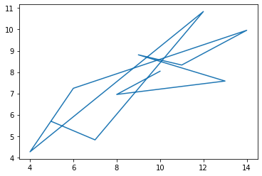

```python
import pandas as pd
import numpy as np
import matplotlib.pyplot as plt
import seaborn as sns
```


```python
blood = ['A', 'A', 'A', 'B', 'B', 'AB', 'O']
# 범주형 자료
```


```python
np.unique(blood)
np.unique(blood, return_counts=True)
```


    (array(['A', 'AB', 'B', 'O'], dtype='<U2'), array([3, 1, 2, 1], dtype=int64))


```python
pd.value_counts(blood)
```


    A     3
    B     2
    AB    1
    O     1
    dtype: int64


```python
sns.countplot(x=blood)
```


    <AxesSubplot:ylabel='count'>


    

    


```python
x = [1, 1, 1, 2, 3, 5, 5, 7, 8, 9]
```


```python
hist, edge = np.histogram(x, 4) # 구간별 빈도수 확인/ 구간별 빈도수, 구간
```


```python
hist
```


    array([4, 1, 2, 3], dtype=int64)


```python
edge
```


    array([1., 3., 5., 7., 9.])


```python
# 중심경향치 : 자료의 중심이 되는 숫자 (평균, 중위수, 최빈수 등)
# - 무엇을 중심으로 모여있나(흩어져있나)
# 변산성측정치 : 자료가 흩어져 있는 정도를 나타낸 값
# - 모여있는 정도(흩어진 정도)

x = [100, 100, 200, 400, 500]
```


```python
np.mean(x)
```


    260.0


```python
np.median(x) # 중위수
```


    200.0


```python
x = [1, 1, 2, 3, 3, 3, 4, 5, 5, 7]
```


```python
# 범위(range) : 최대값과 최소값의 차이, 자료의 퍼짐 정도
np.min(x)
np.max(x)
np.max(x) - np.min(x)
```


    6


```python
# 중위수 : 명명척도에서 사용x, 서열/등간/비율척도에서 사용O

# 척도(scale) : 수집된 데이터의 수준
# 명명척도 : 혈액형(순서x, 연산x, 빈도수o)
# 서열척도 : 직급(사원,대리,과장,..., 순서o, 연산x, 빈도수o, 데이터 간격 일정치 않음)
# ex) 어린이, 청소년, 청년, 장년, 노년
# 등간척도 : 온도(순서o, 연산o, 영점의 기준이 임의적)
# ex)섭씨 20도는 섭씨 5도의 4배(수치상), 4배 따뜻하다?(아님)
# 비율척도 : 길이(등간척도 + 영점의 기준이 절대적(절대영점))
# ex)길이 20미터는 길이 5미터의 4배(수치상), 실제로도 4배 길다
```


```python
from scipy.stats import mode
```


```python
mode(x) # 최빈수, 최빈수의 빈도
```


    ModeResult(mode=array([100]), count=array([2]))


```python
# 분산 크다? 데이터가 평균에서 많이 벗어나 있다
# 분산 작다? 데이터가 평균 주변에 많이 있다
```


```python
np.var(x) # 분산
```


    3.2399999999999998


```python
np.mean(x) # 3.4
```


    3.4


```python
x
```


    [1, 1, 2, 3, 3, 3, 4, 5, 5, 7]


```python
# 분산
summation = 0
for n in x:
    summation+=(n-np.mean(x))**2
summation/len(x)
```


    3.2399999999999998


```python
# 공분산
# 두 변수가 함께 변화하는 정도
# 공분산 > 0 : 두 변수가 같은 방향으로 변화
# 공분산 < 0 : 두 변수가 반대 방향으로 변화
# 공분산 = 0 : 두 변수가 독립(상관없음)

# 공분산의 크기가(절대값) 클 때 : 두 변수가 함께 많이 변화
# 공분산의 크기는 단위의 영향(ex: 키 cm/m) -> 절대적 크기로 판단x => -1 ~ +1 값으로 표준화
# => 표준화된값 : 상관계수

# 공분산은 선형적인 관계 측정, 비선형적인 관계는 측정하지 못함


# 상관계수
# 두 변수가 함께 변화하는 정도를 -1 ~ +1 사이로 나타낸 수
# 상관계수 = 공분산/ 각 변수의 표준편차의 곱 
# -1 <= 상관계수 <= +1

# 피어슨 상관계수 : 일반적인 상관계수
# 스피어만, 켄달, ... 상관계수
```


```python
x = [8, 3, 6, 6, 9, 4, 3, 9, 3, 4] # 부모
y = [6, 2, 4, 6, 10, 5, 1, 8, 4, 5] # 자식
```


```python
plt.plot(x, y, 'o')
```


    [<matplotlib.lines.Line2D at 0x23a710e9a90>]


    

    


```python
np.cov(x,y)
```


    array([[6.05555556, 5.61111111],
           [5.61111111, 6.98888889]])


```python
np.cov(x,y)[0,1] # 공분산
```


    5.611111111111111


```python
z = [-3, -2, -1, 0, 1, 2, 3]
w = [9, 4, 1, 0, 1, 4, 9]
```


```python
plt.plot(z,w,'o')
```


    [<matplotlib.lines.Line2D at 0x23a717ecb20>]


    

    


```python
np.cov(z,w)[0,1]
```


    0.0


```python
x
```


    [8, 3, 6, 6, 9, 4, 3, 9, 3, 4]


```python
y
```


    [6, 2, 4, 6, 10, 5, 1, 8, 4, 5]


```python
np.corrcoef(x,y)[0,1] # 상관계수
```


    0.862517279213578


```python
# 공분산/(x의 표준편차 * y의표준편차)
np.cov(x,y)[0,1] # 공분산
xsd = np.std(x, ddof=1) # 표본표준편차
ysd = np.std(y, ddof=1)
```


```python
np.cov(x,y)[0,1]/(xsd*ysd)
```


    0.8625172792135779


```python
# 3~12번열까지 총 10개 열에 해당되는 데이터를 추출하고
# 각 열에대한 이름을 a~j까지 열거된 이름으로 설정한다.

# a~j열까지 10개 열 상호간에 상관계수를 구했을 때, 
# 가장 상관계수가 높고 낮은 변수(features)들을 구하시오
```


```python
medi = pd.read_csv('breast+cancer+wisconsin+diagnostic/wdbc.data', header=None).iloc[:, 2:12]
medi
```


<div>
<style scoped>
    .dataframe tbody tr th:only-of-type {
        vertical-align: middle;
    }

    .dataframe tbody tr th {
        vertical-align: top;
    }

    .dataframe thead th {
        text-align: right;
    }
</style>
<table border="1" class="dataframe">
  <thead>
    <tr style="text-align: right;">
      <th></th>
      <th>2</th>
      <th>3</th>
      <th>4</th>
      <th>5</th>
      <th>6</th>
      <th>7</th>
      <th>8</th>
      <th>9</th>
      <th>10</th>
      <th>11</th>
    </tr>
  </thead>
  <tbody>
    <tr>
      <th>0</th>
      <td>17.99</td>
      <td>10.38</td>
      <td>122.80</td>
      <td>1001.0</td>
      <td>0.11840</td>
      <td>0.27760</td>
      <td>0.30010</td>
      <td>0.14710</td>
      <td>0.2419</td>
      <td>0.07871</td>
    </tr>
    <tr>
      <th>1</th>
      <td>20.57</td>
      <td>17.77</td>
      <td>132.90</td>
      <td>1326.0</td>
      <td>0.08474</td>
      <td>0.07864</td>
      <td>0.08690</td>
      <td>0.07017</td>
      <td>0.1812</td>
      <td>0.05667</td>
    </tr>
    <tr>
      <th>2</th>
      <td>19.69</td>
      <td>21.25</td>
      <td>130.00</td>
      <td>1203.0</td>
      <td>0.10960</td>
      <td>0.15990</td>
      <td>0.19740</td>
      <td>0.12790</td>
      <td>0.2069</td>
      <td>0.05999</td>
    </tr>
    <tr>
      <th>3</th>
      <td>11.42</td>
      <td>20.38</td>
      <td>77.58</td>
      <td>386.1</td>
      <td>0.14250</td>
      <td>0.28390</td>
      <td>0.24140</td>
      <td>0.10520</td>
      <td>0.2597</td>
      <td>0.09744</td>
    </tr>
    <tr>
      <th>4</th>
      <td>20.29</td>
      <td>14.34</td>
      <td>135.10</td>
      <td>1297.0</td>
      <td>0.10030</td>
      <td>0.13280</td>
      <td>0.19800</td>
      <td>0.10430</td>
      <td>0.1809</td>
      <td>0.05883</td>
    </tr>
    <tr>
      <th>...</th>
      <td>...</td>
      <td>...</td>
      <td>...</td>
      <td>...</td>
      <td>...</td>
      <td>...</td>
      <td>...</td>
      <td>...</td>
      <td>...</td>
      <td>...</td>
    </tr>
    <tr>
      <th>564</th>
      <td>21.56</td>
      <td>22.39</td>
      <td>142.00</td>
      <td>1479.0</td>
      <td>0.11100</td>
      <td>0.11590</td>
      <td>0.24390</td>
      <td>0.13890</td>
      <td>0.1726</td>
      <td>0.05623</td>
    </tr>
    <tr>
      <th>565</th>
      <td>20.13</td>
      <td>28.25</td>
      <td>131.20</td>
      <td>1261.0</td>
      <td>0.09780</td>
      <td>0.10340</td>
      <td>0.14400</td>
      <td>0.09791</td>
      <td>0.1752</td>
      <td>0.05533</td>
    </tr>
    <tr>
      <th>566</th>
      <td>16.60</td>
      <td>28.08</td>
      <td>108.30</td>
      <td>858.1</td>
      <td>0.08455</td>
      <td>0.10230</td>
      <td>0.09251</td>
      <td>0.05302</td>
      <td>0.1590</td>
      <td>0.05648</td>
    </tr>
    <tr>
      <th>567</th>
      <td>20.60</td>
      <td>29.33</td>
      <td>140.10</td>
      <td>1265.0</td>
      <td>0.11780</td>
      <td>0.27700</td>
      <td>0.35140</td>
      <td>0.15200</td>
      <td>0.2397</td>
      <td>0.07016</td>
    </tr>
    <tr>
      <th>568</th>
      <td>7.76</td>
      <td>24.54</td>
      <td>47.92</td>
      <td>181.0</td>
      <td>0.05263</td>
      <td>0.04362</td>
      <td>0.00000</td>
      <td>0.00000</td>
      <td>0.1587</td>
      <td>0.05884</td>
    </tr>
  </tbody>
</table>
<p>569 rows × 10 columns</p>
</div>


```python
medi.columns=['radius', 'texture', 'perimeter', 'area', 'smoothness', 'compactness', 'concavity', 'concave points', 'symmetry', 'fractal dimension']
```


```python
medi
```


<div>
<style scoped>
    .dataframe tbody tr th:only-of-type {
        vertical-align: middle;
    }

    .dataframe tbody tr th {
        vertical-align: top;
    }

    .dataframe thead th {
        text-align: right;
    }
</style>
<table border="1" class="dataframe">
  <thead>
    <tr style="text-align: right;">
      <th></th>
      <th>radius</th>
      <th>texture</th>
      <th>perimeter</th>
      <th>area</th>
      <th>smoothness</th>
      <th>compactness</th>
      <th>concavity</th>
      <th>concave points</th>
      <th>symmetry</th>
      <th>fractal dimension</th>
    </tr>
  </thead>
  <tbody>
    <tr>
      <th>0</th>
      <td>17.99</td>
      <td>10.38</td>
      <td>122.80</td>
      <td>1001.0</td>
      <td>0.11840</td>
      <td>0.27760</td>
      <td>0.30010</td>
      <td>0.14710</td>
      <td>0.2419</td>
      <td>0.07871</td>
    </tr>
    <tr>
      <th>1</th>
      <td>20.57</td>
      <td>17.77</td>
      <td>132.90</td>
      <td>1326.0</td>
      <td>0.08474</td>
      <td>0.07864</td>
      <td>0.08690</td>
      <td>0.07017</td>
      <td>0.1812</td>
      <td>0.05667</td>
    </tr>
    <tr>
      <th>2</th>
      <td>19.69</td>
      <td>21.25</td>
      <td>130.00</td>
      <td>1203.0</td>
      <td>0.10960</td>
      <td>0.15990</td>
      <td>0.19740</td>
      <td>0.12790</td>
      <td>0.2069</td>
      <td>0.05999</td>
    </tr>
    <tr>
      <th>3</th>
      <td>11.42</td>
      <td>20.38</td>
      <td>77.58</td>
      <td>386.1</td>
      <td>0.14250</td>
      <td>0.28390</td>
      <td>0.24140</td>
      <td>0.10520</td>
      <td>0.2597</td>
      <td>0.09744</td>
    </tr>
    <tr>
      <th>4</th>
      <td>20.29</td>
      <td>14.34</td>
      <td>135.10</td>
      <td>1297.0</td>
      <td>0.10030</td>
      <td>0.13280</td>
      <td>0.19800</td>
      <td>0.10430</td>
      <td>0.1809</td>
      <td>0.05883</td>
    </tr>
    <tr>
      <th>...</th>
      <td>...</td>
      <td>...</td>
      <td>...</td>
      <td>...</td>
      <td>...</td>
      <td>...</td>
      <td>...</td>
      <td>...</td>
      <td>...</td>
      <td>...</td>
    </tr>
    <tr>
      <th>564</th>
      <td>21.56</td>
      <td>22.39</td>
      <td>142.00</td>
      <td>1479.0</td>
      <td>0.11100</td>
      <td>0.11590</td>
      <td>0.24390</td>
      <td>0.13890</td>
      <td>0.1726</td>
      <td>0.05623</td>
    </tr>
    <tr>
      <th>565</th>
      <td>20.13</td>
      <td>28.25</td>
      <td>131.20</td>
      <td>1261.0</td>
      <td>0.09780</td>
      <td>0.10340</td>
      <td>0.14400</td>
      <td>0.09791</td>
      <td>0.1752</td>
      <td>0.05533</td>
    </tr>
    <tr>
      <th>566</th>
      <td>16.60</td>
      <td>28.08</td>
      <td>108.30</td>
      <td>858.1</td>
      <td>0.08455</td>
      <td>0.10230</td>
      <td>0.09251</td>
      <td>0.05302</td>
      <td>0.1590</td>
      <td>0.05648</td>
    </tr>
    <tr>
      <th>567</th>
      <td>20.60</td>
      <td>29.33</td>
      <td>140.10</td>
      <td>1265.0</td>
      <td>0.11780</td>
      <td>0.27700</td>
      <td>0.35140</td>
      <td>0.15200</td>
      <td>0.2397</td>
      <td>0.07016</td>
    </tr>
    <tr>
      <th>568</th>
      <td>7.76</td>
      <td>24.54</td>
      <td>47.92</td>
      <td>181.0</td>
      <td>0.05263</td>
      <td>0.04362</td>
      <td>0.00000</td>
      <td>0.00000</td>
      <td>0.1587</td>
      <td>0.05884</td>
    </tr>
  </tbody>
</table>
<p>569 rows × 10 columns</p>
</div>


```python
medi.iloc[0]
```


    radius                 17.99000
    texture                10.38000
    perimeter             122.80000
    area                 1001.00000
    smoothness              0.11840
    compactness             0.27760
    concavity               0.30010
    concave points          0.14710
    symmetry                0.24190
    fractal dimension       0.07871
    Name: 0, dtype: float64


```python
np.corrcoef(medi.iloc[0],medi.iloc[1])[0,1] # 상관계수
```


    0.9997347978355419


```python
res = {}
for i in range(len(medi.columns)):
    for j in range(i+1, len(medi.columns)):
        a1 = medi.columns[i]
        a2 = medi.columns[j]
        
        a3 = np.corrcoef(medi[a1], medi[a2])[0,1] # 상관계수
        
        res[(a1, a2)] = a3

max_res = max(res, key=res.get)
max_res

min_res = min(res, key=res.get)
min_res
```


    ('radius', 'fractal dimension')


```python
df = pd.read_csv('breast+cancer+wisconsin+diagnostic/wdbc.data', header=None).iloc[:, 2:12]
df

df.columns = [
    'radius', 'texture', 'perimeter', 'area', 'smoothness', 
    'compactness', 'concavity', 'concave points', 'symmetry', 'fractal dimension'
]

corr_arr = np.corrcoef(df, rowvar=False) # 상관계수 배열
corr_df = pd.DataFrame(corr_arr, index=df.columns, columns=df.columns) # 상관계수 프레임

descending_ser = corr_df.unstack().sort_values(ascending=False) # 내림차순
ascending_ser = corr_df.unstack().sort_values() # 오름차순

descending_ser[descending_ser < 0.999][0] # 1 미만 가장 큰 값
ascending_ser[0] # 가장 작은 값
```


    -0.3116308263092902


```python

```
