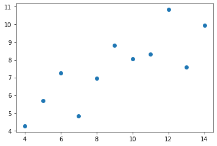
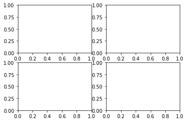
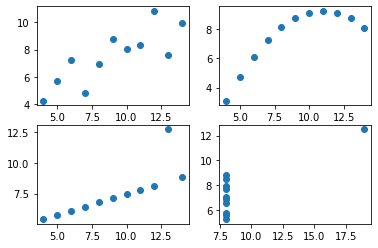
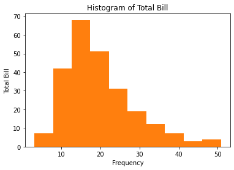
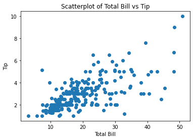
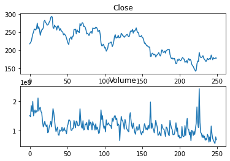

```python
import pandas as pd
import numpy as np
import matplotlib.pyplot as plt
```


```python
scientists = pd.read_csv("data/scientists.csv")
scientists
```


<div>
<style scoped>
    .dataframe tbody tr th:only-of-type {
        vertical-align: middle;
    }

    .dataframe tbody tr th {
        vertical-align: top;
    }

    .dataframe thead th {
        text-align: right;
    }
</style>
<table border="1" class="dataframe">
  <thead>
    <tr style="text-align: right;">
      <th></th>
      <th>Name</th>
      <th>Born</th>
      <th>Died</th>
      <th>Age</th>
      <th>Occupation</th>
    </tr>
  </thead>
  <tbody>
    <tr>
      <th>0</th>
      <td>Rosaline Franklin</td>
      <td>1920-07-25</td>
      <td>1958-04-16</td>
      <td>37</td>
      <td>Chemist</td>
    </tr>
    <tr>
      <th>1</th>
      <td>William Gosset</td>
      <td>1876-06-13</td>
      <td>1937-10-16</td>
      <td>61</td>
      <td>Statistician</td>
    </tr>
    <tr>
      <th>2</th>
      <td>Florence Nightingale</td>
      <td>1820-05-12</td>
      <td>1910-08-13</td>
      <td>90</td>
      <td>Nurse</td>
    </tr>
    <tr>
      <th>3</th>
      <td>Marie Curie</td>
      <td>1867-11-07</td>
      <td>1934-07-04</td>
      <td>66</td>
      <td>Chemist</td>
    </tr>
    <tr>
      <th>4</th>
      <td>Rachel Carson</td>
      <td>1907-05-27</td>
      <td>1964-04-14</td>
      <td>56</td>
      <td>Biologist</td>
    </tr>
    <tr>
      <th>5</th>
      <td>John Snow</td>
      <td>1813-03-15</td>
      <td>1858-06-16</td>
      <td>45</td>
      <td>Physician</td>
    </tr>
    <tr>
      <th>6</th>
      <td>Alan Turing</td>
      <td>1912-06-23</td>
      <td>1954-06-07</td>
      <td>41</td>
      <td>Computer Scientist</td>
    </tr>
    <tr>
      <th>7</th>
      <td>Johann Gauss</td>
      <td>1777-04-30</td>
      <td>1855-02-23</td>
      <td>77</td>
      <td>Mathematician</td>
    </tr>
  </tbody>
</table>
</div>


```python
ages = scientists['Age']
ages
```


    0    37
    1    61
    2    90
    3    66
    4    56
    5    45
    6    41
    7    77
    Name: Age, dtype: int64


```python
ages.max()
```


    90


```python
ages.mean()
```


    59.125


```python
ages[ages > ages.mean()]
```


    1    61
    2    90
    3    66
    7    77
    Name: Age, dtype: int64


```python
ages+ages
ages*ages
ages + 100
ages*2
```


    0     74
    1    122
    2    180
    3    132
    4    112
    5     90
    6     82
    7    154
    Name: Age, dtype: int64


```python
pd.Series([1, 100])
```


    0      1
    1    100
    dtype: int64


```python
pd.Series([1, 100]) + ages
```


    0     38.0
    1    161.0
    2      NaN
    3      NaN
    4      NaN
    5      NaN
    6      NaN
    7      NaN
    dtype: float64


```python
scientists
```


<div>
<style scoped>
    .dataframe tbody tr th:only-of-type {
        vertical-align: middle;
    }

    .dataframe tbody tr th {
        vertical-align: top;
    }

    .dataframe thead th {
        text-align: right;
    }
</style>
<table border="1" class="dataframe">
  <thead>
    <tr style="text-align: right;">
      <th></th>
      <th>Name</th>
      <th>Born</th>
      <th>Died</th>
      <th>Age</th>
      <th>Occupation</th>
    </tr>
  </thead>
  <tbody>
    <tr>
      <th>0</th>
      <td>Rosaline Franklin</td>
      <td>1920-07-25</td>
      <td>1958-04-16</td>
      <td>37</td>
      <td>Chemist</td>
    </tr>
    <tr>
      <th>1</th>
      <td>William Gosset</td>
      <td>1876-06-13</td>
      <td>1937-10-16</td>
      <td>61</td>
      <td>Statistician</td>
    </tr>
    <tr>
      <th>2</th>
      <td>Florence Nightingale</td>
      <td>1820-05-12</td>
      <td>1910-08-13</td>
      <td>90</td>
      <td>Nurse</td>
    </tr>
    <tr>
      <th>3</th>
      <td>Marie Curie</td>
      <td>1867-11-07</td>
      <td>1934-07-04</td>
      <td>66</td>
      <td>Chemist</td>
    </tr>
    <tr>
      <th>4</th>
      <td>Rachel Carson</td>
      <td>1907-05-27</td>
      <td>1964-04-14</td>
      <td>56</td>
      <td>Biologist</td>
    </tr>
    <tr>
      <th>5</th>
      <td>John Snow</td>
      <td>1813-03-15</td>
      <td>1858-06-16</td>
      <td>45</td>
      <td>Physician</td>
    </tr>
    <tr>
      <th>6</th>
      <td>Alan Turing</td>
      <td>1912-06-23</td>
      <td>1954-06-07</td>
      <td>41</td>
      <td>Computer Scientist</td>
    </tr>
    <tr>
      <th>7</th>
      <td>Johann Gauss</td>
      <td>1777-04-30</td>
      <td>1855-02-23</td>
      <td>77</td>
      <td>Mathematician</td>
    </tr>
  </tbody>
</table>
</div>


```python
scientists[scientists['Age'] > scientists['Age'].mean()]
```


<div>
<style scoped>
    .dataframe tbody tr th:only-of-type {
        vertical-align: middle;
    }

    .dataframe tbody tr th {
        vertical-align: top;
    }

    .dataframe thead th {
        text-align: right;
    }
</style>
<table border="1" class="dataframe">
  <thead>
    <tr style="text-align: right;">
      <th></th>
      <th>Name</th>
      <th>Born</th>
      <th>Died</th>
      <th>Age</th>
      <th>Occupation</th>
    </tr>
  </thead>
  <tbody>
    <tr>
      <th>1</th>
      <td>William Gosset</td>
      <td>1876-06-13</td>
      <td>1937-10-16</td>
      <td>61</td>
      <td>Statistician</td>
    </tr>
    <tr>
      <th>2</th>
      <td>Florence Nightingale</td>
      <td>1820-05-12</td>
      <td>1910-08-13</td>
      <td>90</td>
      <td>Nurse</td>
    </tr>
    <tr>
      <th>3</th>
      <td>Marie Curie</td>
      <td>1867-11-07</td>
      <td>1934-07-04</td>
      <td>66</td>
      <td>Chemist</td>
    </tr>
    <tr>
      <th>7</th>
      <td>Johann Gauss</td>
      <td>1777-04-30</td>
      <td>1855-02-23</td>
      <td>77</td>
      <td>Mathematician</td>
    </tr>
  </tbody>
</table>
</div>


```python
scientists * 2
```


<div>
<style scoped>
    .dataframe tbody tr th:only-of-type {
        vertical-align: middle;
    }

    .dataframe tbody tr th {
        vertical-align: top;
    }

    .dataframe thead th {
        text-align: right;
    }
</style>
<table border="1" class="dataframe">
  <thead>
    <tr style="text-align: right;">
      <th></th>
      <th>Name</th>
      <th>Born</th>
      <th>Died</th>
      <th>Age</th>
      <th>Occupation</th>
    </tr>
  </thead>
  <tbody>
    <tr>
      <th>0</th>
      <td>Rosaline FranklinRosaline Franklin</td>
      <td>1920-07-251920-07-25</td>
      <td>1958-04-161958-04-16</td>
      <td>74</td>
      <td>ChemistChemist</td>
    </tr>
    <tr>
      <th>1</th>
      <td>William GossetWilliam Gosset</td>
      <td>1876-06-131876-06-13</td>
      <td>1937-10-161937-10-16</td>
      <td>122</td>
      <td>StatisticianStatistician</td>
    </tr>
    <tr>
      <th>2</th>
      <td>Florence NightingaleFlorence Nightingale</td>
      <td>1820-05-121820-05-12</td>
      <td>1910-08-131910-08-13</td>
      <td>180</td>
      <td>NurseNurse</td>
    </tr>
    <tr>
      <th>3</th>
      <td>Marie CurieMarie Curie</td>
      <td>1867-11-071867-11-07</td>
      <td>1934-07-041934-07-04</td>
      <td>132</td>
      <td>ChemistChemist</td>
    </tr>
    <tr>
      <th>4</th>
      <td>Rachel CarsonRachel Carson</td>
      <td>1907-05-271907-05-27</td>
      <td>1964-04-141964-04-14</td>
      <td>112</td>
      <td>BiologistBiologist</td>
    </tr>
    <tr>
      <th>5</th>
      <td>John SnowJohn Snow</td>
      <td>1813-03-151813-03-15</td>
      <td>1858-06-161858-06-16</td>
      <td>90</td>
      <td>PhysicianPhysician</td>
    </tr>
    <tr>
      <th>6</th>
      <td>Alan TuringAlan Turing</td>
      <td>1912-06-231912-06-23</td>
      <td>1954-06-071954-06-07</td>
      <td>82</td>
      <td>Computer ScientistComputer Scientist</td>
    </tr>
    <tr>
      <th>7</th>
      <td>Johann GaussJohann Gauss</td>
      <td>1777-04-301777-04-30</td>
      <td>1855-02-231855-02-23</td>
      <td>154</td>
      <td>MathematicianMathematician</td>
    </tr>
  </tbody>
</table>
</div>


```python
scientists['Born']
```


    0    1920-07-25
    1    1876-06-13
    2    1820-05-12
    3    1867-11-07
    4    1907-05-27
    5    1813-03-15
    6    1912-06-23
    7    1777-04-30
    Name: Born, dtype: object


```python
pd.to_datetime(scientists['Born'], format='%Y-%m-%d')
born_datetime = pd.to_datetime(scientists['Born'], format='%Y-%m-%d') 
born_datetime
```


    0   1920-07-25
    1   1876-06-13
    2   1820-05-12
    3   1867-11-07
    4   1907-05-27
    5   1813-03-15
    6   1912-06-23
    7   1777-04-30
    Name: Born, dtype: datetime64[ns]


```python
died_datetime = pd.to_datetime(scientists['Died'], format='%Y-%m-%d')
print(died_datetime)
```

    0   1958-04-16
    1   1937-10-16
    2   1910-08-13
    3   1934-07-04
    4   1964-04-14
    5   1858-06-16
    6   1954-06-07
    7   1855-02-23
    Name: Died, dtype: datetime64[ns]
    


```python
scientists['born_dt'], scientists['died_dt'] = (born_datetime, died_datetime)
print(scientists.head())
```

                       Name        Born        Died  Age    Occupation    born_dt  \
    0     Rosaline Franklin  1920-07-25  1958-04-16   37       Chemist 1920-07-25   
    1        William Gosset  1876-06-13  1937-10-16   61  Statistician 1876-06-13   
    2  Florence Nightingale  1820-05-12  1910-08-13   90         Nurse 1820-05-12   
    3           Marie Curie  1867-11-07  1934-07-04   66       Chemist 1867-11-07   
    4         Rachel Carson  1907-05-27  1964-04-14   56     Biologist 1907-05-27   
    
         died_dt  
    0 1958-04-16  
    1 1937-10-16  
    2 1910-08-13  
    3 1934-07-04  
    4 1964-04-14  
    


```python
scientists.shape
```


    (8, 7)


```python
scientists.info()
```

    <class 'pandas.core.frame.DataFrame'>
    RangeIndex: 8 entries, 0 to 7
    Data columns (total 7 columns):
     #   Column      Non-Null Count  Dtype         
    ---  ------      --------------  -----         
     0   Name        8 non-null      object        
     1   Born        8 non-null      object        
     2   Died        8 non-null      object        
     3   Age         8 non-null      int64         
     4   Occupation  8 non-null      object        
     5   born_dt     8 non-null      datetime64[ns]
     6   died_dt     8 non-null      datetime64[ns]
    dtypes: datetime64[ns](2), int64(1), object(4)
    memory usage: 576.0+ bytes
    


```python
# 생존 기간(일) 출력
# 날짜형식 -> 수치 데이터
scientists['died_dt'] - scientists['born_dt']
scientists['age_days_dt'] =scientists['died_dt'] - scientists['born_dt']
```


```python
scientists
```


<div>
<style scoped>
    .dataframe tbody tr th:only-of-type {
        vertical-align: middle;
    }

    .dataframe tbody tr th {
        vertical-align: top;
    }

    .dataframe thead th {
        text-align: right;
    }
</style>
<table border="1" class="dataframe">
  <thead>
    <tr style="text-align: right;">
      <th></th>
      <th>Name</th>
      <th>Born</th>
      <th>Died</th>
      <th>Age</th>
      <th>Occupation</th>
      <th>born_dt</th>
      <th>died_dt</th>
      <th>age_days_dt</th>
    </tr>
  </thead>
  <tbody>
    <tr>
      <th>0</th>
      <td>Rosaline Franklin</td>
      <td>1920-07-25</td>
      <td>1958-04-16</td>
      <td>37</td>
      <td>Chemist</td>
      <td>1920-07-25</td>
      <td>1958-04-16</td>
      <td>13779 days</td>
    </tr>
    <tr>
      <th>1</th>
      <td>William Gosset</td>
      <td>1876-06-13</td>
      <td>1937-10-16</td>
      <td>61</td>
      <td>Statistician</td>
      <td>1876-06-13</td>
      <td>1937-10-16</td>
      <td>22404 days</td>
    </tr>
    <tr>
      <th>2</th>
      <td>Florence Nightingale</td>
      <td>1820-05-12</td>
      <td>1910-08-13</td>
      <td>90</td>
      <td>Nurse</td>
      <td>1820-05-12</td>
      <td>1910-08-13</td>
      <td>32964 days</td>
    </tr>
    <tr>
      <th>3</th>
      <td>Marie Curie</td>
      <td>1867-11-07</td>
      <td>1934-07-04</td>
      <td>66</td>
      <td>Chemist</td>
      <td>1867-11-07</td>
      <td>1934-07-04</td>
      <td>24345 days</td>
    </tr>
    <tr>
      <th>4</th>
      <td>Rachel Carson</td>
      <td>1907-05-27</td>
      <td>1964-04-14</td>
      <td>56</td>
      <td>Biologist</td>
      <td>1907-05-27</td>
      <td>1964-04-14</td>
      <td>20777 days</td>
    </tr>
    <tr>
      <th>5</th>
      <td>John Snow</td>
      <td>1813-03-15</td>
      <td>1858-06-16</td>
      <td>45</td>
      <td>Physician</td>
      <td>1813-03-15</td>
      <td>1858-06-16</td>
      <td>16529 days</td>
    </tr>
    <tr>
      <th>6</th>
      <td>Alan Turing</td>
      <td>1912-06-23</td>
      <td>1954-06-07</td>
      <td>41</td>
      <td>Computer Scientist</td>
      <td>1912-06-23</td>
      <td>1954-06-07</td>
      <td>15324 days</td>
    </tr>
    <tr>
      <th>7</th>
      <td>Johann Gauss</td>
      <td>1777-04-30</td>
      <td>1855-02-23</td>
      <td>77</td>
      <td>Mathematician</td>
      <td>1777-04-30</td>
      <td>1855-02-23</td>
      <td>28422 days</td>
    </tr>
  </tbody>
</table>
</div>


```python
import seaborn as sns 
anscombe = sns.load_dataset("anscombe") 
print(anscombe)
```

       dataset     x      y
    0        I  10.0   8.04
    1        I   8.0   6.95
    2        I  13.0   7.58
    3        I   9.0   8.81
    4        I  11.0   8.33
    5        I  14.0   9.96
    6        I   6.0   7.24
    7        I   4.0   4.26
    8        I  12.0  10.84
    9        I   7.0   4.82
    10       I   5.0   5.68
    11      II  10.0   9.14
    12      II   8.0   8.14
    13      II  13.0   8.74
    14      II   9.0   8.77
    15      II  11.0   9.26
    16      II  14.0   8.10
    17      II   6.0   6.13
    18      II   4.0   3.10
    19      II  12.0   9.13
    20      II   7.0   7.26
    21      II   5.0   4.74
    22     III  10.0   7.46
    23     III   8.0   6.77
    24     III  13.0  12.74
    25     III   9.0   7.11
    26     III  11.0   7.81
    27     III  14.0   8.84
    28     III   6.0   6.08
    29     III   4.0   5.39
    30     III  12.0   8.15
    31     III   7.0   6.42
    32     III   5.0   5.73
    33      IV   8.0   6.58
    34      IV   8.0   5.76
    35      IV   8.0   7.71
    36      IV   8.0   8.84
    37      IV   8.0   8.47
    38      IV   8.0   7.04
    39      IV   8.0   5.25
    40      IV  19.0  12.50
    41      IV   8.0   5.56
    42      IV   8.0   7.91
    43      IV   8.0   6.89
    


```python
dataset_1=anscombe[anscombe['dataset']=='I']
dataset_1
```


<div>
<style scoped>
    .dataframe tbody tr th:only-of-type {
        vertical-align: middle;
    }

    .dataframe tbody tr th {
        vertical-align: top;
    }

    .dataframe thead th {
        text-align: right;
    }
</style>
<table border="1" class="dataframe">
  <thead>
    <tr style="text-align: right;">
      <th></th>
      <th>dataset</th>
      <th>x</th>
      <th>y</th>
    </tr>
  </thead>
  <tbody>
    <tr>
      <th>0</th>
      <td>I</td>
      <td>10.0</td>
      <td>8.04</td>
    </tr>
    <tr>
      <th>1</th>
      <td>I</td>
      <td>8.0</td>
      <td>6.95</td>
    </tr>
    <tr>
      <th>2</th>
      <td>I</td>
      <td>13.0</td>
      <td>7.58</td>
    </tr>
    <tr>
      <th>3</th>
      <td>I</td>
      <td>9.0</td>
      <td>8.81</td>
    </tr>
    <tr>
      <th>4</th>
      <td>I</td>
      <td>11.0</td>
      <td>8.33</td>
    </tr>
    <tr>
      <th>5</th>
      <td>I</td>
      <td>14.0</td>
      <td>9.96</td>
    </tr>
    <tr>
      <th>6</th>
      <td>I</td>
      <td>6.0</td>
      <td>7.24</td>
    </tr>
    <tr>
      <th>7</th>
      <td>I</td>
      <td>4.0</td>
      <td>4.26</td>
    </tr>
    <tr>
      <th>8</th>
      <td>I</td>
      <td>12.0</td>
      <td>10.84</td>
    </tr>
    <tr>
      <th>9</th>
      <td>I</td>
      <td>7.0</td>
      <td>4.82</td>
    </tr>
    <tr>
      <th>10</th>
      <td>I</td>
      <td>5.0</td>
      <td>5.68</td>
    </tr>
  </tbody>
</table>
</div>


```python
dataset_2 = anscombe[anscombe['dataset'] == 'II'] 
dataset_3 = anscombe[anscombe['dataset'] == 'III'] 
dataset_4 = anscombe[anscombe['dataset'] == 'IV']
```


```python
dataset_1.describe()
dataset_2.describe()
dataset_3.describe()
dataset_4.describe()
```


<div>
<style scoped>
    .dataframe tbody tr th:only-of-type {
        vertical-align: middle;
    }

    .dataframe tbody tr th {
        vertical-align: top;
    }

    .dataframe thead th {
        text-align: right;
    }
</style>
<table border="1" class="dataframe">
  <thead>
    <tr style="text-align: right;">
      <th></th>
      <th>x</th>
      <th>y</th>
    </tr>
  </thead>
  <tbody>
    <tr>
      <th>count</th>
      <td>11.000000</td>
      <td>11.000000</td>
    </tr>
    <tr>
      <th>mean</th>
      <td>9.000000</td>
      <td>7.500909</td>
    </tr>
    <tr>
      <th>std</th>
      <td>3.316625</td>
      <td>2.030579</td>
    </tr>
    <tr>
      <th>min</th>
      <td>8.000000</td>
      <td>5.250000</td>
    </tr>
    <tr>
      <th>25%</th>
      <td>8.000000</td>
      <td>6.170000</td>
    </tr>
    <tr>
      <th>50%</th>
      <td>8.000000</td>
      <td>7.040000</td>
    </tr>
    <tr>
      <th>75%</th>
      <td>8.000000</td>
      <td>8.190000</td>
    </tr>
    <tr>
      <th>max</th>
      <td>19.000000</td>
      <td>12.500000</td>
    </tr>
  </tbody>
</table>
</div>


```python
plt.plot(dataset_1['x'], dataset_1['y'])
```


    [<matplotlib.lines.Line2D at 0x151237c4250>]


    

    


```python
plt.plot(dataset_1['x'], dataset_1['y'], 'o')
```


    [<matplotlib.lines.Line2D at 0x151240c6490>]


    

    


```python
fig = plt.figure()
axes1 = fig.add_subplot(2, 2, 1)
axes2 = fig.add_subplot(2, 2, 2)
axes3 = fig.add_subplot(2, 2, 3)
axes4 = fig.add_subplot(2, 2, 4)
```


    

    


```python
axes1.plot(dataset_1['x'], dataset_1['y'], 'o') 
axes2.plot(dataset_2['x'], dataset_2['y'], 'o') 
axes3.plot(dataset_3['x'], dataset_3['y'], 'o') 
axes4.plot(dataset_4['x'], dataset_4['y'], 'o')

fig
```


    

    


```python
tips = sns.load_dataset("tips") 
print(tips.head())
print(type(tips))
```

       total_bill   tip     sex smoker  day    time  size
    0       16.99  1.01  Female     No  Sun  Dinner     2
    1       10.34  1.66    Male     No  Sun  Dinner     3
    2       21.01  3.50    Male     No  Sun  Dinner     3
    3       23.68  3.31    Male     No  Sun  Dinner     2
    4       24.59  3.61  Female     No  Sun  Dinner     4
    <class 'pandas.core.frame.DataFrame'>
    


```python
fig = plt.figure() # 도화지
axes1 = fig.add_subplot(1, 1, 1) # 도화지를 여러 영역으로 나눔
```


    

    


```python
axes1.hist(tips['total_bill'], bins=10) 
axes1.set_title('Histogram of Total Bill')
axes1.set_xlabel('Frequency') 
axes1.set_ylabel('Total Bill')
fig
```


    

    


```python
scatter_plot = plt.figure() 
axes1 = scatter_plot.add_subplot(1, 1, 1) 
axes1.scatter(tips['total_bill'], tips['tip']) 
axes1.set_title('Scatterplot of Total Bill vs Tip') 
axes1.set_xlabel('Total Bill') 
axes1.set_ylabel('Tip')
```


    Text(0, 0.5, 'Tip')


    

    


```python
boxplot = plt.figure() 
axes1 = boxplot.add_subplot(1, 1, 1) 

axes1.boxplot( 
    [tips[tips['sex'] == 'Female']['tip'], 
     tips[tips['sex'] == 'Male']['tip']], 
    labels=['Female', 'Male'])


axes1.set_xlabel('Sex') 
axes1.set_ylabel('Tip') 
axes1.set_title('Boxplot of Tips by Sex')
```


    Text(0.5, 1.0, 'Boxplot of Tips by Sex')


    

    


```python
df1=pd.read_csv("data/concat_1.csv")
df1
```


<div>
<style scoped>
    .dataframe tbody tr th:only-of-type {
        vertical-align: middle;
    }

    .dataframe tbody tr th {
        vertical-align: top;
    }

    .dataframe thead th {
        text-align: right;
    }
</style>
<table border="1" class="dataframe">
  <thead>
    <tr style="text-align: right;">
      <th></th>
      <th>A</th>
      <th>B</th>
      <th>C</th>
      <th>D</th>
    </tr>
  </thead>
  <tbody>
    <tr>
      <th>0</th>
      <td>a0</td>
      <td>b0</td>
      <td>c0</td>
      <td>d0</td>
    </tr>
    <tr>
      <th>1</th>
      <td>a1</td>
      <td>b1</td>
      <td>c1</td>
      <td>d1</td>
    </tr>
    <tr>
      <th>2</th>
      <td>a2</td>
      <td>b2</td>
      <td>c2</td>
      <td>d2</td>
    </tr>
    <tr>
      <th>3</th>
      <td>a3</td>
      <td>b3</td>
      <td>c3</td>
      <td>d3</td>
    </tr>
  </tbody>
</table>
</div>


```python
df2=pd.read_csv("data/concat_2.csv")
df2
```


<div>
<style scoped>
    .dataframe tbody tr th:only-of-type {
        vertical-align: middle;
    }

    .dataframe tbody tr th {
        vertical-align: top;
    }

    .dataframe thead th {
        text-align: right;
    }
</style>
<table border="1" class="dataframe">
  <thead>
    <tr style="text-align: right;">
      <th></th>
      <th>A</th>
      <th>B</th>
      <th>C</th>
      <th>D</th>
    </tr>
  </thead>
  <tbody>
    <tr>
      <th>0</th>
      <td>a4</td>
      <td>b4</td>
      <td>c4</td>
      <td>d4</td>
    </tr>
    <tr>
      <th>1</th>
      <td>a5</td>
      <td>b5</td>
      <td>c5</td>
      <td>d5</td>
    </tr>
    <tr>
      <th>2</th>
      <td>a6</td>
      <td>b6</td>
      <td>c6</td>
      <td>d6</td>
    </tr>
    <tr>
      <th>3</th>
      <td>a7</td>
      <td>b7</td>
      <td>c7</td>
      <td>d7</td>
    </tr>
  </tbody>
</table>
</div>


```python
df3=pd.read_csv("data/concat_3.csv")
df3
```


<div>
<style scoped>
    .dataframe tbody tr th:only-of-type {
        vertical-align: middle;
    }

    .dataframe tbody tr th {
        vertical-align: top;
    }

    .dataframe thead th {
        text-align: right;
    }
</style>
<table border="1" class="dataframe">
  <thead>
    <tr style="text-align: right;">
      <th></th>
      <th>A</th>
      <th>B</th>
      <th>C</th>
      <th>D</th>
    </tr>
  </thead>
  <tbody>
    <tr>
      <th>0</th>
      <td>a8</td>
      <td>b8</td>
      <td>c8</td>
      <td>d8</td>
    </tr>
    <tr>
      <th>1</th>
      <td>a9</td>
      <td>b9</td>
      <td>c9</td>
      <td>d9</td>
    </tr>
    <tr>
      <th>2</th>
      <td>a10</td>
      <td>b10</td>
      <td>c10</td>
      <td>d10</td>
    </tr>
    <tr>
      <th>3</th>
      <td>a11</td>
      <td>b11</td>
      <td>c11</td>
      <td>d11</td>
    </tr>
  </tbody>
</table>
</div>


```python
row_concat = pd.concat([df1, df2, df3]) 
print(row_concat)
```

         A    B    C    D
    0   a0   b0   c0   d0
    1   a1   b1   c1   d1
    2   a2   b2   c2   d2
    3   a3   b3   c3   d3
    0   a4   b4   c4   d4
    1   a5   b5   c5   d5
    2   a6   b6   c6   d6
    3   a7   b7   c7   d7
    0   a8   b8   c8   d8
    1   a9   b9   c9   d9
    2  a10  b10  c10  d10
    3  a11  b11  c11  d11
    


```python
print(row_concat.iloc[3, ])
print(row_concat.loc[3, ])
```

    A    a3
    B    b3
    C    c3
    D    d3
    Name: 3, dtype: object
         A    B    C    D
    3   a3   b3   c3   d3
    3   a7   b7   c7   d7
    3  a11  b11  c11  d11
    


```python
gapminder=pd.read_csv("data/gapminder.tsv", sep='\t')
gapminder
```


<div>
<style scoped>
    .dataframe tbody tr th:only-of-type {
        vertical-align: middle;
    }

    .dataframe tbody tr th {
        vertical-align: top;
    }

    .dataframe thead th {
        text-align: right;
    }
</style>
<table border="1" class="dataframe">
  <thead>
    <tr style="text-align: right;">
      <th></th>
      <th>country</th>
      <th>continent</th>
      <th>year</th>
      <th>lifeExp</th>
      <th>pop</th>
      <th>gdpPercap</th>
    </tr>
  </thead>
  <tbody>
    <tr>
      <th>0</th>
      <td>Afghanistan</td>
      <td>Asia</td>
      <td>1952</td>
      <td>28.801</td>
      <td>8425333</td>
      <td>779.445314</td>
    </tr>
    <tr>
      <th>1</th>
      <td>Afghanistan</td>
      <td>Asia</td>
      <td>1957</td>
      <td>30.332</td>
      <td>9240934</td>
      <td>820.853030</td>
    </tr>
    <tr>
      <th>2</th>
      <td>Afghanistan</td>
      <td>Asia</td>
      <td>1962</td>
      <td>31.997</td>
      <td>10267083</td>
      <td>853.100710</td>
    </tr>
    <tr>
      <th>3</th>
      <td>Afghanistan</td>
      <td>Asia</td>
      <td>1967</td>
      <td>34.020</td>
      <td>11537966</td>
      <td>836.197138</td>
    </tr>
    <tr>
      <th>4</th>
      <td>Afghanistan</td>
      <td>Asia</td>
      <td>1972</td>
      <td>36.088</td>
      <td>13079460</td>
      <td>739.981106</td>
    </tr>
    <tr>
      <th>...</th>
      <td>...</td>
      <td>...</td>
      <td>...</td>
      <td>...</td>
      <td>...</td>
      <td>...</td>
    </tr>
    <tr>
      <th>1699</th>
      <td>Zimbabwe</td>
      <td>Africa</td>
      <td>1987</td>
      <td>62.351</td>
      <td>9216418</td>
      <td>706.157306</td>
    </tr>
    <tr>
      <th>1700</th>
      <td>Zimbabwe</td>
      <td>Africa</td>
      <td>1992</td>
      <td>60.377</td>
      <td>10704340</td>
      <td>693.420786</td>
    </tr>
    <tr>
      <th>1701</th>
      <td>Zimbabwe</td>
      <td>Africa</td>
      <td>1997</td>
      <td>46.809</td>
      <td>11404948</td>
      <td>792.449960</td>
    </tr>
    <tr>
      <th>1702</th>
      <td>Zimbabwe</td>
      <td>Africa</td>
      <td>2002</td>
      <td>39.989</td>
      <td>11926563</td>
      <td>672.038623</td>
    </tr>
    <tr>
      <th>1703</th>
      <td>Zimbabwe</td>
      <td>Africa</td>
      <td>2007</td>
      <td>43.487</td>
      <td>12311143</td>
      <td>469.709298</td>
    </tr>
  </tbody>
</table>
<p>1704 rows × 6 columns</p>
</div>


```python
# 전세계인에 대해 연도별 기대수명의 평균값을 출력
life_exp = gapminder.groupby(['year'])['lifeExp'].mean() 
print(life_exp)
```

    year
    1952    49.057620
    1957    51.507401
    1962    53.609249
    1967    55.678290
    1972    57.647386
    1977    59.570157
    1982    61.533197
    1987    63.212613
    1992    64.160338
    1997    65.014676
    2002    65.694923
    2007    67.007423
    Name: lifeExp, dtype: float64
    


```python
life_exp.index
life_exp.index>2000
life_exp[life_exp.index>2000]
```


    year
    2002    65.694923
    2007    67.007423
    Name: lifeExp, dtype: float64


```python
pd.read_csv('data/country_timeseries.csv')
ebola=pd.read_csv('data/country_timeseries.csv')
ebola
```


<div>
<style scoped>
    .dataframe tbody tr th:only-of-type {
        vertical-align: middle;
    }

    .dataframe tbody tr th {
        vertical-align: top;
    }

    .dataframe thead th {
        text-align: right;
    }
</style>
<table border="1" class="dataframe">
  <thead>
    <tr style="text-align: right;">
      <th></th>
      <th>Date</th>
      <th>Day</th>
      <th>Cases_Guinea</th>
      <th>Cases_Liberia</th>
      <th>Cases_SierraLeone</th>
      <th>Cases_Nigeria</th>
      <th>Cases_Senegal</th>
      <th>Cases_UnitedStates</th>
      <th>Cases_Spain</th>
      <th>Cases_Mali</th>
      <th>Deaths_Guinea</th>
      <th>Deaths_Liberia</th>
      <th>Deaths_SierraLeone</th>
      <th>Deaths_Nigeria</th>
      <th>Deaths_Senegal</th>
      <th>Deaths_UnitedStates</th>
      <th>Deaths_Spain</th>
      <th>Deaths_Mali</th>
    </tr>
  </thead>
  <tbody>
    <tr>
      <th>0</th>
      <td>1/5/2015</td>
      <td>289</td>
      <td>2776.0</td>
      <td>NaN</td>
      <td>10030.0</td>
      <td>NaN</td>
      <td>NaN</td>
      <td>NaN</td>
      <td>NaN</td>
      <td>NaN</td>
      <td>1786.0</td>
      <td>NaN</td>
      <td>2977.0</td>
      <td>NaN</td>
      <td>NaN</td>
      <td>NaN</td>
      <td>NaN</td>
      <td>NaN</td>
    </tr>
    <tr>
      <th>1</th>
      <td>1/4/2015</td>
      <td>288</td>
      <td>2775.0</td>
      <td>NaN</td>
      <td>9780.0</td>
      <td>NaN</td>
      <td>NaN</td>
      <td>NaN</td>
      <td>NaN</td>
      <td>NaN</td>
      <td>1781.0</td>
      <td>NaN</td>
      <td>2943.0</td>
      <td>NaN</td>
      <td>NaN</td>
      <td>NaN</td>
      <td>NaN</td>
      <td>NaN</td>
    </tr>
    <tr>
      <th>2</th>
      <td>1/3/2015</td>
      <td>287</td>
      <td>2769.0</td>
      <td>8166.0</td>
      <td>9722.0</td>
      <td>NaN</td>
      <td>NaN</td>
      <td>NaN</td>
      <td>NaN</td>
      <td>NaN</td>
      <td>1767.0</td>
      <td>3496.0</td>
      <td>2915.0</td>
      <td>NaN</td>
      <td>NaN</td>
      <td>NaN</td>
      <td>NaN</td>
      <td>NaN</td>
    </tr>
    <tr>
      <th>3</th>
      <td>1/2/2015</td>
      <td>286</td>
      <td>NaN</td>
      <td>8157.0</td>
      <td>NaN</td>
      <td>NaN</td>
      <td>NaN</td>
      <td>NaN</td>
      <td>NaN</td>
      <td>NaN</td>
      <td>NaN</td>
      <td>3496.0</td>
      <td>NaN</td>
      <td>NaN</td>
      <td>NaN</td>
      <td>NaN</td>
      <td>NaN</td>
      <td>NaN</td>
    </tr>
    <tr>
      <th>4</th>
      <td>12/31/2014</td>
      <td>284</td>
      <td>2730.0</td>
      <td>8115.0</td>
      <td>9633.0</td>
      <td>NaN</td>
      <td>NaN</td>
      <td>NaN</td>
      <td>NaN</td>
      <td>NaN</td>
      <td>1739.0</td>
      <td>3471.0</td>
      <td>2827.0</td>
      <td>NaN</td>
      <td>NaN</td>
      <td>NaN</td>
      <td>NaN</td>
      <td>NaN</td>
    </tr>
    <tr>
      <th>...</th>
      <td>...</td>
      <td>...</td>
      <td>...</td>
      <td>...</td>
      <td>...</td>
      <td>...</td>
      <td>...</td>
      <td>...</td>
      <td>...</td>
      <td>...</td>
      <td>...</td>
      <td>...</td>
      <td>...</td>
      <td>...</td>
      <td>...</td>
      <td>...</td>
      <td>...</td>
      <td>...</td>
    </tr>
    <tr>
      <th>117</th>
      <td>3/27/2014</td>
      <td>5</td>
      <td>103.0</td>
      <td>8.0</td>
      <td>6.0</td>
      <td>NaN</td>
      <td>NaN</td>
      <td>NaN</td>
      <td>NaN</td>
      <td>NaN</td>
      <td>66.0</td>
      <td>6.0</td>
      <td>5.0</td>
      <td>NaN</td>
      <td>NaN</td>
      <td>NaN</td>
      <td>NaN</td>
      <td>NaN</td>
    </tr>
    <tr>
      <th>118</th>
      <td>3/26/2014</td>
      <td>4</td>
      <td>86.0</td>
      <td>NaN</td>
      <td>NaN</td>
      <td>NaN</td>
      <td>NaN</td>
      <td>NaN</td>
      <td>NaN</td>
      <td>NaN</td>
      <td>62.0</td>
      <td>NaN</td>
      <td>NaN</td>
      <td>NaN</td>
      <td>NaN</td>
      <td>NaN</td>
      <td>NaN</td>
      <td>NaN</td>
    </tr>
    <tr>
      <th>119</th>
      <td>3/25/2014</td>
      <td>3</td>
      <td>86.0</td>
      <td>NaN</td>
      <td>NaN</td>
      <td>NaN</td>
      <td>NaN</td>
      <td>NaN</td>
      <td>NaN</td>
      <td>NaN</td>
      <td>60.0</td>
      <td>NaN</td>
      <td>NaN</td>
      <td>NaN</td>
      <td>NaN</td>
      <td>NaN</td>
      <td>NaN</td>
      <td>NaN</td>
    </tr>
    <tr>
      <th>120</th>
      <td>3/24/2014</td>
      <td>2</td>
      <td>86.0</td>
      <td>NaN</td>
      <td>NaN</td>
      <td>NaN</td>
      <td>NaN</td>
      <td>NaN</td>
      <td>NaN</td>
      <td>NaN</td>
      <td>59.0</td>
      <td>NaN</td>
      <td>NaN</td>
      <td>NaN</td>
      <td>NaN</td>
      <td>NaN</td>
      <td>NaN</td>
      <td>NaN</td>
    </tr>
    <tr>
      <th>121</th>
      <td>3/22/2014</td>
      <td>0</td>
      <td>49.0</td>
      <td>NaN</td>
      <td>NaN</td>
      <td>NaN</td>
      <td>NaN</td>
      <td>NaN</td>
      <td>NaN</td>
      <td>NaN</td>
      <td>29.0</td>
      <td>NaN</td>
      <td>NaN</td>
      <td>NaN</td>
      <td>NaN</td>
      <td>NaN</td>
      <td>NaN</td>
      <td>NaN</td>
    </tr>
  </tbody>
</table>
<p>122 rows × 18 columns</p>
</div>


```python
ebola.info()
```

    <class 'pandas.core.frame.DataFrame'>
    RangeIndex: 122 entries, 0 to 121
    Data columns (total 18 columns):
     #   Column               Non-Null Count  Dtype  
    ---  ------               --------------  -----  
     0   Date                 122 non-null    object 
     1   Day                  122 non-null    int64  
     2   Cases_Guinea         93 non-null     float64
     3   Cases_Liberia        83 non-null     float64
     4   Cases_SierraLeone    87 non-null     float64
     5   Cases_Nigeria        38 non-null     float64
     6   Cases_Senegal        25 non-null     float64
     7   Cases_UnitedStates   18 non-null     float64
     8   Cases_Spain          16 non-null     float64
     9   Cases_Mali           12 non-null     float64
     10  Deaths_Guinea        92 non-null     float64
     11  Deaths_Liberia       81 non-null     float64
     12  Deaths_SierraLeone   87 non-null     float64
     13  Deaths_Nigeria       38 non-null     float64
     14  Deaths_Senegal       22 non-null     float64
     15  Deaths_UnitedStates  18 non-null     float64
     16  Deaths_Spain         16 non-null     float64
     17  Deaths_Mali          12 non-null     float64
    dtypes: float64(16), int64(1), object(1)
    memory usage: 17.3+ KB
    


```python
ebola.count()
```


    Date                   122
    Day                    122
    Cases_Guinea            93
    Cases_Liberia           83
    Cases_SierraLeone       87
    Cases_Nigeria           38
    Cases_Senegal           25
    Cases_UnitedStates      18
    Cases_Spain             16
    Cases_Mali              12
    Deaths_Guinea           92
    Deaths_Liberia          81
    Deaths_SierraLeone      87
    Deaths_Nigeria          38
    Deaths_Senegal          22
    Deaths_UnitedStates     18
    Deaths_Spain            16
    Deaths_Mali             12
    dtype: int64


```python
ebola.shape
```


    (122, 18)


```python
num_rows = ebola.shape[0]
num_missing = num_rows - ebola.count()
num_missing
```


    Date                     0
    Day                      0
    Cases_Guinea            29
    Cases_Liberia           39
    Cases_SierraLeone       35
    Cases_Nigeria           84
    Cases_Senegal           97
    Cases_UnitedStates     104
    Cases_Spain            106
    Cases_Mali             110
    Deaths_Guinea           30
    Deaths_Liberia          41
    Deaths_SierraLeone      35
    Deaths_Nigeria          84
    Deaths_Senegal         100
    Deaths_UnitedStates    104
    Deaths_Spain           106
    Deaths_Mali            110
    dtype: int64


```python
ebola.Cases_Guinea.value_counts()
ebola.Cases_Guinea.value_counts(dropna=False)
```


    NaN       29
    86.0       3
    495.0      2
    112.0      2
    390.0      2
              ..
    1199.0     1
    1298.0     1
    1350.0     1
    1472.0     1
    49.0       1
    Name: Cases_Guinea, Length: 89, dtype: int64


```python
ebola.fillna(0)
ebola.fillna(method='ffill')
ebola.fillna(method='bfill')
ebola.interpolate()
```


<div>
<style scoped>
    .dataframe tbody tr th:only-of-type {
        vertical-align: middle;
    }

    .dataframe tbody tr th {
        vertical-align: top;
    }

    .dataframe thead th {
        text-align: right;
    }
</style>
<table border="1" class="dataframe">
  <thead>
    <tr style="text-align: right;">
      <th></th>
      <th>Date</th>
      <th>Day</th>
      <th>Cases_Guinea</th>
      <th>Cases_Liberia</th>
      <th>Cases_SierraLeone</th>
      <th>Cases_Nigeria</th>
      <th>Cases_Senegal</th>
      <th>Cases_UnitedStates</th>
      <th>Cases_Spain</th>
      <th>Cases_Mali</th>
      <th>Deaths_Guinea</th>
      <th>Deaths_Liberia</th>
      <th>Deaths_SierraLeone</th>
      <th>Deaths_Nigeria</th>
      <th>Deaths_Senegal</th>
      <th>Deaths_UnitedStates</th>
      <th>Deaths_Spain</th>
      <th>Deaths_Mali</th>
    </tr>
  </thead>
  <tbody>
    <tr>
      <th>0</th>
      <td>1/5/2015</td>
      <td>289</td>
      <td>2776.0</td>
      <td>NaN</td>
      <td>10030.0</td>
      <td>NaN</td>
      <td>NaN</td>
      <td>NaN</td>
      <td>NaN</td>
      <td>NaN</td>
      <td>1786.0</td>
      <td>NaN</td>
      <td>2977.0</td>
      <td>NaN</td>
      <td>NaN</td>
      <td>NaN</td>
      <td>NaN</td>
      <td>NaN</td>
    </tr>
    <tr>
      <th>1</th>
      <td>1/4/2015</td>
      <td>288</td>
      <td>2775.0</td>
      <td>NaN</td>
      <td>9780.0</td>
      <td>NaN</td>
      <td>NaN</td>
      <td>NaN</td>
      <td>NaN</td>
      <td>NaN</td>
      <td>1781.0</td>
      <td>NaN</td>
      <td>2943.0</td>
      <td>NaN</td>
      <td>NaN</td>
      <td>NaN</td>
      <td>NaN</td>
      <td>NaN</td>
    </tr>
    <tr>
      <th>2</th>
      <td>1/3/2015</td>
      <td>287</td>
      <td>2769.0</td>
      <td>8166.0</td>
      <td>9722.0</td>
      <td>NaN</td>
      <td>NaN</td>
      <td>NaN</td>
      <td>NaN</td>
      <td>NaN</td>
      <td>1767.0</td>
      <td>3496.0</td>
      <td>2915.0</td>
      <td>NaN</td>
      <td>NaN</td>
      <td>NaN</td>
      <td>NaN</td>
      <td>NaN</td>
    </tr>
    <tr>
      <th>3</th>
      <td>1/2/2015</td>
      <td>286</td>
      <td>2749.5</td>
      <td>8157.0</td>
      <td>9677.5</td>
      <td>NaN</td>
      <td>NaN</td>
      <td>NaN</td>
      <td>NaN</td>
      <td>NaN</td>
      <td>1753.0</td>
      <td>3496.0</td>
      <td>2871.0</td>
      <td>NaN</td>
      <td>NaN</td>
      <td>NaN</td>
      <td>NaN</td>
      <td>NaN</td>
    </tr>
    <tr>
      <th>4</th>
      <td>12/31/2014</td>
      <td>284</td>
      <td>2730.0</td>
      <td>8115.0</td>
      <td>9633.0</td>
      <td>NaN</td>
      <td>NaN</td>
      <td>NaN</td>
      <td>NaN</td>
      <td>NaN</td>
      <td>1739.0</td>
      <td>3471.0</td>
      <td>2827.0</td>
      <td>NaN</td>
      <td>NaN</td>
      <td>NaN</td>
      <td>NaN</td>
      <td>NaN</td>
    </tr>
    <tr>
      <th>...</th>
      <td>...</td>
      <td>...</td>
      <td>...</td>
      <td>...</td>
      <td>...</td>
      <td>...</td>
      <td>...</td>
      <td>...</td>
      <td>...</td>
      <td>...</td>
      <td>...</td>
      <td>...</td>
      <td>...</td>
      <td>...</td>
      <td>...</td>
      <td>...</td>
      <td>...</td>
      <td>...</td>
    </tr>
    <tr>
      <th>117</th>
      <td>3/27/2014</td>
      <td>5</td>
      <td>103.0</td>
      <td>8.0</td>
      <td>6.0</td>
      <td>0.0</td>
      <td>1.0</td>
      <td>1.0</td>
      <td>1.0</td>
      <td>1.0</td>
      <td>66.0</td>
      <td>6.0</td>
      <td>5.0</td>
      <td>0.0</td>
      <td>0.0</td>
      <td>0.0</td>
      <td>1.0</td>
      <td>1.0</td>
    </tr>
    <tr>
      <th>118</th>
      <td>3/26/2014</td>
      <td>4</td>
      <td>86.0</td>
      <td>8.0</td>
      <td>6.0</td>
      <td>0.0</td>
      <td>1.0</td>
      <td>1.0</td>
      <td>1.0</td>
      <td>1.0</td>
      <td>62.0</td>
      <td>6.0</td>
      <td>5.0</td>
      <td>0.0</td>
      <td>0.0</td>
      <td>0.0</td>
      <td>1.0</td>
      <td>1.0</td>
    </tr>
    <tr>
      <th>119</th>
      <td>3/25/2014</td>
      <td>3</td>
      <td>86.0</td>
      <td>8.0</td>
      <td>6.0</td>
      <td>0.0</td>
      <td>1.0</td>
      <td>1.0</td>
      <td>1.0</td>
      <td>1.0</td>
      <td>60.0</td>
      <td>6.0</td>
      <td>5.0</td>
      <td>0.0</td>
      <td>0.0</td>
      <td>0.0</td>
      <td>1.0</td>
      <td>1.0</td>
    </tr>
    <tr>
      <th>120</th>
      <td>3/24/2014</td>
      <td>2</td>
      <td>86.0</td>
      <td>8.0</td>
      <td>6.0</td>
      <td>0.0</td>
      <td>1.0</td>
      <td>1.0</td>
      <td>1.0</td>
      <td>1.0</td>
      <td>59.0</td>
      <td>6.0</td>
      <td>5.0</td>
      <td>0.0</td>
      <td>0.0</td>
      <td>0.0</td>
      <td>1.0</td>
      <td>1.0</td>
    </tr>
    <tr>
      <th>121</th>
      <td>3/22/2014</td>
      <td>0</td>
      <td>49.0</td>
      <td>8.0</td>
      <td>6.0</td>
      <td>0.0</td>
      <td>1.0</td>
      <td>1.0</td>
      <td>1.0</td>
      <td>1.0</td>
      <td>29.0</td>
      <td>6.0</td>
      <td>5.0</td>
      <td>0.0</td>
      <td>0.0</td>
      <td>0.0</td>
      <td>1.0</td>
      <td>1.0</td>
    </tr>
  </tbody>
</table>
<p>122 rows × 18 columns</p>
</div>


```python
ebola.dropna()
```


<div>
<style scoped>
    .dataframe tbody tr th:only-of-type {
        vertical-align: middle;
    }

    .dataframe tbody tr th {
        vertical-align: top;
    }

    .dataframe thead th {
        text-align: right;
    }
</style>
<table border="1" class="dataframe">
  <thead>
    <tr style="text-align: right;">
      <th></th>
      <th>Date</th>
      <th>Day</th>
      <th>Cases_Guinea</th>
      <th>Cases_Liberia</th>
      <th>Cases_SierraLeone</th>
      <th>Cases_Nigeria</th>
      <th>Cases_Senegal</th>
      <th>Cases_UnitedStates</th>
      <th>Cases_Spain</th>
      <th>Cases_Mali</th>
      <th>Deaths_Guinea</th>
      <th>Deaths_Liberia</th>
      <th>Deaths_SierraLeone</th>
      <th>Deaths_Nigeria</th>
      <th>Deaths_Senegal</th>
      <th>Deaths_UnitedStates</th>
      <th>Deaths_Spain</th>
      <th>Deaths_Mali</th>
    </tr>
  </thead>
  <tbody>
    <tr>
      <th>19</th>
      <td>11/18/2014</td>
      <td>241</td>
      <td>2047.0</td>
      <td>7082.0</td>
      <td>6190.0</td>
      <td>20.0</td>
      <td>1.0</td>
      <td>4.0</td>
      <td>1.0</td>
      <td>6.0</td>
      <td>1214.0</td>
      <td>2963.0</td>
      <td>1267.0</td>
      <td>8.0</td>
      <td>0.0</td>
      <td>1.0</td>
      <td>0.0</td>
      <td>6.0</td>
    </tr>
  </tbody>
</table>
</div>


```python
ebola['Cases_Guinea']
ebola['Cases_Liberia']
ebola['Cases_SierraLeone']
```


    0      10030.0
    1       9780.0
    2       9722.0
    3          NaN
    4       9633.0
            ...   
    117        6.0
    118        NaN
    119        NaN
    120        NaN
    121        NaN
    Name: Cases_SierraLeone, Length: 122, dtype: float64


```python
ebola['Cases_multiple'] = ebola['Cases_Guinea'] + ebola['Cases_Liberia'] + ebola['Cases_SierraLeone']
ebola['Cases_multiple']
```


    0          NaN
    1          NaN
    2      20657.0
    3          NaN
    4      20478.0
            ...   
    117      117.0
    118        NaN
    119        NaN
    120        NaN
    121        NaN
    Name: Cases_multiple, Length: 122, dtype: float64


```python
ebola_subset = ebola.loc[:, ['Cases_Guinea', 'Cases_Liberia', 'Cases_SierraLeone', 'Cases_multiple']]
ebola_subset
```


<div>
<style scoped>
    .dataframe tbody tr th:only-of-type {
        vertical-align: middle;
    }

    .dataframe tbody tr th {
        vertical-align: top;
    }

    .dataframe thead th {
        text-align: right;
    }
</style>
<table border="1" class="dataframe">
  <thead>
    <tr style="text-align: right;">
      <th></th>
      <th>Cases_Guinea</th>
      <th>Cases_Liberia</th>
      <th>Cases_SierraLeone</th>
      <th>Cases_multiple</th>
    </tr>
  </thead>
  <tbody>
    <tr>
      <th>0</th>
      <td>2776.0</td>
      <td>NaN</td>
      <td>10030.0</td>
      <td>NaN</td>
    </tr>
    <tr>
      <th>1</th>
      <td>2775.0</td>
      <td>NaN</td>
      <td>9780.0</td>
      <td>NaN</td>
    </tr>
    <tr>
      <th>2</th>
      <td>2769.0</td>
      <td>8166.0</td>
      <td>9722.0</td>
      <td>20657.0</td>
    </tr>
    <tr>
      <th>3</th>
      <td>NaN</td>
      <td>8157.0</td>
      <td>NaN</td>
      <td>NaN</td>
    </tr>
    <tr>
      <th>4</th>
      <td>2730.0</td>
      <td>8115.0</td>
      <td>9633.0</td>
      <td>20478.0</td>
    </tr>
    <tr>
      <th>...</th>
      <td>...</td>
      <td>...</td>
      <td>...</td>
      <td>...</td>
    </tr>
    <tr>
      <th>117</th>
      <td>103.0</td>
      <td>8.0</td>
      <td>6.0</td>
      <td>117.0</td>
    </tr>
    <tr>
      <th>118</th>
      <td>86.0</td>
      <td>NaN</td>
      <td>NaN</td>
      <td>NaN</td>
    </tr>
    <tr>
      <th>119</th>
      <td>86.0</td>
      <td>NaN</td>
      <td>NaN</td>
      <td>NaN</td>
    </tr>
    <tr>
      <th>120</th>
      <td>86.0</td>
      <td>NaN</td>
      <td>NaN</td>
      <td>NaN</td>
    </tr>
    <tr>
      <th>121</th>
      <td>49.0</td>
      <td>NaN</td>
      <td>NaN</td>
      <td>NaN</td>
    </tr>
  </tbody>
</table>
<p>122 rows × 4 columns</p>
</div>


```python
pew=pd.read_csv('data/pew.csv')
pew
```


<div>
<style scoped>
    .dataframe tbody tr th:only-of-type {
        vertical-align: middle;
    }

    .dataframe tbody tr th {
        vertical-align: top;
    }

    .dataframe thead th {
        text-align: right;
    }
</style>
<table border="1" class="dataframe">
  <thead>
    <tr style="text-align: right;">
      <th></th>
      <th>religion</th>
      <th>&lt;$10k</th>
      <th>$10-20k</th>
      <th>$20-30k</th>
      <th>$30-40k</th>
      <th>$40-50k</th>
      <th>$50-75k</th>
      <th>$75-100k</th>
      <th>$100-150k</th>
      <th>&gt;150k</th>
      <th>Don't know/refused</th>
    </tr>
  </thead>
  <tbody>
    <tr>
      <th>0</th>
      <td>Agnostic</td>
      <td>27</td>
      <td>34</td>
      <td>60</td>
      <td>81</td>
      <td>76</td>
      <td>137</td>
      <td>122</td>
      <td>109</td>
      <td>84</td>
      <td>96</td>
    </tr>
    <tr>
      <th>1</th>
      <td>Atheist</td>
      <td>12</td>
      <td>27</td>
      <td>37</td>
      <td>52</td>
      <td>35</td>
      <td>70</td>
      <td>73</td>
      <td>59</td>
      <td>74</td>
      <td>76</td>
    </tr>
    <tr>
      <th>2</th>
      <td>Buddhist</td>
      <td>27</td>
      <td>21</td>
      <td>30</td>
      <td>34</td>
      <td>33</td>
      <td>58</td>
      <td>62</td>
      <td>39</td>
      <td>53</td>
      <td>54</td>
    </tr>
    <tr>
      <th>3</th>
      <td>Catholic</td>
      <td>418</td>
      <td>617</td>
      <td>732</td>
      <td>670</td>
      <td>638</td>
      <td>1116</td>
      <td>949</td>
      <td>792</td>
      <td>633</td>
      <td>1489</td>
    </tr>
    <tr>
      <th>4</th>
      <td>Don’t know/refused</td>
      <td>15</td>
      <td>14</td>
      <td>15</td>
      <td>11</td>
      <td>10</td>
      <td>35</td>
      <td>21</td>
      <td>17</td>
      <td>18</td>
      <td>116</td>
    </tr>
    <tr>
      <th>5</th>
      <td>Evangelical Prot</td>
      <td>575</td>
      <td>869</td>
      <td>1064</td>
      <td>982</td>
      <td>881</td>
      <td>1486</td>
      <td>949</td>
      <td>723</td>
      <td>414</td>
      <td>1529</td>
    </tr>
    <tr>
      <th>6</th>
      <td>Hindu</td>
      <td>1</td>
      <td>9</td>
      <td>7</td>
      <td>9</td>
      <td>11</td>
      <td>34</td>
      <td>47</td>
      <td>48</td>
      <td>54</td>
      <td>37</td>
    </tr>
    <tr>
      <th>7</th>
      <td>Historically Black Prot</td>
      <td>228</td>
      <td>244</td>
      <td>236</td>
      <td>238</td>
      <td>197</td>
      <td>223</td>
      <td>131</td>
      <td>81</td>
      <td>78</td>
      <td>339</td>
    </tr>
    <tr>
      <th>8</th>
      <td>Jehovah's Witness</td>
      <td>20</td>
      <td>27</td>
      <td>24</td>
      <td>24</td>
      <td>21</td>
      <td>30</td>
      <td>15</td>
      <td>11</td>
      <td>6</td>
      <td>37</td>
    </tr>
    <tr>
      <th>9</th>
      <td>Jewish</td>
      <td>19</td>
      <td>19</td>
      <td>25</td>
      <td>25</td>
      <td>30</td>
      <td>95</td>
      <td>69</td>
      <td>87</td>
      <td>151</td>
      <td>162</td>
    </tr>
    <tr>
      <th>10</th>
      <td>Mainline Prot</td>
      <td>289</td>
      <td>495</td>
      <td>619</td>
      <td>655</td>
      <td>651</td>
      <td>1107</td>
      <td>939</td>
      <td>753</td>
      <td>634</td>
      <td>1328</td>
    </tr>
    <tr>
      <th>11</th>
      <td>Mormon</td>
      <td>29</td>
      <td>40</td>
      <td>48</td>
      <td>51</td>
      <td>56</td>
      <td>112</td>
      <td>85</td>
      <td>49</td>
      <td>42</td>
      <td>69</td>
    </tr>
    <tr>
      <th>12</th>
      <td>Muslim</td>
      <td>6</td>
      <td>7</td>
      <td>9</td>
      <td>10</td>
      <td>9</td>
      <td>23</td>
      <td>16</td>
      <td>8</td>
      <td>6</td>
      <td>22</td>
    </tr>
    <tr>
      <th>13</th>
      <td>Orthodox</td>
      <td>13</td>
      <td>17</td>
      <td>23</td>
      <td>32</td>
      <td>32</td>
      <td>47</td>
      <td>38</td>
      <td>42</td>
      <td>46</td>
      <td>73</td>
    </tr>
    <tr>
      <th>14</th>
      <td>Other Christian</td>
      <td>9</td>
      <td>7</td>
      <td>11</td>
      <td>13</td>
      <td>13</td>
      <td>14</td>
      <td>18</td>
      <td>14</td>
      <td>12</td>
      <td>18</td>
    </tr>
    <tr>
      <th>15</th>
      <td>Other Faiths</td>
      <td>20</td>
      <td>33</td>
      <td>40</td>
      <td>46</td>
      <td>49</td>
      <td>63</td>
      <td>46</td>
      <td>40</td>
      <td>41</td>
      <td>71</td>
    </tr>
    <tr>
      <th>16</th>
      <td>Other World Religions</td>
      <td>5</td>
      <td>2</td>
      <td>3</td>
      <td>4</td>
      <td>2</td>
      <td>7</td>
      <td>3</td>
      <td>4</td>
      <td>4</td>
      <td>8</td>
    </tr>
    <tr>
      <th>17</th>
      <td>Unaffiliated</td>
      <td>217</td>
      <td>299</td>
      <td>374</td>
      <td>365</td>
      <td>341</td>
      <td>528</td>
      <td>407</td>
      <td>321</td>
      <td>258</td>
      <td>597</td>
    </tr>
  </tbody>
</table>
</div>


```python
pew.shape
```


    (18, 11)


```python
pd.melt(pew)
```


<div>
<style scoped>
    .dataframe tbody tr th:only-of-type {
        vertical-align: middle;
    }

    .dataframe tbody tr th {
        vertical-align: top;
    }

    .dataframe thead th {
        text-align: right;
    }
</style>
<table border="1" class="dataframe">
  <thead>
    <tr style="text-align: right;">
      <th></th>
      <th>variable</th>
      <th>value</th>
    </tr>
  </thead>
  <tbody>
    <tr>
      <th>0</th>
      <td>religion</td>
      <td>Agnostic</td>
    </tr>
    <tr>
      <th>1</th>
      <td>religion</td>
      <td>Atheist</td>
    </tr>
    <tr>
      <th>2</th>
      <td>religion</td>
      <td>Buddhist</td>
    </tr>
    <tr>
      <th>3</th>
      <td>religion</td>
      <td>Catholic</td>
    </tr>
    <tr>
      <th>4</th>
      <td>religion</td>
      <td>Don’t know/refused</td>
    </tr>
    <tr>
      <th>...</th>
      <td>...</td>
      <td>...</td>
    </tr>
    <tr>
      <th>193</th>
      <td>Don't know/refused</td>
      <td>73</td>
    </tr>
    <tr>
      <th>194</th>
      <td>Don't know/refused</td>
      <td>18</td>
    </tr>
    <tr>
      <th>195</th>
      <td>Don't know/refused</td>
      <td>71</td>
    </tr>
    <tr>
      <th>196</th>
      <td>Don't know/refused</td>
      <td>8</td>
    </tr>
    <tr>
      <th>197</th>
      <td>Don't know/refused</td>
      <td>597</td>
    </tr>
  </tbody>
</table>
<p>198 rows × 2 columns</p>
</div>


```python
pd.melt(pew, id_vars='religion')
```


<div>
<style scoped>
    .dataframe tbody tr th:only-of-type {
        vertical-align: middle;
    }

    .dataframe tbody tr th {
        vertical-align: top;
    }

    .dataframe thead th {
        text-align: right;
    }
</style>
<table border="1" class="dataframe">
  <thead>
    <tr style="text-align: right;">
      <th></th>
      <th>religion</th>
      <th>variable</th>
      <th>value</th>
    </tr>
  </thead>
  <tbody>
    <tr>
      <th>0</th>
      <td>Agnostic</td>
      <td>&lt;$10k</td>
      <td>27</td>
    </tr>
    <tr>
      <th>1</th>
      <td>Atheist</td>
      <td>&lt;$10k</td>
      <td>12</td>
    </tr>
    <tr>
      <th>2</th>
      <td>Buddhist</td>
      <td>&lt;$10k</td>
      <td>27</td>
    </tr>
    <tr>
      <th>3</th>
      <td>Catholic</td>
      <td>&lt;$10k</td>
      <td>418</td>
    </tr>
    <tr>
      <th>4</th>
      <td>Don’t know/refused</td>
      <td>&lt;$10k</td>
      <td>15</td>
    </tr>
    <tr>
      <th>...</th>
      <td>...</td>
      <td>...</td>
      <td>...</td>
    </tr>
    <tr>
      <th>175</th>
      <td>Orthodox</td>
      <td>Don't know/refused</td>
      <td>73</td>
    </tr>
    <tr>
      <th>176</th>
      <td>Other Christian</td>
      <td>Don't know/refused</td>
      <td>18</td>
    </tr>
    <tr>
      <th>177</th>
      <td>Other Faiths</td>
      <td>Don't know/refused</td>
      <td>71</td>
    </tr>
    <tr>
      <th>178</th>
      <td>Other World Religions</td>
      <td>Don't know/refused</td>
      <td>8</td>
    </tr>
    <tr>
      <th>179</th>
      <td>Unaffiliated</td>
      <td>Don't know/refused</td>
      <td>597</td>
    </tr>
  </tbody>
</table>
<p>180 rows × 3 columns</p>
</div>


```python
pd.melt(pew, id_vars='religion', var_name='income', value_name='count')
# religion 열을 고정하고 나머지 열들은 행으로 변환하기
```


<div>
<style scoped>
    .dataframe tbody tr th:only-of-type {
        vertical-align: middle;
    }

    .dataframe tbody tr th {
        vertical-align: top;
    }

    .dataframe thead th {
        text-align: right;
    }
</style>
<table border="1" class="dataframe">
  <thead>
    <tr style="text-align: right;">
      <th></th>
      <th>religion</th>
      <th>income</th>
      <th>count</th>
    </tr>
  </thead>
  <tbody>
    <tr>
      <th>0</th>
      <td>Agnostic</td>
      <td>&lt;$10k</td>
      <td>27</td>
    </tr>
    <tr>
      <th>1</th>
      <td>Atheist</td>
      <td>&lt;$10k</td>
      <td>12</td>
    </tr>
    <tr>
      <th>2</th>
      <td>Buddhist</td>
      <td>&lt;$10k</td>
      <td>27</td>
    </tr>
    <tr>
      <th>3</th>
      <td>Catholic</td>
      <td>&lt;$10k</td>
      <td>418</td>
    </tr>
    <tr>
      <th>4</th>
      <td>Don’t know/refused</td>
      <td>&lt;$10k</td>
      <td>15</td>
    </tr>
    <tr>
      <th>...</th>
      <td>...</td>
      <td>...</td>
      <td>...</td>
    </tr>
    <tr>
      <th>175</th>
      <td>Orthodox</td>
      <td>Don't know/refused</td>
      <td>73</td>
    </tr>
    <tr>
      <th>176</th>
      <td>Other Christian</td>
      <td>Don't know/refused</td>
      <td>18</td>
    </tr>
    <tr>
      <th>177</th>
      <td>Other Faiths</td>
      <td>Don't know/refused</td>
      <td>71</td>
    </tr>
    <tr>
      <th>178</th>
      <td>Other World Religions</td>
      <td>Don't know/refused</td>
      <td>8</td>
    </tr>
    <tr>
      <th>179</th>
      <td>Unaffiliated</td>
      <td>Don't know/refused</td>
      <td>597</td>
    </tr>
  </tbody>
</table>
<p>180 rows × 3 columns</p>
</div>


```python
billboard=pd.read_csv('data/billboard.csv')
billboard
```


<div>
<style scoped>
    .dataframe tbody tr th:only-of-type {
        vertical-align: middle;
    }

    .dataframe tbody tr th {
        vertical-align: top;
    }

    .dataframe thead th {
        text-align: right;
    }
</style>
<table border="1" class="dataframe">
  <thead>
    <tr style="text-align: right;">
      <th></th>
      <th>year</th>
      <th>artist</th>
      <th>track</th>
      <th>time</th>
      <th>date.entered</th>
      <th>wk1</th>
      <th>wk2</th>
      <th>wk3</th>
      <th>wk4</th>
      <th>wk5</th>
      <th>...</th>
      <th>wk67</th>
      <th>wk68</th>
      <th>wk69</th>
      <th>wk70</th>
      <th>wk71</th>
      <th>wk72</th>
      <th>wk73</th>
      <th>wk74</th>
      <th>wk75</th>
      <th>wk76</th>
    </tr>
  </thead>
  <tbody>
    <tr>
      <th>0</th>
      <td>2000</td>
      <td>2 Pac</td>
      <td>Baby Don't Cry (Keep...</td>
      <td>4:22</td>
      <td>2000-02-26</td>
      <td>87</td>
      <td>82.0</td>
      <td>72.0</td>
      <td>77.0</td>
      <td>87.0</td>
      <td>...</td>
      <td>NaN</td>
      <td>NaN</td>
      <td>NaN</td>
      <td>NaN</td>
      <td>NaN</td>
      <td>NaN</td>
      <td>NaN</td>
      <td>NaN</td>
      <td>NaN</td>
      <td>NaN</td>
    </tr>
    <tr>
      <th>1</th>
      <td>2000</td>
      <td>2Ge+her</td>
      <td>The Hardest Part Of ...</td>
      <td>3:15</td>
      <td>2000-09-02</td>
      <td>91</td>
      <td>87.0</td>
      <td>92.0</td>
      <td>NaN</td>
      <td>NaN</td>
      <td>...</td>
      <td>NaN</td>
      <td>NaN</td>
      <td>NaN</td>
      <td>NaN</td>
      <td>NaN</td>
      <td>NaN</td>
      <td>NaN</td>
      <td>NaN</td>
      <td>NaN</td>
      <td>NaN</td>
    </tr>
    <tr>
      <th>2</th>
      <td>2000</td>
      <td>3 Doors Down</td>
      <td>Kryptonite</td>
      <td>3:53</td>
      <td>2000-04-08</td>
      <td>81</td>
      <td>70.0</td>
      <td>68.0</td>
      <td>67.0</td>
      <td>66.0</td>
      <td>...</td>
      <td>NaN</td>
      <td>NaN</td>
      <td>NaN</td>
      <td>NaN</td>
      <td>NaN</td>
      <td>NaN</td>
      <td>NaN</td>
      <td>NaN</td>
      <td>NaN</td>
      <td>NaN</td>
    </tr>
    <tr>
      <th>3</th>
      <td>2000</td>
      <td>3 Doors Down</td>
      <td>Loser</td>
      <td>4:24</td>
      <td>2000-10-21</td>
      <td>76</td>
      <td>76.0</td>
      <td>72.0</td>
      <td>69.0</td>
      <td>67.0</td>
      <td>...</td>
      <td>NaN</td>
      <td>NaN</td>
      <td>NaN</td>
      <td>NaN</td>
      <td>NaN</td>
      <td>NaN</td>
      <td>NaN</td>
      <td>NaN</td>
      <td>NaN</td>
      <td>NaN</td>
    </tr>
    <tr>
      <th>4</th>
      <td>2000</td>
      <td>504 Boyz</td>
      <td>Wobble Wobble</td>
      <td>3:35</td>
      <td>2000-04-15</td>
      <td>57</td>
      <td>34.0</td>
      <td>25.0</td>
      <td>17.0</td>
      <td>17.0</td>
      <td>...</td>
      <td>NaN</td>
      <td>NaN</td>
      <td>NaN</td>
      <td>NaN</td>
      <td>NaN</td>
      <td>NaN</td>
      <td>NaN</td>
      <td>NaN</td>
      <td>NaN</td>
      <td>NaN</td>
    </tr>
    <tr>
      <th>...</th>
      <td>...</td>
      <td>...</td>
      <td>...</td>
      <td>...</td>
      <td>...</td>
      <td>...</td>
      <td>...</td>
      <td>...</td>
      <td>...</td>
      <td>...</td>
      <td>...</td>
      <td>...</td>
      <td>...</td>
      <td>...</td>
      <td>...</td>
      <td>...</td>
      <td>...</td>
      <td>...</td>
      <td>...</td>
      <td>...</td>
      <td>...</td>
    </tr>
    <tr>
      <th>312</th>
      <td>2000</td>
      <td>Yankee Grey</td>
      <td>Another Nine Minutes</td>
      <td>3:10</td>
      <td>2000-04-29</td>
      <td>86</td>
      <td>83.0</td>
      <td>77.0</td>
      <td>74.0</td>
      <td>83.0</td>
      <td>...</td>
      <td>NaN</td>
      <td>NaN</td>
      <td>NaN</td>
      <td>NaN</td>
      <td>NaN</td>
      <td>NaN</td>
      <td>NaN</td>
      <td>NaN</td>
      <td>NaN</td>
      <td>NaN</td>
    </tr>
    <tr>
      <th>313</th>
      <td>2000</td>
      <td>Yearwood, Trisha</td>
      <td>Real Live Woman</td>
      <td>3:55</td>
      <td>2000-04-01</td>
      <td>85</td>
      <td>83.0</td>
      <td>83.0</td>
      <td>82.0</td>
      <td>81.0</td>
      <td>...</td>
      <td>NaN</td>
      <td>NaN</td>
      <td>NaN</td>
      <td>NaN</td>
      <td>NaN</td>
      <td>NaN</td>
      <td>NaN</td>
      <td>NaN</td>
      <td>NaN</td>
      <td>NaN</td>
    </tr>
    <tr>
      <th>314</th>
      <td>2000</td>
      <td>Ying Yang Twins</td>
      <td>Whistle While You Tw...</td>
      <td>4:19</td>
      <td>2000-03-18</td>
      <td>95</td>
      <td>94.0</td>
      <td>91.0</td>
      <td>85.0</td>
      <td>84.0</td>
      <td>...</td>
      <td>NaN</td>
      <td>NaN</td>
      <td>NaN</td>
      <td>NaN</td>
      <td>NaN</td>
      <td>NaN</td>
      <td>NaN</td>
      <td>NaN</td>
      <td>NaN</td>
      <td>NaN</td>
    </tr>
    <tr>
      <th>315</th>
      <td>2000</td>
      <td>Zombie Nation</td>
      <td>Kernkraft 400</td>
      <td>3:30</td>
      <td>2000-09-02</td>
      <td>99</td>
      <td>99.0</td>
      <td>NaN</td>
      <td>NaN</td>
      <td>NaN</td>
      <td>...</td>
      <td>NaN</td>
      <td>NaN</td>
      <td>NaN</td>
      <td>NaN</td>
      <td>NaN</td>
      <td>NaN</td>
      <td>NaN</td>
      <td>NaN</td>
      <td>NaN</td>
      <td>NaN</td>
    </tr>
    <tr>
      <th>316</th>
      <td>2000</td>
      <td>matchbox twenty</td>
      <td>Bent</td>
      <td>4:12</td>
      <td>2000-04-29</td>
      <td>60</td>
      <td>37.0</td>
      <td>29.0</td>
      <td>24.0</td>
      <td>22.0</td>
      <td>...</td>
      <td>NaN</td>
      <td>NaN</td>
      <td>NaN</td>
      <td>NaN</td>
      <td>NaN</td>
      <td>NaN</td>
      <td>NaN</td>
      <td>NaN</td>
      <td>NaN</td>
      <td>NaN</td>
    </tr>
  </tbody>
</table>
<p>317 rows × 81 columns</p>
</div>


```python
pd.melt(billboard, id_vars=['year', 'artist', 'track', 'time', 'date.entered'], var_name='week', value_name='rating')
```


<div>
<style scoped>
    .dataframe tbody tr th:only-of-type {
        vertical-align: middle;
    }

    .dataframe tbody tr th {
        vertical-align: top;
    }

    .dataframe thead th {
        text-align: right;
    }
</style>
<table border="1" class="dataframe">
  <thead>
    <tr style="text-align: right;">
      <th></th>
      <th>year</th>
      <th>artist</th>
      <th>track</th>
      <th>time</th>
      <th>date.entered</th>
      <th>week</th>
      <th>rating</th>
    </tr>
  </thead>
  <tbody>
    <tr>
      <th>0</th>
      <td>2000</td>
      <td>2 Pac</td>
      <td>Baby Don't Cry (Keep...</td>
      <td>4:22</td>
      <td>2000-02-26</td>
      <td>wk1</td>
      <td>87.0</td>
    </tr>
    <tr>
      <th>1</th>
      <td>2000</td>
      <td>2Ge+her</td>
      <td>The Hardest Part Of ...</td>
      <td>3:15</td>
      <td>2000-09-02</td>
      <td>wk1</td>
      <td>91.0</td>
    </tr>
    <tr>
      <th>2</th>
      <td>2000</td>
      <td>3 Doors Down</td>
      <td>Kryptonite</td>
      <td>3:53</td>
      <td>2000-04-08</td>
      <td>wk1</td>
      <td>81.0</td>
    </tr>
    <tr>
      <th>3</th>
      <td>2000</td>
      <td>3 Doors Down</td>
      <td>Loser</td>
      <td>4:24</td>
      <td>2000-10-21</td>
      <td>wk1</td>
      <td>76.0</td>
    </tr>
    <tr>
      <th>4</th>
      <td>2000</td>
      <td>504 Boyz</td>
      <td>Wobble Wobble</td>
      <td>3:35</td>
      <td>2000-04-15</td>
      <td>wk1</td>
      <td>57.0</td>
    </tr>
    <tr>
      <th>...</th>
      <td>...</td>
      <td>...</td>
      <td>...</td>
      <td>...</td>
      <td>...</td>
      <td>...</td>
      <td>...</td>
    </tr>
    <tr>
      <th>24087</th>
      <td>2000</td>
      <td>Yankee Grey</td>
      <td>Another Nine Minutes</td>
      <td>3:10</td>
      <td>2000-04-29</td>
      <td>wk76</td>
      <td>NaN</td>
    </tr>
    <tr>
      <th>24088</th>
      <td>2000</td>
      <td>Yearwood, Trisha</td>
      <td>Real Live Woman</td>
      <td>3:55</td>
      <td>2000-04-01</td>
      <td>wk76</td>
      <td>NaN</td>
    </tr>
    <tr>
      <th>24089</th>
      <td>2000</td>
      <td>Ying Yang Twins</td>
      <td>Whistle While You Tw...</td>
      <td>4:19</td>
      <td>2000-03-18</td>
      <td>wk76</td>
      <td>NaN</td>
    </tr>
    <tr>
      <th>24090</th>
      <td>2000</td>
      <td>Zombie Nation</td>
      <td>Kernkraft 400</td>
      <td>3:30</td>
      <td>2000-09-02</td>
      <td>wk76</td>
      <td>NaN</td>
    </tr>
    <tr>
      <th>24091</th>
      <td>2000</td>
      <td>matchbox twenty</td>
      <td>Bent</td>
      <td>4:12</td>
      <td>2000-04-29</td>
      <td>wk76</td>
      <td>NaN</td>
    </tr>
  </tbody>
</table>
<p>24092 rows × 7 columns</p>
</div>


```python
ebola
ebola.columns
```


    Index(['Date', 'Day', 'Cases_Guinea', 'Cases_Liberia', 'Cases_SierraLeone',
           'Cases_Nigeria', 'Cases_Senegal', 'Cases_UnitedStates', 'Cases_Spain',
           'Cases_Mali', 'Deaths_Guinea', 'Deaths_Liberia', 'Deaths_SierraLeone',
           'Deaths_Nigeria', 'Deaths_Senegal', 'Deaths_UnitedStates',
           'Deaths_Spain', 'Deaths_Mali', 'Cases_multiple'],
          dtype='object')


```python
ebola.iloc[:5, [0,1,2,3,10,11]]
```


<div>
<style scoped>
    .dataframe tbody tr th:only-of-type {
        vertical-align: middle;
    }

    .dataframe tbody tr th {
        vertical-align: top;
    }

    .dataframe thead th {
        text-align: right;
    }
</style>
<table border="1" class="dataframe">
  <thead>
    <tr style="text-align: right;">
      <th></th>
      <th>Date</th>
      <th>Day</th>
      <th>Cases_Guinea</th>
      <th>Cases_Liberia</th>
      <th>Deaths_Guinea</th>
      <th>Deaths_Liberia</th>
    </tr>
  </thead>
  <tbody>
    <tr>
      <th>0</th>
      <td>1/5/2015</td>
      <td>289</td>
      <td>2776.0</td>
      <td>NaN</td>
      <td>1786.0</td>
      <td>NaN</td>
    </tr>
    <tr>
      <th>1</th>
      <td>1/4/2015</td>
      <td>288</td>
      <td>2775.0</td>
      <td>NaN</td>
      <td>1781.0</td>
      <td>NaN</td>
    </tr>
    <tr>
      <th>2</th>
      <td>1/3/2015</td>
      <td>287</td>
      <td>2769.0</td>
      <td>8166.0</td>
      <td>1767.0</td>
      <td>3496.0</td>
    </tr>
    <tr>
      <th>3</th>
      <td>1/2/2015</td>
      <td>286</td>
      <td>NaN</td>
      <td>8157.0</td>
      <td>NaN</td>
      <td>3496.0</td>
    </tr>
    <tr>
      <th>4</th>
      <td>12/31/2014</td>
      <td>284</td>
      <td>2730.0</td>
      <td>8115.0</td>
      <td>1739.0</td>
      <td>3471.0</td>
    </tr>
  </tbody>
</table>
</div>


```python
ebola.iloc[:5, [0,1,2,3,10,11]].melt(id_vars=['Date', 'Day'])
pd.melt(ebola, id_vars=['Date', 'Day'])
```


<div>
<style scoped>
    .dataframe tbody tr th:only-of-type {
        vertical-align: middle;
    }

    .dataframe tbody tr th {
        vertical-align: top;
    }

    .dataframe thead th {
        text-align: right;
    }
</style>
<table border="1" class="dataframe">
  <thead>
    <tr style="text-align: right;">
      <th></th>
      <th>Date</th>
      <th>Day</th>
      <th>variable</th>
      <th>value</th>
    </tr>
  </thead>
  <tbody>
    <tr>
      <th>0</th>
      <td>1/5/2015</td>
      <td>289</td>
      <td>Cases_Guinea</td>
      <td>2776.0</td>
    </tr>
    <tr>
      <th>1</th>
      <td>1/4/2015</td>
      <td>288</td>
      <td>Cases_Guinea</td>
      <td>2775.0</td>
    </tr>
    <tr>
      <th>2</th>
      <td>1/3/2015</td>
      <td>287</td>
      <td>Cases_Guinea</td>
      <td>2769.0</td>
    </tr>
    <tr>
      <th>3</th>
      <td>1/2/2015</td>
      <td>286</td>
      <td>Cases_Guinea</td>
      <td>NaN</td>
    </tr>
    <tr>
      <th>4</th>
      <td>12/31/2014</td>
      <td>284</td>
      <td>Cases_Guinea</td>
      <td>2730.0</td>
    </tr>
    <tr>
      <th>...</th>
      <td>...</td>
      <td>...</td>
      <td>...</td>
      <td>...</td>
    </tr>
    <tr>
      <th>2069</th>
      <td>3/27/2014</td>
      <td>5</td>
      <td>Cases_multiple</td>
      <td>117.0</td>
    </tr>
    <tr>
      <th>2070</th>
      <td>3/26/2014</td>
      <td>4</td>
      <td>Cases_multiple</td>
      <td>NaN</td>
    </tr>
    <tr>
      <th>2071</th>
      <td>3/25/2014</td>
      <td>3</td>
      <td>Cases_multiple</td>
      <td>NaN</td>
    </tr>
    <tr>
      <th>2072</th>
      <td>3/24/2014</td>
      <td>2</td>
      <td>Cases_multiple</td>
      <td>NaN</td>
    </tr>
    <tr>
      <th>2073</th>
      <td>3/22/2014</td>
      <td>0</td>
      <td>Cases_multiple</td>
      <td>NaN</td>
    </tr>
  </tbody>
</table>
<p>2074 rows × 4 columns</p>
</div>


```python
ebola_long = pd.melt(ebola, id_vars=['Date', 'Day'])
print(ebola_long.head())
```

             Date  Day      variable   value
    0    1/5/2015  289  Cases_Guinea  2776.0
    1    1/4/2015  288  Cases_Guinea  2775.0
    2    1/3/2015  287  Cases_Guinea  2769.0
    3    1/2/2015  286  Cases_Guinea     NaN
    4  12/31/2014  284  Cases_Guinea  2730.0
    


```python
# [Cases, Guinea]
# ...
ebola_long['variable'].str.split('_')
# ebola_long.variable.str.replace('_', ', ')
variable_split = ebola_long.variable.str.split('_')
variable_split
```


    0         [Cases, Guinea]
    1         [Cases, Guinea]
    2         [Cases, Guinea]
    3         [Cases, Guinea]
    4         [Cases, Guinea]
                  ...        
    2069    [Cases, multiple]
    2070    [Cases, multiple]
    2071    [Cases, multiple]
    2072    [Cases, multiple]
    2073    [Cases, multiple]
    Name: variable, Length: 2074, dtype: object


```python
variable_split.str[0]
variable_split.str[1]
```


    0         Guinea
    1         Guinea
    2         Guinea
    3         Guinea
    4         Guinea
              ...   
    2069    multiple
    2070    multiple
    2071    multiple
    2072    multiple
    2073    multiple
    Name: variable, Length: 2074, dtype: object


```python
variable_split.str.get(0)
```


    0       Cases
    1       Cases
    2       Cases
    3       Cases
    4       Cases
            ...  
    2069    Cases
    2070    Cases
    2071    Cases
    2072    Cases
    2073    Cases
    Name: variable, Length: 2074, dtype: object


```python
ebola_long['status']=variable_split.str.get(0)
ebola_long
```


<div>
<style scoped>
    .dataframe tbody tr th:only-of-type {
        vertical-align: middle;
    }

    .dataframe tbody tr th {
        vertical-align: top;
    }

    .dataframe thead th {
        text-align: right;
    }
</style>
<table border="1" class="dataframe">
  <thead>
    <tr style="text-align: right;">
      <th></th>
      <th>Date</th>
      <th>Day</th>
      <th>variable</th>
      <th>value</th>
      <th>status</th>
    </tr>
  </thead>
  <tbody>
    <tr>
      <th>0</th>
      <td>1/5/2015</td>
      <td>289</td>
      <td>Cases_Guinea</td>
      <td>2776.0</td>
      <td>Cases</td>
    </tr>
    <tr>
      <th>1</th>
      <td>1/4/2015</td>
      <td>288</td>
      <td>Cases_Guinea</td>
      <td>2775.0</td>
      <td>Cases</td>
    </tr>
    <tr>
      <th>2</th>
      <td>1/3/2015</td>
      <td>287</td>
      <td>Cases_Guinea</td>
      <td>2769.0</td>
      <td>Cases</td>
    </tr>
    <tr>
      <th>3</th>
      <td>1/2/2015</td>
      <td>286</td>
      <td>Cases_Guinea</td>
      <td>NaN</td>
      <td>Cases</td>
    </tr>
    <tr>
      <th>4</th>
      <td>12/31/2014</td>
      <td>284</td>
      <td>Cases_Guinea</td>
      <td>2730.0</td>
      <td>Cases</td>
    </tr>
    <tr>
      <th>...</th>
      <td>...</td>
      <td>...</td>
      <td>...</td>
      <td>...</td>
      <td>...</td>
    </tr>
    <tr>
      <th>2069</th>
      <td>3/27/2014</td>
      <td>5</td>
      <td>Cases_multiple</td>
      <td>117.0</td>
      <td>Cases</td>
    </tr>
    <tr>
      <th>2070</th>
      <td>3/26/2014</td>
      <td>4</td>
      <td>Cases_multiple</td>
      <td>NaN</td>
      <td>Cases</td>
    </tr>
    <tr>
      <th>2071</th>
      <td>3/25/2014</td>
      <td>3</td>
      <td>Cases_multiple</td>
      <td>NaN</td>
      <td>Cases</td>
    </tr>
    <tr>
      <th>2072</th>
      <td>3/24/2014</td>
      <td>2</td>
      <td>Cases_multiple</td>
      <td>NaN</td>
      <td>Cases</td>
    </tr>
    <tr>
      <th>2073</th>
      <td>3/22/2014</td>
      <td>0</td>
      <td>Cases_multiple</td>
      <td>NaN</td>
      <td>Cases</td>
    </tr>
  </tbody>
</table>
<p>2074 rows × 5 columns</p>
</div>


```python
ebola_long['country']=variable_split.str.get(1)
ebola_long
```


<div>
<style scoped>
    .dataframe tbody tr th:only-of-type {
        vertical-align: middle;
    }

    .dataframe tbody tr th {
        vertical-align: top;
    }

    .dataframe thead th {
        text-align: right;
    }
</style>
<table border="1" class="dataframe">
  <thead>
    <tr style="text-align: right;">
      <th></th>
      <th>Date</th>
      <th>Day</th>
      <th>variable</th>
      <th>value</th>
      <th>status</th>
      <th>country</th>
    </tr>
  </thead>
  <tbody>
    <tr>
      <th>0</th>
      <td>1/5/2015</td>
      <td>289</td>
      <td>Cases_Guinea</td>
      <td>2776.0</td>
      <td>Cases</td>
      <td>Guinea</td>
    </tr>
    <tr>
      <th>1</th>
      <td>1/4/2015</td>
      <td>288</td>
      <td>Cases_Guinea</td>
      <td>2775.0</td>
      <td>Cases</td>
      <td>Guinea</td>
    </tr>
    <tr>
      <th>2</th>
      <td>1/3/2015</td>
      <td>287</td>
      <td>Cases_Guinea</td>
      <td>2769.0</td>
      <td>Cases</td>
      <td>Guinea</td>
    </tr>
    <tr>
      <th>3</th>
      <td>1/2/2015</td>
      <td>286</td>
      <td>Cases_Guinea</td>
      <td>NaN</td>
      <td>Cases</td>
      <td>Guinea</td>
    </tr>
    <tr>
      <th>4</th>
      <td>12/31/2014</td>
      <td>284</td>
      <td>Cases_Guinea</td>
      <td>2730.0</td>
      <td>Cases</td>
      <td>Guinea</td>
    </tr>
    <tr>
      <th>...</th>
      <td>...</td>
      <td>...</td>
      <td>...</td>
      <td>...</td>
      <td>...</td>
      <td>...</td>
    </tr>
    <tr>
      <th>2069</th>
      <td>3/27/2014</td>
      <td>5</td>
      <td>Cases_multiple</td>
      <td>117.0</td>
      <td>Cases</td>
      <td>multiple</td>
    </tr>
    <tr>
      <th>2070</th>
      <td>3/26/2014</td>
      <td>4</td>
      <td>Cases_multiple</td>
      <td>NaN</td>
      <td>Cases</td>
      <td>multiple</td>
    </tr>
    <tr>
      <th>2071</th>
      <td>3/25/2014</td>
      <td>3</td>
      <td>Cases_multiple</td>
      <td>NaN</td>
      <td>Cases</td>
      <td>multiple</td>
    </tr>
    <tr>
      <th>2072</th>
      <td>3/24/2014</td>
      <td>2</td>
      <td>Cases_multiple</td>
      <td>NaN</td>
      <td>Cases</td>
      <td>multiple</td>
    </tr>
    <tr>
      <th>2073</th>
      <td>3/22/2014</td>
      <td>0</td>
      <td>Cases_multiple</td>
      <td>NaN</td>
      <td>Cases</td>
      <td>multiple</td>
    </tr>
  </tbody>
</table>
<p>2074 rows × 6 columns</p>
</div>


```python
tips = sns.load_dataset('tips')
tips
```


<div>
<style scoped>
    .dataframe tbody tr th:only-of-type {
        vertical-align: middle;
    }

    .dataframe tbody tr th {
        vertical-align: top;
    }

    .dataframe thead th {
        text-align: right;
    }
</style>
<table border="1" class="dataframe">
  <thead>
    <tr style="text-align: right;">
      <th></th>
      <th>total_bill</th>
      <th>tip</th>
      <th>sex</th>
      <th>smoker</th>
      <th>day</th>
      <th>time</th>
      <th>size</th>
    </tr>
  </thead>
  <tbody>
    <tr>
      <th>0</th>
      <td>16.99</td>
      <td>1.01</td>
      <td>Female</td>
      <td>No</td>
      <td>Sun</td>
      <td>Dinner</td>
      <td>2</td>
    </tr>
    <tr>
      <th>1</th>
      <td>10.34</td>
      <td>1.66</td>
      <td>Male</td>
      <td>No</td>
      <td>Sun</td>
      <td>Dinner</td>
      <td>3</td>
    </tr>
    <tr>
      <th>2</th>
      <td>21.01</td>
      <td>3.50</td>
      <td>Male</td>
      <td>No</td>
      <td>Sun</td>
      <td>Dinner</td>
      <td>3</td>
    </tr>
    <tr>
      <th>3</th>
      <td>23.68</td>
      <td>3.31</td>
      <td>Male</td>
      <td>No</td>
      <td>Sun</td>
      <td>Dinner</td>
      <td>2</td>
    </tr>
    <tr>
      <th>4</th>
      <td>24.59</td>
      <td>3.61</td>
      <td>Female</td>
      <td>No</td>
      <td>Sun</td>
      <td>Dinner</td>
      <td>4</td>
    </tr>
    <tr>
      <th>...</th>
      <td>...</td>
      <td>...</td>
      <td>...</td>
      <td>...</td>
      <td>...</td>
      <td>...</td>
      <td>...</td>
    </tr>
    <tr>
      <th>239</th>
      <td>29.03</td>
      <td>5.92</td>
      <td>Male</td>
      <td>No</td>
      <td>Sat</td>
      <td>Dinner</td>
      <td>3</td>
    </tr>
    <tr>
      <th>240</th>
      <td>27.18</td>
      <td>2.00</td>
      <td>Female</td>
      <td>Yes</td>
      <td>Sat</td>
      <td>Dinner</td>
      <td>2</td>
    </tr>
    <tr>
      <th>241</th>
      <td>22.67</td>
      <td>2.00</td>
      <td>Male</td>
      <td>Yes</td>
      <td>Sat</td>
      <td>Dinner</td>
      <td>2</td>
    </tr>
    <tr>
      <th>242</th>
      <td>17.82</td>
      <td>1.75</td>
      <td>Male</td>
      <td>No</td>
      <td>Sat</td>
      <td>Dinner</td>
      <td>2</td>
    </tr>
    <tr>
      <th>243</th>
      <td>18.78</td>
      <td>3.00</td>
      <td>Female</td>
      <td>No</td>
      <td>Thur</td>
      <td>Dinner</td>
      <td>2</td>
    </tr>
  </tbody>
</table>
<p>244 rows × 7 columns</p>
</div>


```python
tips.dtypes
```


    total_bill     float64
    tip            float64
    sex           category
    smoker        category
    day           category
    time          category
    size             int64
    dtype: object


```python
tips.sex
```


    0      Female
    1        Male
    2        Male
    3        Male
    4      Female
            ...  
    239      Male
    240    Female
    241      Male
    242      Male
    243    Female
    Name: sex, Length: 244, dtype: category
    Categories (2, object): ['Male', 'Female']


```python
tips['sex_str'] = tips.sex.astype(str)
tips
```


<div>
<style scoped>
    .dataframe tbody tr th:only-of-type {
        vertical-align: middle;
    }

    .dataframe tbody tr th {
        vertical-align: top;
    }

    .dataframe thead th {
        text-align: right;
    }
</style>
<table border="1" class="dataframe">
  <thead>
    <tr style="text-align: right;">
      <th></th>
      <th>total_bill</th>
      <th>tip</th>
      <th>sex</th>
      <th>smoker</th>
      <th>day</th>
      <th>time</th>
      <th>size</th>
      <th>sex_str</th>
    </tr>
  </thead>
  <tbody>
    <tr>
      <th>0</th>
      <td>16.99</td>
      <td>1.01</td>
      <td>Female</td>
      <td>No</td>
      <td>Sun</td>
      <td>Dinner</td>
      <td>2</td>
      <td>Female</td>
    </tr>
    <tr>
      <th>1</th>
      <td>10.34</td>
      <td>1.66</td>
      <td>Male</td>
      <td>No</td>
      <td>Sun</td>
      <td>Dinner</td>
      <td>3</td>
      <td>Male</td>
    </tr>
    <tr>
      <th>2</th>
      <td>21.01</td>
      <td>3.50</td>
      <td>Male</td>
      <td>No</td>
      <td>Sun</td>
      <td>Dinner</td>
      <td>3</td>
      <td>Male</td>
    </tr>
    <tr>
      <th>3</th>
      <td>23.68</td>
      <td>3.31</td>
      <td>Male</td>
      <td>No</td>
      <td>Sun</td>
      <td>Dinner</td>
      <td>2</td>
      <td>Male</td>
    </tr>
    <tr>
      <th>4</th>
      <td>24.59</td>
      <td>3.61</td>
      <td>Female</td>
      <td>No</td>
      <td>Sun</td>
      <td>Dinner</td>
      <td>4</td>
      <td>Female</td>
    </tr>
    <tr>
      <th>...</th>
      <td>...</td>
      <td>...</td>
      <td>...</td>
      <td>...</td>
      <td>...</td>
      <td>...</td>
      <td>...</td>
      <td>...</td>
    </tr>
    <tr>
      <th>239</th>
      <td>29.03</td>
      <td>5.92</td>
      <td>Male</td>
      <td>No</td>
      <td>Sat</td>
      <td>Dinner</td>
      <td>3</td>
      <td>Male</td>
    </tr>
    <tr>
      <th>240</th>
      <td>27.18</td>
      <td>2.00</td>
      <td>Female</td>
      <td>Yes</td>
      <td>Sat</td>
      <td>Dinner</td>
      <td>2</td>
      <td>Female</td>
    </tr>
    <tr>
      <th>241</th>
      <td>22.67</td>
      <td>2.00</td>
      <td>Male</td>
      <td>Yes</td>
      <td>Sat</td>
      <td>Dinner</td>
      <td>2</td>
      <td>Male</td>
    </tr>
    <tr>
      <th>242</th>
      <td>17.82</td>
      <td>1.75</td>
      <td>Male</td>
      <td>No</td>
      <td>Sat</td>
      <td>Dinner</td>
      <td>2</td>
      <td>Male</td>
    </tr>
    <tr>
      <th>243</th>
      <td>18.78</td>
      <td>3.00</td>
      <td>Female</td>
      <td>No</td>
      <td>Thur</td>
      <td>Dinner</td>
      <td>2</td>
      <td>Female</td>
    </tr>
  </tbody>
</table>
<p>244 rows × 8 columns</p>
</div>


```python
tips.dtypes
```


    total_bill     float64
    tip            float64
    sex           category
    smoker        category
    day           category
    time          category
    size             int64
    sex_str         object
    dtype: object


```python
tips['total_bill'] = tips['total_bill'].astype(str) # astype(float)
tips
```


<div>
<style scoped>
    .dataframe tbody tr th:only-of-type {
        vertical-align: middle;
    }

    .dataframe tbody tr th {
        vertical-align: top;
    }

    .dataframe thead th {
        text-align: right;
    }
</style>
<table border="1" class="dataframe">
  <thead>
    <tr style="text-align: right;">
      <th></th>
      <th>total_bill</th>
      <th>tip</th>
      <th>sex</th>
      <th>smoker</th>
      <th>day</th>
      <th>time</th>
      <th>size</th>
      <th>sex_str</th>
    </tr>
  </thead>
  <tbody>
    <tr>
      <th>0</th>
      <td>16.99</td>
      <td>1.01</td>
      <td>Female</td>
      <td>No</td>
      <td>Sun</td>
      <td>Dinner</td>
      <td>2</td>
      <td>Female</td>
    </tr>
    <tr>
      <th>1</th>
      <td>10.34</td>
      <td>1.66</td>
      <td>Male</td>
      <td>No</td>
      <td>Sun</td>
      <td>Dinner</td>
      <td>3</td>
      <td>Male</td>
    </tr>
    <tr>
      <th>2</th>
      <td>21.01</td>
      <td>3.50</td>
      <td>Male</td>
      <td>No</td>
      <td>Sun</td>
      <td>Dinner</td>
      <td>3</td>
      <td>Male</td>
    </tr>
    <tr>
      <th>3</th>
      <td>23.68</td>
      <td>3.31</td>
      <td>Male</td>
      <td>No</td>
      <td>Sun</td>
      <td>Dinner</td>
      <td>2</td>
      <td>Male</td>
    </tr>
    <tr>
      <th>4</th>
      <td>24.59</td>
      <td>3.61</td>
      <td>Female</td>
      <td>No</td>
      <td>Sun</td>
      <td>Dinner</td>
      <td>4</td>
      <td>Female</td>
    </tr>
    <tr>
      <th>...</th>
      <td>...</td>
      <td>...</td>
      <td>...</td>
      <td>...</td>
      <td>...</td>
      <td>...</td>
      <td>...</td>
      <td>...</td>
    </tr>
    <tr>
      <th>239</th>
      <td>29.03</td>
      <td>5.92</td>
      <td>Male</td>
      <td>No</td>
      <td>Sat</td>
      <td>Dinner</td>
      <td>3</td>
      <td>Male</td>
    </tr>
    <tr>
      <th>240</th>
      <td>27.18</td>
      <td>2.00</td>
      <td>Female</td>
      <td>Yes</td>
      <td>Sat</td>
      <td>Dinner</td>
      <td>2</td>
      <td>Female</td>
    </tr>
    <tr>
      <th>241</th>
      <td>22.67</td>
      <td>2.00</td>
      <td>Male</td>
      <td>Yes</td>
      <td>Sat</td>
      <td>Dinner</td>
      <td>2</td>
      <td>Male</td>
    </tr>
    <tr>
      <th>242</th>
      <td>17.82</td>
      <td>1.75</td>
      <td>Male</td>
      <td>No</td>
      <td>Sat</td>
      <td>Dinner</td>
      <td>2</td>
      <td>Male</td>
    </tr>
    <tr>
      <th>243</th>
      <td>18.78</td>
      <td>3.00</td>
      <td>Female</td>
      <td>No</td>
      <td>Thur</td>
      <td>Dinner</td>
      <td>2</td>
      <td>Female</td>
    </tr>
  </tbody>
</table>
<p>244 rows × 8 columns</p>
</div>


```python
tips['sex_cate']=tips['sex'].astype('category')
tips.dtypes
```


    total_bill      object
    tip            float64
    sex           category
    smoker        category
    day           category
    time          category
    size             int64
    sex_str         object
    sex_cate      category
    dtype: object


```python
d1 = '40°' 
m1 = "46'" 
s1 = '52.837"' 
u1 = 'N'

d2 = '73°' 
m2 = "58'" 
s2 = '26.302"' 
u2 = 'W'
```


```python
coords = ' '.join([d1, m1, s1, u1, d2, m2, s2, u2])
print(coords)
```

    40° 46' 52.837" N 73° 58' 26.302" W
    


```python
multi_str = """Guard: What? Ridden on a horse?
King Arthur: Yes!
Guard: You're using coconuts!
King Arthur: What?
Guard: You've got ... coconut[s] and you're bangin' 'em together. 
""" 
print(multi_str)
```

    Guard: What? Ridden on a horse?
    King Arthur: Yes!
    Guard: You're using coconuts!
    King Arthur: What?
    Guard: You've got ... coconut[s] and you're bangin' 'em together. 
    
    


```python
multi_str_split = multi_str.splitlines() 
print(multi_str_split)
```

    ['Guard: What? Ridden on a horse?', 'King Arthur: Yes!', "Guard: You're using coconuts!", 'King Arthur: What?', "Guard: You've got ... coconut[s] and you're bangin' 'em together. "]
    


```python
multi_str
```


    "Guard: What? Ridden on a horse?\nKing Arthur: Yes!\nGuard: You're using coconuts!\nKing Arthur: What?\nGuard: You've got ... coconut[s] and you're bangin' 'em together. \n"


```python
 multi_str.replace("Guard: ", "")
```


    "What? Ridden on a horse?\nKing Arthur: Yes!\nYou're using coconuts!\nKing Arthur: What?\nYou've got ... coconut[s] and you're bangin' 'em together. \n"


```python
df = pd.read_csv('data/gapminder.tsv', sep='\t')
df
```


<div>
<style scoped>
    .dataframe tbody tr th:only-of-type {
        vertical-align: middle;
    }

    .dataframe tbody tr th {
        vertical-align: top;
    }

    .dataframe thead th {
        text-align: right;
    }
</style>
<table border="1" class="dataframe">
  <thead>
    <tr style="text-align: right;">
      <th></th>
      <th>country</th>
      <th>continent</th>
      <th>year</th>
      <th>lifeExp</th>
      <th>pop</th>
      <th>gdpPercap</th>
    </tr>
  </thead>
  <tbody>
    <tr>
      <th>0</th>
      <td>Afghanistan</td>
      <td>Asia</td>
      <td>1952</td>
      <td>28.801</td>
      <td>8425333</td>
      <td>779.445314</td>
    </tr>
    <tr>
      <th>1</th>
      <td>Afghanistan</td>
      <td>Asia</td>
      <td>1957</td>
      <td>30.332</td>
      <td>9240934</td>
      <td>820.853030</td>
    </tr>
    <tr>
      <th>2</th>
      <td>Afghanistan</td>
      <td>Asia</td>
      <td>1962</td>
      <td>31.997</td>
      <td>10267083</td>
      <td>853.100710</td>
    </tr>
    <tr>
      <th>3</th>
      <td>Afghanistan</td>
      <td>Asia</td>
      <td>1967</td>
      <td>34.020</td>
      <td>11537966</td>
      <td>836.197138</td>
    </tr>
    <tr>
      <th>4</th>
      <td>Afghanistan</td>
      <td>Asia</td>
      <td>1972</td>
      <td>36.088</td>
      <td>13079460</td>
      <td>739.981106</td>
    </tr>
    <tr>
      <th>...</th>
      <td>...</td>
      <td>...</td>
      <td>...</td>
      <td>...</td>
      <td>...</td>
      <td>...</td>
    </tr>
    <tr>
      <th>1699</th>
      <td>Zimbabwe</td>
      <td>Africa</td>
      <td>1987</td>
      <td>62.351</td>
      <td>9216418</td>
      <td>706.157306</td>
    </tr>
    <tr>
      <th>1700</th>
      <td>Zimbabwe</td>
      <td>Africa</td>
      <td>1992</td>
      <td>60.377</td>
      <td>10704340</td>
      <td>693.420786</td>
    </tr>
    <tr>
      <th>1701</th>
      <td>Zimbabwe</td>
      <td>Africa</td>
      <td>1997</td>
      <td>46.809</td>
      <td>11404948</td>
      <td>792.449960</td>
    </tr>
    <tr>
      <th>1702</th>
      <td>Zimbabwe</td>
      <td>Africa</td>
      <td>2002</td>
      <td>39.989</td>
      <td>11926563</td>
      <td>672.038623</td>
    </tr>
    <tr>
      <th>1703</th>
      <td>Zimbabwe</td>
      <td>Africa</td>
      <td>2007</td>
      <td>43.487</td>
      <td>12311143</td>
      <td>469.709298</td>
    </tr>
  </tbody>
</table>
<p>1704 rows × 6 columns</p>
</div>


```python
years = df.year.unique() 
print(years)
```

    [1952 1957 1962 1967 1972 1977 1982 1987 1992 1997 2002 2007]
    


```python
# 1952년 자료만 추출하여 y1952 변수에 저장
y1952=df[df.year==1952]
y1952
# y1952=df.loc[df.year==1952, :]
# y1952
```


<div>
<style scoped>
    .dataframe tbody tr th:only-of-type {
        vertical-align: middle;
    }

    .dataframe tbody tr th {
        vertical-align: top;
    }

    .dataframe thead th {
        text-align: right;
    }
</style>
<table border="1" class="dataframe">
  <thead>
    <tr style="text-align: right;">
      <th></th>
      <th>country</th>
      <th>continent</th>
      <th>year</th>
      <th>lifeExp</th>
      <th>pop</th>
      <th>gdpPercap</th>
    </tr>
  </thead>
  <tbody>
    <tr>
      <th>0</th>
      <td>Afghanistan</td>
      <td>Asia</td>
      <td>1952</td>
      <td>28.801</td>
      <td>8425333</td>
      <td>779.445314</td>
    </tr>
    <tr>
      <th>12</th>
      <td>Albania</td>
      <td>Europe</td>
      <td>1952</td>
      <td>55.230</td>
      <td>1282697</td>
      <td>1601.056136</td>
    </tr>
    <tr>
      <th>24</th>
      <td>Algeria</td>
      <td>Africa</td>
      <td>1952</td>
      <td>43.077</td>
      <td>9279525</td>
      <td>2449.008185</td>
    </tr>
    <tr>
      <th>36</th>
      <td>Angola</td>
      <td>Africa</td>
      <td>1952</td>
      <td>30.015</td>
      <td>4232095</td>
      <td>3520.610273</td>
    </tr>
    <tr>
      <th>48</th>
      <td>Argentina</td>
      <td>Americas</td>
      <td>1952</td>
      <td>62.485</td>
      <td>17876956</td>
      <td>5911.315053</td>
    </tr>
    <tr>
      <th>...</th>
      <td>...</td>
      <td>...</td>
      <td>...</td>
      <td>...</td>
      <td>...</td>
      <td>...</td>
    </tr>
    <tr>
      <th>1644</th>
      <td>Vietnam</td>
      <td>Asia</td>
      <td>1952</td>
      <td>40.412</td>
      <td>26246839</td>
      <td>605.066492</td>
    </tr>
    <tr>
      <th>1656</th>
      <td>West Bank and Gaza</td>
      <td>Asia</td>
      <td>1952</td>
      <td>43.160</td>
      <td>1030585</td>
      <td>1515.592329</td>
    </tr>
    <tr>
      <th>1668</th>
      <td>Yemen, Rep.</td>
      <td>Asia</td>
      <td>1952</td>
      <td>32.548</td>
      <td>4963829</td>
      <td>781.717576</td>
    </tr>
    <tr>
      <th>1680</th>
      <td>Zambia</td>
      <td>Africa</td>
      <td>1952</td>
      <td>42.038</td>
      <td>2672000</td>
      <td>1147.388831</td>
    </tr>
    <tr>
      <th>1692</th>
      <td>Zimbabwe</td>
      <td>Africa</td>
      <td>1952</td>
      <td>48.451</td>
      <td>3080907</td>
      <td>406.884115</td>
    </tr>
  </tbody>
</table>
<p>142 rows × 6 columns</p>
</div>


```python
tips
```


<div>
<style scoped>
    .dataframe tbody tr th:only-of-type {
        vertical-align: middle;
    }

    .dataframe tbody tr th {
        vertical-align: top;
    }

    .dataframe thead th {
        text-align: right;
    }
</style>
<table border="1" class="dataframe">
  <thead>
    <tr style="text-align: right;">
      <th></th>
      <th>total_bill</th>
      <th>tip</th>
      <th>sex</th>
      <th>smoker</th>
      <th>day</th>
      <th>time</th>
      <th>size</th>
      <th>sex_str</th>
      <th>sex_cate</th>
    </tr>
  </thead>
  <tbody>
    <tr>
      <th>0</th>
      <td>16.99</td>
      <td>1.01</td>
      <td>Female</td>
      <td>No</td>
      <td>Sun</td>
      <td>Dinner</td>
      <td>2</td>
      <td>Female</td>
      <td>Female</td>
    </tr>
    <tr>
      <th>1</th>
      <td>10.34</td>
      <td>1.66</td>
      <td>Male</td>
      <td>No</td>
      <td>Sun</td>
      <td>Dinner</td>
      <td>3</td>
      <td>Male</td>
      <td>Male</td>
    </tr>
    <tr>
      <th>2</th>
      <td>21.01</td>
      <td>3.50</td>
      <td>Male</td>
      <td>No</td>
      <td>Sun</td>
      <td>Dinner</td>
      <td>3</td>
      <td>Male</td>
      <td>Male</td>
    </tr>
    <tr>
      <th>3</th>
      <td>23.68</td>
      <td>3.31</td>
      <td>Male</td>
      <td>No</td>
      <td>Sun</td>
      <td>Dinner</td>
      <td>2</td>
      <td>Male</td>
      <td>Male</td>
    </tr>
    <tr>
      <th>4</th>
      <td>24.59</td>
      <td>3.61</td>
      <td>Female</td>
      <td>No</td>
      <td>Sun</td>
      <td>Dinner</td>
      <td>4</td>
      <td>Female</td>
      <td>Female</td>
    </tr>
    <tr>
      <th>...</th>
      <td>...</td>
      <td>...</td>
      <td>...</td>
      <td>...</td>
      <td>...</td>
      <td>...</td>
      <td>...</td>
      <td>...</td>
      <td>...</td>
    </tr>
    <tr>
      <th>239</th>
      <td>29.03</td>
      <td>5.92</td>
      <td>Male</td>
      <td>No</td>
      <td>Sat</td>
      <td>Dinner</td>
      <td>3</td>
      <td>Male</td>
      <td>Male</td>
    </tr>
    <tr>
      <th>240</th>
      <td>27.18</td>
      <td>2.00</td>
      <td>Female</td>
      <td>Yes</td>
      <td>Sat</td>
      <td>Dinner</td>
      <td>2</td>
      <td>Female</td>
      <td>Female</td>
    </tr>
    <tr>
      <th>241</th>
      <td>22.67</td>
      <td>2.00</td>
      <td>Male</td>
      <td>Yes</td>
      <td>Sat</td>
      <td>Dinner</td>
      <td>2</td>
      <td>Male</td>
      <td>Male</td>
    </tr>
    <tr>
      <th>242</th>
      <td>17.82</td>
      <td>1.75</td>
      <td>Male</td>
      <td>No</td>
      <td>Sat</td>
      <td>Dinner</td>
      <td>2</td>
      <td>Male</td>
      <td>Male</td>
    </tr>
    <tr>
      <th>243</th>
      <td>18.78</td>
      <td>3.00</td>
      <td>Female</td>
      <td>No</td>
      <td>Thur</td>
      <td>Dinner</td>
      <td>2</td>
      <td>Female</td>
      <td>Female</td>
    </tr>
  </tbody>
</table>
<p>244 rows × 9 columns</p>
</div>


```python
tips['size'].value_counts()
```


    2    156
    3     38
    4     37
    5      5
    1      4
    6      4
    Name: size, dtype: int64


```python
tips.groupby('size').filter(lambda x: x['size'].count()>=30)
```


<div>
<style scoped>
    .dataframe tbody tr th:only-of-type {
        vertical-align: middle;
    }

    .dataframe tbody tr th {
        vertical-align: top;
    }

    .dataframe thead th {
        text-align: right;
    }
</style>
<table border="1" class="dataframe">
  <thead>
    <tr style="text-align: right;">
      <th></th>
      <th>total_bill</th>
      <th>tip</th>
      <th>sex</th>
      <th>smoker</th>
      <th>day</th>
      <th>time</th>
      <th>size</th>
      <th>sex_str</th>
      <th>sex_cate</th>
    </tr>
  </thead>
  <tbody>
    <tr>
      <th>0</th>
      <td>16.99</td>
      <td>1.01</td>
      <td>Female</td>
      <td>No</td>
      <td>Sun</td>
      <td>Dinner</td>
      <td>2</td>
      <td>Female</td>
      <td>Female</td>
    </tr>
    <tr>
      <th>1</th>
      <td>10.34</td>
      <td>1.66</td>
      <td>Male</td>
      <td>No</td>
      <td>Sun</td>
      <td>Dinner</td>
      <td>3</td>
      <td>Male</td>
      <td>Male</td>
    </tr>
    <tr>
      <th>2</th>
      <td>21.01</td>
      <td>3.50</td>
      <td>Male</td>
      <td>No</td>
      <td>Sun</td>
      <td>Dinner</td>
      <td>3</td>
      <td>Male</td>
      <td>Male</td>
    </tr>
    <tr>
      <th>3</th>
      <td>23.68</td>
      <td>3.31</td>
      <td>Male</td>
      <td>No</td>
      <td>Sun</td>
      <td>Dinner</td>
      <td>2</td>
      <td>Male</td>
      <td>Male</td>
    </tr>
    <tr>
      <th>4</th>
      <td>24.59</td>
      <td>3.61</td>
      <td>Female</td>
      <td>No</td>
      <td>Sun</td>
      <td>Dinner</td>
      <td>4</td>
      <td>Female</td>
      <td>Female</td>
    </tr>
    <tr>
      <th>...</th>
      <td>...</td>
      <td>...</td>
      <td>...</td>
      <td>...</td>
      <td>...</td>
      <td>...</td>
      <td>...</td>
      <td>...</td>
      <td>...</td>
    </tr>
    <tr>
      <th>239</th>
      <td>29.03</td>
      <td>5.92</td>
      <td>Male</td>
      <td>No</td>
      <td>Sat</td>
      <td>Dinner</td>
      <td>3</td>
      <td>Male</td>
      <td>Male</td>
    </tr>
    <tr>
      <th>240</th>
      <td>27.18</td>
      <td>2.00</td>
      <td>Female</td>
      <td>Yes</td>
      <td>Sat</td>
      <td>Dinner</td>
      <td>2</td>
      <td>Female</td>
      <td>Female</td>
    </tr>
    <tr>
      <th>241</th>
      <td>22.67</td>
      <td>2.00</td>
      <td>Male</td>
      <td>Yes</td>
      <td>Sat</td>
      <td>Dinner</td>
      <td>2</td>
      <td>Male</td>
      <td>Male</td>
    </tr>
    <tr>
      <th>242</th>
      <td>17.82</td>
      <td>1.75</td>
      <td>Male</td>
      <td>No</td>
      <td>Sat</td>
      <td>Dinner</td>
      <td>2</td>
      <td>Male</td>
      <td>Male</td>
    </tr>
    <tr>
      <th>243</th>
      <td>18.78</td>
      <td>3.00</td>
      <td>Female</td>
      <td>No</td>
      <td>Thur</td>
      <td>Dinner</td>
      <td>2</td>
      <td>Female</td>
      <td>Female</td>
    </tr>
  </tbody>
</table>
<p>231 rows × 9 columns</p>
</div>


```python
tip10 = tips.sample(10, random_state=3)
tip10
```


<div>
<style scoped>
    .dataframe tbody tr th:only-of-type {
        vertical-align: middle;
    }

    .dataframe tbody tr th {
        vertical-align: top;
    }

    .dataframe thead th {
        text-align: right;
    }
</style>
<table border="1" class="dataframe">
  <thead>
    <tr style="text-align: right;">
      <th></th>
      <th>total_bill</th>
      <th>tip</th>
      <th>sex</th>
      <th>smoker</th>
      <th>day</th>
      <th>time</th>
      <th>size</th>
      <th>sex_str</th>
      <th>sex_cate</th>
    </tr>
  </thead>
  <tbody>
    <tr>
      <th>14</th>
      <td>14.83</td>
      <td>3.02</td>
      <td>Female</td>
      <td>No</td>
      <td>Sun</td>
      <td>Dinner</td>
      <td>2</td>
      <td>Female</td>
      <td>Female</td>
    </tr>
    <tr>
      <th>134</th>
      <td>18.26</td>
      <td>3.25</td>
      <td>Female</td>
      <td>No</td>
      <td>Thur</td>
      <td>Lunch</td>
      <td>2</td>
      <td>Female</td>
      <td>Female</td>
    </tr>
    <tr>
      <th>126</th>
      <td>8.52</td>
      <td>1.48</td>
      <td>Male</td>
      <td>No</td>
      <td>Thur</td>
      <td>Lunch</td>
      <td>2</td>
      <td>Male</td>
      <td>Male</td>
    </tr>
    <tr>
      <th>6</th>
      <td>8.77</td>
      <td>2.00</td>
      <td>Male</td>
      <td>No</td>
      <td>Sun</td>
      <td>Dinner</td>
      <td>2</td>
      <td>Male</td>
      <td>Male</td>
    </tr>
    <tr>
      <th>61</th>
      <td>13.81</td>
      <td>2.00</td>
      <td>Male</td>
      <td>Yes</td>
      <td>Sat</td>
      <td>Dinner</td>
      <td>2</td>
      <td>Male</td>
      <td>Male</td>
    </tr>
    <tr>
      <th>133</th>
      <td>12.26</td>
      <td>2.00</td>
      <td>Female</td>
      <td>No</td>
      <td>Thur</td>
      <td>Lunch</td>
      <td>2</td>
      <td>Female</td>
      <td>Female</td>
    </tr>
    <tr>
      <th>125</th>
      <td>29.8</td>
      <td>4.20</td>
      <td>Female</td>
      <td>No</td>
      <td>Thur</td>
      <td>Lunch</td>
      <td>6</td>
      <td>Female</td>
      <td>Female</td>
    </tr>
    <tr>
      <th>182</th>
      <td>45.35</td>
      <td>3.50</td>
      <td>Male</td>
      <td>Yes</td>
      <td>Sun</td>
      <td>Dinner</td>
      <td>3</td>
      <td>Male</td>
      <td>Male</td>
    </tr>
    <tr>
      <th>43</th>
      <td>9.68</td>
      <td>1.32</td>
      <td>Male</td>
      <td>No</td>
      <td>Sun</td>
      <td>Dinner</td>
      <td>2</td>
      <td>Male</td>
      <td>Male</td>
    </tr>
    <tr>
      <th>143</th>
      <td>27.05</td>
      <td>5.00</td>
      <td>Female</td>
      <td>No</td>
      <td>Thur</td>
      <td>Lunch</td>
      <td>6</td>
      <td>Female</td>
      <td>Female</td>
    </tr>
  </tbody>
</table>
</div>


```python
grouped=tip10.groupby('sex')
grouped
```


    <pandas.core.groupby.generic.DataFrameGroupBy object at 0x00000151273098E0>


```python
grouped.groups
```


    {'Male': [126, 6, 61, 182, 43], 'Female': [14, 134, 133, 125, 143]}


```python
grouped.mean()
# grouped.mean(numeric_only=True)
```


<div>
<style scoped>
    .dataframe tbody tr th:only-of-type {
        vertical-align: middle;
    }

    .dataframe tbody tr th {
        vertical-align: top;
    }

    .dataframe thead th {
        text-align: right;
    }
</style>
<table border="1" class="dataframe">
  <thead>
    <tr style="text-align: right;">
      <th></th>
      <th>tip</th>
      <th>size</th>
    </tr>
    <tr>
      <th>sex</th>
      <th></th>
      <th></th>
    </tr>
  </thead>
  <tbody>
    <tr>
      <th>Male</th>
      <td>2.060</td>
      <td>2.2</td>
    </tr>
    <tr>
      <th>Female</th>
      <td>3.494</td>
      <td>3.6</td>
    </tr>
  </tbody>
</table>
</div>


```python
date_str = ["2018, 1, 1", "2018, 1, 4", "2018, 1, 5", "2018, 1, 6"]
idx = pd.to_datetime(date_str)
idx
```


    DatetimeIndex(['2018-01-01', '2018-01-04', '2018-01-05', '2018-01-06'], dtype='datetime64[ns]', freq=None)


```python
date_str
```


    ['2018, 1, 1', '2018, 1, 4', '2018, 1, 5', '2018, 1, 6']


```python
np.random.seed(0)
s = pd.Series(np.random.randn(4), index=idx)
s
```


    2018-01-01    1.764052
    2018-01-04    0.400157
    2018-01-05    0.978738
    2018-01-06    2.240893
    dtype: float64


```python
pd.date_range("2024-02-28","2024-06-03")
```


    DatetimeIndex(['2024-02-28', '2024-02-29', '2024-03-01', '2024-03-02',
                   '2024-03-03', '2024-03-04', '2024-03-05', '2024-03-06',
                   '2024-03-07', '2024-03-08', '2024-03-09', '2024-03-10',
                   '2024-03-11', '2024-03-12', '2024-03-13', '2024-03-14',
                   '2024-03-15', '2024-03-16', '2024-03-17', '2024-03-18',
                   '2024-03-19', '2024-03-20', '2024-03-21', '2024-03-22',
                   '2024-03-23', '2024-03-24', '2024-03-25', '2024-03-26',
                   '2024-03-27', '2024-03-28', '2024-03-29', '2024-03-30',
                   '2024-03-31', '2024-04-01', '2024-04-02', '2024-04-03',
                   '2024-04-04', '2024-04-05', '2024-04-06', '2024-04-07',
                   '2024-04-08', '2024-04-09', '2024-04-10', '2024-04-11',
                   '2024-04-12', '2024-04-13', '2024-04-14', '2024-04-15',
                   '2024-04-16', '2024-04-17', '2024-04-18', '2024-04-19',
                   '2024-04-20', '2024-04-21', '2024-04-22', '2024-04-23',
                   '2024-04-24', '2024-04-25', '2024-04-26', '2024-04-27',
                   '2024-04-28', '2024-04-29', '2024-04-30', '2024-05-01',
                   '2024-05-02', '2024-05-03', '2024-05-04', '2024-05-05',
                   '2024-05-06', '2024-05-07', '2024-05-08', '2024-05-09',
                   '2024-05-10', '2024-05-11', '2024-05-12', '2024-05-13',
                   '2024-05-14', '2024-05-15', '2024-05-16', '2024-05-17',
                   '2024-05-18', '2024-05-19', '2024-05-20', '2024-05-21',
                   '2024-05-22', '2024-05-23', '2024-05-24', '2024-05-25',
                   '2024-05-26', '2024-05-27', '2024-05-28', '2024-05-29',
                   '2024-05-30', '2024-05-31', '2024-06-01', '2024-06-02',
                   '2024-06-03'],
                  dtype='datetime64[ns]', freq='D')


```python
pd.date_range(start="2024-4-1", periods=50)
```


    DatetimeIndex(['2024-04-01', '2024-04-02', '2024-04-03', '2024-04-04',
                   '2024-04-05', '2024-04-06', '2024-04-07', '2024-04-08',
                   '2024-04-09', '2024-04-10', '2024-04-11', '2024-04-12',
                   '2024-04-13', '2024-04-14', '2024-04-15', '2024-04-16',
                   '2024-04-17', '2024-04-18', '2024-04-19', '2024-04-20',
                   '2024-04-21', '2024-04-22', '2024-04-23', '2024-04-24',
                   '2024-04-25', '2024-04-26', '2024-04-27', '2024-04-28',
                   '2024-04-29', '2024-04-30', '2024-05-01', '2024-05-02',
                   '2024-05-03', '2024-05-04', '2024-05-05', '2024-05-06',
                   '2024-05-07', '2024-05-08', '2024-05-09', '2024-05-10',
                   '2024-05-11', '2024-05-12', '2024-05-13', '2024-05-14',
                   '2024-05-15', '2024-05-16', '2024-05-17', '2024-05-18',
                   '2024-05-19', '2024-05-20'],
                  dtype='datetime64[ns]', freq='D')


```python
pd.date_range(start="2024-4-1", periods=50, freq='H')
```


    DatetimeIndex(['2024-04-01 00:00:00', '2024-04-01 01:00:00',
                   '2024-04-01 02:00:00', '2024-04-01 03:00:00',
                   '2024-04-01 04:00:00', '2024-04-01 05:00:00',
                   '2024-04-01 06:00:00', '2024-04-01 07:00:00',
                   '2024-04-01 08:00:00', '2024-04-01 09:00:00',
                   '2024-04-01 10:00:00', '2024-04-01 11:00:00',
                   '2024-04-01 12:00:00', '2024-04-01 13:00:00',
                   '2024-04-01 14:00:00', '2024-04-01 15:00:00',
                   '2024-04-01 16:00:00', '2024-04-01 17:00:00',
                   '2024-04-01 18:00:00', '2024-04-01 19:00:00',
                   '2024-04-01 20:00:00', '2024-04-01 21:00:00',
                   '2024-04-01 22:00:00', '2024-04-01 23:00:00',
                   '2024-04-02 00:00:00', '2024-04-02 01:00:00',
                   '2024-04-02 02:00:00', '2024-04-02 03:00:00',
                   '2024-04-02 04:00:00', '2024-04-02 05:00:00',
                   '2024-04-02 06:00:00', '2024-04-02 07:00:00',
                   '2024-04-02 08:00:00', '2024-04-02 09:00:00',
                   '2024-04-02 10:00:00', '2024-04-02 11:00:00',
                   '2024-04-02 12:00:00', '2024-04-02 13:00:00',
                   '2024-04-02 14:00:00', '2024-04-02 15:00:00',
                   '2024-04-02 16:00:00', '2024-04-02 17:00:00',
                   '2024-04-02 18:00:00', '2024-04-02 19:00:00',
                   '2024-04-02 20:00:00', '2024-04-02 21:00:00',
                   '2024-04-02 22:00:00', '2024-04-02 23:00:00',
                   '2024-04-03 00:00:00', '2024-04-03 01:00:00'],
                  dtype='datetime64[ns]', freq='H')


```python
pd.date_range("2024-6-3", "2024-12-31", freq="W") # 일요일 (주 단위)
```


    DatetimeIndex(['2024-06-09', '2024-06-16', '2024-06-23', '2024-06-30',
                   '2024-07-07', '2024-07-14', '2024-07-21', '2024-07-28',
                   '2024-08-04', '2024-08-11', '2024-08-18', '2024-08-25',
                   '2024-09-01', '2024-09-08', '2024-09-15', '2024-09-22',
                   '2024-09-29', '2024-10-06', '2024-10-13', '2024-10-20',
                   '2024-10-27', '2024-11-03', '2024-11-10', '2024-11-17',
                   '2024-11-24', '2024-12-01', '2024-12-08', '2024-12-15',
                   '2024-12-22', '2024-12-29'],
                  dtype='datetime64[ns]', freq='W-SUN')


```python
pd.date_range("2024-6-3", "2024-12-31", freq="W-MON")
```


    DatetimeIndex(['2024-06-03', '2024-06-10', '2024-06-17', '2024-06-24',
                   '2024-07-01', '2024-07-08', '2024-07-15', '2024-07-22',
                   '2024-07-29', '2024-08-05', '2024-08-12', '2024-08-19',
                   '2024-08-26', '2024-09-02', '2024-09-09', '2024-09-16',
                   '2024-09-23', '2024-09-30', '2024-10-07', '2024-10-14',
                   '2024-10-21', '2024-10-28', '2024-11-04', '2024-11-11',
                   '2024-11-18', '2024-11-25', '2024-12-02', '2024-12-09',
                   '2024-12-16', '2024-12-23', '2024-12-30'],
                  dtype='datetime64[ns]', freq='W-MON')


```python
np.random.seed(0)
ts = pd.Series(np.random.randn(4), index=pd.date_range(
    "2024-8-1", periods=4, freq="M")) # 달의 마지막 일
ts
```


    2024-08-31    1.764052
    2024-09-30    0.400157
    2024-10-31    0.978738
    2024-11-30    2.240893
    Freq: M, dtype: float64


```python
ts.shift(1)
```


    2024-08-31         NaN
    2024-09-30    1.764052
    2024-10-31    0.400157
    2024-11-30    0.978738
    Freq: M, dtype: float64


```python
ts.shift(-1)
```


    2024-08-31    0.400157
    2024-09-30    0.978738
    2024-10-31    2.240893
    2024-11-30         NaN
    Freq: M, dtype: float64


```python
ts = pd.Series(np.random.randn(100), index=pd.date_range(
    "2024-1-1", periods=100, freq="D"))
ts
```


    2024-01-01    0.666383
    2024-01-02   -0.460720
    2024-01-03   -1.334258
    2024-01-04   -1.346718
    2024-01-05    0.693773
                    ...   
    2024-04-05    0.852552
    2024-04-06   -0.598654
    2024-04-07   -1.115897
    2024-04-08    0.766663
    2024-04-09    0.356293
    Freq: D, Length: 100, dtype: float64


```python
ts.resample('W').mean()
```


    2024-01-07   -0.296402
    2024-01-14   -0.199907
    2024-01-21   -0.496469
    2024-01-28    0.226224
    2024-02-04   -0.636064
    2024-02-11   -0.049788
    2024-02-18   -0.016745
    2024-02-25   -0.577610
    2024-03-03    0.275519
    2024-03-10   -0.273015
    2024-03-17   -0.201258
    2024-03-24   -0.995174
    2024-03-31   -0.014966
    2024-04-07    0.263159
    2024-04-14    0.561478
    Freq: W-SUN, dtype: float64


```python
s = pd.Series(pd.date_range("2020-12-25", periods=100, freq="D"))
s
```


    0    2020-12-25
    1    2020-12-26
    2    2020-12-27
    3    2020-12-28
    4    2020-12-29
            ...    
    95   2021-03-30
    96   2021-03-31
    97   2021-04-01
    98   2021-04-02
    99   2021-04-03
    Length: 100, dtype: datetime64[ns]


```python
# s.year # error 발생
s.dt.year
s.dt.weekday
s.dt.strftime('%Y년 %m월 %d일')
```


    0     2020년 12월 25일
    1     2020년 12월 26일
    2     2020년 12월 27일
    3     2020년 12월 28일
    4     2020년 12월 29일
              ...      
    95    2021년 03월 30일
    96    2021년 03월 31일
    97    2021년 04월 01일
    98    2021년 04월 02일
    99    2021년 04월 03일
    Length: 100, dtype: object


```python
from datetime import datetime
```


```python
datetime.now()
datetime.today()
```


    datetime.datetime(2024, 6, 3, 14, 32, 21, 450095)


```python
ebola.info()
```

    <class 'pandas.core.frame.DataFrame'>
    RangeIndex: 122 entries, 0 to 121
    Data columns (total 19 columns):
     #   Column               Non-Null Count  Dtype  
    ---  ------               --------------  -----  
     0   Date                 122 non-null    object 
     1   Day                  122 non-null    int64  
     2   Cases_Guinea         93 non-null     float64
     3   Cases_Liberia        83 non-null     float64
     4   Cases_SierraLeone    87 non-null     float64
     5   Cases_Nigeria        38 non-null     float64
     6   Cases_Senegal        25 non-null     float64
     7   Cases_UnitedStates   18 non-null     float64
     8   Cases_Spain          16 non-null     float64
     9   Cases_Mali           12 non-null     float64
     10  Deaths_Guinea        92 non-null     float64
     11  Deaths_Liberia       81 non-null     float64
     12  Deaths_SierraLeone   87 non-null     float64
     13  Deaths_Nigeria       38 non-null     float64
     14  Deaths_Senegal       22 non-null     float64
     15  Deaths_UnitedStates  18 non-null     float64
     16  Deaths_Spain         16 non-null     float64
     17  Deaths_Mali          12 non-null     float64
     18  Cases_multiple       54 non-null     float64
    dtypes: float64(17), int64(1), object(1)
    memory usage: 18.2+ KB
    


```python
ebola['date_dt']=pd.to_datetime(ebola['Date'])
ebola.info()
```

    <class 'pandas.core.frame.DataFrame'>
    RangeIndex: 122 entries, 0 to 121
    Data columns (total 20 columns):
     #   Column               Non-Null Count  Dtype         
    ---  ------               --------------  -----         
     0   Date                 122 non-null    object        
     1   Day                  122 non-null    int64         
     2   Cases_Guinea         93 non-null     float64       
     3   Cases_Liberia        83 non-null     float64       
     4   Cases_SierraLeone    87 non-null     float64       
     5   Cases_Nigeria        38 non-null     float64       
     6   Cases_Senegal        25 non-null     float64       
     7   Cases_UnitedStates   18 non-null     float64       
     8   Cases_Spain          16 non-null     float64       
     9   Cases_Mali           12 non-null     float64       
     10  Deaths_Guinea        92 non-null     float64       
     11  Deaths_Liberia       81 non-null     float64       
     12  Deaths_SierraLeone   87 non-null     float64       
     13  Deaths_Nigeria       38 non-null     float64       
     14  Deaths_Senegal       22 non-null     float64       
     15  Deaths_UnitedStates  18 non-null     float64       
     16  Deaths_Spain         16 non-null     float64       
     17  Deaths_Mali          12 non-null     float64       
     18  Cases_multiple       54 non-null     float64       
     19  date_dt              122 non-null    datetime64[ns]
    dtypes: datetime64[ns](1), float64(17), int64(1), object(1)
    memory usage: 19.2+ KB
    


```python
test_df1 = pd.DataFrame({'order_day':['01/01/15', '02/01/15', '03/01/15']})
test_df1
```


<div>
<style scoped>
    .dataframe tbody tr th:only-of-type {
        vertical-align: middle;
    }

    .dataframe tbody tr th {
        vertical-align: top;
    }

    .dataframe thead th {
        text-align: right;
    }
</style>
<table border="1" class="dataframe">
  <thead>
    <tr style="text-align: right;">
      <th></th>
      <th>order_day</th>
    </tr>
  </thead>
  <tbody>
    <tr>
      <th>0</th>
      <td>01/01/15</td>
    </tr>
    <tr>
      <th>1</th>
      <td>02/01/15</td>
    </tr>
    <tr>
      <th>2</th>
      <td>03/01/15</td>
    </tr>
  </tbody>
</table>
</div>


```python
# pd.to_datetime(test_df1['order_day'])
pd.to_datetime(test_df1['order_day'], format="%m/%d/%y")
```


    0   2015-01-01
    1   2015-02-01
    2   2015-03-01
    Name: order_day, dtype: datetime64[ns]


```python
pd.to_datetime(test_df1['order_day'], format="%y/%m/%d")
```


    0   2001-01-15
    1   2002-01-15
    2   2003-01-15
    Name: order_day, dtype: datetime64[ns]


```python
test_df1.info()
```

    <class 'pandas.core.frame.DataFrame'>
    RangeIndex: 3 entries, 0 to 2
    Data columns (total 1 columns):
     #   Column     Non-Null Count  Dtype 
    ---  ------     --------------  ----- 
     0   order_day  3 non-null      object
    dtypes: object(1)
    memory usage: 152.0+ bytes
    


```python
test_df2 = pd.DataFrame({'order_day':['01-01-15', '02-01-15', '03-01-15']})
test_df2
```


<div>
<style scoped>
    .dataframe tbody tr th:only-of-type {
        vertical-align: middle;
    }

    .dataframe tbody tr th {
        vertical-align: top;
    }

    .dataframe thead th {
        text-align: right;
    }
</style>
<table border="1" class="dataframe">
  <thead>
    <tr style="text-align: right;">
      <th></th>
      <th>order_day</th>
    </tr>
  </thead>
  <tbody>
    <tr>
      <th>0</th>
      <td>01-01-15</td>
    </tr>
    <tr>
      <th>1</th>
      <td>02-01-15</td>
    </tr>
    <tr>
      <th>2</th>
      <td>03-01-15</td>
    </tr>
  </tbody>
</table>
</div>


```python
pd.to_datetime(test_df2['order_day'], format='%d-%m-%y')
```


    0   2015-01-01
    1   2015-01-02
    2   2015-01-03
    Name: order_day, dtype: datetime64[ns]


```python
pd.read_csv('data/country_timeseries.csv')
```


<div>
<style scoped>
    .dataframe tbody tr th:only-of-type {
        vertical-align: middle;
    }

    .dataframe tbody tr th {
        vertical-align: top;
    }

    .dataframe thead th {
        text-align: right;
    }
</style>
<table border="1" class="dataframe">
  <thead>
    <tr style="text-align: right;">
      <th></th>
      <th>Date</th>
      <th>Day</th>
      <th>Cases_Guinea</th>
      <th>Cases_Liberia</th>
      <th>Cases_SierraLeone</th>
      <th>Cases_Nigeria</th>
      <th>Cases_Senegal</th>
      <th>Cases_UnitedStates</th>
      <th>Cases_Spain</th>
      <th>Cases_Mali</th>
      <th>Deaths_Guinea</th>
      <th>Deaths_Liberia</th>
      <th>Deaths_SierraLeone</th>
      <th>Deaths_Nigeria</th>
      <th>Deaths_Senegal</th>
      <th>Deaths_UnitedStates</th>
      <th>Deaths_Spain</th>
      <th>Deaths_Mali</th>
    </tr>
  </thead>
  <tbody>
    <tr>
      <th>0</th>
      <td>1/5/2015</td>
      <td>289</td>
      <td>2776.0</td>
      <td>NaN</td>
      <td>10030.0</td>
      <td>NaN</td>
      <td>NaN</td>
      <td>NaN</td>
      <td>NaN</td>
      <td>NaN</td>
      <td>1786.0</td>
      <td>NaN</td>
      <td>2977.0</td>
      <td>NaN</td>
      <td>NaN</td>
      <td>NaN</td>
      <td>NaN</td>
      <td>NaN</td>
    </tr>
    <tr>
      <th>1</th>
      <td>1/4/2015</td>
      <td>288</td>
      <td>2775.0</td>
      <td>NaN</td>
      <td>9780.0</td>
      <td>NaN</td>
      <td>NaN</td>
      <td>NaN</td>
      <td>NaN</td>
      <td>NaN</td>
      <td>1781.0</td>
      <td>NaN</td>
      <td>2943.0</td>
      <td>NaN</td>
      <td>NaN</td>
      <td>NaN</td>
      <td>NaN</td>
      <td>NaN</td>
    </tr>
    <tr>
      <th>2</th>
      <td>1/3/2015</td>
      <td>287</td>
      <td>2769.0</td>
      <td>8166.0</td>
      <td>9722.0</td>
      <td>NaN</td>
      <td>NaN</td>
      <td>NaN</td>
      <td>NaN</td>
      <td>NaN</td>
      <td>1767.0</td>
      <td>3496.0</td>
      <td>2915.0</td>
      <td>NaN</td>
      <td>NaN</td>
      <td>NaN</td>
      <td>NaN</td>
      <td>NaN</td>
    </tr>
    <tr>
      <th>3</th>
      <td>1/2/2015</td>
      <td>286</td>
      <td>NaN</td>
      <td>8157.0</td>
      <td>NaN</td>
      <td>NaN</td>
      <td>NaN</td>
      <td>NaN</td>
      <td>NaN</td>
      <td>NaN</td>
      <td>NaN</td>
      <td>3496.0</td>
      <td>NaN</td>
      <td>NaN</td>
      <td>NaN</td>
      <td>NaN</td>
      <td>NaN</td>
      <td>NaN</td>
    </tr>
    <tr>
      <th>4</th>
      <td>12/31/2014</td>
      <td>284</td>
      <td>2730.0</td>
      <td>8115.0</td>
      <td>9633.0</td>
      <td>NaN</td>
      <td>NaN</td>
      <td>NaN</td>
      <td>NaN</td>
      <td>NaN</td>
      <td>1739.0</td>
      <td>3471.0</td>
      <td>2827.0</td>
      <td>NaN</td>
      <td>NaN</td>
      <td>NaN</td>
      <td>NaN</td>
      <td>NaN</td>
    </tr>
    <tr>
      <th>...</th>
      <td>...</td>
      <td>...</td>
      <td>...</td>
      <td>...</td>
      <td>...</td>
      <td>...</td>
      <td>...</td>
      <td>...</td>
      <td>...</td>
      <td>...</td>
      <td>...</td>
      <td>...</td>
      <td>...</td>
      <td>...</td>
      <td>...</td>
      <td>...</td>
      <td>...</td>
      <td>...</td>
    </tr>
    <tr>
      <th>117</th>
      <td>3/27/2014</td>
      <td>5</td>
      <td>103.0</td>
      <td>8.0</td>
      <td>6.0</td>
      <td>NaN</td>
      <td>NaN</td>
      <td>NaN</td>
      <td>NaN</td>
      <td>NaN</td>
      <td>66.0</td>
      <td>6.0</td>
      <td>5.0</td>
      <td>NaN</td>
      <td>NaN</td>
      <td>NaN</td>
      <td>NaN</td>
      <td>NaN</td>
    </tr>
    <tr>
      <th>118</th>
      <td>3/26/2014</td>
      <td>4</td>
      <td>86.0</td>
      <td>NaN</td>
      <td>NaN</td>
      <td>NaN</td>
      <td>NaN</td>
      <td>NaN</td>
      <td>NaN</td>
      <td>NaN</td>
      <td>62.0</td>
      <td>NaN</td>
      <td>NaN</td>
      <td>NaN</td>
      <td>NaN</td>
      <td>NaN</td>
      <td>NaN</td>
      <td>NaN</td>
    </tr>
    <tr>
      <th>119</th>
      <td>3/25/2014</td>
      <td>3</td>
      <td>86.0</td>
      <td>NaN</td>
      <td>NaN</td>
      <td>NaN</td>
      <td>NaN</td>
      <td>NaN</td>
      <td>NaN</td>
      <td>NaN</td>
      <td>60.0</td>
      <td>NaN</td>
      <td>NaN</td>
      <td>NaN</td>
      <td>NaN</td>
      <td>NaN</td>
      <td>NaN</td>
      <td>NaN</td>
    </tr>
    <tr>
      <th>120</th>
      <td>3/24/2014</td>
      <td>2</td>
      <td>86.0</td>
      <td>NaN</td>
      <td>NaN</td>
      <td>NaN</td>
      <td>NaN</td>
      <td>NaN</td>
      <td>NaN</td>
      <td>NaN</td>
      <td>59.0</td>
      <td>NaN</td>
      <td>NaN</td>
      <td>NaN</td>
      <td>NaN</td>
      <td>NaN</td>
      <td>NaN</td>
      <td>NaN</td>
    </tr>
    <tr>
      <th>121</th>
      <td>3/22/2014</td>
      <td>0</td>
      <td>49.0</td>
      <td>NaN</td>
      <td>NaN</td>
      <td>NaN</td>
      <td>NaN</td>
      <td>NaN</td>
      <td>NaN</td>
      <td>NaN</td>
      <td>29.0</td>
      <td>NaN</td>
      <td>NaN</td>
      <td>NaN</td>
      <td>NaN</td>
      <td>NaN</td>
      <td>NaN</td>
      <td>NaN</td>
    </tr>
  </tbody>
</table>
<p>122 rows × 18 columns</p>
</div>


```python
ebola_df=pd.read_csv('data/country_timeseries.csv', parse_dates=['Date'])
ebola_df
ebola_df.info()
```

    <class 'pandas.core.frame.DataFrame'>
    RangeIndex: 122 entries, 0 to 121
    Data columns (total 18 columns):
     #   Column               Non-Null Count  Dtype         
    ---  ------               --------------  -----         
     0   Date                 122 non-null    datetime64[ns]
     1   Day                  122 non-null    int64         
     2   Cases_Guinea         93 non-null     float64       
     3   Cases_Liberia        83 non-null     float64       
     4   Cases_SierraLeone    87 non-null     float64       
     5   Cases_Nigeria        38 non-null     float64       
     6   Cases_Senegal        25 non-null     float64       
     7   Cases_UnitedStates   18 non-null     float64       
     8   Cases_Spain          16 non-null     float64       
     9   Cases_Mali           12 non-null     float64       
     10  Deaths_Guinea        92 non-null     float64       
     11  Deaths_Liberia       81 non-null     float64       
     12  Deaths_SierraLeone   87 non-null     float64       
     13  Deaths_Nigeria       38 non-null     float64       
     14  Deaths_Senegal       22 non-null     float64       
     15  Deaths_UnitedStates  18 non-null     float64       
     16  Deaths_Spain         16 non-null     float64       
     17  Deaths_Mali          12 non-null     float64       
    dtypes: datetime64[ns](1), float64(16), int64(1)
    memory usage: 17.3 KB
    


```python
ebola_df.Date.dt.year
```


    0      2015
    1      2015
    2      2015
    3      2015
    4      2014
           ... 
    117    2014
    118    2014
    119    2014
    120    2014
    121    2014
    Name: Date, Length: 122, dtype: int64


```python
ebola_df
```


<div>
<style scoped>
    .dataframe tbody tr th:only-of-type {
        vertical-align: middle;
    }

    .dataframe tbody tr th {
        vertical-align: top;
    }

    .dataframe thead th {
        text-align: right;
    }
</style>
<table border="1" class="dataframe">
  <thead>
    <tr style="text-align: right;">
      <th></th>
      <th>Date</th>
      <th>Day</th>
      <th>Cases_Guinea</th>
      <th>Cases_Liberia</th>
      <th>Cases_SierraLeone</th>
      <th>Cases_Nigeria</th>
      <th>Cases_Senegal</th>
      <th>Cases_UnitedStates</th>
      <th>Cases_Spain</th>
      <th>Cases_Mali</th>
      <th>Deaths_Guinea</th>
      <th>Deaths_Liberia</th>
      <th>Deaths_SierraLeone</th>
      <th>Deaths_Nigeria</th>
      <th>Deaths_Senegal</th>
      <th>Deaths_UnitedStates</th>
      <th>Deaths_Spain</th>
      <th>Deaths_Mali</th>
    </tr>
  </thead>
  <tbody>
    <tr>
      <th>0</th>
      <td>2015-01-05</td>
      <td>289</td>
      <td>2776.0</td>
      <td>NaN</td>
      <td>10030.0</td>
      <td>NaN</td>
      <td>NaN</td>
      <td>NaN</td>
      <td>NaN</td>
      <td>NaN</td>
      <td>1786.0</td>
      <td>NaN</td>
      <td>2977.0</td>
      <td>NaN</td>
      <td>NaN</td>
      <td>NaN</td>
      <td>NaN</td>
      <td>NaN</td>
    </tr>
    <tr>
      <th>1</th>
      <td>2015-01-04</td>
      <td>288</td>
      <td>2775.0</td>
      <td>NaN</td>
      <td>9780.0</td>
      <td>NaN</td>
      <td>NaN</td>
      <td>NaN</td>
      <td>NaN</td>
      <td>NaN</td>
      <td>1781.0</td>
      <td>NaN</td>
      <td>2943.0</td>
      <td>NaN</td>
      <td>NaN</td>
      <td>NaN</td>
      <td>NaN</td>
      <td>NaN</td>
    </tr>
    <tr>
      <th>2</th>
      <td>2015-01-03</td>
      <td>287</td>
      <td>2769.0</td>
      <td>8166.0</td>
      <td>9722.0</td>
      <td>NaN</td>
      <td>NaN</td>
      <td>NaN</td>
      <td>NaN</td>
      <td>NaN</td>
      <td>1767.0</td>
      <td>3496.0</td>
      <td>2915.0</td>
      <td>NaN</td>
      <td>NaN</td>
      <td>NaN</td>
      <td>NaN</td>
      <td>NaN</td>
    </tr>
    <tr>
      <th>3</th>
      <td>2015-01-02</td>
      <td>286</td>
      <td>NaN</td>
      <td>8157.0</td>
      <td>NaN</td>
      <td>NaN</td>
      <td>NaN</td>
      <td>NaN</td>
      <td>NaN</td>
      <td>NaN</td>
      <td>NaN</td>
      <td>3496.0</td>
      <td>NaN</td>
      <td>NaN</td>
      <td>NaN</td>
      <td>NaN</td>
      <td>NaN</td>
      <td>NaN</td>
    </tr>
    <tr>
      <th>4</th>
      <td>2014-12-31</td>
      <td>284</td>
      <td>2730.0</td>
      <td>8115.0</td>
      <td>9633.0</td>
      <td>NaN</td>
      <td>NaN</td>
      <td>NaN</td>
      <td>NaN</td>
      <td>NaN</td>
      <td>1739.0</td>
      <td>3471.0</td>
      <td>2827.0</td>
      <td>NaN</td>
      <td>NaN</td>
      <td>NaN</td>
      <td>NaN</td>
      <td>NaN</td>
    </tr>
    <tr>
      <th>...</th>
      <td>...</td>
      <td>...</td>
      <td>...</td>
      <td>...</td>
      <td>...</td>
      <td>...</td>
      <td>...</td>
      <td>...</td>
      <td>...</td>
      <td>...</td>
      <td>...</td>
      <td>...</td>
      <td>...</td>
      <td>...</td>
      <td>...</td>
      <td>...</td>
      <td>...</td>
      <td>...</td>
    </tr>
    <tr>
      <th>117</th>
      <td>2014-03-27</td>
      <td>5</td>
      <td>103.0</td>
      <td>8.0</td>
      <td>6.0</td>
      <td>NaN</td>
      <td>NaN</td>
      <td>NaN</td>
      <td>NaN</td>
      <td>NaN</td>
      <td>66.0</td>
      <td>6.0</td>
      <td>5.0</td>
      <td>NaN</td>
      <td>NaN</td>
      <td>NaN</td>
      <td>NaN</td>
      <td>NaN</td>
    </tr>
    <tr>
      <th>118</th>
      <td>2014-03-26</td>
      <td>4</td>
      <td>86.0</td>
      <td>NaN</td>
      <td>NaN</td>
      <td>NaN</td>
      <td>NaN</td>
      <td>NaN</td>
      <td>NaN</td>
      <td>NaN</td>
      <td>62.0</td>
      <td>NaN</td>
      <td>NaN</td>
      <td>NaN</td>
      <td>NaN</td>
      <td>NaN</td>
      <td>NaN</td>
      <td>NaN</td>
    </tr>
    <tr>
      <th>119</th>
      <td>2014-03-25</td>
      <td>3</td>
      <td>86.0</td>
      <td>NaN</td>
      <td>NaN</td>
      <td>NaN</td>
      <td>NaN</td>
      <td>NaN</td>
      <td>NaN</td>
      <td>NaN</td>
      <td>60.0</td>
      <td>NaN</td>
      <td>NaN</td>
      <td>NaN</td>
      <td>NaN</td>
      <td>NaN</td>
      <td>NaN</td>
      <td>NaN</td>
    </tr>
    <tr>
      <th>120</th>
      <td>2014-03-24</td>
      <td>2</td>
      <td>86.0</td>
      <td>NaN</td>
      <td>NaN</td>
      <td>NaN</td>
      <td>NaN</td>
      <td>NaN</td>
      <td>NaN</td>
      <td>NaN</td>
      <td>59.0</td>
      <td>NaN</td>
      <td>NaN</td>
      <td>NaN</td>
      <td>NaN</td>
      <td>NaN</td>
      <td>NaN</td>
      <td>NaN</td>
    </tr>
    <tr>
      <th>121</th>
      <td>2014-03-22</td>
      <td>0</td>
      <td>49.0</td>
      <td>NaN</td>
      <td>NaN</td>
      <td>NaN</td>
      <td>NaN</td>
      <td>NaN</td>
      <td>NaN</td>
      <td>NaN</td>
      <td>29.0</td>
      <td>NaN</td>
      <td>NaN</td>
      <td>NaN</td>
      <td>NaN</td>
      <td>NaN</td>
      <td>NaN</td>
      <td>NaN</td>
    </tr>
  </tbody>
</table>
<p>122 rows × 18 columns</p>
</div>


```python
# 리베리아(Cases_Liberia)에서 발병한 에볼라 바이러스가 누적 발병자 수의 최대값에 해당되는 날짜는?
ebola_df['Date'][ebola_df['Cases_Liberia'].max() == ebola_df['Cases_Liberia']]
```


    2   2015-01-03
    Name: Date, dtype: datetime64[ns]


```python
banks = pd.read_csv('data/banklist.csv')
banks
```


<div>
<style scoped>
    .dataframe tbody tr th:only-of-type {
        vertical-align: middle;
    }

    .dataframe tbody tr th {
        vertical-align: top;
    }

    .dataframe thead th {
        text-align: right;
    }
</style>
<table border="1" class="dataframe">
  <thead>
    <tr style="text-align: right;">
      <th></th>
      <th>Bank Name</th>
      <th>City</th>
      <th>ST</th>
      <th>CERT</th>
      <th>Acquiring Institution</th>
      <th>Closing Date</th>
      <th>Updated Date</th>
    </tr>
  </thead>
  <tbody>
    <tr>
      <th>0</th>
      <td>Washington Federal Bank for Savings</td>
      <td>Chicago</td>
      <td>IL</td>
      <td>30570</td>
      <td>Royal Savings Bank</td>
      <td>15-Dec-17</td>
      <td>20-Dec-17</td>
    </tr>
    <tr>
      <th>1</th>
      <td>The Farmers and Merchants State Bank of Argonia</td>
      <td>Argonia</td>
      <td>KS</td>
      <td>17719</td>
      <td>Conway Bank</td>
      <td>13-Oct-17</td>
      <td>20-Oct-17</td>
    </tr>
    <tr>
      <th>2</th>
      <td>Fayette County Bank</td>
      <td>Saint Elmo</td>
      <td>IL</td>
      <td>1802</td>
      <td>United Fidelity Bank, fsb</td>
      <td>26-May-17</td>
      <td>26-Jul-17</td>
    </tr>
    <tr>
      <th>3</th>
      <td>Guaranty Bank, (d/b/a BestBank in Georgia &amp; Mi...</td>
      <td>Milwaukee</td>
      <td>WI</td>
      <td>30003</td>
      <td>First-Citizens Bank &amp; Trust Company</td>
      <td>5-May-17</td>
      <td>26-Jul-17</td>
    </tr>
    <tr>
      <th>4</th>
      <td>First NBC Bank</td>
      <td>New Orleans</td>
      <td>LA</td>
      <td>58302</td>
      <td>Whitney Bank</td>
      <td>28-Apr-17</td>
      <td>5-Dec-17</td>
    </tr>
    <tr>
      <th>...</th>
      <td>...</td>
      <td>...</td>
      <td>...</td>
      <td>...</td>
      <td>...</td>
      <td>...</td>
      <td>...</td>
    </tr>
    <tr>
      <th>550</th>
      <td>Superior Bank, FSB</td>
      <td>Hinsdale</td>
      <td>IL</td>
      <td>32646</td>
      <td>Superior Federal, FSB</td>
      <td>27-Jul-01</td>
      <td>19-Aug-14</td>
    </tr>
    <tr>
      <th>551</th>
      <td>Malta National Bank</td>
      <td>Malta</td>
      <td>OH</td>
      <td>6629</td>
      <td>North Valley Bank</td>
      <td>3-May-01</td>
      <td>18-Nov-02</td>
    </tr>
    <tr>
      <th>552</th>
      <td>First Alliance Bank &amp; Trust Co.</td>
      <td>Manchester</td>
      <td>NH</td>
      <td>34264</td>
      <td>Southern New Hampshire Bank &amp; Trust</td>
      <td>2-Feb-01</td>
      <td>18-Feb-03</td>
    </tr>
    <tr>
      <th>553</th>
      <td>National State Bank of Metropolis</td>
      <td>Metropolis</td>
      <td>IL</td>
      <td>3815</td>
      <td>Banterra Bank of Marion</td>
      <td>14-Dec-00</td>
      <td>17-Mar-05</td>
    </tr>
    <tr>
      <th>554</th>
      <td>Bank of Honolulu</td>
      <td>Honolulu</td>
      <td>HI</td>
      <td>21029</td>
      <td>Bank of the Orient</td>
      <td>13-Oct-00</td>
      <td>17-Mar-05</td>
    </tr>
  </tbody>
</table>
<p>555 rows × 7 columns</p>
</div>


```python
banks.info()
```

    <class 'pandas.core.frame.DataFrame'>
    RangeIndex: 555 entries, 0 to 554
    Data columns (total 7 columns):
     #   Column                 Non-Null Count  Dtype 
    ---  ------                 --------------  ----- 
     0   Bank Name              555 non-null    object
     1   City                   555 non-null    object
     2   ST                     555 non-null    object
     3   CERT                   555 non-null    int64 
     4   Acquiring Institution  555 non-null    object
     5   Closing Date           555 non-null    object
     6   Updated Date           555 non-null    object
    dtypes: int64(1), object(6)
    memory usage: 30.5+ KB
    


```python
banks = pd.read_csv('data/banklist.csv', parse_dates=[5,6])
banks
banks.info()
```

    <class 'pandas.core.frame.DataFrame'>
    RangeIndex: 555 entries, 0 to 554
    Data columns (total 7 columns):
     #   Column                 Non-Null Count  Dtype         
    ---  ------                 --------------  -----         
     0   Bank Name              555 non-null    object        
     1   City                   555 non-null    object        
     2   ST                     555 non-null    object        
     3   CERT                   555 non-null    int64         
     4   Acquiring Institution  555 non-null    object        
     5   Closing Date           555 non-null    datetime64[ns]
     6   Updated Date           555 non-null    datetime64[ns]
    dtypes: datetime64[ns](2), int64(1), object(4)
    memory usage: 30.5+ KB
    


```python
banks['Closing Date'].dt.quarter
```


    0      4
    1      4
    2      2
    3      2
    4      2
          ..
    550    3
    551    2
    552    1
    553    4
    554    4
    Name: Closing Date, Length: 555, dtype: int64


```python
banks['Closing Date'].dt.year
# banks Closing Date 열을 참조하여 연도별로 문을 닫은 은행의 개수를 출력하시오
banks['Closing Date'].dt.year.value_counts()
```


    2010    157
    2009    140
    2011     92
    2012     51
    2008     25
    2013     24
    2014     18
    2002     11
    2017      8
    2015      8
    2016      5
    2004      4
    2001      4
    2007      3
    2003      3
    2000      2
    Name: Closing Date, dtype: int64


```python
banks.groupby(banks['Closing Date'].dt.year)['Closing Date'].count()
```


    Closing Date
    2000      2
    2001      4
    2002     11
    2003      3
    2004      4
    2007      3
    2008     25
    2009    140
    2010    157
    2011     92
    2012     51
    2013     24
    2014     18
    2015      8
    2016      5
    2017      8
    Name: Closing Date, dtype: int64


```python
pip install pandas_datareader
```

    Collecting pandas_datareader
      Downloading pandas_datareader-0.10.0-py3-none-any.whl (109 kB)
    Requirement already satisfied: lxml in c:\anaconda3\lib\site-packages (from pandas_datareader) (4.6.3)
    Requirement already satisfied: requests>=2.19.0 in c:\anaconda3\lib\site-packages (from pandas_datareader) (2.26.0)
    Requirement already satisfied: pandas>=0.23 in c:\anaconda3\lib\site-packages (from pandas_datareader) (1.3.4)
    Requirement already satisfied: python-dateutil>=2.7.3 in c:\anaconda3\lib\site-packages (from pandas>=0.23->pandas_datareader) (2.8.2)
    Requirement already satisfied: pytz>=2017.3 in c:\anaconda3\lib\site-packages (from pandas>=0.23->pandas_datareader) (2021.3)
    Requirement already satisfied: numpy>=1.17.3 in c:\anaconda3\lib\site-packages (from pandas>=0.23->pandas_datareader) (1.20.3)
    Requirement already satisfied: six>=1.5 in c:\anaconda3\lib\site-packages (from python-dateutil>=2.7.3->pandas>=0.23->pandas_datareader) (1.16.0)
    Requirement already satisfied: charset-normalizer~=2.0.0 in c:\anaconda3\lib\site-packages (from requests>=2.19.0->pandas_datareader) (2.0.4)
    Requirement already satisfied: idna<4,>=2.5 in c:\anaconda3\lib\site-packages (from requests>=2.19.0->pandas_datareader) (3.2)
    Requirement already satisfied: certifi>=2017.4.17 in c:\anaconda3\lib\site-packages (from requests>=2.19.0->pandas_datareader) (2021.10.8)
    Requirement already satisfied: urllib3<1.27,>=1.21.1 in c:\anaconda3\lib\site-packages (from requests>=2.19.0->pandas_datareader) (1.26.7)
    Installing collected packages: pandas-datareader
    Successfully installed pandas-datareader-0.10.0
    Note: you may need to restart the kernel to use updated packages.
    


```python
import pandas_datareader as pdr
```


```python
# tesla = pdr.get_data_quandl('TSLA', api_key='api키')
# www.quandl.com 가입 -> api 키 발급
```


```python
# tesla.to_csv('tesla_.csv')
```


```python
# finance.yahoo.com
# !pip install yfinance

# import yfinance as yf
# from datetime import datetime
# start = datetime(2020, 1, 1)
# end = datetime(2020, 12, 31)
# aapl = yf.download('AAPL', start=start, end=end)
# aapl.head()
```


```python
tsla_df = pd.read_csv('TSLA.csv')
tsla_df
```


<div>
<style scoped>
    .dataframe tbody tr th:only-of-type {
        vertical-align: middle;
    }

    .dataframe tbody tr th {
        vertical-align: top;
    }

    .dataframe thead th {
        text-align: right;
    }
</style>
<table border="1" class="dataframe">
  <thead>
    <tr style="text-align: right;">
      <th></th>
      <th>Date</th>
      <th>Open</th>
      <th>High</th>
      <th>Low</th>
      <th>Close</th>
      <th>Adj Close</th>
      <th>Volume</th>
    </tr>
  </thead>
  <tbody>
    <tr>
      <th>0</th>
      <td>2023-06-05</td>
      <td>217.800003</td>
      <td>221.289993</td>
      <td>214.520004</td>
      <td>217.610001</td>
      <td>217.610001</td>
      <td>151143100</td>
    </tr>
    <tr>
      <th>1</th>
      <td>2023-06-06</td>
      <td>216.139999</td>
      <td>221.910004</td>
      <td>212.529999</td>
      <td>221.309998</td>
      <td>221.309998</td>
      <td>146911600</td>
    </tr>
    <tr>
      <th>2</th>
      <td>2023-06-07</td>
      <td>228.000000</td>
      <td>230.830002</td>
      <td>223.199997</td>
      <td>224.570007</td>
      <td>224.570007</td>
      <td>185710800</td>
    </tr>
    <tr>
      <th>3</th>
      <td>2023-06-08</td>
      <td>224.220001</td>
      <td>235.229996</td>
      <td>223.009995</td>
      <td>234.860001</td>
      <td>234.860001</td>
      <td>164489700</td>
    </tr>
    <tr>
      <th>4</th>
      <td>2023-06-09</td>
      <td>249.070007</td>
      <td>252.419998</td>
      <td>242.020004</td>
      <td>244.399994</td>
      <td>244.399994</td>
      <td>199882300</td>
    </tr>
    <tr>
      <th>...</th>
      <td>...</td>
      <td>...</td>
      <td>...</td>
      <td>...</td>
      <td>...</td>
      <td>...</td>
      <td>...</td>
    </tr>
    <tr>
      <th>245</th>
      <td>2024-05-24</td>
      <td>174.839996</td>
      <td>180.080002</td>
      <td>173.729996</td>
      <td>179.240005</td>
      <td>179.240005</td>
      <td>65479700</td>
    </tr>
    <tr>
      <th>246</th>
      <td>2024-05-28</td>
      <td>176.399994</td>
      <td>178.250000</td>
      <td>173.160004</td>
      <td>176.750000</td>
      <td>176.750000</td>
      <td>59736600</td>
    </tr>
    <tr>
      <th>247</th>
      <td>2024-05-29</td>
      <td>174.190002</td>
      <td>178.149994</td>
      <td>173.929993</td>
      <td>176.190002</td>
      <td>176.190002</td>
      <td>54782600</td>
    </tr>
    <tr>
      <th>248</th>
      <td>2024-05-30</td>
      <td>178.580002</td>
      <td>182.669998</td>
      <td>175.380005</td>
      <td>178.789993</td>
      <td>178.789993</td>
      <td>77784800</td>
    </tr>
    <tr>
      <th>249</th>
      <td>2024-05-31</td>
      <td>178.500000</td>
      <td>180.320007</td>
      <td>173.820007</td>
      <td>178.080002</td>
      <td>178.080002</td>
      <td>67209500</td>
    </tr>
  </tbody>
</table>
<p>250 rows × 7 columns</p>
</div>


```python
tsla_df.info()
```

    <class 'pandas.core.frame.DataFrame'>
    RangeIndex: 250 entries, 0 to 249
    Data columns (total 7 columns):
     #   Column     Non-Null Count  Dtype  
    ---  ------     --------------  -----  
     0   Date       250 non-null    object 
     1   Open       250 non-null    float64
     2   High       250 non-null    float64
     3   Low        250 non-null    float64
     4   Close      250 non-null    float64
     5   Adj Close  250 non-null    float64
     6   Volume     250 non-null    int64  
    dtypes: float64(5), int64(1), object(1)
    memory usage: 13.8+ KB
    


```python
# Date 열에서 월을 추출하시오
pd.to_datetime(tsla_df['Date']).dt.month
```


    0      6
    1      6
    2      6
    3      6
    4      6
          ..
    245    5
    246    5
    247    5
    248    5
    249    5
    Name: Date, Length: 250, dtype: int64


```python
# 2024년 4월에 해당되는 자료를 출력하시오
# tsla_df[pd.to_datetime(tsla_df['Date']).dt.month == 4]
```


```python
tsla_df = pd.read_csv('TSLA.csv', parse_dates=['Date'])
tsla_df
```


<div>
<style scoped>
    .dataframe tbody tr th:only-of-type {
        vertical-align: middle;
    }

    .dataframe tbody tr th {
        vertical-align: top;
    }

    .dataframe thead th {
        text-align: right;
    }
</style>
<table border="1" class="dataframe">
  <thead>
    <tr style="text-align: right;">
      <th></th>
      <th>Date</th>
      <th>Open</th>
      <th>High</th>
      <th>Low</th>
      <th>Close</th>
      <th>Adj Close</th>
      <th>Volume</th>
    </tr>
  </thead>
  <tbody>
    <tr>
      <th>0</th>
      <td>2023-06-05</td>
      <td>217.800003</td>
      <td>221.289993</td>
      <td>214.520004</td>
      <td>217.610001</td>
      <td>217.610001</td>
      <td>151143100</td>
    </tr>
    <tr>
      <th>1</th>
      <td>2023-06-06</td>
      <td>216.139999</td>
      <td>221.910004</td>
      <td>212.529999</td>
      <td>221.309998</td>
      <td>221.309998</td>
      <td>146911600</td>
    </tr>
    <tr>
      <th>2</th>
      <td>2023-06-07</td>
      <td>228.000000</td>
      <td>230.830002</td>
      <td>223.199997</td>
      <td>224.570007</td>
      <td>224.570007</td>
      <td>185710800</td>
    </tr>
    <tr>
      <th>3</th>
      <td>2023-06-08</td>
      <td>224.220001</td>
      <td>235.229996</td>
      <td>223.009995</td>
      <td>234.860001</td>
      <td>234.860001</td>
      <td>164489700</td>
    </tr>
    <tr>
      <th>4</th>
      <td>2023-06-09</td>
      <td>249.070007</td>
      <td>252.419998</td>
      <td>242.020004</td>
      <td>244.399994</td>
      <td>244.399994</td>
      <td>199882300</td>
    </tr>
    <tr>
      <th>...</th>
      <td>...</td>
      <td>...</td>
      <td>...</td>
      <td>...</td>
      <td>...</td>
      <td>...</td>
      <td>...</td>
    </tr>
    <tr>
      <th>245</th>
      <td>2024-05-24</td>
      <td>174.839996</td>
      <td>180.080002</td>
      <td>173.729996</td>
      <td>179.240005</td>
      <td>179.240005</td>
      <td>65479700</td>
    </tr>
    <tr>
      <th>246</th>
      <td>2024-05-28</td>
      <td>176.399994</td>
      <td>178.250000</td>
      <td>173.160004</td>
      <td>176.750000</td>
      <td>176.750000</td>
      <td>59736600</td>
    </tr>
    <tr>
      <th>247</th>
      <td>2024-05-29</td>
      <td>174.190002</td>
      <td>178.149994</td>
      <td>173.929993</td>
      <td>176.190002</td>
      <td>176.190002</td>
      <td>54782600</td>
    </tr>
    <tr>
      <th>248</th>
      <td>2024-05-30</td>
      <td>178.580002</td>
      <td>182.669998</td>
      <td>175.380005</td>
      <td>178.789993</td>
      <td>178.789993</td>
      <td>77784800</td>
    </tr>
    <tr>
      <th>249</th>
      <td>2024-05-31</td>
      <td>178.500000</td>
      <td>180.320007</td>
      <td>173.820007</td>
      <td>178.080002</td>
      <td>178.080002</td>
      <td>67209500</td>
    </tr>
  </tbody>
</table>
<p>250 rows × 7 columns</p>
</div>


```python
tsla_df[(tsla_df.Date.dt.month == 4) & (tsla_df.Date.dt.year == 2024)]
```


<div>
<style scoped>
    .dataframe tbody tr th:only-of-type {
        vertical-align: middle;
    }

    .dataframe tbody tr th {
        vertical-align: top;
    }

    .dataframe thead th {
        text-align: right;
    }
</style>
<table border="1" class="dataframe">
  <thead>
    <tr style="text-align: right;">
      <th></th>
      <th>Date</th>
      <th>Open</th>
      <th>High</th>
      <th>Low</th>
      <th>Close</th>
      <th>Adj Close</th>
      <th>Volume</th>
    </tr>
  </thead>
  <tbody>
    <tr>
      <th>206</th>
      <td>2024-04-01</td>
      <td>176.169998</td>
      <td>176.750000</td>
      <td>170.210007</td>
      <td>175.220001</td>
      <td>175.220001</td>
      <td>81562100</td>
    </tr>
    <tr>
      <th>207</th>
      <td>2024-04-02</td>
      <td>164.750000</td>
      <td>167.690002</td>
      <td>163.429993</td>
      <td>166.630005</td>
      <td>166.630005</td>
      <td>116650600</td>
    </tr>
    <tr>
      <th>208</th>
      <td>2024-04-03</td>
      <td>164.020004</td>
      <td>168.820007</td>
      <td>163.279999</td>
      <td>168.380005</td>
      <td>168.380005</td>
      <td>82950100</td>
    </tr>
    <tr>
      <th>209</th>
      <td>2024-04-04</td>
      <td>170.070007</td>
      <td>177.190002</td>
      <td>168.009995</td>
      <td>171.110001</td>
      <td>171.110001</td>
      <td>123162000</td>
    </tr>
    <tr>
      <th>210</th>
      <td>2024-04-05</td>
      <td>169.080002</td>
      <td>170.860001</td>
      <td>160.509995</td>
      <td>164.899994</td>
      <td>164.899994</td>
      <td>141250700</td>
    </tr>
    <tr>
      <th>211</th>
      <td>2024-04-08</td>
      <td>169.339996</td>
      <td>174.500000</td>
      <td>167.789993</td>
      <td>172.979996</td>
      <td>172.979996</td>
      <td>104423300</td>
    </tr>
    <tr>
      <th>212</th>
      <td>2024-04-09</td>
      <td>172.910004</td>
      <td>179.220001</td>
      <td>171.919998</td>
      <td>176.880005</td>
      <td>176.880005</td>
      <td>103232700</td>
    </tr>
    <tr>
      <th>213</th>
      <td>2024-04-10</td>
      <td>173.039993</td>
      <td>174.929993</td>
      <td>170.009995</td>
      <td>171.759995</td>
      <td>171.759995</td>
      <td>84532400</td>
    </tr>
    <tr>
      <th>214</th>
      <td>2024-04-11</td>
      <td>172.550003</td>
      <td>175.880005</td>
      <td>168.509995</td>
      <td>174.600006</td>
      <td>174.600006</td>
      <td>94516000</td>
    </tr>
    <tr>
      <th>215</th>
      <td>2024-04-12</td>
      <td>172.339996</td>
      <td>173.809998</td>
      <td>170.360001</td>
      <td>171.050003</td>
      <td>171.050003</td>
      <td>64506600</td>
    </tr>
    <tr>
      <th>216</th>
      <td>2024-04-15</td>
      <td>170.240005</td>
      <td>170.690002</td>
      <td>161.380005</td>
      <td>161.479996</td>
      <td>161.479996</td>
      <td>100245300</td>
    </tr>
    <tr>
      <th>217</th>
      <td>2024-04-16</td>
      <td>156.740005</td>
      <td>158.190002</td>
      <td>153.750000</td>
      <td>157.110001</td>
      <td>157.110001</td>
      <td>97000000</td>
    </tr>
    <tr>
      <th>218</th>
      <td>2024-04-17</td>
      <td>157.639999</td>
      <td>158.330002</td>
      <td>153.779999</td>
      <td>155.449997</td>
      <td>155.449997</td>
      <td>82439700</td>
    </tr>
    <tr>
      <th>219</th>
      <td>2024-04-18</td>
      <td>151.250000</td>
      <td>152.199997</td>
      <td>148.699997</td>
      <td>149.929993</td>
      <td>149.929993</td>
      <td>96098800</td>
    </tr>
    <tr>
      <th>220</th>
      <td>2024-04-19</td>
      <td>148.970001</td>
      <td>150.940002</td>
      <td>146.220001</td>
      <td>147.050003</td>
      <td>147.050003</td>
      <td>86005100</td>
    </tr>
    <tr>
      <th>221</th>
      <td>2024-04-22</td>
      <td>140.559998</td>
      <td>144.440002</td>
      <td>138.800003</td>
      <td>142.050003</td>
      <td>142.050003</td>
      <td>107097600</td>
    </tr>
    <tr>
      <th>222</th>
      <td>2024-04-23</td>
      <td>143.330002</td>
      <td>147.259995</td>
      <td>141.110001</td>
      <td>144.679993</td>
      <td>144.679993</td>
      <td>124545100</td>
    </tr>
    <tr>
      <th>223</th>
      <td>2024-04-24</td>
      <td>162.839996</td>
      <td>167.970001</td>
      <td>157.509995</td>
      <td>162.130005</td>
      <td>162.130005</td>
      <td>181178000</td>
    </tr>
    <tr>
      <th>224</th>
      <td>2024-04-25</td>
      <td>158.960007</td>
      <td>170.880005</td>
      <td>158.360001</td>
      <td>170.179993</td>
      <td>170.179993</td>
      <td>126427500</td>
    </tr>
    <tr>
      <th>225</th>
      <td>2024-04-26</td>
      <td>168.850006</td>
      <td>172.119995</td>
      <td>166.369995</td>
      <td>168.289993</td>
      <td>168.289993</td>
      <td>109815700</td>
    </tr>
    <tr>
      <th>226</th>
      <td>2024-04-29</td>
      <td>188.419998</td>
      <td>198.869995</td>
      <td>184.539993</td>
      <td>194.050003</td>
      <td>194.050003</td>
      <td>243869700</td>
    </tr>
    <tr>
      <th>227</th>
      <td>2024-04-30</td>
      <td>186.979996</td>
      <td>190.949997</td>
      <td>182.839996</td>
      <td>183.279999</td>
      <td>183.279999</td>
      <td>127031800</td>
    </tr>
  </tbody>
</table>
</div>


```python
tsla_df[(tsla_df.Date.dt.year == 2024) & (tsla_df.Date.dt.month == 5)]
```


<div>
<style scoped>
    .dataframe tbody tr th:only-of-type {
        vertical-align: middle;
    }

    .dataframe tbody tr th {
        vertical-align: top;
    }

    .dataframe thead th {
        text-align: right;
    }
</style>
<table border="1" class="dataframe">
  <thead>
    <tr style="text-align: right;">
      <th></th>
      <th>Date</th>
      <th>Open</th>
      <th>High</th>
      <th>Low</th>
      <th>Close</th>
      <th>Adj Close</th>
      <th>Volume</th>
    </tr>
  </thead>
  <tbody>
    <tr>
      <th>228</th>
      <td>2024-05-01</td>
      <td>182.000000</td>
      <td>185.860001</td>
      <td>179.009995</td>
      <td>179.990005</td>
      <td>179.990005</td>
      <td>92829700</td>
    </tr>
    <tr>
      <th>229</th>
      <td>2024-05-02</td>
      <td>182.860001</td>
      <td>184.600006</td>
      <td>176.020004</td>
      <td>180.009995</td>
      <td>180.009995</td>
      <td>89148000</td>
    </tr>
    <tr>
      <th>230</th>
      <td>2024-05-03</td>
      <td>182.100006</td>
      <td>184.779999</td>
      <td>178.419998</td>
      <td>181.190002</td>
      <td>181.190002</td>
      <td>75491500</td>
    </tr>
    <tr>
      <th>231</th>
      <td>2024-05-06</td>
      <td>183.800003</td>
      <td>187.559998</td>
      <td>182.199997</td>
      <td>184.759995</td>
      <td>184.759995</td>
      <td>84390300</td>
    </tr>
    <tr>
      <th>232</th>
      <td>2024-05-07</td>
      <td>182.399994</td>
      <td>183.259995</td>
      <td>177.399994</td>
      <td>177.809998</td>
      <td>177.809998</td>
      <td>75045900</td>
    </tr>
    <tr>
      <th>233</th>
      <td>2024-05-08</td>
      <td>171.589996</td>
      <td>176.059998</td>
      <td>170.149994</td>
      <td>174.720001</td>
      <td>174.720001</td>
      <td>79969500</td>
    </tr>
    <tr>
      <th>234</th>
      <td>2024-05-09</td>
      <td>175.009995</td>
      <td>175.619995</td>
      <td>171.369995</td>
      <td>171.970001</td>
      <td>171.970001</td>
      <td>65950300</td>
    </tr>
    <tr>
      <th>235</th>
      <td>2024-05-10</td>
      <td>173.050003</td>
      <td>173.059998</td>
      <td>167.750000</td>
      <td>168.470001</td>
      <td>168.470001</td>
      <td>72627200</td>
    </tr>
    <tr>
      <th>236</th>
      <td>2024-05-13</td>
      <td>170.000000</td>
      <td>175.399994</td>
      <td>169.000000</td>
      <td>171.889999</td>
      <td>171.889999</td>
      <td>67018900</td>
    </tr>
    <tr>
      <th>237</th>
      <td>2024-05-14</td>
      <td>174.500000</td>
      <td>179.490005</td>
      <td>174.070007</td>
      <td>177.550003</td>
      <td>177.550003</td>
      <td>86407400</td>
    </tr>
    <tr>
      <th>238</th>
      <td>2024-05-15</td>
      <td>179.899994</td>
      <td>180.000000</td>
      <td>173.110001</td>
      <td>173.990005</td>
      <td>173.990005</td>
      <td>79663000</td>
    </tr>
    <tr>
      <th>239</th>
      <td>2024-05-16</td>
      <td>174.100006</td>
      <td>175.789993</td>
      <td>171.429993</td>
      <td>174.839996</td>
      <td>174.839996</td>
      <td>59812200</td>
    </tr>
    <tr>
      <th>240</th>
      <td>2024-05-17</td>
      <td>173.550003</td>
      <td>179.630005</td>
      <td>172.750000</td>
      <td>177.460007</td>
      <td>177.460007</td>
      <td>77445800</td>
    </tr>
    <tr>
      <th>241</th>
      <td>2024-05-20</td>
      <td>177.559998</td>
      <td>177.750000</td>
      <td>173.520004</td>
      <td>174.949997</td>
      <td>174.949997</td>
      <td>61727400</td>
    </tr>
    <tr>
      <th>242</th>
      <td>2024-05-21</td>
      <td>175.509995</td>
      <td>186.880005</td>
      <td>174.710007</td>
      <td>186.600006</td>
      <td>186.600006</td>
      <td>115266500</td>
    </tr>
    <tr>
      <th>243</th>
      <td>2024-05-22</td>
      <td>182.850006</td>
      <td>183.800003</td>
      <td>178.119995</td>
      <td>180.110001</td>
      <td>180.110001</td>
      <td>88313500</td>
    </tr>
    <tr>
      <th>244</th>
      <td>2024-05-23</td>
      <td>181.800003</td>
      <td>181.899994</td>
      <td>173.259995</td>
      <td>173.740005</td>
      <td>173.740005</td>
      <td>71975500</td>
    </tr>
    <tr>
      <th>245</th>
      <td>2024-05-24</td>
      <td>174.839996</td>
      <td>180.080002</td>
      <td>173.729996</td>
      <td>179.240005</td>
      <td>179.240005</td>
      <td>65479700</td>
    </tr>
    <tr>
      <th>246</th>
      <td>2024-05-28</td>
      <td>176.399994</td>
      <td>178.250000</td>
      <td>173.160004</td>
      <td>176.750000</td>
      <td>176.750000</td>
      <td>59736600</td>
    </tr>
    <tr>
      <th>247</th>
      <td>2024-05-29</td>
      <td>174.190002</td>
      <td>178.149994</td>
      <td>173.929993</td>
      <td>176.190002</td>
      <td>176.190002</td>
      <td>54782600</td>
    </tr>
    <tr>
      <th>248</th>
      <td>2024-05-30</td>
      <td>178.580002</td>
      <td>182.669998</td>
      <td>175.380005</td>
      <td>178.789993</td>
      <td>178.789993</td>
      <td>77784800</td>
    </tr>
    <tr>
      <th>249</th>
      <td>2024-05-31</td>
      <td>178.500000</td>
      <td>180.320007</td>
      <td>173.820007</td>
      <td>178.080002</td>
      <td>178.080002</td>
      <td>67209500</td>
    </tr>
  </tbody>
</table>
</div>


```python
#1. 테슬라
# 1) High / Low /Close / Volume 열에 대해 최대/최소/평균/중위수 출력
tsla_df.describe()
# 2) Open열과 Close 열 값의 차이가 가장 큰 날짜는 언제인가?
tsla_df['Date'][(tsla_df['Open'] - tsla_df['Close']) == (tsla_df['Open'] - tsla_df['Close']).max()]
# 3) Volume(거래량)이 가장 높았던 날에는 주가가 올랐을까 내렸을까?
tsla_df['Close'][tsla_df['Volume'] == tsla_df['Volume'].max()] - tsla_df.loc[tsla_df['Volume'].idxmax() - 1, 'Close']
# 4) 3,4,5월 중에서 평균적으로 종가(Close)가 가장 높은 달은?
tsla_df.Close[tsla_df.Date.dt.month == 3].mean()
tsla_df.Close[tsla_df.Date.dt.month == 4].mean()
tsla_df.Close[tsla_df.Date.dt.month == 5].mean()
# 176.16300034999998
# 165.87227227272726
# 177.23181904545456 
# 5) 종가 및 거래량 데이터를 활용하여 시각화(선그래프) 출력
fig, axs = plt.subplots(2)
axs[0].plot(tsla_df.Close)
axs[0].set_title('Close')
axs[1].plot(tsla_df.Volume)
axs[1].set_title('Volume')

plt.show()
# 6) 주가가 오른 날이 많았을까? 내린 날이 많았을까?
(tsla_df['Open']-tsla_df['Close'] > 0).value_counts()
# False    126
# True     124
# 떨어진 날이 더 많음
```


    

    


    False    126
    True     124
    dtype: int64


```python
tsla_df.groupby(tsla_df.Date.dt.month)['Close'].mean().sort_values().index[-1]
```


    7


```python
fig, axs = plt.subplots(2)
axs[0].plot(tsla_df.Close)
axs[0].set_title('Close')
axs[1].plot(tsla_df.Volume)
axs[1].set_title('Volume')

plt.show()
```


    

    


```python
df
```


<div>
<style scoped>
    .dataframe tbody tr th:only-of-type {
        vertical-align: middle;
    }

    .dataframe tbody tr th {
        vertical-align: top;
    }

    .dataframe thead th {
        text-align: right;
    }
</style>
<table border="1" class="dataframe">
  <thead>
    <tr style="text-align: right;">
      <th></th>
      <th>country</th>
      <th>continent</th>
      <th>year</th>
      <th>lifeExp</th>
      <th>pop</th>
      <th>gdpPercap</th>
    </tr>
  </thead>
  <tbody>
    <tr>
      <th>0</th>
      <td>Afghanistan</td>
      <td>Asia</td>
      <td>1952</td>
      <td>28.801</td>
      <td>8425333</td>
      <td>779.445314</td>
    </tr>
    <tr>
      <th>1</th>
      <td>Afghanistan</td>
      <td>Asia</td>
      <td>1957</td>
      <td>30.332</td>
      <td>9240934</td>
      <td>820.853030</td>
    </tr>
    <tr>
      <th>2</th>
      <td>Afghanistan</td>
      <td>Asia</td>
      <td>1962</td>
      <td>31.997</td>
      <td>10267083</td>
      <td>853.100710</td>
    </tr>
    <tr>
      <th>3</th>
      <td>Afghanistan</td>
      <td>Asia</td>
      <td>1967</td>
      <td>34.020</td>
      <td>11537966</td>
      <td>836.197138</td>
    </tr>
    <tr>
      <th>4</th>
      <td>Afghanistan</td>
      <td>Asia</td>
      <td>1972</td>
      <td>36.088</td>
      <td>13079460</td>
      <td>739.981106</td>
    </tr>
    <tr>
      <th>...</th>
      <td>...</td>
      <td>...</td>
      <td>...</td>
      <td>...</td>
      <td>...</td>
      <td>...</td>
    </tr>
    <tr>
      <th>1699</th>
      <td>Zimbabwe</td>
      <td>Africa</td>
      <td>1987</td>
      <td>62.351</td>
      <td>9216418</td>
      <td>706.157306</td>
    </tr>
    <tr>
      <th>1700</th>
      <td>Zimbabwe</td>
      <td>Africa</td>
      <td>1992</td>
      <td>60.377</td>
      <td>10704340</td>
      <td>693.420786</td>
    </tr>
    <tr>
      <th>1701</th>
      <td>Zimbabwe</td>
      <td>Africa</td>
      <td>1997</td>
      <td>46.809</td>
      <td>11404948</td>
      <td>792.449960</td>
    </tr>
    <tr>
      <th>1702</th>
      <td>Zimbabwe</td>
      <td>Africa</td>
      <td>2002</td>
      <td>39.989</td>
      <td>11926563</td>
      <td>672.038623</td>
    </tr>
    <tr>
      <th>1703</th>
      <td>Zimbabwe</td>
      <td>Africa</td>
      <td>2007</td>
      <td>43.487</td>
      <td>12311143</td>
      <td>469.709298</td>
    </tr>
  </tbody>
</table>
<p>1704 rows × 6 columns</p>
</div>


```python
# 2. 인구
df = pd.read_csv('data/gapminder.tsv', sep='\t')
df
# 1) 대륙별로 기대수명이 평균적으로 가장 높은 대륙은?
df.groupby('continent')['lifeExp'].mean().index[-1]
# 2) 대륙 별 국가의 개수를 출력하시오
df.drop_duplicates('country').groupby('continent').size()
# 3) 기대수명이 가장 높은 국가는?
df[df['lifeExp']==df['lifeExp'].max()]
# 4) 1952~2007년까지 gdp가 가장 크게 증가한 나라는? 증가율은?
a = df[df['year'] == 2007].groupby('country')['gdpPercap'].mean() - df[df['year'] == 1952].groupby('country')['gdpPercap'].mean()
a.sort_values(ascending=False).head(1)

a1 = a.sort_values(ascending=False).head(1)
a1
a2 = df[df['country']==a1.index[0]]
a2
(a2[a2['year']==2007].gdpPercap.mean()) / (a2[a2['year']==1952].gdpPercap.mean())

# 5) 1952~2007년까지 pop가 가장 크게 증가한 나라는? 증가율은?
b = df[df['year'] == 2007].groupby('country')['pop'].mean() - df[df['year'] == 1952].groupby('country')['pop'].mean()
b.sort_values(ascending=False).head(1)

b1 = b.sort_values(ascending=False).head(1)
b1
b2 = df[df['country']==b1.index[0]]
b2
b2['pop'].index[0]
b2['pop'].index[-1]
b2['pop'].loc[b2['pop'].index[-1]] / b2['pop'].loc[b2['pop'].index[0]]

```


    2.3706085910608334


```python
y1952 = df[df.year == 1952].set_index('country').gdpPercap
y2007 = df[df.year == 2007].set_index('country').gdpPercap
increased_amount = y2007 - y1952

ctr = increased_amount.idxmax() # 국가
ser = increased_amount / y1952 * 100
ser[ser.index == ctr] # 수치
```


    country
    Singapore    1936.300861
    Name: gdpPercap, dtype: float64


```python
df[df.lifeExp == df.lifeExp.max()].country
```


    803    Japan
    Name: country, dtype: object


```python
df.groupby('continent')['country'].agg('count')/len(df.year.unique())
```


    continent
    Africa      52.0
    Americas    25.0
    Asia        33.0
    Europe      30.0
    Oceania      2.0
    Name: country, dtype: float64


```python
df[df['year'] == 1952].groupby('country')['gdpPercap'].value_counts()
```


    country             gdpPercap  
    Afghanistan         779.445314     1
    Albania             1601.056136    1
    Algeria             2449.008185    1
    Angola              3520.610273    1
    Argentina           5911.315053    1
                                      ..
    Vietnam             605.066492     1
    West Bank and Gaza  1515.592329    1
    Yemen, Rep.         781.717576     1
    Zambia              1147.388831    1
    Zimbabwe            406.884115     1
    Name: gdpPercap, Length: 142, dtype: int64


```python
a = df[df['year'] == 2007].groupby('country')['gdpPercap'].mean() - df[df['year'] == 1952].groupby('country')['gdpPercap'].mean()
a1 = a.sort_values(ascending=False).head(1)
a1
```


    country
    Singapore    44828.041413
    Name: gdpPercap, dtype: float64


```python
a2 = df[df['country']==a1.index[0]]
a2
```


<div>
<style scoped>
    .dataframe tbody tr th:only-of-type {
        vertical-align: middle;
    }

    .dataframe tbody tr th {
        vertical-align: top;
    }

    .dataframe thead th {
        text-align: right;
    }
</style>
<table border="1" class="dataframe">
  <thead>
    <tr style="text-align: right;">
      <th></th>
      <th>country</th>
      <th>continent</th>
      <th>year</th>
      <th>lifeExp</th>
      <th>pop</th>
      <th>gdpPercap</th>
    </tr>
  </thead>
  <tbody>
    <tr>
      <th>1356</th>
      <td>Singapore</td>
      <td>Asia</td>
      <td>1952</td>
      <td>60.396</td>
      <td>1127000</td>
      <td>2315.138227</td>
    </tr>
    <tr>
      <th>1357</th>
      <td>Singapore</td>
      <td>Asia</td>
      <td>1957</td>
      <td>63.179</td>
      <td>1445929</td>
      <td>2843.104409</td>
    </tr>
    <tr>
      <th>1358</th>
      <td>Singapore</td>
      <td>Asia</td>
      <td>1962</td>
      <td>65.798</td>
      <td>1750200</td>
      <td>3674.735572</td>
    </tr>
    <tr>
      <th>1359</th>
      <td>Singapore</td>
      <td>Asia</td>
      <td>1967</td>
      <td>67.946</td>
      <td>1977600</td>
      <td>4977.418540</td>
    </tr>
    <tr>
      <th>1360</th>
      <td>Singapore</td>
      <td>Asia</td>
      <td>1972</td>
      <td>69.521</td>
      <td>2152400</td>
      <td>8597.756202</td>
    </tr>
    <tr>
      <th>1361</th>
      <td>Singapore</td>
      <td>Asia</td>
      <td>1977</td>
      <td>70.795</td>
      <td>2325300</td>
      <td>11210.089480</td>
    </tr>
    <tr>
      <th>1362</th>
      <td>Singapore</td>
      <td>Asia</td>
      <td>1982</td>
      <td>71.760</td>
      <td>2651869</td>
      <td>15169.161120</td>
    </tr>
    <tr>
      <th>1363</th>
      <td>Singapore</td>
      <td>Asia</td>
      <td>1987</td>
      <td>73.560</td>
      <td>2794552</td>
      <td>18861.530810</td>
    </tr>
    <tr>
      <th>1364</th>
      <td>Singapore</td>
      <td>Asia</td>
      <td>1992</td>
      <td>75.788</td>
      <td>3235865</td>
      <td>24769.891200</td>
    </tr>
    <tr>
      <th>1365</th>
      <td>Singapore</td>
      <td>Asia</td>
      <td>1997</td>
      <td>77.158</td>
      <td>3802309</td>
      <td>33519.476600</td>
    </tr>
    <tr>
      <th>1366</th>
      <td>Singapore</td>
      <td>Asia</td>
      <td>2002</td>
      <td>78.770</td>
      <td>4197776</td>
      <td>36023.105400</td>
    </tr>
    <tr>
      <th>1367</th>
      <td>Singapore</td>
      <td>Asia</td>
      <td>2007</td>
      <td>79.972</td>
      <td>4553009</td>
      <td>47143.179640</td>
    </tr>
  </tbody>
</table>
</div>


```python
(a2[a2['year']==2007].gdpPercap.mean()) / (a2[a2['year']==1952].gdpPercap.mean())
```


    20.36300860579242


```python
b = df[df['year'] == 2007].groupby('country')['pop'].mean() - df[df['year'] == 1952].groupby('country')['pop'].mean()
b.sort_values(ascending=False).head(1)

b1 = b.sort_values(ascending=False).head(1)
b1
b2 = df[df['country']==b1.index[0]]
b2
b2['pop'].index[0]
b2['pop'].index[-1]
b2['pop'].loc[b2['pop'].index[-1]] / b2['pop'].loc[b2['pop'].index[0]]
```


    299


```python
b2['pop']
```


    288     556263527
    289     637408000
    290     665770000
    291     754550000
    292     862030000
    293     943455000
    294    1000281000
    295    1084035000
    296    1164970000
    297    1230075000
    298    1280400000
    299    1318683096
    Name: pop, dtype: int64


```python
a = df[df['year'] == 2007].groupby('country')['pop'].mean() - df[df['year'] == 1952].groupby('country')['pop'].mean()
a.sort_values(ascending=False).head(1)
```


    country
    China    762419569.0
    Name: pop, dtype: float64


```python
df[(df.year == 1952)].gdpPercap
```


    0        779.445314
    12      1601.056136
    24      2449.008185
    36      3520.610273
    48      5911.315053
               ...     
    1644     605.066492
    1656    1515.592329
    1668     781.717576
    1680    1147.388831
    1692     406.884115
    Name: gdpPercap, Length: 142, dtype: float64


```python
(df[(df['country']=='Zimbabwe') & (df['year']==1952)]).gdpPercap
```


    1692    406.884115
    Name: gdpPercap, dtype: float64


```python
(df['year']==2007) - (df['year']==2007)
```


    0       False
    1       False
    2       False
    3       False
    4       False
            ...  
    1699    False
    1700    False
    1701    False
    1702    False
    1703     True
    Name: year, Length: 1704, dtype: bool


```python

```
